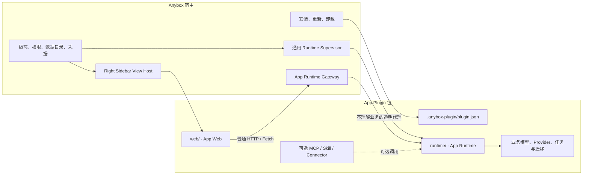
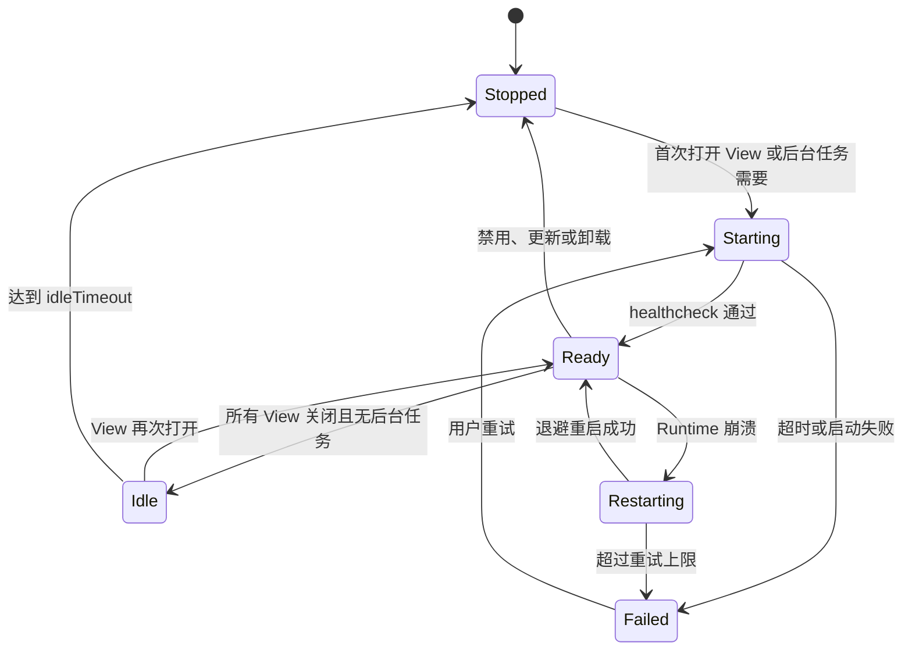

# Anybox App Plugin 设计框架

> 状态：目标设计草案 v0.1  
> 日期：2026-08-10  
> 范围：定义“独立 App 安装到 Anybox，并通过 Right Sidebar 进入”的产品与技术边界。

> [!IMPORTANT]
> 本文描述的是 App Plugin 的目标架构，不是当前已经全部实现的 Manifest 格式。当前解析器只支持严格的 `views`、`mcpServers`、`skills`、`connectors` 等字段；本文出现的 `appRuntime`、`appPermissions` 等字段均为待实现的目标契约，在 Schema 落地前不能直接写入正式插件 Manifest。

## 1. 核心结论

App Plugin 应被看作一个完整、独立的 App，而不是一组由 Anybox 业务 API 拼装出来的宿主扩展。

安装 App Plugin 到 Anybox，本质上是给这个独立 App 增加一个 Anybox 内的前端入口：

```text
Anybox
└── Right Sidebar / Tools Primary 中的 App 入口
    └── 独立 App
        ├── 自己的 Web UI
        ├── 自己的 Runtime
        ├── 自己的 HTTP API
        ├── 自己的业务数据与迁移
        ├── 自己的 Provider 适配
        └── 可选的 MCP、Skill 和 Connector 集成
```

Anybox 是 App Plugin 的安装器、启动器、嵌入式浏览器和安全边界。App Plugin 本身才是产品。

由此得到五条不可违背的原则：

1. App 的业务能力由 App 自己实现。
2. App Web 调用 App 自己的 API，不把每个业务操作翻译成 Anybox Bridge 或 MCP Tool。
3. Anybox 只提供通用安装、启动、隔离、代理、权限和系统集成能力。
4. Anybox 核心不得包含 Cinema、Timeline、Storyboard、Render Job 等某个 App 专属的业务知识。
5. MCP、Skill 和 Connector 是 App 的可选 Agent 集成，不是 App Web 正常运行的前提。

## 2. App Plugin 与能力插件的区别

Anybox 插件系统可以同时承载两类插件，但不能混淆它们的运行模型。

| 类型 | 主要用途 | 核心入口 | 是否必须有独立 UI | 是否必须依赖 Agent |
|---|---|---|---|---|
| 能力插件 | 给 Agent 增加工具、Skill、Connector | MCP、Skill、Connector | 否 | 通常是 |
| App Plugin | 在 Anybox 中安装一个完整产品 | `right-sidebar` View | 是 | 否 |

一个 App Plugin 可以同时声明 MCP、Skill 或 Connector。例如 Cinema 可以独立运行，同时向 Agent 暴露“创建分镜”“读取项目摘要”等工具。但即使用户关闭 Agent 功能，Cinema App 本身仍应能够正常打开和工作。

### 2.1 不采用的模型

下面的模型不应成为 App Plugin 的主架构：

```text
App Web
  → window.anyboxPlugin.call("cinema_start_generation")
  → Anybox 解释 Cinema 业务调用
  → MCP Runtime
```

这个模型会让 App 依赖 Anybox 的工具协议，并迫使宿主理解 App 的业务动作。它适合 Agent Tool，不适合作为完整 App 的前后端通信基础。

### 2.2 采用的模型

App Web 应使用普通的 Web 协议调用 App 自己的 Runtime：

```text
App Web
  → fetch("/__anybox_runtime__/api/projects")
  → Anybox 内部透明代理
  → App 自带 Runtime
```

Anybox 只校验调用者身份、运行时归属、生命周期和安全策略，然后透明转发 HTTP 请求。Anybox 不解析 URL 中的业务含义，也不解析业务 JSON。

## 3. 总体架构



### 3.1 关键边界

App Web 与 App Runtime 是同一个产品的前端和后端。Anybox 位于两者之间，只是为了提供安全的内部寻址、进程监督和桌面集成。

因此，App Runtime 不等同于当前 `mcpServers[].runtime`：

- MCP Runtime 面向 Agent Tool Protocol。
- App Runtime 面向 App 自己的 HTTP API、媒体流、上传、SSE 或 WebSocket。
- 两者可以复用 App 内部业务模块，但生命周期和调用协议相互独立。

## 4. 所有权划分

### 4.1 App Plugin 自己拥有的内容

| 领域 | App Plugin 的责任 |
|---|---|
| 产品 UI | 页面、路由、Canvas、Timeline、表单、弹窗、错误状态和可访问性 |
| 业务 API | API 路径、请求和响应格式、版本兼容、错误码 |
| 领域模型 | 节点、时间线、任务、资产、项目等所有业务对象 |
| 业务规则 | 校验、状态机、撤销重做、任务恢复、重试和取消 |
| Provider | 第三方 API 请求、模型列表、轮询、结果归一化和错误映射 |
| 持久化 | 数据格式、索引、数据库、迁移和兼容策略 |
| 媒体处理 | 渲染图、编解码参数、字幕合成、导出预设和产物管理 |
| 产品日志 | App 专属日志字段、错误上下文和诊断语义 |
| 独立运行 | 在 Anybox 外能够通过自己的开发入口启动 Web 和 Runtime |

### 4.2 Anybox 宿主拥有的内容

| 领域 | Anybox 的责任 |
|---|---|
| 安装 | Catalog、包校验、原子安装、更新、禁用和卸载 |
| UI 容器 | Right Sidebar 标签页、加载状态和 Tools Primary 居中布局 |
| Web 安全 | 独立 Session Partition、Sandbox、CSP、导航和权限控制 |
| Runtime 生命周期 | 通用启动、健康检查、停止、崩溃重启、退避和日志收集 |
| 内部寻址 | 给 App Web 提供稳定、不可伪造的 Runtime 地址 |
| 内部代理 | 透明转发 HTTP、上传、下载、Range、SSE 和 WebSocket |
| 数据目录 | 提供稳定的 App Data 和 Cache 目录，不规定内部格式 |
| Workspace 授权 | 由用户选择并授权 App 可以访问的目录 |
| 系统能力 | 文件选择器、打开外部链接、通知、剪贴板等受控桌面能力 |
| 凭据保险箱 | 可选地提供系统级安全存储，但不定义 App 的登录业务 |
| 安装审查 | 展示本地命令、网络、文件、原生组件和高风险权限 |

### 4.3 共同边界

有些能力需要双方配合，但业务所有权仍属于 App：

- App 定义项目文件格式；Anybox 只授予某个目录的访问权。
- App 定义 Provider 登录和调用流程；Anybox 可以提供安全凭据存储。
- App 定义任务进度和取消语义；Anybox 只保证 Runtime 进程可用。
- App 生成和组织媒体；Anybox 只提供安全、支持 Range 的资源传输。
- App 定义数据迁移；Anybox 只保证升级期间数据目录不会被替换。

## 5. 插件包结构

推荐的完整 App Plugin 包结构如下：

```text
<plugin-id>/
├── .anybox-plugin/
│   └── plugin.json
├── web/
│   ├── index.html
│   └── assets/
├── runtime/
│   ├── server.js
│   ├── api/
│   ├── domain/
│   ├── providers/
│   ├── storage/
│   └── migrations/
├── shared/
│   └── contracts/
├── assets/
├── docs/
├── skills/                 # 可选 Agent 集成
├── mcp/                    # 可选 Agent MCP Adapter
└── connectors/             # 可选凭据或外部服务集成
```

规则：

- `.anybox-plugin` 只是元数据目录，不是插件包根目录。
- `web/` 必须包含可离线加载的构建产物，不能依赖 Vite 开发服务器。
- `runtime/` 属于 App，不属于 Anybox Agent。
- App 包安装目录视为只读代码目录，运行时数据不能写入 `${PLUGIN_ROOT}`。
- MCP Adapter 可以调用 App Runtime 或复用 `runtime/domain`，但不能反过来成为 Web UI 的必选依赖。

## 6. Runtime 模型

App Plugin 应支持三种产品形态。

### 6.1 Static App

只有本地 Web 资源，所有逻辑都能在浏览器 Sandbox 中完成。

```text
web/index.html
```

适合计算器、可视化工具、离线编辑器等。当前 `react-sidebar-proof` 已经验证了这一形态的最小基础。

### 6.2 Local App Runtime

插件包携带本地 Runtime。Anybox 通用启动 Runtime，但不理解它的业务 API。

```text
web/index.html
runtime/server.js
```

推荐协议是受控的 Loopback HTTP：

1. Anybox 分配临时端口和一次性 Runtime Token。
2. Runtime 只能监听 `127.0.0.1` 或宿主提供的受控 IPC 端点。
3. Token 通过环境变量传给 Runtime，不暴露给 App Web。
4. App Web 请求 Anybox 的同源内部路径。
5. Anybox Gateway 为 Runtime 注入 Token 并透明转发请求。

这样既保留普通 Web App 的开发模型，也不向页面暴露随机端口、密钥或 Node.js 权限。

### 6.3 Remote App Runtime

插件包携带前端，但产品后端由开发者自己的云服务提供。

Anybox 可以有两种实现：

- 根据 Manifest 的 Origin Allowlist 允许 App Web 直接访问声明的 HTTPS Origin。
- 通过 Anybox Gateway 代理到声明的远程 Runtime。

第一种更接近普通 Web App；第二种更容易统一身份、CORS、审计和凭据保护。两者都不能默认开放任意网络访问。

## 7. App Runtime 通用契约

Local App Runtime 应遵循最小、与业务无关的启动契约。

### 7.1 宿主注入的环境变量

建议提供：

```text
ANYBOX_APP_ID
ANYBOX_APP_VERSION
ANYBOX_APP_PORT
ANYBOX_APP_TOKEN
ANYBOX_APP_DATA_DIR
ANYBOX_APP_CACHE_DIR
ANYBOX_APP_LOG_DIR
ANYBOX_APP_LOCALE
```

其中：

- `PORT` 由宿主分配，Runtime 不自行选择固定端口。
- `TOKEN` 只用于宿主与 Runtime 的内部认证。
- `DATA_DIR` 跨启用、禁用和版本升级保留。
- `CACHE_DIR` 可以由宿主清理。
- App 不能假设任何绝对安装路径，只能使用宿主变量和包内相对路径。

### 7.2 健康检查

Runtime 必须提供不包含业务副作用的健康检查，例如：

```http
GET /health
```

响应至少包含 Runtime 版本和 Ready 状态。Anybox 只判断 Runtime 是否可用，不解释业务健康指标。

### 7.3 内部代理

建议为 App Web 保留同源路径前缀：

```text
/__anybox_runtime__/*
```

例如：

```ts
const response = await fetch("/__anybox_runtime__/api/projects")
```

Gateway 应支持：

- 常规 HTTP 方法和状态码；
- JSON、FormData 和流式上传；
- 文件下载和 `Range` 请求；
- SSE；
- WebSocket；
- 请求取消和合理超时；
- 对敏感响应头的过滤。

Gateway 不应：

- 将每个业务接口注册成 Anybox IPC；
- 解析 App 的 JSON Schema；
- 把 App API 自动暴露给 Agent；
- 允许一个 App 访问另一个 App 的 Runtime；
- 将 Runtime 的真实端口或 Token 暴露给 Web 页面。

## 8. 最小宿主 SDK

App 的业务请求使用普通 HTTP。只有真正属于宿主的动作才进入可选的 `window.anyboxApp` SDK。

允许的通用能力示例：

```ts
interface AnyboxAppHost {
  getContext(): Promise<{
    appID: string
    appVersion: string
    locale: string
    colorScheme: "light" | "dark"
    surfaceRole: "primary" | "companion"
  }>

  requestWorkspaceAccess(): Promise<{ grantID: string } | null>
  pickFiles(options?: { multiple?: boolean }): Promise<Array<{ handle: string; name: string }>>
  openExternal(url: string): Promise<void>
  notify(input: { title: string; body?: string }): Promise<void>
}
```

SDK 中不应出现下面的接口：

```text
startCinemaGeneration
createStoryboard
renderTimeline
listCinemaAssets
```

这些都是 App 自己的业务 API。

SDK 必须由 Anybox 自有 Preload 注入，插件不能声明或替换 Preload。

## 9. Manifest 目标形态

当前 `views` 继续作为唯一 UI 入口；不新增 `workbench`、`document-tab` 等 Surface。Right Sidebar 对应 Tools Surface，宿主布局可以把整个 Tools Surface 放到中央主区域。

目标 Manifest 可以在现有 View 之外增加一个可选、与业务无关的 App Runtime 声明：

```json
{
  "name": "cinema",
  "version": "1.0.0",
  "description": "A complete AI filmmaking application.",
  "views": [
    {
      "id": "main",
      "title": "Cinema",
      "location": "right-sidebar",
      "entry": "./web/index.html"
    }
  ],
  "appRuntime": {
    "type": "local-http",
    "command": "node",
    "args": ["${PLUGIN_ROOT}/runtime/server.js"],
    "cwd": "${PLUGIN_ROOT}",
    "healthcheckPath": "/health",
    "startupTimeoutMs": 15000,
    "idleTimeoutMs": 300000
  },
  "appPermissions": {
    "workspace": "request",
    "network": [
      "https://api.example.com"
    ],
    "system": [
      "file-picker",
      "notifications"
    ]
  }
}
```

设计要求：

- `appRuntime` 只描述如何启动和判断 Ready，不描述业务接口。
- `appPermissions` 用于安装审查和可执行的权限策略，不作为普通展示元数据。
- `appRuntime` 与 `mcpServers` 相互独立。
- 没有 `appRuntime` 的 View 继续作为 Static App 加载。
- 未来若支持 Remote Runtime，应使用明确的 `type` 判别，不复用 MCP 的 `remote` 语义。
- Schema 必须继续严格校验；新增字段时同步 Parser、测试、开发指南和 Skill。

## 10. Web 安全模型

App Web 默认是不可信页面，应保持以下边界：

1. `nodeIntegration=false`。
2. `contextIsolation=true`。
3. `sandbox=true`。
4. 每个插件使用独立 Session Partition。
5. 禁止插件自带 Preload。
6. 默认禁止任意导航、新窗口、权限请求和未声明网络。
7. 静态资源只能来自安装后插件包的真实路径，拒绝路径穿越和符号链接逃逸。
8. Runtime Gateway 根据当前已安装且启用的 App 身份建立路由，不能信任页面提交的 `pluginID`。
9. CSP 根据 App 类型和已授予权限生成；Static App 默认只允许包内资源。
10. App Web 永远不能直接读取 Runtime Token、系统凭据或任意本地绝对路径。

当前 Plugin View 使用 `connect-src 'none'`。目标实现不能简单地把它改成 `connect-src *`，而应只增加当前 App 的内部 Runtime Origin 和明确授权的网络 Origin。

### 10.1 本地 Runtime 的风险级别

本地 Runtime 是真实本机代码，风险高于纯 HTML View。没有 OS 级进程 Sandbox 时，网络和文件权限声明只能提供审查与约束意图，不能被宣传为完整隔离。

因此安装本地 Runtime App 时至少需要：

- 展示将执行的 command、args、cwd；
- 展示网络、Workspace、原生组件和凭据权限；
- 验证所有包内可执行路径；
- 支持发布者签名和信任链；
- 记录安装、更新和 Runtime 启动审计；
- 对未知来源给出明确风险提示。

## 11. 数据和文件模型

### 11.1 目录语义

```text
PLUGIN_ROOT          安装后的只读代码与静态资源
APP_DATA_DIR         持久化业务数据，跨版本保留
APP_CACHE_DIR        可重建缓存，可由用户或宿主清理
APP_LOG_DIR          Runtime 日志
WORKSPACE_GRANT      用户显式授权的项目目录
```

### 11.2 生命周期规则

- 禁用 App：保留 Data、Cache 和用户 Workspace 文件。
- 更新 App：保留 Data，由 App 自己执行数据迁移。
- 更新失败：恢复旧包，不能损坏已有 Data。
- 卸载 App：停止 Runtime 并撤销权限；是否删除 App Data 必须由用户明确选择。
- 卸载永远不能删除用户 Workspace 中的项目文件。
- Cache 可以在卸载或用户清理时删除。

## 12. Runtime 生命周期

推荐一个已安装 App 在同一用户配置中只运行一个 Runtime 实例，多个 View 或标签页共享它。



关键规则：

- 关闭 View 不等于立即杀死 Runtime；长任务可以继续。
- Runtime 自己负责恢复哪些业务任务，宿主只负责进程重启。
- 更新前先停止旧 Runtime，再原子替换包。
- Runtime 的 stderr/stdout 进入按 App 隔离的诊断日志。
- 崩溃循环必须有限流和用户可见的错误状态。

## 13. Cinema Web 的目标映射

### 13.1 当前状态

当前 Cinema 尚未形成独立 App Plugin：

- UI 位于 `packages/cinema-web`。
- 业务 Runtime 大量位于 `packages/anyboxagent/src/cinema`。
- HTTP 路由位于 `packages/anyboxagent/src/server/routes/cinema.ts`。
- Use Case 位于 `packages/anyboxagent/src/server/usecases/cinema.ts`。
- 当前 `plugins/Anybox-Plugins/cinema` 主要提供 Skill 和 MCP helper，Manifest 明确说明 Provider Runtime 仍在 AnyBox Agent。

这意味着当前 Anybox 宿主仍然理解大量 Cinema 业务知识。

### 13.2 完全插件化后的结构

```text
plugins/Anybox-Plugins/cinema/
├── .anybox-plugin/plugin.json
├── web/                         # 原 packages/cinema-web 构建产物
├── runtime/
│   ├── server.js
│   ├── canvas/
│   ├── timeline/
│   ├── assets/
│   ├── generation/
│   ├── providers/
│   ├── render/
│   └── storage/
├── shared/
├── skills/
├── mcp/                         # 可选 Agent Adapter
└── assets/
```

### 13.3 请求链路

Cinema Web 当前已经使用 `agentBaseURL + fetch()` 调用 `/api/cinema/*`。迁移时不需要把这些调用全部改造成 MCP Tool；可以把 `agentBaseURL` 改为 App Runtime Gateway 的 Base URL，并尽量保留现有 HTTP API：

```text
Cinema Web
  → /__anybox_runtime__/api/cinema/projects/:id
  → Cinema Runtime
  → Cinema 自己的 Canvas、Timeline、Provider、Render 和 Storage
```

Anybox Gateway 只转发请求，不知道 `/api/cinema/projects` 代表什么。

### 13.4 Cinema 与宿主的最终边界

Cinema 插件拥有：

- Cinema Web；
- Canvas 和 Timeline；
- Asset Library；
- Generation Task；
- Kling、ComfyUI 等 Provider；
- Render Runtime；
- Cinema 项目和私有数据格式；
- Cinema 数据迁移；
- 可选 Cinema MCP 和 Skill。

Anybox 保留：

- 插件安装和更新；
- Right Sidebar 和居中布局；
- App Runtime Supervisor；
- Runtime Gateway；
- Webview Sandbox；
- 用户授权的 Workspace、文件选择器和安全资源传输；
- 通用凭据保险箱与安装权限审查。

## 14. 当前实现与目标设计的差距

| 能力 | 当前状态 | 目标 |
|---|---|---|
| 本地 HTML/React View | 已支持 | 保留 |
| UI 位置 | 只支持 `right-sidebar` | 保持不变 |
| Tools Surface 居中 | 已支持 | 保留 |
| Webview Sandbox | 已支持 | 保留并扩展 |
| App Web 网络访问 | `connect-src 'none'` | 按内部 Runtime 和权限精确开放 |
| App Runtime Manifest | 未支持 | 新增独立于 MCP 的严格 Schema |
| App Runtime Supervisor | 未支持 | 新增通用生命周期管理 |
| App Runtime Gateway | 未支持 | 新增同源透明代理 |
| App Data/Cache 目录 | 未作为 App 契约提供 | 增加稳定目录和升级语义 |
| 大文件/媒体 Range | 仅包内 Preview 资源 | Gateway 支持 Runtime 动态媒体 |
| SSE/WebSocket | App View 未支持 | Gateway 支持长任务事件 |
| 最小宿主 SDK | 未支持 | 只提供通用桌面能力 |
| Cinema 独立 Runtime | 仍在 Anybox Agent | 移入 Cinema 插件 |

另有一处文档漂移：实时解析器和第三方开发指南已经支持 `views`，但 `.agents/skills/anybox-plugin/references/manifest-format.md` 的字段表尚未列出 `views`。实现 App Plugin Schema 时应一并修正。

## 15. 推荐实现顺序

### Phase 1：固化契约

1. 为 Static、Local 和 Remote App 确定最终 Manifest Schema。
2. 明确 `views` 与 `appRuntime` 的引用关系。
3. 明确 Runtime Gateway 的 URL、认证、流式传输和错误契约。
4. 明确 Data、Cache、Log 和 Workspace Grant 生命周期。

### Phase 2：Local App Runtime 基础设施

1. 实现 Runtime Supervisor。
2. 实现端口分配、Token、Healthcheck 和进程日志。
3. 实现同源 Runtime Gateway。
4. 保持插件 Webview 无 Node 权限和无插件自定义 Preload。
5. 增加禁用、更新、卸载和崩溃恢复测试。

### Phase 3：App Plugin Proof

创建独立 `app-plugin-proof`：

- 自带 React Web；
- 自带 Local HTTP Runtime；
- Web 只用普通 `fetch`；
- 支持持久任务、进度、取消和重启恢复；
- 支持 Data、Cache、文件上传和 Range 下载；
- 不声明 MCP 也能完整运行；
- 可选再增加 MCP Adapter，证明 Agent 集成与 App 主链路解耦。

### Phase 4：Cinema 迁移

1. 把 Cinema Web 构建产物移入插件。
2. 把 Cinema HTTP API 和业务 Runtime 移入插件。
3. 将 `agentBaseURL` 指向 App Runtime Gateway。
4. 移出 Anybox Agent 中的 Cinema 专用 Route、Use Case 和 Runtime。
5. 保留必要的兼容迁移和项目数据升级。
6. 完成大媒体、渲染、Provider、重启和升级回归。

## 16. 验收标准

App Plugin 框架完成必须同时满足：

1. App 可以在 Anybox 外以普通 Web + Runtime 方式独立启动。
2. 安装到 Anybox 后，唯一必要的产品入口是 `right-sidebar` View。
3. App Web 使用标准 HTTP 调用自己的 Runtime。
4. Anybox 不包含该 App 的业务 Route、类型或业务分支。
5. App 不依赖 MCP、Skill 或 Agent 也能完成核心产品流程。
6. 多个 App 的 Web、Runtime、数据、网络和权限相互隔离。
7. 禁用、崩溃、更新和卸载不会破坏用户业务数据。
8. 正式安装包在关闭源码扫描时仍能独立运行。
9. Runtime 端口和 Token 不暴露给 App Web 或其他插件。
10. Local Runtime 的本机代码风险在安装时得到明确审查。

Cinema 完全迁移后的最终验收标准是：

> 删除 Cinema 插件后，Anybox 核心仍完整运行且不包含 Cinema 业务知识；重新安装 Cinema 插件后，Cinema 产品能力全部恢复。

## 17. 暂不阻塞架构的待定项

以下问题需要在实现前定稿，但不会改变“独立 App + Anybox 前端入口”的核心模型：

- Local Runtime 是按 App、用户配置还是 Workspace 启动实例；默认建议按 App 和用户配置单例。
- Remote Runtime 采用直接 Origin Allowlist 还是统一 Gateway；默认建议优先 Gateway。
- Runtime 空闲多久后停止，以及后台长任务如何声明保活。
- 卸载时 App Data 默认保留还是默认删除；无论默认值如何都必须明确提示。
- 原生二进制、GPU Runtime 和 FFmpeg 采用插件包、平台 Artifact 还是共享宿主依赖。
- 未签名第三方 Local Runtime 的安装确认级别和发布者信任策略。

这些决策应保持通用，不得因为 Cinema 的特殊需求在 Anybox 核心中增加 Cinema 专用协议。
