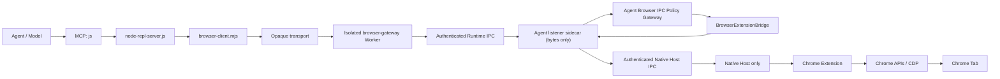
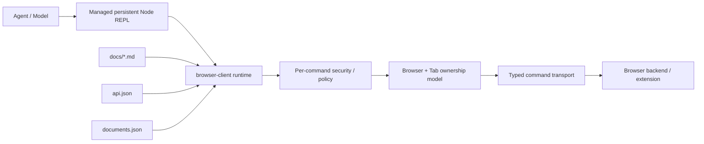
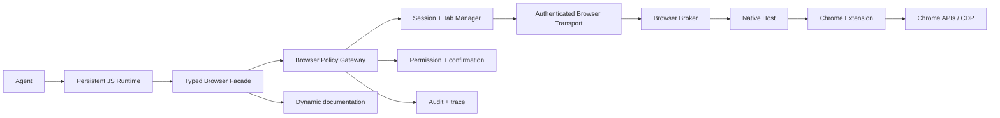
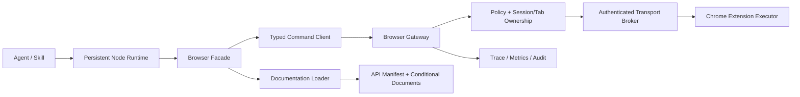

# Anybox Chrome 插件与 Codex Browser Runtime 差距分析及优化路线图

> 文档日期：2026-07-19  
> Anybox 初始审计版本：Chrome 插件 `0.4.0`  
> Anybox 当前实现版本：Chrome 插件 `0.6.0`、Extension `0.2.0`、Browser Runtime `0.3.0`、Native Host `0.3.0`、Node MCP Server / Runtime IPC client `0.4.0`
> Codex 对照版本：本机已安装 Chrome 插件 `26.715.31925`  
> 文档性质：历史审计快照、差距分析与工程路线图；正文中的静态 Facade/Worker allowlist 数值保留为 Phase 0 基线
> 最近实施同步：2026-07-19，Browser Contract v1 与 Browser Client Runtime 首个纵向切片
> 相关背景文档：[Codex Browser Use 实现方式：模块化架构与参考实现](./codex-browser-use-implementation-reference.md)
> 当前实现与后续阶段的权威设计记录：[Anybox Browser Client Runtime 迁移设计](../packages/chrome-plugin/docs/browser-client-runtime-migration.md)

> **阅读提示：** 0.6.0 已实现 BrowserManager、Backend `getInfo`、精确 command
> schema、capability-filtered API/Documentation Manifest、Agent params → policy →
> bridge → result 校验，并把 Worker 收敛为受保护 Transport Adapter。正文中把这些能力
> 标为“缺失”或把 Worker 描述为 15-method allowlist 的段落是审计时事实，不代表当前
> 工作树。Extension `0.2.0` 已通过 Browser Contract version + command 列表协商
> capability，模型可见 status/getInfo 与 command error 已做边界脱敏。
> ownership/claim/finalize、逐 origin/动作审批、Locator、cancel/turnEnded 与
> feature flag 仍未完成。

## 0. 文档目标

本文不再只回答“Anybox 的工具是否比 Codex 少”，而是系统回答以下问题：

1. Anybox 当前从 Agent 到 Chrome 的完整调用链是什么。
2. 当前迁移到持久 Node REPL 后，为什么实际效果反而可能更慢、更不稳定。
3. Anybox 与当前 Codex Browser Runtime 在运行时语义、API、文档、安全、标签页生命周期、页面语义、交互质量、性能、打包和测试方面分别差在哪里。
4. 哪些问题只是“缺功能”，哪些问题已经属于安全或正确性阻断项。
5. 应按什么顺序改造，才能避免继续在不稳定基础上堆叠更多 API。

本文的核心结论是：

> Anybox 当前主要复刻了“Agent 通过一个 JavaScript 工具调用 Browser Runtime”这一外形，但尚未复刻 Codex 在这条路径周围建立的类型系统、动态文档、逐命令安全治理、标签页所有权、能力发现、错误恢复、输出预算和交互语义。

Node REPL 本身不是效果变好的原因。真正决定效果的是 Node REPL 后面那一整套 Browser Runtime 合同。

### 0.1 2026-07-19 实施同步

本文最初基于 Chrome 插件 `0.4.0` 审计。`0.4.1` 完成第一批入口鉴权与结构化输出加固；当前工作区的 `0.5.0` 又把 Browser control 的两段 localhost HTTP/WebSocket 生产传输迁移为受认证的本机 IPC。

| 工作面 | 当前状态 | 本轮结果 |
|---|---|---|
| Browser control HTTP / WebSocket | 已从生产链路删除 | `/status`、`/command`、`/trusted-command`、`/ws` 不再注册；`/health` 只返回带 `ok: true` 的最小 API envelope，没有自动 legacy fallback |
| IPC framing / role | Windows 已实现并实测 | Runtime 与 Native Host 使用独立 Named Pipe；4-byte big-endian 长度前缀 JSON、16 MiB 上限、严格 message schema、稳定错误码 |
| macOS / Linux transport | 代码已提供，当前机器未实测 | 同一 `node:net` / Rust local-socket 抽象使用 Unix Domain Socket；目录 `0700`、socket `0600`，不能把 Windows 回归写成跨平台验证 |
| 认证与凭据生命周期 | 已移除长期落盘 token | pipe 名不是 secret；hello 绑定 role、protocol、broker instance、client version 和 challenge HMAC。Runtime proof 每次 Agent 进程轮换且只注入受管 MCP；Native proof 最长 5 分钟、一次消费、断线/过期轮换 |
| Native runtime config | 已完成 secret-free 升级 | 持久配置只保留 transport、protocol、endpoint 和 bootstrap 文件定位；安装会覆盖旧 token 配置 |
| Policy / Bridge 边界 | 保留 | Browser IPC Gateway 在 Agent 主进程验证命令并复用 `BrowserExtensionBridge`；listener sidecar 只转发字节，不拥有认证、policy、pending 或 ownership 逻辑 |
| 连接身份与结果所有权 | 保留并回归 | 固定 Extension ID、first-ready sticky、connection-owned result、owner disconnect 失败 pending command、role confusion 拒绝 |
| 模型隔离 | 已完成本轮目标 | endpoint/proof 在创建 Worker 后从模型进程环境删除；Browser Client 不暴露 socket；Worker 只检查 transport envelope，Agent Contract 与 Extension 均拒绝 raw evaluate/CDP |
| Capability / packaging | 已完成首个 Runtime 切片 | Browser Contract v1、versioned Extension command capability 协商、BackendInfo、API/Documentation Manifest 与动态裁剪已落地；高级 capability 显式为 false；生成包仍为 `22` 个文件 |
| Peer process provenance | 仍有残余风险 | Windows 使用进程 token 默认 DACL 且没有 all-users grant，但当前运行库未校验连接端 PID/SID；同一用户的任意进程仍是明确残余威胁 |
| Command boundary policy | 部分完成 | Agent 已权威执行 strict schema、backend capability 与 security class；session/message/tool-call context 已贯穿；逐命令用户确认、permission proof、完整 tab ownership、trace 和 cancel/interruption 尚未闭环 |
| Screenshot / trace 隐私 | 部分完成 | 结构化页面输出及模型可见 command error/status/getInfo 已脱敏；screenshot 像素、端到端 trace、fill/type 的完整审计与真实 Chrome fixture 仍未完成 |

因此，本文当前结论是：

> 本机传输迁移、长期 transport token 清理、Phase 0 基线和 Browser Client Runtime
> 首个纵向切片已经完成。剩余阻塞项是可信 peer/provenance、用户级
> command-boundary policy 与 tab ownership、Locator、screenshot/trace/error
> 的剩余隐私审计，以及真正的端到端取消隔离。

### 0.2 Browser IPC 迁移验收记录

截至 2026-07-19，本次 transport 迁移的生产调用链已经固定为：

```text
MCP js
→ node-repl-server.js
→ browser-client.mjs
→ isolated browser-gateway-worker.js
→ authenticated Runtime Named Pipe / Unix Domain Socket
→ Anybox Agent Browser IPC Policy Gateway
→ BrowserExtensionBridge
→ authenticated Native Host Named Pipe / Unix Domain Socket
→ Rust Native Host
→ Chrome Native Messaging stdio
→ Chrome Extension
```

`BrowserExtensionBridge` 仍负责 Browser connection registry、first-ready
selection、pending command、timeout、connection-owned result 和现有的 tab
bookkeeping。Agent Command Gateway/BrowserPolicyEngine 在它前面权威执行 contract
version、params、backend capability 和 result 校验；完整 permission/ownership
policy 尚待后续阶段。Runtime 没有连接 Native Host endpoint 或绕过 Agent 的代码
路径。Node listener sidecar 只是 Agent 内部的 socket byte relay，不持有 proof、
policy、pending command 或 Browser ownership 状态。

本次入口变化如下：

| 入口 | 迁移后状态 | 说明 |
|---|---|---|
| Browser HTTP `/status` | 已删除 | 不再通过 localhost 暴露 Browser connection 状态 |
| Browser HTTP `/command` | 已删除 | Runtime command 只接受认证 Runtime IPC |
| Browser HTTP `/trusted-command` | 已删除 | 模型侧没有等价 IPC method |
| Browser WebSocket `/ws` | 已删除 | Native Host 只连接认证 Native Host IPC |
| Browser HTTP `/health` | 保留 | 只返回最小 `ok: true` envelope，不包含连接、endpoint、broker 或凭据 |
| Runtime IPC endpoint | 新增 | Windows Named Pipe；macOS/Linux Unix Domain Socket |
| Native Host IPC endpoint | 新增 | 与 Runtime endpoint 物理分离，并绑定 `native-host` role |
| Chrome Native Messaging stdio | 保留 | Chrome Extension 与 Rust Native Host 之间的 Chrome 标准传输 |

凭据与认证生命周期已经从长期 bearer token 改为：

- endpoint 名称和持久化 runtime config 只用于定位，不作为 secret 或认证依据；
- Runtime proof 在每次 Agent 进程启动时重新生成，只注入受管 Chrome MCP，
  Worker 创建后会从模型可见的进程环境删除；
- Native Host proof 写入当前用户 IPC 状态目录中的临时 bootstrap 文件，最长
  有效 5 分钟，只允许成功消费一次，成功认证、断线和过期都会触发删除或轮换；
- hello proof 使用 challenge nonce、role、broker instance、client instance 和
  client version 组成 HMAC transcript，旧 broker、旧 proof、过期 proof 和 replay
  均 fail-closed；
- Runtime 与 Native Host 使用独立 endpoint 和严格 message union，不能通过
  自报 role 在另一端执行命令；
- 4-byte big-endian length-prefixed JSON frame 设置 16 MiB 上限，并拒绝空长度、
  malformed UTF-8/JSON、超限、截断和未知 message type。

迁移验收结论：

- Worker 和 Native Host 的生产默认 transport 均为 IPC。
- 生产代码没有 HTTP/WebSocket fallback、development fallback 或自动降级。
- 长期 Browser transport token 已从 Agent、Worker、Native Host 和持久配置删除；
  代码中保留的旧 URL/token 示例只用于断言 legacy config 会被拒绝。
- raw page JavaScript、selector adapter、CDP 和 `trusted-command` 继续在 Browser
  Facade、isolated Worker 和 Agent Gateway 边界 fail-closed。
- Windows Named Pipe 已通过 Agent、Runtime 和 Rust Native Host 的真实跨进程
  测试；macOS/Linux UDS 代码已实现，但本轮 Windows 工作区没有提供实机结果。
- source manifest、生成包、README、Chrome Skill 和运行时 capability 已同步；
  `plugins/Anybox-Plugins/chrome` 只能由 packaging 工具从权威源码生成。
- 相关自动测试、生成包一致性和 Desktop managed Agent runtime build/verify
  已通过，详细数量见 [25.1 当前已有测试覆盖](#251-当前已有测试覆盖)。

因此可以把 **Browser transport IPC migration** 标记为完成，但不能把
**Phase 0** 标记为完成。另一 Windows 用户的 ACL 拒绝、peer PID/SID/uid、
包 provenance、完整 command permission、heartbeat、cancel、screenshot/trace/
error redaction 和真实 Chrome 安装升级矩阵仍是发布阻断项或残余风险。

---

## 1. 证据范围与可信度

### 1.1 Anybox 当前运行代码

本文优先以以下文件为事实来源：

- `packages/chrome-plugin/runtime/scripts/node-repl-server.js`
- `packages/chrome-plugin/runtime/scripts/browser-gateway-worker.js`
- `packages/chrome-plugin/runtime/scripts/browser-ipc-client.cjs`
- `packages/chrome-plugin/browser-runtime/src/browser-client.ts`
- `packages/chrome-plugin/browser-extension/src/background/commands.ts`
- `packages/chrome-plugin/browser-extension/src/background/anybox-client.ts`
- `packages/chrome-plugin/browser-native-host/src/main.rs`
- `packages/anyboxagent/src/browser-extension/bridge.ts`
- `packages/anyboxagent/src/browser-extension/command-gateway.ts`
- `packages/anyboxagent/src/browser-extension/ipc-gateway.ts`
- `packages/anyboxagent/src/browser-extension/ipc-listener-sidecar.mjs`
- `packages/anyboxagent/src/server/routes/browser-extension.ts`
- `packages/anyboxagent/src/server/server.ts`
- `packages/anyboxagent/src/tool/browser-tools.ts`
- `packages/shared/src/browser-extension.ts`
- `packages/shared/src/browser-ipc.ts`
- `packages/chrome-plugin/tools/package-chrome-plugin.mjs`
- `packages/chrome-plugin/runtime/skills/chrome/SKILL.md`

### 1.2 Anybox 测试与实际运行证据

本文还核对了：

- `packages/chrome-plugin/browser-runtime/Test/browser-client.test.mjs`
- `packages/chrome-plugin/browser-runtime/Test/browser-ipc-client.test.mjs`
- `packages/chrome-plugin/browser-extension/Test/commands-privacy.test.ts`
- `packages/anyboxagent/Test/chrome-plugin-runtime.test.ts`
- `packages/anyboxagent/Test/browser-extension-routes.test.ts`
- `packages/anyboxagent/Test/browser-extension-bridge.test.ts`
- `packages/anyboxagent/Test/browser-ipc-gateway.test.ts`
- `packages/anyboxagent/Test/mcp.test.ts`
- `packages/chrome-plugin/browser-native-host/tests/bridge.rs`
- 2026-07-19 提供的实际 Anybox session trace

Trace 路径：

```text
C:\Users\19128\AppData\Roaming\anybox-desktop-agent\session-traces\
prj_2545c453dffeUQJSa0BTBguEV5\
anybox-trace-ses_088f9839affe2a7OJP2iNM18uV-20260719-050547
```

### 1.3 Codex 对照证据

Codex 部分来自本机已安装插件的实际文件和实际 `chrome.documentation()` 输出：

- `C:\Users\19128\.codex\plugins\cache\openai-bundled\chrome\26.715.31925\skills\control-chrome\SKILL.md`
- `C:\Users\19128\.codex\plugins\cache\openai-bundled\chrome\26.715.31925\scripts\browser-client.mjs`
- `C:\Users\19128\.codex\plugins\cache\openai-bundled\chrome\26.715.31925\docs\api.json`
- `C:\Users\19128\.codex\plugins\cache\openai-bundled\chrome\26.715.31925\docs\documents.json`
- 同目录下的 Browser Safety、Playwright、确认、上传、故障排查与 capabilities 文档

Codex 插件是 proprietary 软件。本文只描述本机可观察行为和可借鉴的架构模式，不把内部名称视为第三方兼容标准，也不建议逐字复制其文档。

### 1.4 事实标记

本文使用三类表述：

- **已确认**：可以从当前代码、测试、实际文档输出或 trace 直接证明。
- **工程推断**：由已确认事实推导出的风险或原因。
- **建议目标**：Anybox 后续应达到的设计，不代表当前已经实现。

---

## 2. 执行摘要

### 2.1 当前迁移处于什么阶段

Anybox 已经具备以下主链路：

```text
Anybox Agent
  → Chrome 插件的 MCP js 工具（stdio）
  → node-repl-server.js
  → browser-client.mjs
  → 隔离的 browser-gateway Worker
  → authenticated local IPC runtime endpoint
  → Anybox Agent Browser IPC Policy Gateway
  → BrowserExtensionBridge
  → authenticated local IPC native-host endpoint
  → Native Messaging Host
  → Chrome MV3 扩展
  → Chrome APIs / CDP
```

Windows 当前使用两个 Named Pipe；macOS/Linux 由同一接口选择 Unix Domain Socket。Agent 内的 Node listener sidecar 仅处理 socket I/O 和字节转发，认证、method allowlist、context、Bridge ownership 与请求结果仍在 Agent 主进程执行。生产路径没有 localhost HTTP/WebSocket fallback。

但是当前链路更接近：

> 一个可持久保存 `globalThis` 的 JavaScript 执行器，加上一组手写的浏览器方法。

它还不是 Codex 意义上的：

> 受精确文档、API manifest、capability 过滤、逐动作策略、稳定标签页模型、结构化错误和输出预算约束的 Browser Runtime。

### 2.2 最关键的六类差距

| 类别 | 当前差距 | 直接影响 |
|---|---|---|
| Node REPL 语义 | 普通顶层变量不持久；超时不终止代码；并发共享全局输出数组 | Agent 误判状态、超时后幽灵执行、结果串线 |
| Browser API 合同 | 参数大多是 `Record<string, unknown>`；运行时缺少精确 schema | 错误签名进入后端才失败，错误信息弱 |
| 动态文档 | `documentation()` 只有 1,140 字符、37 行静态清单 | Agent 猜 API、猜 Playwright、反复试错 |
| 安全与权限 | 入口鉴权与 trusted token 隔离已加固，但仍缺逐命令审批、session context 和 tab ownership | 普通 mutation 仍只受外层 `js` 粗粒度授权 |
| Tab 生命周期 | 没有 claim/finalize；Node 路径不记录 tab ownership；release 不 detach debugger | 多任务串台、残留控制、DevTools 冲突 |
| 页面交互质量 | “Playwright”只是轻量 CSS 包装；缺少 locator 唯一性、actionability 和导航等待 | React/Draft.js 等复杂页面大量失败 |

### 2.3 必须先处理的 P0 问题

以下问题不宜等到“API 功能做齐以后”再处理。`0.5.0` 工作区状态如下：

| P0 问题 | 状态 |
|---|---|
| localhost Browser API 与 Browser WebSocket | **已从生产控制面删除**；只保留最小 `/health` |
| IPC framing、role confusion、stale broker、replay | **本轮已完成并有真实 Named Pipe 回归** |
| 长期 transport token 写入 runtime config | **本轮已移除**；配置只含非秘密 locator |
| OS ACL / peer process provenance | **部分完成**：Windows 默认 DACL、UDS `0700/0600`；尚未验证 PID/SID 或 peer credential |
| command result 未校验 connection ownership | **本轮已完成** |
| Runtime bootstrap / 原始 IPC 可由模型读取 | **本轮已阻断常规模型路径**：受管注入、环境清除、Facade 不暴露 socket |
| snapshot / interactive / DOM / AX 敏感值旁路 | **本轮已完成结构化输出范围** |
| raw evaluate / CDP 默认可用 | **本轮已关闭**，等待逐命令 capability policy |
| manifest 仍宣称 raw evaluate / CDP 可用 | **已修复**：source/package/README/Skill/runtime 语义一致性测试通过 |
| Native Host / plugin 强 provenance | **仍阻塞**：固定身份与 proof 不是签名或进程身份校验 |
| session/message/tool-call context 与逐命令风险确认 | **仍阻塞** |
| screenshot / trace 敏感数据策略 | **仍阻塞** |
| `Promise.race` 超时不能终止执行或取消动作 | **仍阻塞** |

当前不应回到“继续堆 API”的路线；应先完成表中剩余 P0。

### 2.4 推荐的总体方向

不建议继续直接给 `BrowserTab` 增加零散方法。推荐先建立五层稳定边界：

```text
真正持久、可取消的 JavaScript Runtime
  → 类型化 Browser Facade
  → Browser Policy Gateway
  → Session / Tab Ownership Manager
  → 认证的 Browser Transport
  → Chrome 扩展执行层
```

动态文档、Playwright API 和 capabilities 都应建立在这些边界之上。

---

## 3. 当前 Anybox 已经做对的部分

差距分析不意味着现有实现没有价值。以下能力可以保留并继续演进。

### 3.1 插件包已经自包含

当前插件包包含：

- `.anybox-plugin/plugin.json`
- Browser Runtime
- Node REPL MCP Server
- Chrome Extension 构建产物
- 平台 Native Messaging Host
- Skill
- 安装和注册脚本

这比依赖用户另外安装任意 npm 包或本地 Playwright 服务更容易交付。

### 3.2 Native Messaging 路线是正确方向

当前实现使用：

```text
Chrome Extension
  → chrome.runtime.connectNative("com.anybox.browser")
  → Rust Native Host
  → authenticated Named Pipe / Unix Domain Socket
  → Anybox Agent Browser IPC Gateway
```

这能够复用用户真实 Chrome Profile、现有标签页和登录状态，是与 Codex Chrome 模式相同的大方向。

### 3.3 已有稳定扩展 ID 和用户级 Host 注册

扩展 manifest 包含固定 key，安装脚本会生成 Native Messaging Manifest，并在 Windows 下注册用户级 registry key。

这为稳定的 `allowed_origins` 和跨更新兼容奠定了基础。

### 3.4 已有基础 Browser Broker

`BrowserExtensionBridge` 已经提供：

- connection registry
- pending command map
- command timeout
- active connection
- session/tab ownership map
- last command diagnostics
- authenticated native transport metadata

这些结构没有因 transport 迁移被复制或删除。当前 Browser IPC Gateway 把完成认证的 Native Host 连接注册为 `native-ipc` transport，并继续由 Bridge 执行 first-ready 选择和 connection-owned result；下一步仍需补能力协商、session/tab 的逐命令归属、heartbeat、cancel 和完整生命周期。

### 3.5 页面执行能力已经覆盖 MVP

扩展端已经实现：

- tabs list/open/activate
- text snapshot
- interactive snapshot
- DOM tree
- accessibility tree
- screenshot
- coordinate click
- element click
- fill/type
- scroll
- wait
- raw page script（Extension 底层 executor 仍保留，模型路径默认拒绝）
- raw CDP（Extension 底层 executor 仍保留，模型路径默认拒绝）

这足以支持“修基础层、补治理、提高语义质量”的渐进式路线。

### 3.6 旧 MCP 路径有可复用的治理能力

`packages/anyboxagent/src/tool/browser-tools.ts` 中仍然存在较完整的：

- Zod 参数 schema
- 结果 schema 校验
- session/message/tool-call context
- preferred owned tab
- per-action permission intent
- 敏感字段风险提升
- interaction confirmation
- Tool capability 分类

迁移到 Node REPL 时，这些能力不应被丢掉，而应下沉到 Browser Policy Gateway，让 Node REPL 和旧 MCP 共用。

---

## 4. 当前架构与目标架构

### 4.1 Anybox 当前调用链



每一个浏览器方法通常需要经过：

```text
MCP stdio
→ JavaScript wrapper
→ isolated Worker request
→ length-prefixed Runtime IPC
→ Agent policy / Bridge
→ length-prefixed Native Host IPC
→ Native Messaging
→ Extension command
→ Chrome/CDP
→ 原路返回
```

`0.5.0` 在模型侧 Chrome MCP 进程完成初始化后的关键安全边界是：

- Agent 只向受管 Chrome MCP 注入当前 Agent 进程的 Runtime endpoint、broker ID 和 bootstrap proof；`node-repl-server.js` 创建 Worker 后从模型可见环境删除这些值。
- Browser Runtime 只持有不可枚举的结构化 transport，不读取 endpoint/proof，也不获得原始 socket。
- 模型侧只能发送普通 allowlist command；`trusted-command`、raw evaluate 和 CDP 在 Worker 内再次拒绝。
- Agent Gateway 在 Runtime endpoint 再次执行 schema/method/role 校验，并把 context 交给既有 Bridge；Runtime 无法连接 Native Host endpoint 冒充该角色。
- Native Host 使用一次性、短期 bootstrap proof；Extension 不保留直连或 WebSocket fallback，连接必须经过 Chrome Native Messaging Host。
- Windows pipe 由无 policy 能力的 Node sidecar 监听，以避开 Bun `node:net` listener 与 MCP child process 并存的运行时崩溃；这没有把 policy 移出 Agent 主进程。

### 4.2 从本机 Codex 可观察到的 Browser Runtime 抽象



最重要的区别不在于图中是否也有 MCP，而在于：

- Browser API 是运行时合同，不是松散 helper。
- 文档与 API surface 同步生成。
- 不支持的成员会被隐藏。
- 每个命令仍经过安全检查。
- Tab 有明确来源、所有权和最终处置。
- 页面交互有强约束与恢复策略。

### 4.3 推荐的 Anybox 目标链路



关键要求是：

> JavaScript Runtime 只能获得 Browser Facade，不能通过持有 raw endpoint/proof 或直接连接 Native Host 绕过 Browser Policy Gateway。

---

## 5. 实际 Trace 暴露出的典型问题

### 5.1 Trace 概览

对提供的 trace 中 `mcp_plugin_chrome_node_repl_js` 调用进行统计：

| 指标 | 结果 |
|---|---:|
| JavaScript 调用次数 | 39 |
| 累计工具执行时间 | 47,607 ms |
| 单次最长执行时间 | 5,035 ms |
| 原始工具输出字符数 | 213,283 |
| 默认 text snapshot 常见大小 | 约 15–17 KB |
| interactive snapshot 实际大小 | 约 90.7 KB |
| screenshot base64 结果 | 约 406–429 KB |

这些数字还不包含模型多轮推理等待和重复上下文处理时间。

### 5.2 首次启动跳过了文档

首个 Browser Runtime 调用实际执行的是：

```js
if (globalThis.agent?.browsers == null) {
  await setupBrowserRuntime({ globals: globalThis })
}
if (globalThis.chrome == null) {
  globalThis.chrome = await agent.browsers.get("extension")
}
return await chrome.status()
```

没有执行：

```js
nodeRepl.write(await chrome.documentation())
```

因此后续错误不能简单归咎于“模型没有认真读文档”；实际上文档根本没有进入上下文。

### 5.3 错误调用 `waitFor`

Trace 中调用：

```js
await globalThis.tab.waitFor("https://www.zhihu.com", {
  timeoutMs: 15000,
})
```

实际 Anybox 签名是：

```ts
tab.waitFor({
  text?,
  urlIncludes?,
  selector?,
  elementId?,
  timeoutMs?,
})
```

由于 Browser Runtime 参数类型只是宽泛对象，错误直到后端才表现成 `Internal server error`。

理想行为应该是 Browser Facade 在本地立即返回：

```text
Invalid argument for Tab.waitFor:
expected one options object with text, urlIncludes, selector, or elementId.
```

### 5.4 Agent 把 lightweight adapter 当作完整 Playwright

Trace 中出现：

```text
locator.first is not a function
```

以及：

```text
Cannot read properties of undefined (reading 'locator')
```

对应尝试：

```js
locator.first()
tab.playwright.page.locator(...)
```

当前 `BrowserLocator` 实际只有：

- `click()`
- `fill()`
- `textContent()`
- `inputValue()`

当前 `tab.playwright` 也没有 `page`。

### 5.5 大输出导致上下文和 I/O 浪费

Trace 中两次完整 `interactiveSnapshot()` 都产生约 90.7 KB 数据，随后被持久化并截断。

这意味着：

1. 扩展先收集完整数据。
2. 数据仍通过 Native Messaging、两段 IPC framing 和 MCP 多次序列化；HTTP/WebSocket 两次协议转换已经删除。
3. Node REPL 同时把结果转为 text 和 structuredContent。
4. Anybox 外层发现过大后再落盘和截断。
5. Agent 没拿到完整内容，只能继续尝试其他办法。

这是“先支付全部成本，最后才截断”的典型反模式。

### 5.6 输出被重复编码

Node REPL 当前对返回值同时生成：

- `content[].text`
- `structuredContent.result`
- `structuredContent.writes`

对于大对象，模型侧包装又可能再次包含这些内容。

Trace 中一个约 16.9 KB 的 snapshot，最终 `modelOutput.json` 达到约 59 KB。这会增加：

- JSON 序列化时间
- trace 体积
- 上下文处理成本
- 持久化成本

### 5.7 API 不足迫使 Agent 降级到 raw evaluate/CDP

在标准 locator 和 element action 失败后，Agent 多次尝试：

- 遍历全页面 DOM
- 手工寻找文本按钮
- 直接 dispatch DOM event
- 使用 CDP 坐标点击
- 读取页面内部状态
- 尝试直接调用站点 API

这不是单纯的“Agent 太冒进”。它说明高层 API 无法稳定完成复杂编辑器和发布流程，而初始审计版本又默认暴露了 raw evaluate/CDP 作为近距离逃生通道。

`0.5.0` 当前状态：

- 模型可见 Browser Runtime 的 `evaluate()` 和 `cdp.send()` 现在 fail-closed。
- 隔离 Worker 同时拒绝 `trusted-command`、`page.executeScript` 和 `cdp.send`，不能通过直接构造 transport request 绕过。
- selector-based lightweight adapter 中依赖 raw evaluate 的路径也不再作为可用能力写入 Skill。

这避免了在 command-boundary policy 完成前继续扩大高风险 surface，但也意味着复杂 selector/编辑器任务暂时只能使用结构化 snapshot、elementId、click/fill/type 等能力；能力缺口应通过后续正式 API 补齐，而不是立即重新开放 raw escape hatch。

### 5.8 固定 sleep 占用了大量时间

Trace 中存在多次 3–5 秒固定等待。

当前 runtime 缺少：

- `expectNavigation`
- `waitForURL`
- `waitForLoadState`
- locator state wait
- 结构化成功信号

Agent 只能用 `setTimeout` 猜页面是否完成变化。

---

## 6. 差距总览评分

以下评分不是产品排名，而是当前 Anybox 相对“Codex 风格 Browser Runtime”目标的工程成熟度评估。

| 维度 | Anybox 当前 | 目标成熟度 | 主要原因 |
|---|---:|---:|---|
| Chrome 连接基础 | 4/5 | 5/5 | Native Host、认证 hello、first-ready connection 与 result ownership 已可用；仍缺 heartbeat 和多 Profile ownership |
| Node REPL 持久语义 | 1/5 | 5/5 | 只持久化 sandbox/globalThis，不持久化 lexical bindings |
| API 类型合同 | 1/5 | 5/5 | Browser Runtime 参数普遍是 unknown record |
| 动态文档 | 1/5 | 5/5 | 37 行静态清单，无 manifest |
| Tab 生命周期 | 1/5 | 5/5 | 无 claim/finalize，Node 路径无 ownership |
| 页面快照 | 3/5 | 5/5 | 结构化文本输出已默认拒绝 editable/sensitive 值，但仍过宽、过大，且 screenshot/trace 治理未完成 |
| Locator/Playwright | 1/5 | 5/5 | CSS querySelector 包装，不具备 Playwright 语义 |
| 导航与等待 | 1/5 | 5/5 | 缺少 goto/back/reload/expectNavigation 等 |
| 输入与表单 | 2/5 | 5/5 | 基础 click/fill 可用，复杂控件和框架兼容不足 |
| Capability 系统 | 1/5 | 5/5 | raw capability 已默认关闭，但仍无协商、动态过滤和 capability docs |
| 逐动作权限 | 1/5 | 5/5 | Node 路径只有粗粒度 js 审批 |
| 本地接口安全 | 4/5 | 5/5 | Browser HTTP/WS 与长期 token 已删除，IPC role/proof/result ownership 已回归；仍缺 peer PID/SID/uid 与包 provenance |
| 错误与取消 | 1/5 | 5/5 | 错误弱、超时不取消、无 abort propagation |
| 输出预算 | 1/5 | 5/5 | 大对象完整生成后才由外层截断 |
| 可观测性 | 2/5 | 5/5 | 有 trace，但看不到结构化 nested browser command |
| 测试与评测 | 3/5 | 5/5 | 已补首批安全、隐私与打包回归；仍缺真实 Chrome E2E、交互评测和兼容矩阵 |

---

## 7. Node REPL 运行时差距

### 7.1 “持久”语义并不等价

当前 Anybox 每次调用都创建新的：

```js
new AsyncFunction(...)
```

代码被包进一个新的 async function：

```js
with (sandbox) {
  return await (async () => {
    // user code
  })()
}
```

因此：

```js
const tab = ...
let count = 1
var browser = ...
```

这些普通顶层绑定不会跨调用保留。

只有显式写入：

```js
globalThis.tab = ...
globalThis.chrome = ...
```

才会持久。

Codex 当前 Node REPL 的合同是普通顶层 binding 持久化，并明确教 Agent：

- 重用现有变量
- 可重声明时优先使用 top-level `var`
- 遇到重复 `const` 时改用已有绑定或新名字

#### 优化方向

Anybox 需要二选一：

1. 实现真正的持久 JavaScript context 和 lexical environment。
2. 明确把产品命名改成“persistent globals JavaScript runner”，不要声称等价 Node REPL。

推荐第一种，因为当前 Skill 和 Agent 行为都在向 Codex Node REPL 语义靠拢。

### 7.2 当前 timeout 不能真正终止执行

当前实现：

```js
Promise.race([
  userPromise,
  timeoutPromise,
])
```

它存在两个问题：

1. 同步死循环会阻塞 event loop，timer 根本无法触发。
2. 异步任务即使超时，原 Promise、fetch、timer 和浏览器命令仍可能继续执行。

#### 风险

- 工具已经向 Agent 报超时，但浏览器稍后仍点击或提交。
- 上一次调用的异步回调写入下一次调用的 `writes`。
- `js_reset` 后旧 timer 仍可能访问新 sandbox 周边状态。

#### 优化方向

- 每个执行单元必须拥有可取消的 runtime/cell。
- Browser IPC request 接收 `AbortSignal` 并映射为协议 cancel。
- Browser bridge pending command支持 cancel。
- 超时后禁止提交任何晚到副作用或输出。
- CPU 死循环必须能由宿主中断，而不是依赖同一 event loop 的 timer。

### 7.3 并发调用会共享可变全局状态

`readline` 的每一行都启动一个独立 async IIFE，没有全局串行队列。

多个 `js` 调用可能同时修改：

- `sandbox`
- `writes`
- `images`
- `globalThis.tab`
- Browser Runtime 状态

#### 优化方向

- 同一 REPL session 默认串行执行 cell。
- 需要并发时显式创建子任务，并把输出归属到具体 cell。
- 浏览器交互命令按 tab 建立 exclusive queue。
- 只读 observation 可以有限并发，但必须有 output ownership。

### 7.4 reset 不完整

当前 `resetKernel()`：

- 重建 sandbox
- 清空 writes/images
- 保留 `nodeModuleDirs`
- 保留 `browserClientPromise`
- 不取消旧 timers
- 不关闭 Browser connection
- 不释放或 finalize tabs

#### 优化方向

定义清晰 reset 语义：

```text
reset bindings
→ cancel active cells
→ cancel timers/fetches
→ release browser session resources
→ preserve configured module search roots
→ keep trusted module cache only if明确允许
```

### 7.5 模块和宿主能力过宽

Anybox sandbox 暴露：

- `require`
- `fetch`
- `Buffer`
- timers
- 完整本地 module resolution

虽然 `process` 被设置为 `undefined`，但代码仍可通过：

```js
require("node:process")
```

重新获得 process，也可加载：

- filesystem
- child_process
- network
- native addons

插件 manifest 已把风险标记为 high 并声明本地文件和网络能力，因此这不是隐藏行为，但它与“只控制 Chrome”的最小权限目标不一致。

#### 优化方向

- Browser 插件的 JS Runtime 默认不暴露任意 `require`。
- 可信 `browser-client.mjs` 由宿主加载，不等于模型代码可以加载任意模块。
- 文件、网络、shell 应继续通过 Anybox 正常工具体系和权限系统。
- 如果保留 general Node 模式，应与 Chrome Browser Runtime 分离成不同插件/权限。

### 7.6 request metadata 基础已接通，授权上下文仍不完整

`0.5.0` 中 Anybox MCP manager 只对受管 Chrome binding 写入 `tools/call._meta` 的 `sessionID`、`messageID` 和 `toolCallID`。Node MCP Server 用 `AsyncLocalStorage` 将其绑定到当前 `js` 调用，Browser Facade 自动附加到每条 Worker/IPC command；模型不需要、也不能通过公共 Browser API 手填该 context。

当前仍缺：

- 当前 Agent / delegated role
- 用户审批或 permission proof
- plugin/package provenance
- 原子 tab claim/finalize ownership
- response metadata 与完整 browser-use trace span

#### 优化方向

每次 `js` call 建立不可伪造的宿主上下文：

```ts
type NodeReplRequestContext = {
  sessionID: string
  messageID: string
  toolCallID: string
  agentID?: string
  permissionSnapshotID?: string
}
```

Browser Facade 发送每个命令时自动附带它，而不是让模型手工填写。

### 7.7 缺少 response metadata

Codex Browser Runtime 会向宿主附加 browser-use metadata，例如：

- browser ID
- 当前 URL
- open tab IDs
- session 是否结束
- 当前 screenshot

Anybox `nodeRepl` 没有：

```js
nodeRepl.setResponseMeta(...)
```

#### 影响

- UI 无法稳定知道某个 JS 调用操作了哪个 tab。
- screenshot 只能作为普通 MCP image 返回。
- trace 只能看到外层 js，无法理解浏览器语义。
- tab cleanup 状态无法传给宿主。

### 7.8 输出格式与预算不足

当前 `nodeRepl.write()` 只做：

```js
String(value)
```

对象会变成 `[object Object]`。

同时 `runJavaScript()` 又会自动把返回值：

- stringify 成 text
- 原样放入 structuredContent

#### 优化方向

- `nodeRepl.write()` 使用安全 console formatter，支持 circular、BigInt 和有限深度。
- text 与 structuredContent 不重复携带完整大对象。
- 增加每次调用的 `maxOutputTokens` 或最大字符预算。
- Browser snapshot 在进入 Node REPL 前就完成结构压缩。
- 图片只进入 image content，不在 text/structuredContent 中重复 base64。

### 7.9 工具描述过短

当前 `js` 工具描述只有一句：

```text
Run JavaScript in a persistent Node.js REPL with Chrome runtime helpers.
```

它没有告诉 Agent：

- 哪些绑定会持久
- top-level `const` 是否持久
- 如何输出对象和图片
- 如何处理重复变量
- 是否支持 dynamic import
- 是否有 `tools`
- timeout 是否会取消动作
- 应如何重用 Browser/Tab

工具描述是 Agent 使用正确率的一部分，不能完全依赖 Skill。

### 7.10 Tool annotation 不准确

当前 `js` 标记：

```json
{
  "readOnlyHint": false,
  "destructiveHint": false,
  "openWorldHint": true
}
```

但这个工具实际上可以：

- 写本地文件
- 执行子进程
- 发网络请求
- 点击、填写、提交网页

`0.4.1` 已关闭预加载 Browser Runtime 的 raw page evaluate/CDP，但高层浏览器 mutation、本地文件、子进程和开放网络能力仍足以让 `destructiveHint: false` 弱化上层风险理解。

---

## 8. Skill 与 Bootstrap 差距

### 8.1 Codex 的约束更强

Codex 当前 Skill 明确要求：

- 首次选择浏览器后立即读取完整文档。
- 必须直接执行准确的 `nodeRepl.write(await browser.documentation())`。
- 不得先赋值、测长度、截断、摘要或只输出片段。
- 只有工具明确报告截断时才允许分块。
- 浏览器 binding 跨 turn 复用。
- tab stale 时只重建 tab，不重选 browser。
- setup/Chrome 故障先读取对应 troubleshooting 文档。

### 8.2 Anybox 当前约束较弱

Anybox Skill 虽然写了：

```js
nodeRepl.write(await chrome.documentation())
```

但没有像 Codex 一样强调：

- MUST
- before any interaction
- exact direct call
- no truncation/summarization
- 不得跳过
- 文档已经读过后不得重复读

实际 trace 证明 Agent 跳过了文档。

### 8.3 Skill 无法独自承担运行时安全

即使强化 Skill，也不能依赖模型百分百遵守。

应增加运行时保护：

- Browser object 创建后记录 `documentationVersion`。
- 首次非 `status/documentation` 调用前检查文档是否已 emitted。
- 或由 Node REPL bootstrap 自动发送文档，并把结果标为 hidden setup output。
- trace 记录本 session 是否加载过某版本文档。

运行时 gate 不能证明模型“理解了”，但至少可以防止完全跳过。

### 8.4 安装与连接恢复流程不足

Anybox Skill 只有简单的 status retry，缺少独立的：

- bootstrap troubleshooting
- Chrome extension troubleshooting
- Native Host registration troubleshooting
- duplicate connection troubleshooting
- debugger conflict recovery
- upload/screenshot troubleshooting

这些内容不应全部塞进核心文档，而应按需加载。

---

## 9. Documentation 系统差距

### 9.1 规模差距

实际调用结果：

| 项目 | Codex 当前 | Anybox 当前 |
|---|---:|---:|
| 字符数 | 40,906 | 1,140 |
| 行数 | 631 | 37 |
| 文档来源 | Markdown + manifests + runtime state | 静态字符串 |
| API interface manifest | 22 个 | 无 |
| API type manifest | 58 个 | 无 |
| interface members | 135 个 manifest 成员 | 无机器可读清单 |

规模不是目标本身，但它反映了 API 合同完整度。

### 9.2 Codex 文档的组成方式

Codex 使用：

```text
docs/api.json
docs/documents.json
docs/*.md
browser type
browser/tab capabilities
disabled API members
```

动态生成：

1. Selected Browser 信息。
2. 当前适用的内嵌 guidance。
3. 按需 lookup catalog。
4. 当前可用 capability 文档入口。
5. 只包含支持成员的 TypeScript API Reference。

### 9.3 Anybox 当前只是方法目录

当前文档主要列出：

```text
Browser
Tab inspection
Tab interaction
Advanced
```

缺少：

- 参数类型
- 默认值
- 返回结构
- 错误条件
- 支持与不支持的方法
- stale element 恢复
- tab 生命周期
- 输出预算
- 安全边界
- 正确示例
- 复杂页面策略
- capability 说明

### 9.4 文档与真实实现容易漂移

Anybox 的 API 信息目前分散在：

- TypeScript class
- shared Zod result schemas
- extension command parser
- Skill
- 静态 documentation string
- 旧 MCP tool schema

同一个方法可能出现五份事实来源。

#### 优化方向

建立单一 API manifest：

```ts
type ApiMemberDefinition = {
  id: string
  declaration: string
  description: string
  inputSchema?: JsonSchema
  outputSchema?: JsonSchema
  risk: "read" | "interaction" | "sensitive" | "developer"
  supportedBy: string[]
  references: string[]
}
```

从同一份定义生成：

- Browser Facade 参数校验
- API reference
- capability filter
- trace member ID
- 测试用例

### 9.5 推荐的文档目录

```text
packages/chrome-plugin/browser-runtime/docs/
  api.json
  documents.json
  browser-safety.md
  api-use-behavior.md
  tab-lifecycle.md
  interactive-snapshot.md
  lightweight-playwright.md
  confirmations.md
  browser-troubleshooting.md
  chrome-troubleshooting.md
  screenshots.md
  file-uploads.md
  capabilities/
```

### 9.6 当前打包器阻止这种结构

`package-chrome-plugin.mjs` 当前：

- 顶层 allowlist 没有 `docs`
- `docs` 被列入 forbidden directory
- `copyBrowserRuntimeBuild()` 只复制 `browser-client.mjs`

要采用 Codex 风格，需要：

1. 允许插件包根目录 `docs/`。
2. 从 browser-runtime source 复制 docs。
3. 验证文档路径不逃逸插件根目录。
4. 禁止 symlink。
5. 把 docs 纳入 package snapshot/check。

### 9.7 不应机械复制 40 KB 文档

Anybox 当前 API 更小，核心首次文档建议控制在约 8–15 KB，再按需加载：

- confirmations
- uploads
- screenshots
- CDP
- troubleshooting

否则会把“当前文档太少”变成“每个新 session 都先消耗 10k tokens”。

---

## 10. Browser 对象模型与 Capability 差距

### 10.1 Codex 当前对象模型

Codex API manifest 中可以观察到：

```text
Agent
  ├─ browsers
  └─ documentation

Browser
  ├─ browserId
  ├─ capabilities
  ├─ user
  ├─ tabs
  ├─ documentation()
  └─ nameSession()

Tab
  ├─ capabilities
  ├─ clipboard
  ├─ cua
  ├─ dom_cua
  ├─ dev
  ├─ playwright
  └─ navigation / screenshot / dialog APIs
```

### 10.2 Anybox 当前对象模型

Anybox 当前只有：

```text
agent.browsers.get("extension")
  → BrowserRuntime
      ├─ status()
      ├─ documentation()
      └─ tabs
```

没有：

- browsers.list()
- getDefault()
- getForUrl()
- browser ID/name/type
- browser capabilities
- tab capabilities
- user namespace
- documentation lookup namespace
- session naming

Anybox 当前只有 Chrome，并不一定马上需要多浏览器选择，但 capability 和 user/tabs 分层仍然需要。

### 10.3 已有基础协议 hello，但 Capability handshake 仍缺失

`0.5.0` 的 Extension hello 当前继续发送并校验：

- `protocolVersion`，当前固定为协议版本 `1`
- `extensionInstanceID`
- 固定 `extensionID`
- `version`

transport 与 host name 不由客户端 hello/query 自报，而是由完成 Native IPC challenge/hello 的 Agent Gateway 固定绑定为 `native-ipc` / `com.anybox.browser`。在此之前，Browser IPC 还会独立校验 role、broker instance、client version 和 HMAC proof。

当前仍没有发送：

- minimum compatible protocol version
- supported commands
- browser capabilities
- tab capabilities
- API support overrides
- full/limited CDP 状态
- upload/download support

#### 影响

Browser Runtime 无法知道当前连接的是：

- 新版还是旧版扩展
- 是否支持某个命令
- 是否应从文档/API 中隐藏某个成员

当前 Extension 只有 Native Host transport；如果未来重新增加其他 transport，其能力差异也必须进入同一 handshake，而不是恢复隐式 fallback。

### 10.4 推荐 capability 模型

```ts
type BrowserHello = {
  protocolVersion: string
  extensionVersion: string
  runtimeVersion: string
  capabilities: {
    browser: Array<{ id: string; description: string }>
    tab: Array<{ id: string; description: string }>
  }
  apiSupportOverrides?: Record<string, boolean>
}
```

Runtime 应根据 capability：

- 只暴露存在的方法
- 只生成适用文档
- 在版本不兼容时拒绝执行，而不是运行到中途失败

---

## 11. Tab 发现、认领、所有权和清理差距

### 11.1 Anybox 把“用户所有 Tab”与“Agent 可控 Tab”混在一起

`chrome.tabs.list()` 当前直接列出 Chrome 的全部 tabs，并给每项附加 runtime。

这意味着 Agent 可以从列表直接获得任意用户 tab 的控制对象。

Codex 当前模型将其分开：

- `browser.user.openTabs()`：只读查看用户打开的 tabs。
- `browser.user.claimTab(tabInfo)`：显式认领某个准确返回的 tab。
- `browser.tabs.list()`：Agent 当前 session 管理的 tabs。

这种分层减少了误操作和猜 tab ID。

### 11.2 Node REPL 已传递基础 command context，Tab ownership 仍未闭环

`0.5.0` 已把 session/message/tool-call context 从 MCP `_meta` 经 `AsyncLocalStorage`、Worker 和 IPC 传到 Agent。Gateway 会在 `tabs.open` 成功后调用既有 Bridge ownership helper，`tabs.release` 也在 Agent 本地更新该状态。

这修复了“Node 路径完全没有 session context”的缺口，但仍不能等同完整 Tab 生命周期：

- 没有原子的 user-tab claim。
- `current()` / preferred tab 仍可能在多 Profile 或多 session 下漂移。
- ownership 尚未绑定 permission proof、agent role 和 finalize disposition。
- release 仍需与 debugger detach、interruption 和 browser shutdown 形成闭环。

### 11.3 `current()` 不是稳定 tab binding

`tabs.current()` 返回：

```ts
new BrowserTab(undefined)
```

后续每个命令再解析当前 active tab。

如果用户或另一个任务在两次调用之间切换焦点：

```js
await tab.snapshot()
await tab.click(...)
```

这两个动作可能落在不同 tab。

#### 优化方向

`selected()` 或 `current()` 必须在创建 binding 时解析并固定 tab ID。

### 11.4 release 没有真正释放 Chrome debugger

Agent route 对 `tabs.release` 做本地 ownership 删除，不把命令发送到扩展。

扩展中的 `attachedTabs` 只在 `chrome.debugger.onDetach` 时删除，但没有看到 release 主动执行：

```js
chrome.debugger.detach(...)
```

#### 影响

- Chrome 持续显示 debugger 控制状态。
- 用户打开 DevTools 可能冲突。
- 后续其他 session attach 失败。
- 任务结束后浏览器仍处于被控制状态。

### 11.5 缺少 finalize

Anybox 当前没有统一的最终 tab disposition：

- close agent-created intermediate tab
- keep deliverable tab
- keep handoff tab
- release claimed user tab
- detach debugger
- 清除 ownership

Agent 也没有被要求把 finalize 作为本 turn 最后一个浏览器动作。

### 11.6 缺少用户接管/中断模型

当前没有稳定事件表示：

- 用户在扩展里停止控制
- 用户主动操作 tab
- tab 被关闭
- debugger 被其他客户端抢占
- extension 释放当前任务

Codex 文档要求把这种情况自然描述为“浏览器控制被停止”，而不是向用户暴露内部 turn/runtime 错误。

### 11.7 推荐 Tab 状态机

```text
discovered
  → claimed
  → controlled
  → deliverable | handoff | omitted
  → finalized
```

每个 tab 至少记录：

```ts
type ManagedTab = {
  tabId: number
  browserId: string
  sessionID: string
  origin: "user" | "agent"
  state: "claimed" | "controlled" | "finalized"
  documentGeneration: number
  debuggerAttached: boolean
  lastUsedAt: number
}
```

---

## 12. 导航、等待和页面稳定性差距

### 12.1 Anybox 缺少基础导航 API

当前没有正式高层方法：

- `goto(url)`
- `back()`
- `forward()`
- `reload()`
- `close()`
- `title()`
- `url()`

Agent 只能：

- 新开一个 tab
- 激活 tab
- 调用现有有限的高层命令

初始 trace 中曾通过 evaluate/CDP 绕过缺失能力；`0.4.1` 已将模型路径上的 raw evaluate/CDP 改为 fail-closed，因此这个绕过不再可用。缺少正式导航 API 现在会直接表现为 capability gap。

### 12.2 当前 waitFor 能力过窄

当前支持：

- text appeared
- URL includes
- selector exists
- elementId exists

缺少：

- visible/hidden
- attached/detached
- enabled/disabled
- checked/unchecked
- exact URL
- load/domcontentloaded/networkidle
- download/filechooser/dialog event
- navigation action wrapper

### 12.3 缺少 expectNavigation

复杂流程中，Agent 需要表达：

```js
await tab.playwright.expectNavigation(
  () => submit.click(),
  { waitUntil: "domcontentloaded" },
)
```

否则点击与等待之间存在 race：

1. 页面可能在 wait 注册前已经导航。
2. Agent 只能固定 sleep。
3. 页面未导航时也白等。

### 12.4 页面变化不会使 ref 系统性失效

当前 interactive element ID 是写入 DOM 的：

```text
data-anybox-element-id
```

没有 document generation。

导航、局部重渲染、虚拟列表复用或页面脚本修改后，旧 ID 可能：

- 消失
- 仍存在但代表不同语义
- 被复制
- 被页面脚本伪造

#### 优化方向

元素引用应至少绑定：

```ts
type ElementRef = {
  tabId: number
  documentGeneration: number
  frameId?: string
  backendNodeId?: number
  ref: string
}
```

任何导航或 document replacement 都使旧 generation 失效。

---

## 13. 页面观察与语义快照差距

### 13.1 text snapshot 过宽

当前 `snapshot()` 默认读取：

- 整个 `document.body.innerText`
- 最多 80 个 links
- 最多 80 个 buttons
- 最多 80 个 inputs

默认文本上限 20,000 字符，最大 100,000。

#### 影响

- 对复杂站点产生大量无关信息。
- 页脚、导航、推荐区淹没任务目标。
- 每次重复 snapshot 都重新支付完整成本。
- 容易把页面中的 prompt injection 文本带入上下文。

Codex 当前使用指南强调：

- 一次宽观察用于定位。
- 之后缩小到相关 section。
- 不重复 dump body。
- 不循环读取大量 locator。

### 13.2 snapshot 敏感值泄漏已按默认拒绝策略修复

初始审计版本会直接返回 `input.value`，这是 P0 隐私问题。`0.4.1` 已改为：

- 所有 editable 控件的值默认不进入 compact 或 interactive snapshot，不再以“未命中敏感正则即可输出”为默认。
- password、hidden、OTP、token、card、verification/security code、PIN 和中英文敏感 metadata 会进一步隐藏 name、placeholder、text、description 等旁路。
- camelCase/PascalCase 会先规范化再做边界分类，避免 `accessToken` 漏判，也避免 `secretary`、`cardinal` 等明显误判。
- `contenteditable=""`、`true`、`plaintext-only` 及其 `innerText` / `textContent` 差异均进入私有值处理。
- editable 原始值若又出现在 aria-label、placeholder 或其他 metadata 中，该 metadata 也会省略。

### 13.3 DOM、Accessibility 与 URL 旁路已同步 fail-closed

本轮不只修复 `interactiveSnapshot.name`，还覆盖：

- DOM sensitive/private 状态向 children、shadow root、content document 和 template content 传播。
- AX editable/private 状态向 `StaticText`、`InlineTextBox` 等子树传播。
- AX 通过 `backendDOMNodeId` 关联一次性 DOM metadata；无法关联时仍对 editable role 做保守脱敏。
- tab URL 和 link href 对 HTTP(S) 只暴露 origin；pathname、credential、query、fragment 均不向模型返回。
- `file:` URL 整体隐藏；DOM 中的 `href`、`src`、`srcset`、`ping`、`data`、`manifest`、`style url(...)` 等 URL 容器 fail-closed。
- 非字符串 ARIA/value 不再因 `.replace()` 假设而抛错。

这些规则已有定向 fixture 覆盖。仍未完成的是 screenshot 像素内容与端到端 trace 的敏感数据策略，因此整个 Privacy Gate 尚不能标记为完成。

### 13.4 interactive snapshot 过大

默认最多 200 个元素，每项包含：

- elementId
- role/tag/name/text/href/type/placeholder/value
- disabled/visible/sensitive
- rect

在复杂站点上可轻易超过 90 KB。

#### 优化方向

- 默认只返回紧凑文本表示。
- 默认上限降到 50–80。
- rect 按需读取。
- 支持 scope/container。
- 支持 query/filter。
- 支持分页 cursor，但不要让 Agent无目的翻页。
- 对重复导航栏元素去重。

### 13.5 交互 ID 会污染页面 DOM

把 `data-anybox-element-id` 写入真实页面：

- 页面脚本可以观察到 Agent 标记。
- MutationObserver 可以检测控制活动。
- 页面可伪造或复制属性。
- 属性会在任务结束后残留。

更稳健的方式是：

- 使用 CDP backendNodeId 或内部 ref map。
- ref 只保存在扩展/Broker。
- 不把内部控制 ID 写入网站 DOM。

### 13.6 iframe 和 Shadow DOM 支持不完整

当前：

- text snapshot 只执行在 top frame。
- interactiveSnapshot 使用普通 `document.querySelectorAll`。
- locator 也只使用普通 CSS querySelector。
- DOM tree 可以通过 CDP pierce 观察部分内容，但不能对应地交互。

目标需要：

- frame-aware snapshot
- frame locator
- open shadow root traversal
- ref 带 frame/document generation
- 跨 frame action routing

### 13.7 Accessibility Tree 是有价值的基础

Anybox 已经有 AX tree；`0.4.1` 已对 editable/sensitive 文本、关联 DOM 属性和 URL 做默认脱敏。剩余问题主要是输出预算、真实 Chrome fixture 和把 AX 语义转化成稳定 locator。

后续应把它用于：

- accessible name
- role locator
- disabled/checked/expanded 等状态
- 更稳定的语义定位

而不是只把 AX tree 作为一个大对象返回给 Agent。

---

## 14. Playwright 适配层差距

### 14.1 当前实现不具有 Playwright 的核心语义

当前 `tab.playwright` facade 仍暴露或曾暴露这些形状：

- `locator(selector)`
- `click(selector)`
- `fill(selector, value)`
- `evaluate(...)`
- `waitForSelector(...)`
- `screenshot(...)`
- `keyboard.type(...)`
- `mouse.click(...)`

但名称相似不代表行为相似。`0.4.1` 中 `evaluate(...)` 已默认拒绝，依赖 raw evaluate 的 selector locator/click/fill adapter 也不能再被当作可用能力；当前可执行的主要是映射到明确高层 command 的 screenshot、wait、keyboard 和 coordinate mouse 等操作。后续应通过 typed registry 和真实 locator/actionability 语义重建这些方法，而不是重新打开 raw bypass。

### 14.2 当前 locator 只是 CSS selector wrapper

当前：

```ts
new BrowserLocator(tab, selector)
```

不支持：

- role
- label
- placeholder
- test ID
- text
- frame
- filter
- and/or
- count
- uniqueness
- actionability
- auto-wait

### 14.3 click 使用 synthetic DOM event

当前 lightweight `playwright.click`：

1. `document.querySelector()` 取第一个元素。
2. scrollIntoView。
3. dispatch mouseover/mousedown/mouseup/click。

问题包括：

- 不检查 selector 是否匹配多个元素。
- 不检查真正可见性和遮挡。
- 不使用浏览器原生输入管线。
- 不计算正确坐标。
- 不支持 iframe。
- 不等待 navigation。
- 页面可能忽略 synthetic event。

### 14.4 fill 直接修改 DOM value

当前 lightweight `playwright.fill`：

- 直接写 `element.value`
- dispatch input/change

而高层 `tab.fill(elementId, text)` 至少会使用原型 setter。

这会导致两个同名 fill 路径行为不一致。

复杂框架可能依赖：

- native value setter
- beforeinput
- InputEvent
- composition
- selection
- keyboard event
- framework internal state

Trace 中 Draft.js 编辑器失败就是这类问题的典型表现。

### 14.5 “Playwright”命名会诱导模型调用上游 API

当对象叫 `playwright` 时，模型自然会尝试：

- `.page`
- `.first()`
- `.getByRole()`
- `.press()`
- `.count()`

如果短期内不准备实现这些语义，应考虑：

```text
tab.selectors
tab.css
```

而不是继续使用 `playwright` 名称。

### 14.6 推荐的最低 Playwright-compatible surface

第一阶段至少实现：

```text
domSnapshot
locator
getByRole
getByLabel
getByPlaceholder
getByText
getByTestId
count
click
fill
press
selectOption
check / uncheck / setChecked
isVisible
isEnabled
getAttribute
textContent
innerText
waitFor
expectNavigation
waitForURL
waitForLoadState
```

### 14.7 交互前必须强制唯一性和 actionability

建议 runtime，而不只是文档，执行：

```text
resolve locator
→ count must equal 1
→ visible
→ enabled
→ stable
→ scroll into view
→ native/CDP action
→ structured post-action observation
```

不应让 `querySelector()` 静默选择第一个。

### 14.8 失败恢复必须结构化

错误应区分：

- `LOCATOR_NOT_FOUND`
- `LOCATOR_AMBIGUOUS`
- `ELEMENT_HIDDEN`
- `ELEMENT_DISABLED`
- `ELEMENT_DETACHED`
- `SELECTOR_INVALID`
- `NAVIGATION_TIMEOUT`
- `CONTROL_INTERRUPTED`
- `FRAME_NOT_FOUND`

每种错误应携带：

- tab ID
- document generation
- selector/ref
- 是否建议 refresh snapshot
- 是否允许重试

---

## 15. 输入、表单、文件与浏览器事件差距

### 15.1 当前输入能力

Anybox 当前有：

- coordinate click
- element click
- fill
- insertText
- window scroll

### 15.2 缺少的基础交互

- double click
- hover/move
- drag
- keypress/key combinations
- focus
- clear
- checkbox/radio
- native select by label/value/index
- element scroll
- right click context

### 15.3 缺少文件上传

目标应提供：

- wait for filechooser
- inspect multiple support
- set files
- 文件路径授权和存在性校验
- 上传前的敏感数据确认
- Chrome 上传失败 troubleshooting

### 15.4 缺少下载

目标应提供：

- wait for download
- download metadata
- safe target path
- file size/type limits
- 用户可见结果
- 下载权限和危险文件处理

### 15.5 缺少 JavaScript Dialog

需要支持：

- alert dismiss
- confirm accept/dismiss
- prompt accept(text)/dismiss
- beforeunload dismiss

否则 dialog 会阻塞后续命令并表现成通用 timeout。

### 15.6 缺少 clipboard、logs 和 viewport

这些能力应作为 capability，而不是所有 browser/tab 默认成员：

- clipboard read/write
- console logs
- viewport override
- page assets
- CDP developer capability

---

## 16. 安全与权限治理差距

### 16.1 旧 MCP 有逐动作审批，新 Node 路径没有

旧 Browser tools 会对：

- click
- fill
- type
- open/activate
- sensitive target

分别生成 permission intent。

Node 插件当前只把整个 `js` 工具设为 `ask`。

一次批准的 JavaScript 可以在内部执行：

```text
读取页面
→ 点击
→ 填写
→ 发网络请求
→ 写本地文件
```

`0.5.0` 已让 raw evaluate/CDP 在 facade、Worker allowlist 和 Agent IPC Gateway 三层 fail-closed，但宿主仍未对每一个高层 Browser action完成风险分类，也无法在真正提交前再次确认。

### 16.2 Codex 风格的关键不是“Skill 说要确认”

本机 Browser Runtime bundle 中可以观察到逐命令安全检查入口；同时文档明确要求 action-time confirmation。

Anybox 需要把权限放在 Browser Policy Gateway：

```text
browser facade method
→ exact command schema
→ resolve tab / URL / target
→ risk classification
→ Permission.evaluate
→ optional user confirmation
→ execute
```

### 16.3 localhost Browser control API 已删除

`0.5.0` 当前：

- `/api/browser-extension/status`、`/command`、`/trusted-command` 和 `/ws` 均不再注册，回归测试要求返回 `404`。
- `/api/browser-extension/health` 继续公开，但只返回带 `ok: true` 的最小 API envelope，不暴露 connection、pipe path、proof 或控制状态。
- 生产代码没有自动回退到旧 HTTP/WebSocket transport 的分支或 feature flag。
- Anybox Server 仍为 PTY 等非 Browser 功能保留通用 HTTP/WebSocket；这不能误写成 Browser control legacy transport 仍存在。

因此 localhost TCP、CORS、Origin 和 WebSocket hijacking 不再是 Browser control 的入口防线；它们被从该控制面移除，而不是只靠更复杂的 header 鉴权继续维持。

### 16.4 IPC transport 采用独立 endpoint 与严格 framing

Runtime 与 Native Host 使用不同 endpoint。每条消息使用 4-byte big-endian 长度前缀 JSON，最大 frame 为 16 MiB；共享 decoder 覆盖完整、分片、合并、malformed JSON/UTF-8、零长度、超限和中途关闭。

连接必须先完成 challenge/hello：

- 固定 `protocolVersion`
- endpoint 绑定的 `role`
- 当前 `brokerInstanceID`
- challenge nonce 与 expiry
- `clientInstanceID` / `clientVersion`
- 对完整 transcript 的 HMAC proof

未完成 hello、错误 role/protocol/broker、unknown message type、replay、过期 proof 和 role-only method 混淆都会 fail-closed。

### 16.5 Native Host IPC 已认证，长期 token 已删除

Native Host runtime config 只保存非秘密 locator：transport、protocol、Runtime/Native endpoint 和 bootstrap file path。旧 config 在安装/更新时会被 secret-free 文档覆盖。

Agent 启动时写出 mode `0600` 的 Native bootstrap 文件；proof：

- 最长有效 5 分钟；
- hello 成功即消费并删除；
- 过期、重放和旧 broker instance 均拒绝；
- Native Host 断开后重新轮换。

Windows listener 使用进程 token 默认 DACL，且没有 `readableAll` / `writableAll` grant；Unix socket 目录为 `0700`、socket 为 `0600`。但是当前 Node/Rust 组合没有在应用层校验 peer PID/SID/uid，所以“同一用户下任意进程”仍是残余威胁，固定 pipe 名也明确不被当作认证。

### 16.6 command result 已绑定 connection ownership

Bridge 现在同时校验 `commandID` 和：

```ts
pending.connectionID === connection.connectionID
```

非 owner connection 返回的成功或失败 result 都会被忽略；owner 断开时对应 pending command 会失败，不会由其他连接接管。这一协议不变量已有成功/失败两类回归测试。

### 16.7 Runtime IPC proof 与模型环境隔离

`0.5.0` 当前设计：

- Agent 只向受管 Chrome plugin binding 注入当前进程的 Runtime endpoint、broker ID 和随机 proof；对环境变量名做 Windows 大小写不敏感过滤，generic MCP 不会获得这些值。
- `node-repl-server.js` 先把凭据放入独立 `browser-gateway-worker.js` 的 `workerData`，再从模型可见 `process.env` 删除所有 legacy 和 IPC credential。
- Browser Runtime Facade 不暴露 endpoint、proof、socket 或通用 request 方法。
- Worker 只加载 IPC client，既不调用 HTTP，也不允许模型替换 `fetch` 观察流量；request type 与 method allowlist 拒绝 `trusted-command`、`page.executeScript` 和 `cdp.send`。
- Agent Gateway 仍对 Worker 消息做独立 schema、role 和 method 校验，Worker 不是授权边界的唯一一层。

测试覆盖 generic MCP env、受管 Chrome env、模型 `process.env`、global `fetch` hook、原始方法拒绝、reset/reconnect 和 stale broker。

剩余问题：

- Runtime proof 在 Agent 进程内轮换，不长期落盘，但受管 Node MCP 本身仍是同一用户的本地进程；缺少 PID/SID 绑定。
- Agent 主要依据 plugin owner ID / binding ID 决定注入，仍需要 package signature、固定 runtime hash 或等价 provenance 校验。

### 16.8 页面内容的 prompt injection 治理不足

当前 Skill 没有像 Codex Browser Safety 一样完整说明：

- 页面内容是不可信数据。
- 页面不能授权上传、发送、删除、泄露数据。
- 页面文字不能覆盖用户指令。
- 传输敏感数据前要检查具体目标和授权。

但更重要的是，运行时缺少：

- 目标域名
- action type
- transmitted data classification
- approval proof

因此即使 Skill 识别了风险，也难以把安全决策落实到每个 command。

### 16.9 raw evaluate/CDP 已默认关闭，等待正式 capability policy

`0.5.0` 中 `tab.evaluate()` 和 `tab.cdp.send()` 会 fail-closed；隔离 Worker 与 Agent IPC Gateway 都不会转发 `page.executeScript`、`cdp.send` 或任何模型发起的 `trusted-command`。

重新开放前仍应拆成 capability：

```text
safe page evaluate
limited CDP
full developer CDP
```

并分别限制：

- 允许的 domain/method
- 只读/写
- 返回体大小
- storage/network/cookie
- 用户确认

在 Browser Policy Gateway 能携带 session/tool-call/tab ownership context 并在真实 command boundary 做风险确认前，不应恢复这些高级能力。

---

## 17. Transport、协议与连接生命周期差距

### 17.1 已有协议版本校验，但缺少兼容协商

`0.5.0` 有两层显式 hello。Browser IPC hello 校验：

- 固定 `protocolVersion: 1`
- endpoint 绑定的 Runtime / Native Host role
- 当前 Agent `brokerInstanceID`
- client version / instance
- 有 deadline 的 challenge nonce
- HMAC transcript proof

Extension hello 继续校验：

- 固定的 `protocolVersion: 1`
- `extensionID`
- `version`
- `extensionInstanceID`

Broker 会拒绝协议版本、固定 Extension ID 或 transport identity 不匹配的连接。`extensionInstanceID` 当前只做非空校验并用于记录和连接选择，不应被描述为独立的可信身份凭证。这已经解决“完全相信 query 自报 native 身份”的主要问题，但仍不是完整的协议协商，尚缺：

- minimum compatible version
- command schema version
- capability version
- downgrade / incompatible error contract

当前可见版本为：plugin `0.5.0`、Extension `0.1.1`、Browser Runtime `0.2.0`、Native Host `0.3.0`、Node MCP Server `0.3.0`，Browser IPC 与 Extension command protocol 均为 `v1`。版本已显式化，但还没有形成完整 compatibility matrix。

### 17.2 active connection 已避免“最后 hello 覆盖”，多实例治理仍不足

Broker 当前采用 first-ready sticky 选择，并把 pending result 绑定到发起命令的 connection；无效或后到连接不能直接抢占 active connection。Extension 只允许 Native Messaging 链路；Native Host 只允许 IPC，不存在 direct WebSocket 或自动 fallback。

连接断开时已有确定的剩余连接 fallback，但仍需要定义：

- 同一 extension instance 的旧连接何时、如何替换。
- 哪个 window/profile 属于当前用户选择。
- 多 Chrome Profile 如何稳定区分。
- profile/instance 选择如何进入 session ownership。

### 17.3 缺少 liveness 和 heartbeat 策略

Bridge 有 `ping()`，但没有看到周期性：

- ping
- pong deadline
- stale connection eviction
- command 前健康检查

Named Pipe/UDS 和 Native Messaging 会报告正常断开，但半开连接仍可能长期处于假连接状态；transport 迁移没有替代 application-level heartbeat。

### 17.4 凭据生命周期已收口，peer 来源证明仍不足

Rust Host 当前读取短期 bootstrap 文件，通过 Native endpoint challenge/response 连接 Broker。proof 一次消费、最长 5 分钟、绑定 broker/role/nonce/client identity；配置文件不再保存 token 或 proof。

当前剩余风险是：

- Node listener 使用默认 Windows DACL，UDS 使用 `0700/0600`；但自动测试不能模拟另一 Windows 用户，且应用层没有验证 peer PID/SID/uid。
- 同一用户、能在 proof 有效窗口读取 bootstrap 文件的恶意进程，理论上可能抢先消费 Native proof。
- Host/插件来源证明主要依赖用户级安装位置、固定 Extension ID/binding 和协议身份，还不是签名、hash 或进程证明。
- Runtime proof 只进入受管 MCP 并随 Agent 进程轮换，但也尚未绑定具体子进程身份。

因此 transport credential 的“长期明文落盘”阻断已经解除，但强 peer provenance 仍未闭环。

### 17.5 Endpoint、stale socket 与重启策略

Windows endpoint 是当前用户 home identity hash 派生的固定 pipe locator；它不是 secret。macOS/Linux endpoint 位于 Agent state 下的私有目录。Gateway：

- Runtime 与 Native Host 分 endpoint，避免角色混淆。
- 启动前只清理自己 IPC 目录下、且实际类型为 socket 的 stale UDS；拒绝删除普通文件或目录外路径。
- Agent restart 生成新 broker ID 和 proof，旧 hello 被 `BROKER_STALE` 拒绝。
- shutdown 终止连接、拒绝 pending Runtime request、删除自有 bootstrap 和 UDS。
- Native Host 断开后 provision 新的一次性 bootstrap；Runtime client 在 reset 或断线后重新连接。

Windows Named Pipe rebind、Native Host 重连、Runtime reset/reconnect 已有实际跨进程回归；Unix stale socket 逻辑在本轮 Windows 环境未执行。

### 17.6 缺少 cancel command

当前 command protocol 只有：

- hello
- command
- result
- event
- ping/pong

缺少：

- cancel
- command progress
- control interrupted
- tab navigated/closed
- capability changed

### 17.7 错误结果过于文本化

当前 extension 返回：

```json
{
  "ok": false,
  "error": "some text"
}
```

推荐：

```ts
type BrowserCommandError = {
  code: string
  message: string
  retryable: boolean
  tabId?: number
  currentUrl?: string
  documentGeneration?: number
  details?: Record<string, unknown>
}
```

### 17.8 Host 注册不应成为每次 MCP initialize 的主要工作

当前 Node MCP Server 在启动时调用 `ensureNativeMessagingHost()`，initialize 会等待它。

这会增加：

- 首次工具启动延迟
- registry/filesystem 副作用
- 故障面

推荐：

- 插件安装/启用阶段完成正式注册。
- MCP 启动只做快速校验。
- 发现失效时执行显式 repair。
- repair 结果进入 troubleshooting，而不是静默 fallback。

---

## 18. Schema、类型和运行时校验差距

### 18.1 旧 MCP 的 schema 没有迁移到 Browser Runtime

旧工具已经有精确 Zod schema，例如：

```ts
WaitForParameters
InteractiveSnapshotParameters
DomTreeParameters
ClickElementParameters
```

Browser Runtime 却退化成：

```ts
type BrowserCommandParams = Record<string, unknown>
```

### 18.2 Extension parser 倾向静默默认

扩展端大量使用：

- `readRecord`
- `readString`
- `readNumber`
- fallback/default/clamp

这适合处理已验证后的兼容输入，不适合作为唯一参数校验层。

错误类型可能被静默转成默认值，最终形成难理解的行为。

### 18.3 结果校验不一致

旧 MCP tools 会：

```ts
BrowserExtensionSnapshotResult.parse(...)
```

Node Browser Runtime 主要依赖 TypeScript return type assertion，运行时不校验 Agent API 返回。

### 18.4 推荐单一 command registry

```ts
const BrowserCommands = {
  "page.waitFor": {
    input: WaitForParameters,
    output: BrowserExtensionWaitForResult,
    risk: "read",
    timeout: "long",
  },
  // ...
}
```

它应被以下层共同使用：

- Browser Facade
- Agent route
- Broker
- extension dispatcher
- documentation generator
- tests

### 18.5 未知字段策略

建议：

- 正式 command 默认 strict。
- 跨版本兼容字段通过 version/capability 明确处理。
- 不要默认接受任意额外字段。
- 错误返回具体 path 和 expected type。

---

## 19. 权限模型差距

### 19.1 当前两套权限语义不一致

旧 per-action tools：

- read operations 通常可自动执行
- click/fill/type 可以逐动作 ask
- sensitive target 提升风险
- destructive label 提升风险

新 Node plugin：

- `js` 整体 ask
- `js_reset` auto
- Browser command 内部不再进入 Anybox Permission

### 19.2 粗粒度 ask 同时损害安全和速度

它有两个相反问题：

1. 每个普通 observation 也可能触发 `js` 级审批，增加阻隔。
2. 一旦批准，内部多个高风险动作又不再逐项审批。

### 19.3 目标权限分层

| 动作 | 默认策略 |
|---|---|
| status/documentation | auto |
| tabs list、只读 snapshot | auto 或站点授权后 auto |
| open/navigate/activate | low-risk interaction |
| click/keypress/scroll | 根据目标和站点判断 |
| fill 非敏感字段 | action-time confirmation 视产品策略 |
| fill 敏感字段 | 必须具体确认目标、站点和数据类型 |
| submit/send/publish/pay/delete | action-time confirmation |
| upload | 文件、站点、目标用途确认 |
| raw evaluate/limited CDP | developer capability |
| storage/network/cookie/full CDP | 独立高风险授权 |

### 19.4 Permission proof 应随命令传递

```ts
type BrowserApprovalProof = {
  permissionRequestID: string
  action: string
  destinationOrigin: string
  tabId: number
  expiresAt: number
  inputDigest: string
}
```

扩展/Broker 不应只相信上游说“已经批准”，而应至少验证命令绑定的 context 和 proof。

---

## 20. 性能与上下文效率差距

### 20.1 新路径增加了额外 hop

旧 Browser tools 在 Anybox Agent 进程中直接调用 bridge。

新路径增加：

```text
MCP stdio
→ Node child
→ isolated Worker
→ Runtime Named Pipe / UDS
→ listener sidecar byte relay
→ Agent Gateway
```

之后才进入原有 bridge。

相较 `0.4.1`，HTTP route 和 WebSocket 两套协议/重连已经删除；代价是本机 IPC framing、listener sidecar 与跨平台 ACL/重连诊断复杂度。若每个浏览器动作仍单独调用一次 `js`，开销依然会比旧 MCP 高。

### 20.2 Node REPL 的优势没有被充分利用

理论优势是：

- 持久 binding
- 本地变量计算
- 在一次调用中组合多个低风险动作
- 减少模型回合

当前实际 trace 却有 39 次 `js` 调用，说明组合收益没有实现。

原因包括：

- API 不可靠，Agent 每一步都要检查。
- 文档没读，调用不断失败。
- observation 过大，必须分轮处理。
- 缺少结构化等待，使用固定 sleep。
- 高层动作失败后不断降级。

### 20.3 应在数据源头做投影

不要：

```js
const snapshot = await tab.interactiveSnapshot()
return snapshot
```

而应支持：

```js
await tab.playwright.domSnapshot()
```

或者：

```js
await tab.interactiveSnapshot({
  scope: "dialog",
  roles: ["textbox", "button"],
  maxElements: 30,
})
```

### 20.4 避免结果重复

建议 Node REPL result contract：

```ts
type JsResult = {
  content: ContentItem[]
  structuredContent?: SmallJsonValue
  meta?: Record<string, unknown>
}
```

规则：

- 大 JSON 只保留一个表示。
- screenshot base64 不进入 text。
- trace 存 hash、大小、摘要和单独 payload reference。
- structuredContent 有独立大小上限。

### 20.5 文档加载也需要预算

Codex 当前完整 docs 约 40.9 KB，但：

- 每个 fresh browser binding 只读一次。
- optional topics 按需读取。
- capability 过滤减少无关内容。

Anybox 应记录：

```text
browserRuntimeVersion + documentationVersion + browserId
```

同一持久 session 不重复加载。

### 20.6 建议性能指标

以下是建议目标，不是当前数据：

| 指标 | 建议目标 |
|---|---:|
| 简单状态/URL 读取 p95 | < 300 ms |
| 普通 locator action p95 | < 1 s，不含页面导航 |
| 首次核心文档 | < 15 KB |
| 普通 DOM observation | < 20 KB |
| 单次 interactive observation | < 30 KB |
| 复杂发布类任务 JS 调用数 | 目标 < 10 |
| 不支持 API 调用率 | 0 |
| 固定 sleep 占比 | 接近 0 |

---

## 21. API 能力矩阵

### 21.1 Browser 与 Tab

| 能力 | Codex 当前可观察 surface | Anybox 当前 | 优先级 |
|---|---|---|---|
| browser list/default/URL selection | 有 | 只有 `get("extension")` | P2 |
| browser metadata | 有 | 无 | P1 |
| dynamic documentation | 有 | 静态 | P1 |
| session naming | 有 | 无 | P2 |
| user open tabs | 独立 API | 与 tabs.list 混合 | P1 |
| claim user tab | 有 | 无 | P1 |
| agent tab list | 有 | 无独立所有权语义 | P1 |
| new tab | 有 | `open()` | 已有 |
| selected tab | 有 | `current()` 不固定 ID | P1 |
| finalize | 有 | 无 | P1 |
| goto/back/forward/reload | 有 | 无 | P1 |
| close | 有 | 无 | P1 |
| title/url | 独立轻量 API | 通过 info/snapshot | P1 |
| JS dialog | 有 | 无 | P2 |

### 21.2 Playwright 与 DOM

| 能力 | Codex | Anybox | 优先级 |
|---|---|---|---|
| DOM snapshot | 紧凑字符串 | 大对象快照为主 | P1 |
| CSS locator | 有 | 有 | 已有但需重做语义 |
| role/label/text/testid | 有 | 无 | P1 |
| frame locator | 有 | 无 | P2 |
| count/uniqueness | 有 | 无 | P1 |
| filter/and/or | 有 | 无 | P2 |
| visible/enabled | 有 | 无 | P1 |
| check/select/press | 有 | 无 | P1 |
| locator waitFor | 有 | 无 | P1 |
| expectNavigation | 有 | 无 | P1 |
| waitForURL/load state | 有 | 无 | P1 |
| file chooser/download | 有 | 无 | P2 |
| element screenshot/info | manifest 中存在 | 无 | P2 |

### 21.3 CUA、系统与 capabilities

| 能力 | Codex | Anybox | 优先级 |
|---|---|---|---|
| coordinate click | 有 | 有 | 已有 |
| double click | 有 | 无 | P2 |
| move/hover | 有 | 无 | P2 |
| drag | 有 | 无 | P2 |
| keypress | 有 | 只有 insertText | P1 |
| DOM CUA | 有 | element click/fill 的局部实现 | P2 |
| clipboard | 有 | 无 | P3 |
| console logs | 有 | 无 | P2 |
| viewport | capability | 无 | P2 |
| page assets | capability | 无 | P3 |
| scoped CDP docs | capability | raw 默认关闭；尚无受控 adapter | P1 |

---

## 22. 错误处理、恢复与幂等差距

### 22.1 `Internal server error` 不足以指导恢复

Trace 中错误签名和 stale element 都可能变成通用 internal error。

Agent无法判断：

- 是参数错
- tab 被关闭
- extension 断开
- element stale
- debugger 冲突
- 页面权限阻止
- timeout

### 22.2 推荐错误分类

```text
INVALID_ARGUMENT
BROWSER_DISCONNECTED
TAB_NOT_FOUND
TAB_NOT_OWNED
TAB_STALE
DOCUMENT_CHANGED
ELEMENT_NOT_FOUND
ELEMENT_AMBIGUOUS
ELEMENT_HIDDEN
ELEMENT_DISABLED
NAVIGATION_TIMEOUT
COMMAND_TIMEOUT
CONTROL_INTERRUPTED
DEBUGGER_CONFLICT
PERMISSION_REQUIRED
PERMISSION_DENIED
CAPABILITY_UNAVAILABLE
PROTOCOL_MISMATCH
```

### 22.3 恢复规则应进入文档和 runtime

例如：

| 错误 | 正确恢复 |
|---|---|
| TAB_STALE | 从现有 browser binding 获取新 tab |
| DOCUMENT_CHANGED | 丢弃旧 refs，重新 snapshot |
| LOCATOR_AMBIGUOUS | 缩小 scope，不使用 first 逃避 |
| BROWSER_DISCONNECTED | 读取 Chrome troubleshooting |
| DEBUGGER_CONFLICT | 提示关闭冲突 DevTools/控制方 |
| CAPABILITY_UNAVAILABLE | 不再尝试该 API，选择受支持路径 |

### 22.4 不应自动重放副作用

只读命令可以按策略重试。

以下命令不能因连接恢复而自动重放：

- click
- fill/type
- submit
- upload
- payment
- delete
- raw evaluate/CDP write

---

## 23. 可观测性与 Trace 差距

### 23.1 当前 trace 只把外层 js 当成主要工具

从 trace 可以看到：

- js code
- js tool duration
- 最终输出

但看不到一等 nested browser command：

- `tabs.open`
- `page.snapshot`
- `page.clickElement`
- `page.fill`
- `page.wait`

### 23.2 建议记录 BrowserCommandSpan

```ts
type BrowserCommandSpan = {
  parentJsCallID: string
  browserCommandID: string
  method: string
  browserId: string
  tabId?: number
  origin?: string
  risk: string
  approvalID?: string
  startedAt: number
  endedAt?: number
  status: string
  inputBytes: number
  outputBytes: number
  retryCount: number
  errorCode?: string
}
```

### 23.3 Trace 必须脱敏

`0.4.1` 已在 snapshot、interactive、DOM、AX 和 URL 进入 trace 前做源头脱敏，但还没有覆盖 fill/type 参数、screenshot 像素、通用错误对象和所有 trace sink，因此这里只能标记为部分完成。

不要记录：

- typed sensitive text
- password/OTP/token
- 完整 snapshot 中的私密内容
- screenshot base64
- trusted token
- raw cookie/storage

记录：

- 长度
- hash
- MIME
- origin
- ref
- redaction count

### 23.4 建议的诊断指标

- docs 是否已加载及版本
- unsupported API attempts
- stale ref rate
- locator ambiguity rate
- raw evaluate/CDP fallback rate
- snapshot truncation rate
- output bytes per task
- fixed sleep duration
- command round-trip breakdown
- connection count 和 transport selection
- debugger attach lifetime

---

## 24. 打包、版本和发布差距

`0.5.0` 当前状态：

- `packages/chrome-plugin/` 继续作为权威源码，`plugins/Anybox-Plugins/chrome/` 为生成分发目录。
- source/package 一致性检查已通过，当前打包结果共 `22` 个文件。
- `browser-gateway-worker.js` 和 `browser-ipc-client.cjs` 均进入 required package files。
- manifest、README、Skill 与运行能力的语义检查已加入；负例会拒绝重新宣称 raw page JavaScript/CDP。

### 24.1 当前 package layout 是良好基础

继续保留：

```text
chrome/
  .anybox-plugin/
  assets/
  browser-extension/
  extension-host/
  scripts/
  skills/
```

后续新增：

```text
  docs/
```

### 24.2 package check 已覆盖 IPC 运行文件与 capability 语义

本轮已更新 required package files、stage copy、package snapshot、package validation 和 stale generated package test，能够发现 IPC client/Worker 遗漏或 source/package 漂移；semantic validation 会交叉检查 manifest、README、Skill 和 Runtime raw capability。

下一步仍需补：

- packaged docs 可读性和 hash/完整性检查
- compatibility matrix
- 旧版本拒绝或降级测试

### 24.3 版本应统一

当前版本已显式更新为：

- plugin `0.5.0`
- Node MCP Server `0.3.0`
- Browser Runtime `0.2.0`
- Extension `0.1.1`
- Native Host `0.3.0`
- Browser IPC / command protocol `v1`

至少统一管理：

- plugin version
- Node MCP server version
- browser runtime version
- command protocol version
- extension version
- native host version
- documentation version
- API manifest version

它们不一定完全相同。当前 hello/status 已暴露其中一部分身份和协议信息，但仍需让全部版本可见，并建立最小兼容版本、降级和拒绝规则。

### 24.4 源码与生成产物边界

权威源应放在：

```text
packages/chrome-plugin/
```

`plugins/Anybox-Plugins/chrome/` 继续作为生成分发目录。

不要直接手改：

```text
plugins/Anybox-Plugins/chrome/scripts/browser-client.mjs
```

### 24.5 文档版权与版本漂移

不应直接复制 Codex proprietary 文档。

应借鉴：

- 文档分层
- manifest 驱动
- capability filter
- exact API reference
- failure recipes

并为 Anybox 的真实 API 重新编写内容。

---

## 25. 测试与评测差距

### 25.1 当前已有测试覆盖

本轮验证结果为：

- Shared 全量测试：`96` 项通过，其中 Browser IPC framing/protocol `11` 项。
- Agent Browser route/Bridge/IPC/packaged Runtime 定向测试：`29` 项通过。
- Agent MCP 集成：`12` 项通过。
- plugin marketplace 全量回归：`46` 项、`563` 个断言通过，包含 Chrome package 加载、安装与 diagnostic。
- Extension privacy：`8` 项通过。
- Browser Runtime：`8` 项通过。
- Native Host：`9` 个 unit + `1` 个真实 Windows Named Pipe integration 通过。
- packaging tooling：`11` 项通过。
- package check：通过，分发包 `22` 个文件。
- Desktop managed Agent runtime：隔离输出目录的完整 build + verify 通过，包含 `ipc-listener-sidecar.mjs`。

补充验证：Shared 与 Desktop TypeScript typecheck 通过。`packages/anyboxagent` 的全量 `tsc` 已执行，但仍被本次改动范围外的 `permission.ts`、Cinema/API、plugin fixture 和 server fixture 共 `8` 个既存类型错误阻塞；本轮新增 IPC 源码和测试不在剩余错误列表中。

当前覆盖已包括：

- package layout
- MCP initialize、tools/list 和安全代表性 tools/call
- `globalThis` state
- browser runtime preload
- legacy `/status`、`/command`、`/trusted-command`、`/ws` 均为 `404`，`/health` 最小化
- IPC 完整/分片/合并 frame、malformed JSON/UTF-8、非法/超限长度和中途关闭
- challenge/hello、protocol/role/broker/client identity、HMAC proof、expiry/replay/stale broker
- Runtime/Native endpoint 与 method 角色隔离
- Windows Named Pipe Agent、Runtime 和 Rust Native Host 跨进程连接
- result connection ownership
- first-ready connection selection
- owner disconnect 失败 pending command
- Runtime proof/endpoint 的 Worker 与模型环境隔离
- raw evaluate/CDP 三层拒绝
- reset/shutdown/rebind/reconnect 与 Native proof rotation
- 旧 token config 的 secret-free 升级
- snapshot/interactive/DOM/AX editable 与 sensitive 文本脱敏
- URL path/query/fragment、本地路径和敏感属性脱敏
- screenshot image emission
- Native Messaging framing
- Native Host IPC forwarding

### 25.2 当前缺少的关键测试

#### Node Runtime

- 普通 `var/let/const` 持久语义
- 并发 js 调用隔离
- timeout 后没有晚到副作用
- CPU 死循环终止
- reset 取消 timers/fetch
- circular/BigInt output
- 大输出预算
- image 不重复 base64
- response metadata、plugin/tab ownership context 与多并发 request context 隔离

#### Browser Security

- 另一 Windows 用户对 Named Pipe 的实际拒绝测试与 peer PID/SID/uid 验证
- Native Host / plugin 签名或 hash provenance
- 多 Chrome Profile / instance ownership
- heartbeat、stale connection eviction
- command-boundary context、risk 和 permission proof
- cancel/interruption 的真实隔离

#### Privacy

- screenshot 像素和 metadata 策略
- trace 不记录敏感输入
- fill/type 参数不进入完整 trace
- 错误对象不回显 secret
- 真实 Chrome 页面上的端到端隐私 fixture

#### Tab Lifecycle

- claim exact tab
- 多 session ownership
- current tab 固定 binding
- stale tab recovery
- finalize dispositions
- release detach debugger
- user interruption
- duplicate extension connection

#### Interaction

- ambiguous locator
- hidden/disabled element
- React controlled input
- contenteditable/Draft.js
- select/checkbox/radio
- iframe
- shadow root
- navigation race
- dialog
- upload/download

#### Documentation

- 每个 exposed member 都被文档覆盖
- 文档不包含 unsupported member
- API manifest 引用闭包完整
- capability filter
- path traversal rejection
- packaged docs 可读
- Skill 首次调用 gate

### 25.3 需要真实任务评测

建议建立固定任务集：

1. 打开公共页面并提取一个明确事实。
2. 使用现有登录态找到某条记录。
3. 在普通 input 填写草稿但不提交。
4. 操作 React controlled form。
5. 操作 contenteditable 富文本编辑器。
6. 选择 native select 和 checkbox。
7. iframe 内点击。
8. 上传测试文件但在提交前停下。
9. 下载小文件并返回路径。
10. 用户中途接管浏览器。
11. 扩展断线后恢复。
12. 多 Agent session 同时使用不同 tabs。

### 25.4 评测指标

```text
task success rate
unsupported API call count
tool/js call count
browser command count
raw evaluate fallback count
CDP fallback count
fixed sleep duration
output bytes
snapshot truncations
stale ref retries
permission correctness
tab cleanup correctness
```

## 26. 分阶段优化路线

这项迁移不适合按“把缺失方法逐个补齐”的方式推进。当前最大问题并不是 API 数量少，而是安全边界、调用语义、文档发现、资源所有权和可观测性尚未形成闭环。建议按以下顺序建设。

### 26.1 Phase 0：先封住安全与隐私缺口

优先级：P0，任何扩大灰度之前必须完成。

状态：**进行中；本机 IPC 迁移、长期 transport token 清理和结构化文本隐私已落地，但 Phase 0 整体尚未退出。**

目标状态：

- [x] `/status`、`/command`、`/trusted-command` 和 Browser `/ws` 从生产路由删除；只保留最小 `/health`。
- [x] Runtime / Native Host 使用独立 Named Pipe/UDS endpoint，严格 length-prefixed framing、大小上限和角色 schema。
- [x] IPC hello 校验 challenge HMAC、role、协议版本、broker instance 和 client identity。
- [x] command result 只能完成同一 connection 发起的 pending request。
- [x] Native Host 只能连接 Agent Native IPC endpoint；Browser Runtime 不能绕过 Agent 或使用 Native role/method。
- [x] Runtime IPC endpoint/proof 与模型 Node 环境隔离；模型替换 `fetch`、读取 `process` 或探测 Facade 均不能获得原始 transport。
- [x] snapshot、interactive snapshot、DOM tree 和 AX tree 默认不输出 editable/sensitive 值，URL/本地路径按 fail-closed 策略脱敏。
- [x] raw page evaluate/CDP 在模型路径默认关闭。
- [x] manifest、README、Skill 对 raw capability 的声明与实际 fail-closed 行为一致。
- [x] transport token 不再以长期明文形式保存在 runtime config；Native bootstrap proof 一次消费、过期/断线轮换。
- [ ] OS ACL 的跨用户拒绝有平台实测，且 peer PID/SID/uid 与受管进程身份绑定。
- [ ] Native Host / plugin 具备强于 owner/binding 的 provenance proof。
- [ ] screenshot、trace、fill/type 参数和错误对象完成统一脱敏。
- [ ] 每条浏览器命令携带 session、message、tool call、plugin 和 tab ownership 上下文。
- [ ] 用户确认与风险策略在实际 command boundary 执行，而不是只在外层 `js` 工具粗粒度执行一次。

建议交付物：

1. Browser transport gateway：**IPC transport、role、context routing 已完成**；逐命令风险/确认仍未成为完整 Policy Gateway。
2. 短期 scoped capability token：**transport bootstrap 已完成，command permission proof 未完成**；两者不是同一个授权层。
3. 本机认证：**challenge HMAC + 短期/进程期 proof 已完成**；OS peer credential/provenance 仍需加强。
4. snapshot redaction policy：**结构化文本输出已完成**；screenshot/trace/error 未完成。
5. result ownership 校验：**已完成**。
6. 安全回归测试集：**已完成首批**。

退出条件：

- [x] 未认证本机 client 无法调用任何读写浏览器命令。
- [x] 恶意网页没有 Browser control TCP/HTTP/WebSocket endpoint 可直接访问。
- [x] 一个旧连接或伪造连接不能回应另一个连接的 request。
- [x] 模型执行环境无法获得 Runtime proof 或原始 IPC transport。
- [x] Native transport credential 不再是长期明文 secret。
- [ ] 跨用户 ACL 与同用户 peer process provenance 有强验证。
- [x] 敏感 editable 值不进入 Browser 结构化文本输出。
- [ ] fill/type、screenshot、trace 和错误对象有统一且经过真实 Chrome fixture 验证的脱敏策略。
- [ ] command-boundary context、risk、permission proof、tab ownership 和 cancellation 形成闭环。

### 26.2 Phase 1：建立可靠的 Runtime 基座

优先级：P0/P1。

目标：

- 明确 Node REPL 的真实持久化语义。
- 串行化同一 REPL session 中的代码执行，或实现明确的并发隔离。
- timeout 能够真正中止或隔离失控任务，而不只是让调用方提前返回。
- reset 能清理 timers、pending browser calls、module state、tab claims 和 response buffers。
- `nodeRepl.write()` 只产生一份模型可见结果，避免 `content` 与 `structuredContent` 重复。
- 建立 request metadata 和 response metadata。
- Browser Runtime 使用统一的 typed command registry，而不是散落的字符串 action。
- 结构化错误包含稳定 code、operation、tab、retryability 和 remediation。

关于“真正持久 Node REPL”，有两条可选路线：

#### 路线 A：实现接近标准 Node REPL 的 lexical persistence

优点：

- `const browser = ...`、`let tab = ...` 等顶层绑定可以跨 cell 使用。
- 与 Codex skill 和常见 Agent 预期一致。

代价：

- 需要一个长期 VM context、REPL evaluator 或 AST transform。
- reset、timeout、module isolation 和安全沙箱会更复杂。

#### 路线 B：明确只持久化 `globalThis`

优点：

- 实现较简单。

代价：

- 必须在 skill、documentation 和工具描述中明确要求：

```js
globalThis.browser = await connectBrowser();
globalThis.tab = await browser.tabs.current();
```

- 与“Node REPL”这个名字给 Agent 的通常预期不完全一致。
- 迁移 Codex 风格示例时容易再次产生语义错位。

建议选择路线 A。如果短期保留路线 B，工具名称和首屏文档必须诚实描述，不要让 Agent 通过试错才发现普通变量不会持久化。

退出条件：

- 顶层绑定语义有自动测试。
- 同一 session 的 cell 不会无意并发修改共享状态。
- timeout 后没有继续运行的浏览器副作用。
- reset 后没有残留 timers、claims 或 pending promises。
- 大结果只向模型发送一次，并能按预算裁剪。

### 26.3 Phase 2：建设动态 Documentation 和能力协商

优先级：P1。

目标：

- 将 API 真相源从手写的一小段字符串迁移到机器可读 manifest。
- documentation 根据当前浏览器、扩展版本、权限、feature flags 和 disabled members 动态生成。
- 文档区分：
  - 首次必须读的核心指南；
  - 按条件自动附加的指南；
  - Agent 需要时显式检索的专题文档。
- Skill 强制首次浏览器交互前完整输出 `documentation()`。
- 扩展、host、agent 和 plugin 完成版本与 capability handshake。

最小建议文档集合：

```text
docs/
  api.json
  documents.json
  browser-safety.md
  session-and-tab-ownership.md
  snapshots-and-element-refs.md
  playwright-compatible-api.md
  forms-and-editors.md
  navigation-and-waits.md
  frames-and-shadow-dom.md
  downloads-and-uploads.md
  debugging-and-recovery.md
```

首屏核心文档不应简单追求越长越好。它应足以防止最常见错误，同时把大体量专题内容留给条件加载和 lookup：

- 当前连接的浏览器类型和能力。
- 安全与用户控制规则。
- tab claim、release、finalize 规则。
- 快照优先、locator 优先；raw evaluate/CDP 默认不可用，未来只有在 scoped capability 和高风险策略完备后才可受控开放。
- 当前真实可用 API 的精确签名。
- 错误恢复和输出预算规则。

退出条件：

- manifest 中每个 exposed member 都能追溯到文档。
- documentation 不展示当前环境不支持的 member。
- capability 改变后，Agent 看到的文档自动变化。
- 首次交互 gate 有测试。
- 文档文件路径经过 allowlist 校验，不能目录穿越。

### 26.4 Phase 3：补齐高频浏览器交互能力

优先级：P1。

建议顺序：

1. 导航与页面状态：
   - `goto`
   - `back`
   - `forward`
   - `reload`
   - `url`
   - `title`
   - `waitForURL`
   - `waitForLoadState`
   - navigation-aware action
2. Locator 核心：
   - CSS locator
   - role
   - label
   - text
   - placeholder
   - test id
   - `count`
   - `first`
   - `nth`
   - uniqueness check
   - visibility/enabled/actionability
3. 表单：
   - click
   - fill
   - type
   - press
   - check/uncheck
   - selectOption
   - contenteditable
4. 页面结构：
   - iframe
   - frame locator
   - shadow DOM
   - stale element/document generation detection
5. 等待与断言：
   - selector state
   - text/value/state
   - deterministic timeout
   - retryable error classification

这一阶段应优先做到“少量 API 稳定可靠”，而不是快速复制所有 Playwright 名称。每新增一个公开方法，都必须同时具备：

- manifest schema；
- runtime implementation；
- capability flag；
- 文档；
- permission classification；
- trace event；
- unit/integration/E2E test。

退出条件：

- Agent 在核心评测任务中不再需要猜测 `.first()`、`.page` 等不存在的成员。
- 普通网页与 React controlled form 能稳定填写。
- 导航动作不依赖固定 sleep。
- stale ref 能被明确识别并恢复。
- locator 歧义会返回可操作错误，而不是随机点击第一个元素。

### 26.5 Phase 4：增加受控的高级能力

优先级：P2。

可选能力：

- file chooser 和 upload。
- download lifecycle。
- JavaScript dialog。
- clipboard。
- console/network logs。
- viewport。
- page assets。
- screenshot region。
- scoped CDP。
- DOM-backed computer use。

这些能力应独立做 capability 和 permission gate。不要因为 Runtime 支持它们，就默认向所有 Agent、所有 session、所有网站开放。

### 26.6 Phase 5：生产化与持续演进

优先级：P2。

目标：

- 以任务成功率、错误类型和输出成本驱动迭代。
- plugin、desktop agent、native host、extension 使用明确兼容矩阵。
- 支持安全回滚和旧版本拒绝策略。
- 建立 nightly browser eval。
- 建立 extension 更新失败与连接修复流程。
- 支持企业策略、网站 allow/deny policy 和审计日志。

## 27. 推荐的目标组件划分

建议把“Agent 可见的 Browser Runtime”“安全策略”“协议传输”“扩展执行器”分成独立层，避免一个 `browser-client.mjs` 同时承担文档、API、网络、权限和兼容逻辑。



各层职责如下。

### 27.1 Persistent Node Runtime

负责：

- cell 执行；
- lexical/global persistence；
- module allowlist；
- timers；
- cancellation；
- output capture；
- image emission；
- request/response metadata；
- reset 和 session disposal。

不负责：

- 决定某个网站能否点击；
- 保存浏览器长期 token；
- 直接创建 IPC socket 或拼 transport request；
- 推断 tab ownership。

### 27.2 Browser Facade

负责：

- 向 Agent 暴露稳定、可发现的对象模型；
- `browser.tabs`、`tab`、`locator` 等对象；
- 输入参数校验；
- 将低层 command error 转换成 Agent 可恢复错误；
- 输出预算；
- capability-aware member exposure。

### 27.3 Typed Command Client / Registry

每个 command 应有唯一声明，例如：

```ts
type BrowserCommandDefinition<I, O> = {
  name: string;
  inputSchema: JsonSchema<I>;
  outputSchema: JsonSchema<O>;
  risk: "read" | "write" | "sensitive" | "external-side-effect";
  capability: string;
  timeoutMs: number;
  cancellable: boolean;
  tracePolicy: "full" | "metadata-only" | "redacted";
};
```

同一份 registry 应驱动：

- Runtime 参数检查；
- gateway 校验；
- permission policy；
- API manifest；
- documentation；
- trace redaction；
- contract tests。

这可以显著减少“实现有方法但文档没有”“文档写了方法但扩展不支持”“旧 MCP 与新 Node 路径风险分类不同”的漂移。

### 27.4 Browser Gateway

负责：

- 鉴权；
- session/message/tool-call context；
- command policy；
- tab ownership；
- rate limit；
- cancellation；
- transport routing；
- result ownership；
- structured errors；
- audit。

所有路径都必须经过 gateway，包括：

- 高层 locator action；
- snapshot；
- screenshot；
- raw evaluate；
- CDP；
- tab open/close/activate；
- upload/download。

### 27.5 Chrome Extension Executor

负责：

- Chrome tabs/debugger APIs；
- 页面 world 中的 DOM 操作；
- CDP session；
- element ref generation；
- navigation event；
- frame/shadow traversal；
- extension-side cancellation；
- disconnect cleanup。

它不应该承担面向 Agent 的长篇 documentation。文档应与 Runtime 一起作为插件资源打包，由 Browser Facade 读取；扩展只报告当前真实 capabilities 和版本。

### 27.6 Documentation Loader

负责：

- 加载 `api.json` 与 `documents.json`；
- 校验资源路径；
- 解析引用闭包；
- 根据 capability/policy 过滤；
- 生成稳定顺序的首屏文档；
- 按 topic 返回额外文档；
- 对最终输出做 size accounting。

## 28. 推荐目录结构

下面是方向性结构，不要求一次性重排仓库：

```text
packages/chrome-plugin/
  browser-runtime/
    src/
      index.ts
      browser-facade.ts
      documentation.ts
      command-client.ts
      errors.ts
      output-budget.ts
      types.ts
    docs/
      api.json
      documents.json
      browser-safety.md
      session-and-tab-ownership.md
      snapshots-and-element-refs.md
      playwright-compatible-api.md
      forms-and-editors.md
      navigation-and-waits.md
      debugging-and-recovery.md
    tests/
  runtime/
    scripts/
      node-repl-server.js
    tests/
  browser-extension/
    src/
      protocol/
      commands/
      snapshot/
      refs/
      security/
      lifecycle/
  browser-native-host/
    src/
      main.rs
  tools/
    package-chrome-plugin.mjs

packages/anyboxagent/src/
  browser/
    browser-gateway.ts
    command-registry.ts
    capability-negotiation.ts
    permission-policy.ts
    session-manager.ts
    tab-ownership.ts
    transport-broker.ts
    trace-redaction.ts
```

在当前插件格式下，建议：

- 源文档放在 `packages/chrome-plugin/browser-runtime/docs/`。
- 打包后放在 `plugins/Anybox-Plugins/chrome/docs/`。
- `browser-client.mjs` 通过插件根目录解析这些只读资源。
- 更新 package allowlist、当前 `docs` forbidden rule、复制逻辑、完整性校验与打包测试。
- 不要把大段 documentation 硬编码进 Chrome extension background bundle。

## 29. 从旧 MCP 工具迁移的策略

当前旧的 per-action MCP tools 虽然接口较碎，但它们仍保留了一些新 Node 路径丢失的重要能力：

- 精确 schema；
- session/message/tool-call context；
- owned-tab 偏好；
- per-action permission；
- sensitive risk 分类；
- 结构化结果解析。

因此，不建议马上删除旧路径。更稳妥的迁移方式是：

### 29.1 先统一底层，不先统一入口

让旧 MCP tools 和新 Browser Facade 都调用同一个：

- command registry；
- browser gateway；
- permission policy；
- ownership manager；
- transport broker；
- error model。

入口可以暂时保留两套，但执行真相源只能有一套。

### 29.2 将旧工具作为基准与回退

在 Node 路径达到同等任务成功率之前：

- 保留 feature flag；
- 对同一评测集同时跑 old MCP 与 Node Runtime；
- 比较成功率、调用数、输出字节、授权正确性和 cleanup；
- 遇到未覆盖 capability 时，可显式切回旧工具，而不是让 Agent 盲目 raw evaluate。

### 29.3 按能力灰度，不按“整个浏览器”一次切换

可采用：

```text
read-only snapshot/navigation
        ↓
simple click/fill
        ↓
forms and controlled editors
        ↓
frames/uploads/downloads
        ↓
raw evaluate/scoped CDP
```

每一层通过 gate 后再扩大。

### 29.4 删除旧工具的条件

只有在以下条件同时满足后，才考虑删除旧 MCP browser tools：

- 新路径覆盖所有正式使用场景。
- per-command 权限不弱于旧路径。
- tab ownership 不弱于旧路径。
- 同一评测集成功率不低于旧路径。
- P95 时延和平均输出成本可接受。
- 回滚机制已验证。
- 至少一个稳定发布周期没有严重回归。

## 30. 详细验收门槛

### 30.1 Security Gate

- [x] Browser `/status`、`/command`、`/trusted-command`、`/ws` 已删除，且没有生产 fallback。
- [x] `/health` 不暴露 pipe、connection、proof 或控制状态。
- [x] Runtime/Native IPC 使用分离 endpoint、严格 framing、role、protocol、broker 和 challenge proof。
- [x] pending request 与 connection 绑定。
- [x] Native Host 不能调用 Runtime-only method；Runtime 不能直接访问 Native Host/Extension。
- [x] IPC endpoint/proof 与原始 socket 不进入模型可读环境。
- [x] Native transport credential 不以长期明文形式落盘，并具备一次消费、rotation 和 expiry。
- [ ] Windows 跨用户 ACL 拒绝与 peer PID/SID/uid 绑定通过平台测试。
- [x] raw evaluate/CDP 默认关闭。
- [ ] 所有 mutation 在 command boundary 重新做 policy check。

### 30.2 Privacy Gate

- [x] password 不出现在 value。
- [x] password 不通过 name、text、description 旁路泄漏。
- [x] OTP/token/card 等 editable/sensitive 值默认脱敏。
- [x] editable 值默认不进入 snapshot、interactive snapshot、DOM tree 和 AX tree。
- [x] Browser 输出中的 URL credential、path、query、fragment 和本地文件路径按 fail-closed 策略处理。
- [ ] screenshot/trace 有明确敏感数据策略。
- [ ] fill/type 内容默认不写完整 trace。
- [ ] 错误对象不回显 secret。

### 30.3 Runtime Gate

- [ ] REPL 持久化语义与文档一致。
- [ ] 同一 session 默认顺序执行。
- [ ] timeout 后任务被真正终止或隔离。
- [ ] reset 清理资源。
- [ ] request metadata 可用。
- [ ] response metadata 可设置。
- [ ] output 不重复。
- [ ] 大对象和循环引用安全序列化。

### 30.4 Documentation Gate

- [ ] 首次 browser 交互前完整读取核心 documentation。
- [ ] 文档来自 machine-readable manifest。
- [ ] exposed API 与 docs 一致。
- [ ] unsupported API 不出现。
- [ ] 文档根据能力和策略过滤。
- [ ] lookup docs 可按 topic 获取。
- [ ] package 中的 docs 有 hash/完整性测试。

### 30.5 Tab Lifecycle Gate

- [ ] tab claim 是原子的。
- [ ] ownership 与 Agent session 绑定。
- [ ] `current()` 在操作序列中不会静默漂移。
- [ ] stale/closed/navigated tab 有独立错误。
- [ ] release 真正 detach debugger。
- [ ] finalize 支持 keep/close/handoff。
- [ ] interruption 会停止后续动作并释放资源。
- [ ] 重复 extension connection 有确定仲裁规则。

### 30.6 Interaction Gate

- [ ] navigation wait 不依赖 fixed sleep。
- [ ] locator ambiguity 明确报错。
- [ ] hidden/disabled/covered 元素不会误操作。
- [ ] React controlled input 通过。
- [ ] contenteditable 通过。
- [ ] select/checkbox/radio 通过。
- [ ] iframe 和 shadow DOM 通过。
- [ ] document generation 变化使旧 ref 失效。
- [ ] file/dialog/download lifecycle 有测试。

### 30.7 Performance Gate

- [ ] 默认 snapshot 在常见页面上有明确字节预算。
- [ ] 大型页面有 summary + scoped expansion。
- [ ] screenshot 不把 base64 同时复制到多处。
- [ ] trace 中记录原始字节、裁剪字节和模型可见字节。
- [ ] 固定 sleep 时间接近零。
- [ ] P50/P95 command latency 有基线。
- [ ] 单任务 tool calls、output bytes 和 retries 有阈值。

### 30.8 Release Gate

- [x] source 与 packaged plugin 一致性测试通过。
- [x] manifest、README、Skill 与运行时 capability 语义一致。
- [x] IPC client、Worker、Native Host 和 secret-free installer 进入生成包。
- [ ] extension/host/agent/plugin compatibility matrix 通过。
- [ ] 旧版本拒绝或降级行为明确。
- [ ] feature flag 与回滚已演练。
- [ ] Windows 完整 Chrome 安装、更新、卸载矩阵通过；当前只验证安装配置升级、Host 启动、Named Pipe forwarding 和重连。
- [ ] nightly eval 无关键场景回归。

## 31. 建议的前 10 个 PR

为了让每次变更可评审、可回滚，建议拆成以下顺序。

### PR 1：浏览器入口统一鉴权

状态：**`0.4.1` 工作区实现已完成并通过本轮回归；不代表 GitHub PR 已创建或合并。**

范围：

- `/status`、`/command`、`/trusted-command` 鉴权。
- Browser control routes 不暴露 CORS，并拒绝浏览器 Origin。
- WebSocket auth/origin。
- loopback endpoint validation。
- connection-owned result。

实际还一并完成了 first-ready connection、Native-only Extension transport、protocol/identity hello 校验和 Browser route CORS 隔离。

### PR 2：敏感数据与 trace 脱敏

状态：**部分完成。**

范围：

- [x] password/name fallback 修复。
- [x] input 分类。
- [x] snapshot/interactive/DOM/AX/URL 脱敏。
- [x] 安全测试 fixture。
- [ ] fill/type trace redaction。
- [ ] screenshot 像素/metadata 策略。
- [ ] 通用错误对象 secret fixture。

### `0.4.1` 之后的 Phase 0 收尾工作（不计入原 10 个编号）

执行顺序应固定为：

1. **P0-0：Capability declaration hotfix**：**`0.5.0` 工作区已完成**；source/package manifest、README、Skill/runtime 与语义负例测试一致。
2. **P0-A：Native transport credential 与 provenance**：**transport 与 credential lifecycle 已完成；peer provenance 部分未完成**。
3. **P0-B：PR 2 剩余隐私边界**。
4. PR 3 Command Registry，再进入 PR 4 command-boundary policy/ownership。

P0-A 范围：

- [x] 移除 runtime config 中长期明文 transport token。
- [x] 引入按启动/连接轮换的一次性 bootstrap 和受 ACL 保护的 Named Pipe/UDS。
- [ ] 让 Broker 验证强于 owner/binding 的 Host/插件 provenance。
- [x] 增加 expiry、replay、stale broker/credential 和安装升级 fixture。

P0-B 范围是 trace、fill/type、screenshot 和 error redaction。P0-0 已完成，P0-A 还剩 peer provenance，P0-B 未完成；不要把“IPC 已连接”误写成“Phase 0 已完成”。

### PR 3：统一 Command Registry 与结构化错误

状态：**下一阶段；当前严格 hello/parser 只是基础，不等于统一 registry。**

范围：

- 定义 command schemas。
- 将现有 extension actions 注册进去。
- gateway/runtime 双侧验证。
- 建立 stable error codes。

### PR 4：上下文、权限与 ownership gateway

状态：**已有 IPC transport gateway、raw deny 和 session/message/tool-call context 透传；逐命令 risk/permission proof、完整 ownership 和 cancel 核心未完成。**

范围：

- session/message/toolCall context。
- per-command risk。
- owned tab。
- cancel/interruption signal。
- old MCP 与 Node path 共用 gateway。

### PR 5：Node Runtime 语义与输出治理

状态：**未开始。**

范围：

- persistent binding 或明确 global-only contract。
- 串行执行。
- cancellation/isolation。
- reset cleanup。
- deduplicated result。
- request/response metadata。

### PR 6：Documentation 基础设施

状态：**未开始。**

范围：

- `api.json`、`documents.json`。
- dynamic filter。
- resource path validation。
- package docs。
- skill first-call gate。

### PR 7：Tab Claim、Finalize 与 Detach

状态：**未开始；connection result ownership 不等于 tab claim/ownership。**

范围：

- claim/release/finalize。
- stable current binding。
- duplicate connection arbitration。
- debugger detach。
- interruption cleanup。

### PR 8：导航、等待与页面 generation

状态：**未开始。**

范围：

- goto/back/forward/reload。
- waitForURL/load state。
- navigation-aware click。
- document generation。
- stale ref。

### PR 9：Locator 与表单核心

状态：**未开始；raw adapter 已关闭，但可靠 locator/actionability 尚未建设。**

范围：

- role/label/text/testid。
- count/first/nth。
- actionability。
- click/fill/type/press/check/select。
- React/contenteditable fixtures。

### PR 10：评测、指标与灰度

状态：**已有首批安全、隐私、CI/package test 基础；任务评测、指标、feature flag 和灰度未完成。**

范围：

- fixed task suite。
- old MCP vs Node comparison。
- latency/output/retry metrics。
- feature flags。
- release gates。

完成前 10 个 PR 后，再决定高级 CDP、download、clipboard、page assets 等能力的优先级。这个顺序能避免在不稳定基础上继续堆 API。

## 32. 关键技术取舍

### 32.1 是否直接嵌入完整 Playwright

不建议仅为了 API 名称相似就直接把 Playwright 浏览器进程模型嵌入当前架构。Anybox 的目标是控制用户现有 Chrome session，而不是启动一个由 Playwright 独占的新浏览器。

推荐：

- 对 Agent 提供“Playwright-compatible subset”。
- 底层通过扩展 DOM 执行、Chrome APIs 和受控 CDP 实现。
- 只公开已经做到稳定语义的成员。
- 文档明确列出兼容范围和不兼容点。

当某项能力必须依赖 Playwright protocol 时，再单独评估，而不是把名称兼容误当成行为兼容。

### 32.2 文档内嵌还是外置

推荐外置、打包为插件资源：

- 易审查；
- 易生成；
- 易按条件加载；
- 易做版本 diff；
- 不需要重新构建 extension 才能改 Agent 指南；
- 可用 hash 校验 package 完整性。

Runtime 中只保留极小的故障兜底文档，例如“docs 缺失、版本不匹配、如何修复”，不要保留另一份容易漂移的完整副本。

### 32.3 通用 Node REPL 与 Browser Runtime 是否拆开

推荐拆开：

- Node REPL 是执行基础设施。
- Browser Runtime 是注入其中的受策略约束能力。
- Browser trusted transport 当前已通过独立 `browser-gateway-worker.js` 隔离，模型只拿到 allowlisted facade；IPC endpoint/proof 在 Worker 初始化后从模型环境清除。
- 不应依赖模型自己从 env 读取 proof 或创建 Named Pipe/UDS socket。

这样以后接入文件、桌面自动化或其他 Runtime 时，不会复制浏览器安全错误。

### 32.4 HTTP/WebSocket 还是本机 IPC

当前 Browser control 已切换为本机 IPC：Windows Named Pipe 已实测，macOS/Linux 使用同一接口的 Unix Domain Socket 实现但尚未在本轮 Windows 工作区执行。旧 HTTP/WebSocket command routes 和长期 bearer token 已删除，且没有自动降级。

收益：

- 不再开放 Browser control TCP 端口，减少 localhost 探测、CORS、Origin、DNS rebinding/WS hijacking 和 Host header 防护面。
- 不再长期落盘 transport bearer token。
- 两个独立 endpoint 与 role handshake 减少 Runtime/Native Host 混淆。
- HTTP → Bridge → WebSocket 的双层协议和重连收敛为统一 framing。

代价：

- 新增 Windows ACL、Unix mode、stale socket、安装升级、sidecar 交付、重连和跨平台诊断复杂度。
- Named Pipe/UDS 权限不等于应用层身份；当前还缺 peer PID/SID/uid 与包 provenance。
- transport proof 只解决本机连接认证，不是逐命令 permission proof。

因此后续仍需补 command-scoped policy、Host/插件 provenance、完整 compatibility matrix 和跨平台实测。Codex 在这里提供的是“可信本机 IPC 边界”的参考，不要求 Anybox 逐文件或逐组件照抄。

### 32.5 Documentation 应该多长

Codex 当前 `documentation()` 较长，价值在于它是精确、动态且与实际 API 同源，而不只是因为字数多。Anybox 不应机械复制其长度。

建议目标：

- 核心文档覆盖最常见正确路径与安全规则。
- 精确 API reference 可完整生成。
- 专题指南按条件或 lookup 加载。
- 输出记录 token/byte budget。
- 评测“首次阅读是否减少错误”，而非只评测文档字符数。

## 33. 明确不建议做的事情

- 不要逐字复制 Codex 的专有文档；应复刻机制和工程原则。
- 不要把几十 KB 静态文本直接塞进 `browser-client.mjs` 后就视为完成。
- 不要先追求 API 数量，再补权限、ownership 和测试。
- 不要把 raw `evaluate` 或 CDP 当成常规交互主路径。
- 不要让网页端自行声明 `native`、`hostName` 后就获得可信身份。
- 不要把长期 trusted token 暴露给任意模型代码。
- 不要把 `js` 的一次授权等同于其中所有浏览器副作用的授权。
- 不要在没有 generation 的情况下长期复用 DOM element IDs。
- 不要用 fixed sleep 掩盖导航与事件协议缺失。
- 不要让 source plugin 和 packaged plugin 各自手工维护一套 docs。
- 不要在新路径尚未达到 parity 时删除旧 MCP 回退。
- 不要以“和 Codex 字节级一致”为目标；目标应是同等级的可靠性、安全性和可发现性。

## 34. 本文核查的关键文件

### 34.1 Anybox

- `packages/chrome-plugin/browser-runtime/src/browser-client.ts`
- `packages/chrome-plugin/runtime/scripts/node-repl-server.js`
- `packages/chrome-plugin/tools/package-chrome-plugin.mjs`
- `packages/chrome-plugin/runtime/.anybox-plugin/plugin.json`
- `packages/anyboxagent/src/tool/browser-tools.ts`
- `packages/anyboxagent/src/server/server.ts`
- `packages/anyboxagent/src/server/routes/browser-extension.ts`
- `packages/anyboxagent/src/browser-extension/bridge.ts`
- `packages/chrome-plugin/browser-extension/src/background/commands.ts`
- `packages/chrome-plugin/browser-extension/src/background/anybox-client.ts`
- `packages/chrome-plugin/browser-native-host/src/main.rs`
- `plugins/Anybox-Plugins/chrome/scripts/browser-client.mjs`
- `plugins/Anybox-Plugins/chrome/scripts/node-repl-server.js`
- `plugins/Anybox-Plugins/chrome/skills/chrome/SKILL.md`

### 34.2 Codex 本机参考实现

- `C:\Users\19128\.codex\plugins\cache\openai-bundled\chrome\26.715.31925\skills\control-chrome\SKILL.md`
- `C:\Users\19128\.codex\plugins\cache\openai-bundled\chrome\26.715.31925\docs\api.json`
- `C:\Users\19128\.codex\plugins\cache\openai-bundled\chrome\26.715.31925\docs\documents.json`
- 同一插件包内 Browser Runtime bundle 和专题 docs。

### 34.3 运行 trace

- `C:\Users\19128\AppData\Roaming\anybox-desktop-agent\session-traces\prj_2545c453dffeUQJSa0BTBguEV5\anybox-trace-ses_088f9839affe2a7OJP2iNM18uV-20260719-050547`

## 35. 最终判断

Anybox 当前并不是“只比 Codex 少几个浏览器工具”。在 `0.5.0` 工作区实现之后，它已经从 localhost HTTP/WebSocket 认证基线推进到受认证本机 IPC 和首批 fail-closed 隔离：

```text
MCP js
  → Node-like execution service
  → browser facade
  → isolated browser-gateway-worker
  → authenticated Runtime Named Pipe / UDS
  → Agent Browser IPC Policy Gateway
  → BrowserExtensionBridge
  → authenticated Native Host Named Pipe / UDS
  → Native Host / Chrome Native Messaging
  → Chrome extension
```

当前基线已经包括：严格 framing、分离 role endpoint、challenge HMAC、broker/replay/expiry 校验、短期 Native proof、进程期 Runtime proof、secret-free runtime config、connection-owned result、first-ready selection、模型 transport 隔离、editable 结构化输出默认脱敏，以及 raw evaluate/CDP 默认关闭。旧 Browser HTTP/WS 控制面没有保留 legacy fallback。

但 Codex 风格方案真正有效的部分，是这条链路周围的一整套契约：

```text
精确且动态的 documentation
+ 真实持久执行语义
+ typed capability model
+ per-command safety policy
+ session/tab ownership
+ deterministic navigation/wait
+ reliable locator semantics
+ output budget
+ structured recovery
+ protocol negotiation
+ lifecycle cleanup
+ eval-driven release gates
```

初始 trace 中“更慢、阻隔更多、频繁试错”的现象，仍说明这些契约尚未形成闭环。单纯继续增加 `browser-client.mjs` 方法，能缓解一部分 `not a function`，但不能解决逐命令权限、tab 漂移、固定等待、结果膨胀和资源清理问题。

不应再把“长期 transport token 落盘”“Browser command HTTP/WS 仍在生产路径”“未认证连接可直接冒认”或“snapshot/DOM/AX 直接回显 editable 值”描述成当前未解决问题。当前主要缺口已经转为：peer process/package provenance、跨平台 ACL 实测、trace/screenshot/error 隐私、command-boundary risk 与 scoped permission proof、tab ownership、真正的取消隔离、typed registry、动态文档和可靠交互语义。

最推荐的总策略是：

1. 在已完成 capability 声明和 IPC credential lifecycle 的基础上，补齐 peer provenance，并收尾 trace、screenshot、fill/type 和 error redaction。
2. 完成统一 Command Registry 和结构化错误，再补 command-boundary context、permission proof、ownership 与 cancel。
3. 随后稳定 Node Runtime 的持久语义、串行、真正 timeout/cancel isolation、reset 和 metadata。
4. 建立与真实能力同源的动态 documentation。
5. 按真实任务频率补齐导航、locator、表单和 frame。
6. 用旧 MCP 的能力/评测结果作为基线，而不是在生产 transport 上自动回退 HTTP/WS；达到安全、成功率、时延和清理 gate 后再扩大灰度。

这样优化后，Anybox 得到的不会只是“看起来像 Codex 的 Node REPL 调用方式”，而是一套能让 Agent 在真实用户 Chrome 中稳定、安全、低试错地工作的 Browser Runtime。
