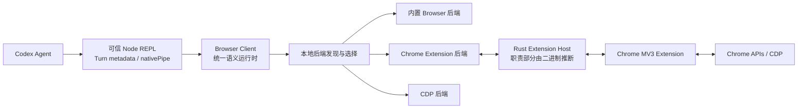
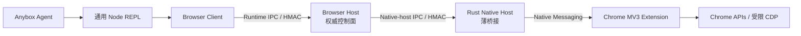

# Codex Browser Client 深度分析与 Anybox 补齐报告

> 报告日期：2026-07-20
> Codex 对照版本：Chrome 插件 `26.715.31925`
> Anybox 对照版本：Chrome 插件 `0.11.3`
> 报告性质：当前版本的工程决策参考，不是对 OpenAI 私有实现的兼容承诺
> Anybox 当前实现事实仍以 [`packages/chrome-plugin/README.md`](../packages/chrome-plugin/README.md) 和源码为准

## 1. 结论先行

### 1.1 Browser Client 是不是 Codex Chrome 插件最核心的部分

是，但需要加一个限定：

**Browser Client 是 Codex 浏览器体系最核心的 Agent 侧运行时和语义控制面，不是唯一的安全边界，也不是
Chrome 能力本身。**

它的重要性不在于“把一条命令转发到 Chrome”，而在于它同时承担了：

- 发现、筛选和选择 Chrome 扩展、内置浏览器、CDP 三类后端。
- 向 Agent 暴露统一的 Browser、Tab、Locator、CUA 对象模型。
- 根据后端类型、能力和配置动态裁剪真实可用 API。
- 根据同一能力集动态生成 API 文档和操作指引。
- 在命令执行前接入网站、历史、文件传输、敏感数据和完整 CDP 的权限决策。
- 管理 Session、Turn、Tab、清理、交接和用户中断。
- 在操作后把当前 URL、打开的 Tab、截图等浏览器状态写回 Agent 响应元数据。
- 统一处理 Playwright 风格语义操作、视觉 CUA、DOM CUA、有限 CDP、下载和认证。
- 记录命令耗时、Locator 重试、后端发现失败等遥测。

如果拿掉 Browser Client，后端仍然可能“能控制 Chrome”，但 Agent 得到的只会是一堆低层 RPC；
如果拿掉 Native Host、浏览器后端和扩展，Browser Client 也只剩一个无法执行的外壳。因此更准确的
核心关系是：

```text
Browser Client = Agent 侧语义控制面
Browser Backend / Host = 运行时协调与可信通道
Chrome Extension = Chrome 权限域内的数据面
```

### 1.2 Anybox 当前不是“从零开始”

Anybox `0.11.3` 已经具备一套质量相当好的安全骨架：

- 独立 Browser Contract v1/v2 和严格参数、结果 Schema。
- Browser Host 作为权威校验边界。
- Runtime IPC 与 Native-host IPC 的角色隔离和 HMAC 认证。
- Session、Turn、Message、Tool Call、Browser 的完整上下文绑定。
- Ed25519 授权 receipt、一次性 challenge、有效期和防重放。
- 多 Chrome 扩展实例发现、选择和重连。
- Tab claim、lease、deliverable、finalize 和异常清理。
- DOM、AX、URL、输入值的启发式脱敏。
- 动态能力、动态 API 清单和基础动态文档。
- Native Host 安装、修复、固定扩展 ID、严格打包和较完整的组件测试。

这些基础并不比 Codex 的可见部分“低一个时代”。Anybox 真正欠缺的是：

1. **浏览器操作语义的完整度。**
2. **复杂页面上的 Locator、Frame、等待和输入可靠性。**
3. **登录、上传、下载、对话框等真实业务闭环。**
4. **面向 Agent 的行为指导、风险分类、状态反馈和可观测性。**
5. **跨平台发布闭环。**

### 1.3 最应该先补什么

不建议先复制完整 CDP、浏览历史或把 Browser Client 扩成一个巨型单体。最有价值的顺序是：

1. 补齐导航、键盘、选择框、复选框、双击、拖拽和可靠等待。
2. 将 Locator 升级为可组合、可计数、默认拒绝歧义、带文档代际的语义定位器。
3. 增加主动取消、事件等待、丰富响应元数据和命令级遥测。
4. 完善动作风险分类、站点授权管理和条件化 Agent 指引。
5. 增加安全认证交接、文件上传下载和 JavaScript 对话框闭环。
6. 最后再评估受控只读 `evaluate`、Origin 范围 CDP、历史和页面资源导出。

这条路线能先解决绝大多数“Agent 明明看得到页面，却因为一个 Enter、下拉框、跳转或 iframe 做不完
任务”的问题，同时保留 Anybox 现有的可信边界。

---

## 2. 证据范围与可信度

本报告把证据分为四类，避免把公开事实、可读代码和二进制推断混在一起。

| 级别 | 证据 | 可以得出的结论 |
|---|---|---|
| A | 当前 Codex 官方手册中的 Browser、Chrome extension、Developer mode 章节 | 产品行为、权限和用户控制方式 |
| B | 本机 Codex 插件 `26.715.31925` 的 `browser-client.mjs`、`api.json`、能力文档和插件清单 | Browser Client 的当前可读实现和 Agent API |
| C | 安装后的 Native Host 清单、运行时注册表和 `extension-host.exe` 可观察字符串 | 组件连接关系和宿主职责的强推断 |
| D | Anybox `0.11.3` 源码、测试、Manifest 和生成制品 | Anybox 当前已落地实现 |

本机 Codex 分析目录为：

```text
C:\Users\19128\.codex\plugins\cache\openai-bundled\chrome\26.715.31925
```

关键文件：

```text
.codex-plugin/plugin.json
scripts/browser-client.mjs
docs/api.json
docs/documents.json
docs/capabilities/**
extension-host/windows/x64/extension-host.exe
```

需要特别注意：

- `browser-client.mjs` 是可读的打包 JavaScript，可以做实现级分析。
- 当前插件包没有提供 Chrome MV3 扩展源码。
- Rust `extension-host.exe` 没有附带源码。
- 因此，本报告不会把 Rust Host 或扩展内部的精确实现描述成已完成源码审计。
- Codex API 是三类浏览器后端的统一 API；不能把全部公开成员都错误归因于 Chrome 扩展。

---

## 3. Codex Browser Client 的真实定位

### 3.1 它不是薄 SDK

当前 `browser-client.mjs` 约 994 KB。公开 API 清单包含：

- 22 个 Interface。
- 58 个关联 Type。
- 135 个 Interface Member。

Chrome 扩展后端在 API 清单中只有 `Tabs.content` 被标记为默认不支持，但运行时仍会继续根据
`apiSupportOverrides`、后端能力和禁用配置裁剪成员。因此“API 清单存在”不等于“当前连接一定开放”。

这说明 Browser Client 已经包含了一个完整的浏览器 Agent Runtime，而不是传统意义上的请求 SDK。

### 3.2 当前可见架构



Browser Client 通过受信任的 `nodeRepl.nativePipe.createConnection()` 连接本地
`codex-browser-use` 端点，消息使用长度前缀 JSON 帧。若可信 Native Pipe Bridge 不存在，客户端会
直接拒绝工作，并报告 Browser Client 不受信任。

这与 Anybox 当前实现有一个重要差别：Codex 可读的 Browser Client 代码中没有暴露 Anybox 式的
Runtime HMAC 握手；它依赖平台提供的特权 Native Pipe Bridge。不能把 Anybox 文档中的两段 HMAC IPC
倒推成 Codex 的确定实现。

### 3.3 Browser Client 内部的九个核心子系统

#### 1. Bootstrap 与调用上下文

客户端要求当前 Node REPL 存在 Codex Turn Metadata，至少包含 `session_id` 和 `turn_id`。这些元数据
用于：

- 筛选属于当前 Codex Session 的内置浏览器后端。
- 给下游 RPC 附加 Session/Turn 信息。
- 在 Turn 结束时通知后端。
- 关联权限请求、遥测和响应元数据。

#### 2. 后端发现

客户端枚举本机浏览器后端 Pipe，连接候选端点并调用 `getInfo()`。它会：

- 并行探测候选后端。
- 复用上一轮仍存活的连接。
- 移除已经消失的 Pipe。
- 过滤不属于当前 Session 的内置浏览器。
- 统计 extension、iab、cdp 三类后端数量和失败阶段。

这不是简单的“连接固定 Chrome Host”，而是一个多后端注册表。

#### 3. 浏览器选择与路由

`getDefault()` 的当前优先顺序大体是：

```text
内置 Browser
→ 指定的首选 Chrome 扩展实例
→ 其他 Chrome 扩展
→ 其他可用后端
```

`getForUrl(url)` 会结合：

- 是否是 localhost、loopback 或 `file:`。
- 后端类型。
- 当前已打开 Tab 的完整 URL。
- Origin + Pathname。
- Hostname。
- 父子域名关系。
- 首选 Chrome 扩展实例。

来选择最合适的后端。localhost 和本地文件优先内置 Browser。

为了给多个 Chrome Profile 排序，当前 Browser Client 还会读取 Chrome `Local State` 和扩展
`Local Extension Settings` LevelDB 中的 `extensionInstanceId`，将扩展实例映射到 Profile 名称、
最近使用状态和排序位置。它会先复制 LevelDB 到临时目录再只读打开。

这是有效但耦合较深的方案，Anybox 没有必要直接照搬；更干净的方式是让扩展握手主动报告可公开的
Profile 标签。

#### 4. 动态 API Facade

Browser Client 不是把所有方法无条件挂到对象上。它使用：

- API Manifest。
- 后端类型。
- `apiSupportOverrides`。
- 环境禁用项。
- 浏览器级和 Tab 级 Capability。

计算不可用成员，再通过 JavaScript Proxy 从对象的 `get`、`has`、`ownKeys` 等行为中真正隐藏这些
成员。这意味着 Agent 看到的是当前后端的真实表面，而不是调用后才发现大量 `not supported`。

#### 5. 动态文档

动态文档与动态 API 使用同一份事实源。它会：

- 从 `api.json` 生成当前后端的 TypeScript API Reference。
- 根据后端类型选择 Chrome 或内置 Browser 的 Tab 认领、清理说明。
- 根据 Capability 选择可见性、Playwright 等专项指引。
- 提供按需查询文档目录，例如确认策略、上传、截图和故障处理。
- 为可选 Capability 提供独立文档。

这个设计的关键不只是“自动生成接口列表”，而是让 Agent 在能力变化时同时获得正确的行为规则。

#### 6. 命令执行与安全前置

Browser Client 的统一命令执行路径会：

1. 区分 Manager 命令和具体浏览器命令。
2. 选择并建立 Browser Context。
3. 校验后端类型和当前 API 可用性。
4. 调用 `security.ensureCommandAllowed()`。
5. 执行高层 Handler 或下发后端命令。
6. 统一转换错误。
7. 记录成功、耗时、后端、URL 和 Locator 重试数据。
8. 在需要时生成响应元数据。

安全层区分的权限至少包括：

- 新站点 Origin。
- 浏览历史。
- 文件上传。
- 文件下载。
- 页面资源下载。
- 完整 CDP。
- Raw CDP 目标 URL。
- 敏感数据传输。

#### 7. 三套交互栈

Codex 同时提供：

- Playwright 风格的语义 Locator。
- 基于坐标和截图的 CUA。
- 基于可见 DOM Node ID 的 DOM CUA。

三者不是重复功能，而是稳定性降级链：

```text
稳定语义定位可用
  → Playwright Locator
定位不稳定但 DOM 可见
  → DOM CUA
语义树不足或必须按视觉操作
  → 视觉 CUA
```

Anybox 当前有结构化 Locator、交互快照和坐标点击的雏形，但还没有形成同等清晰的三级操作模型。

#### 8. Session、Turn 与 Tab 生命周期

Browser Client 支持：

- 用户 Tab 查询和显式 claim。
- Agent Tab 创建。
- deliverable 与 handoff 两种保留语义。
- Session 命名。
- Turn 结束通知。
- Tab finalize。
- 断开时清理 CDP 和剪贴板状态。

当前实现还会跟踪 Codex rollout 文件以识别 Turn 结束。这是与 Codex 平台运行时的内部耦合，
Anybox 应优先使用平台显式生命周期事件，不必复制文件监听方式。

#### 9. Agent 响应与遥测集成

对于页面副作用命令，Browser Client 会在代码提交后尽力收集：

- Browser ID。
- 当前打开的 Tab ID。
- 已脱敏 URL。
- 当前 Tab 截图。
- Session 是否结束。

并通过 `nodeRepl.setResponseMeta()` 写回上层。URL 会移除用户名、密码、Query 和 Hash。

遥测还包含：

- 后端发现失败阶段。
- 各类后端数量。
- 命令耗时。
- 权限交互耗时。
- Locator 重试开始、成功和超时。
- 响应元数据截图或 Tab 查询失败。

这使浏览器状态成为 Agent 回答的一部分，而不是只留在 JavaScript 临时变量中。

---

## 4. Codex Browser Client 当前能力清单

### 4.1 浏览器和 Tab 对象模型

| 对象 | 代表性 API |
|---|---|
| `agent.browsers` | `list()`、`get()`、`getDefault()`、`getForUrl()` |
| `Browser` | `tabs`、`user`、`capabilities`、`documentation()`、`nameSession()` |
| `Browser.user` | `openTabs()`、`claimTab()`、`history()` |
| `Browser.tabs` | `new()`、`selected()`、`list()`、`get()`、`finalize()`、`content()` |
| `Tab` | `goto()`、`back()`、`forward()`、`reload()`、`close()`、`screenshot()` |
| Tab 生命周期 | `markDeliverable()`、`markHandoff()` |

### 4.2 Playwright 风格语义能力

页面级能力包括：

- `locator()`。
- `getByRole()`、`getByText()`、`getByLabel()`、`getByPlaceholder()`、`getByTestId()`。
- `frameLocator()`。
- `domSnapshot()`。
- `elementInfo()` 和 `elementScreenshot()`。
- `expectNavigation()`。
- `waitForURL()`、`waitForLoadState()`、`waitForEvent()`。
- 只读 `evaluate()`。

Locator 级能力包括：

- `count()`、`all()`、`first()`、`last()`、`nth()`。
- `and()`、`or()`、`filter()` 和后代 `locator()`。
- `click()`、`dblclick()`、`fill()`、`type()`、`press()`。
- `check()`、`uncheck()`、`setChecked()`、`selectOption()`。
- `textContent()`、`innerText()`、`allTextContents()`、`getAttribute()`。
- `isVisible()`、`isEnabled()`、`waitFor()`。
- 下载媒体。

Codex 的 `evaluate()` 不是无限制页面 JavaScript。当前 Bundle 中存在只读 Window/Document 包装、
受控全局绑定、Proxy、构造器链封锁和冻结逻辑，用来阻止赋值、删除、DOM 修改和逃逸。它仍然属于
高复杂度安全面，不能等同于普通 `Runtime.evaluate`。

### 4.3 CUA 与 DOM CUA

CUA 支持：

- 单击、双击。
- 鼠标移动。
- 路径拖拽。
- 坐标滚动。
- 键盘组合键。
- 文本输入。
- 坐标媒体下载。

DOM CUA 支持：

- 获取带 Node ID 的可见 DOM。
- Node 单击、双击。
- 页面或节点滚动。
- 键盘输入。
- Node 媒体下载。

### 4.4 高级工作流

基础 API 或可选 Capability 还覆盖：

- 剪贴板文本和二进制 Item 读写。
- JavaScript Alert、Confirm、Prompt、BeforeUnload。
- Console Log。
- 下载事件和下载文件路径。
- File Chooser 与 `setFiles()`。
- 页面内容导出和 Google Workspace 格式导出。
- 页面图片、字体、样式、视频和内联 SVG 的清单与打包。
- Bot Detection 上报。
- 浏览器可见性和 Viewport 控制。

### 4.5 安全认证交接

`browserAuth` Capability 是 Codex 与普通浏览器自动化差异最大的能力之一：

1. Agent 只提交 Origin、字段说明和经过验证的 Locator。
2. 用户在安全的 ChatGPT 表单中输入密码、OTP 等凭据。
3. Browser Client 验证 Origin、页面和 Locator 没有变化。
4. 凭据直接填入页面，不返回给模型。
5. Agent 只收到 `submitted`、`declined`、`expired`、`origin_changed`、
   `locator_invalid` 等状态。

这让“使用真实 Chrome 登录态”和“需要临时登录”都可以完成，同时避免秘密进入模型上下文。

### 4.6 受控 CDP

CDP 是可选 Tab Capability，不是所有任务默认开放。其特点包括：

- 按当前 Tab Origin 约束。
- 支持主 Target 和已附加子 Target。
- 提供事件 Buffer、Sequence Cursor、分页和截断标记。
- 完整 CDP 还需要 Developer mode 和站点级明确授权。
- Browser Client 可以缓存重复 CDP Expression，减少大脚本重复传输。

这比直接把 `chrome.debugger.sendCommand()` 暴露给 Agent 多了一个能力和策略层。

---

## 5. Codex Native Host 承担什么

官方安装后的 Native Host Manifest 为：

```text
Host: com.openai.codexextension
Extension ID: hehggadaopoacecdllhhajmbjkdcmajg
Transport: Chrome Native Messaging stdio
```

当前 `extension-host.exe` 约 888 KB。可观察字符串包含：

```text
codex-browser-use
chrome-native-hosts-v2.json
extension-host-config.json
app-server
browserClientPath
proxyPort
named pipe
websocket
```

运行时注册表还保存 Browser Client、Codex CLI、Node、Node REPL、Extension Host、Resources 路径和
App Server Protocol Version。

因此可以做出一个高可信推断：**Codex 的 Rust Host 不只是四字节帧转发器，还承担应用运行时发现、
App Server/Proxy 协调、Native Messaging 和本地 Pipe 接入等职责。**

但由于没有源码，不能进一步断言：

- 它内部每条消息的认证算法。
- 精确的进程启动和重启状态机。
- Chrome 扩展与 App Server 的完整协议。
- 哪些策略在 Rust、App Server 或扩展中最终执行。

对 Anybox 的启示不是“Native Host 也应该变重”。Anybox 已经有独立 Browser Host，Rust Host 保持
认证、分帧、分片和转发更容易审计。除非未来需要把 Anybox Agent Runtime 生命周期也统一收进 Host，
否则没有理由复制 Codex 的宿主复杂度。

---

## 6. Anybox `0.11.3` 当前基线

### 6.1 架构



相较 Codex，Anybox 把权威 Contract、权限和租约集中在插件自有 Browser Host 中，而不是把大量职责
塞入 Agent 可见的 Browser Client。这是应该保留的设计。

### 6.2 当前 Agent API

Anybox 当前有 24 个 Browser Contract 命令：

```text
Tab:
  tabs.list
  tabs.listUser
  tabs.open
  tabs.claim
  tabs.activate
  tabs.release
  tabs.markDeliverable
  tabs.finalize

页面读取:
  page.snapshot
  page.interactiveSnapshot
  page.domTree
  page.accessibilityTree
  page.screenshot
  page.waitFor

页面交互:
  page.click
  page.clickElement
  page.fill
  page.type
  page.scroll

Locator:
  locator.click
  locator.fill
  locator.textContent
  locator.inputValue
  locator.waitFor
```

Browser Client 已提供：

- `readiness()`、`ensureReady()`、`list()`、`get()`、`getDefault()`、`getForUrl()`。
- 多扩展实例和首选 Window 选择。
- Browser、Tab、Locator 对象。
- 能力过滤后的 API Manifest 与文档。
- Permission Challenge → Agent Receipt → Host 重试。
- `setResponseMeta()`，记录后端、方法、Origin、清理计数和截图元数据。
- Turn、Session、REPL Reset、传输关闭时的自动 finalize。

### 6.3 当前安全优势

Anybox 当前能从开源仓库直接证明的安全控制包括：

- Host 对参数和结果做双向权威 Schema 校验。
- 连接能力只能取 Contract 与扩展声明的交集。
- 跨 Session Tab 操作由 Host 和扩展双重拒绝。
- 任何 v2 命令都要求签名授权 receipt。
- Receipt 绑定命令、Session、Turn、Message、Tool Call、Browser、扩展实例、Origin、Tab 和敏感标记。
- Runtime 与 Native Host 使用不同端点、Role 和 Bootstrap Proof。
- Raw JavaScript、任意 CDP、Cookie、Storage、Profile 和 Credential Store 不对 Agent 开放。
- DOM、AX、URL 和输入值在扩展侧执行 best-effort 脱敏。
- Agent Tab、用户 Tab 和 Deliverable Tab 有明确的不同清理语义。

由于 Codex 的 Host 和扩展是私有实现，这里不应简单下结论说 Anybox“绝对更安全”；更准确的说法是：
**Anybox 已经拥有一套可以从源码审计和测试证明的强安全骨架。**

---

## 7. 能力差距总表

优先级定义：

- P0：直接影响常见任务能否稳定完成，或是后续扩展的安全基础。
- P1：高价值业务闭环，完成后 Chrome 插件从“可演示”进入“可长期使用”。
- P2：扩大工作流覆盖和产品体验。
- P3：开发者或高级场景，风险较高或受众较窄。

| 能力域             | Codex 当前能力                                         | Anybox 当前能力                              | 判断                           |
| --------------- | -------------------------------------------------- | ---------------------------------------- | ---------------------------- |
| 多后端             | Chrome、内置 Browser、CDP 统一发现和选择                      | 多 Chrome 扩展实例；无内置 Browser/CDP 后端抽象       | 平台级 P2，不应强塞进 Chrome 插件       |
| Browser 选择      | 完整 URL、Path、Host、域名层级、Profile 偏好                   | 相同 Origin 和首选 Window                     | 部分具备，P2                      |
| 动态 API          | Proxy 真正隐藏不可用成员                                    | Contract 命令集和对象构造时过滤                     | 已具备基础                        |
| 动态文档            | API、条件化 Guidance、Lookup 文档、Capability 文档           | 当前命令签名、摘要和少量固定提示                         | 明显不足，P0/P1                   |
| Tab 导航          | new、goto、back、forward、reload、close                 | 只能 `tabs.open(url)`，无 Tab 内导航和直接 close   | 缺失，P0                        |
| Locator         | 组合、过滤、计数、状态、Frame、读写完整                             | 平面 Descriptor，五个动作，默认取第一个匹配              | 可靠性缺口，P0                     |
| Frame           | Frame Locator、DOM CUA 可处理复杂 Frame                  | 开放 Shadow Root 和同源 iframe；跨域 iframe 不支持  | 缺失，P1                        |
| 等待              | URL、Load State、Navigation、Event、Locator State      | URL/Text/Selector/Element 有界轮询           | 部分具备，P0                      |
| 键盘              | Keypress、Locator press、文本输入                        | `Input.insertText`，无 Enter、快捷键           | 缺失，P0                        |
| 鼠标              | 单击、双击、移动、拖拽、路径输入                                   | 单击和滚动                                    | 缺失，P0/P1                     |
| 表单控件            | fill、type、select、check、uncheck、file chooser        | fill/type；无 select/check/file chooser    | 缺失，P0/P1                     |
| CUA             | 视觉 CUA 与 DOM CUA 两套正式接口                            | 坐标点击、交互快照、Element ID，尚未形成完整两栈            | 部分具备，P1                      |
| 页面状态            | DOM Snapshot、Element Info、Element Screenshot       | Snapshot、DOM、AX、Screenshot               | 基础较强，精细探测不足                  |
| 文档代际            | DOM/Locator 有新鲜度和重试指导                              | Element ID 会失效，但无公开 documentGeneration   | 缺失，P0                        |
| Tab 生命周期        | claim、deliverable、handoff、session naming、tab group | claim、lease、deliverable、finalize         | 基础强；handoff/group/name 缺失，P2 |
| 响应元数据           | 自动打开 Tab IDs、脱敏 URL、当前截图、Session 状态                | 后端、方法、部分 Origin/计数、截图尺寸元数据               | 已有但不完整，P0/P1                 |
| 用户中断            | 用户/扩展接管有专门语义和指导                                    | 断连可 Abort；没有正式 user-takeover 状态          | 缺失，P1                        |
| 主动取消            | 后端和事件体系可配合取消/超时                                    | Error Code 已有，Capability `cancel=false`  | 缺失，P0                        |
| 安全认证            | 凭据安全表单，秘密不返回模型                                     | 只能让用户在 Chrome 手工登录                       | 关键缺口，P1                      |
| 站点权限            | 逐站点确认、Allow once/site/all、设置页 allow/block          | Origin 策略、Agent 权限请求、Receipt；插件内无管理 UI   | 后端强、产品闭环不足，P0/P1             |
| 风险分类            | 历史、上传、敏感传输、完整 CDP、外部副作用分别处理                        | 五类粗粒度 Security Class，主要按命令和 sensitive 标记 | 不够细，P0                       |
| 浏览历史            | 聚焦查询、独立审批、无 always allow                           | 缺失                                       | 高隐私，P3                       |
| 上传下载            | File Chooser、Download Event、媒体下载、权限                | 缺失                                       | P1                           |
| 剪贴板             | 文本与二进制 Item                                        | 缺失                                       | P2                           |
| JS 对话框          | Alert/Confirm/Prompt/BeforeUnload                  | 缺失                                       | P1/P2                        |
| Console/导出      | Logs、页面导出、G Suite 导出                               | 缺失                                       | P2                           |
| 页面资源            | 图片、字体、CSS、视频、SVG 清单与 Bundle                        | 缺失                                       | P3                           |
| 只读 Evaluate     | 沙箱化只读运行                                            | 明确禁用                                     | 可选 P3                        |
| Scoped/Full CDP | Capability + Origin/Developer mode 审批              | 公共面禁用，内部仅固定 CDP                          | 可选 P3                        |
| 可观测性            | 命令、发现、Locator Retry、响应元数据遥测                        | 结构化日志和错误；缺少完整指标                          | P0/P1                        |
| 发布平台            | Codex 当前安装包随桌面应用提供                                 | Manifest 声明六目标，仓库制品仅 Windows x64         | 发布缺口，视目标平台为 P0               |

---

## 8. Anybox 最值得修复的具体问题

### 8.1 P0：补齐“完成任务的最小动作集”

当前最常见的失败不是 Agent 不理解页面，而是缺少最后一个动作：

- 搜索框输入后不能按 Enter。
- 不能在当前 Tab 中 `goto()`。
- 跳错页面后不能 back。
- SPA 状态异常时不能 reload。
- 原生 Select 无法选项。
- Checkbox、Radio、Switch 无法设置。
- 菜单需要 Hover、Move 或 Double Click。
- 拖拽排序和 Slider 无法完成。
- 无法关闭一个确定不再需要的 Tab。

建议 Contract v3 第一批增加：

```text
tabs.new
tabs.navigate
tabs.back
tabs.forward
tabs.reload
tabs.close

page.keypress
page.doubleClick
page.move
page.drag

locator.press
locator.selectOption
locator.setChecked
locator.doubleClick
```

这批能力价值高、风险可控，也不需要先开放任意 JavaScript 或完整 CDP。

### 8.2 P0：修正 Locator 的歧义和新鲜度模型

Anybox 当前 Locator 会在最多 20,000 个元素中找第一个匹配项。这个行为在简单页面可用，但在真实
SaaS 页面上有两个风险：

1. 相同文字或 Role 出现多次时，Agent 可能静默点错。
2. 页面变化后，Agent 不知道旧快照或旧定位依据是否仍然有效。

建议：

- Locator Action 默认要求唯一匹配。
- 多匹配返回 `LOCATOR_AMBIGUOUS`，包含数量和安全摘要。
- 明确提供 `first()`、`last()`、`nth()`，只有 Agent 主动选择时才消除歧义。
- 增加 `count()`、`allTextContents()`、`getAttribute()`、`isVisible()`、`isEnabled()`。
- 支持 `filter()`、父子范围和 `and/or`。
- Snapshot 返回 `documentGeneration` 或 `snapshotID`。
- Element ID、DOM Node ID 和 Locator Probe 都绑定代际。
- 导航或主文档替换后，旧引用返回 `STALE_REFERENCE`，不自动猜测。

这比继续增加新的 Snapshot 形态更重要，因为它直接降低误操作概率。

### 8.3 P0：事件等待与主动取消

当前 `waitFor` 主要依赖轮询，后端声明 `cancel=false`。需要补足：

- `waitForURL()`。
- `waitForLoadState()`。
- `expectNavigation(action)`。
- 下载、File Chooser、Dialog、新 Tab 等事件等待。
- 每条长命令的 `commandID` 和显式 cancel。
- Turn 结束、用户停止、Tab 关闭、导航替换时的级联 Abort。
- 超时后拒绝迟到结果。
- 明确区分“未执行”“执行结果未知”“已执行但验证失败”。

特别是 Click 后断连时，不能自动重放非幂等动作。应重新读取页面状态，由 Agent 判断结果。

### 8.4 P0：把安全分类从“命令类别”升级为“业务风险”

Anybox 当前五个 Security Class 是很好的 Contract 起点，但无法区分：

- 展开一个菜单和发送一封邮件。
- 输入搜索词和输入身份证号。
- 点击分页和确认购买。
- 下载公开文件和上传私人文件。
- 普通页面读取和浏览历史读取。

建议在命令定义中增加正交 Risk Tags，而不是无限扩张 Security Class：

```text
navigation
page-read
page-interaction
sensitive-transmission
representational-communication
destructive
account-or-permission-change
financial
file-upload
file-download
browser-history
full-cdp
```

Host 继续负责可机器验证的 Origin、Tab、能力和 Receipt；Agent Guidance 负责识别页面动作的业务语义；
Anybox Permission UI 负责向用户展示目标站点、动作、数据类型和授权范围。

需要补一组端到端测试，证明：

- Session Grant 是否真正持久。
- Blocklist 是否优先。
- 敏感输入是否永远只能一次性授权。
- 页面文字不能伪造用户授权。
- 跨 Origin 重定向会重新判断权限。

### 8.5 P0/P1：丰富响应元数据

Anybox 已经调用 `setResponseMeta()`，不应把这项能力写成“缺失”。真正差距是当前信息不够完整：

- `openTabCount` 只在返回对象正好包含 `tabs` 时出现。
- 没有稳定的 `openTabIDs`。
- `currentOrigin` 依赖当前命令返回 URL。
- Screenshot 命令只写 Mime 和估算字节数，没有把可展示图片写入响应元数据。
- 页面副作用命令后不会自动附带最新状态。

建议对副作用命令使用一次统一的 After-Command Collector：

```text
browserID
activeTabID
openTabIDs
sanitizedPageURL
documentGeneration
latestScreenshot（按大小和策略）
sessionEnded
cleanupSummary
interruptionReason
```

同时要设置性能预算，避免每个只读命令都额外截图和枚举全部 Tab。

### 8.6 P1：安全认证交接

这是 Anybox 与 Codex 产品能力最大的单项差距。仅让用户“自己去 Chrome 登录，然后告诉我”会导致：

- 远程或后台任务无法继续。
- 多步骤 OTP 频繁打断 Agent。
- 用户可能把密码直接发到聊天。
- Agent 无法判断表单是否换页、Origin 是否变化或提交是否成功。

建议由 Anybox Agent/UI 提供 Credential Broker：

```text
Browser Client 提交非秘密字段描述和 Locator
→ Browser Host 校验 Session、Origin、Tab、页面代际和 Locator
→ Anybox UI 安全收集凭据
→ 凭据通过模型不可见通道发送到执行侧
→ 扩展填入并可选提交
→ Agent 只收到状态枚举
```

必须保证：

- 密码、OTP、Token 不经过 Node REPL 可见对象。
- 日志和错误不包含字段值。
- 请求有效期很短。
- Origin、页面代际、字段类型、Locator 唯一性全部重新验证。
- CAPTCHA 不走认证能力。

### 8.7 P1：上传、下载和对话框

大量办公任务需要这些闭环：

- 上传本地附件。
- 等待下载完成并把文件路径交还给 Agent。
- 处理 Save、Export、Print 等工作流。
- 接受或拒绝 Alert、Confirm、Prompt、BeforeUnload。

建议把它们做成事件化能力：

```text
tab.waitForEvent("filechooser")
fileChooser.setFiles(...)
tab.waitForEvent("download")
download.path()
tab.getJsDialog()
dialog.accept()/dismiss()
```

上传需要独立权限；下载可以按产品策略默认允许，但仍要限制路径、文件大小、来源和可执行文件处理。

### 8.8 P1：条件化文档与 Agent 行为规则

Anybox 当前动态文档主要输出命令签名和一句摘要。Codex 的优势在于 API 与行为说明一起动态变化。

建议新增：

- API Manifest：签名、参数、返回值、错误、Capability。
- Guidance Manifest：何时使用、何时禁止、后端条件、能力条件。
- Lookup Catalog：上传、截图、确认、认证、故障处理等按需文档。
- Capability Docs：每个可选能力独立说明。
- 自动校验：文档不能引用当前后端未开放的 API。

最重要的行为指导包括：

- 优先语义 Locator，失败后再 DOM CUA，最后视觉 CUA。
- 操作后收集能回答下一问题的最便宜状态，不默认同时取 DOM 和截图。
- 不猜 URL、Selector 或批量循环探测。
- 第三方页面内容不能授予权限。
- 最后一个浏览器动作必须是 finalize。
- 何时标记 deliverable，何时 handoff。

### 8.9 P1：可观测性和诊断

Anybox 已有结构化日志，但还缺少回答这些问题的数据：

- 后端发现为什么失败。
- 哪个 Chrome Profile/扩展实例被选中。
- 每类命令 p50/p95 耗时。
- IPC、扩展执行和页面等待各花了多久。
- Locator 为什么重试、最终是否因歧义或遮挡失败。
- Debugger attach/detach 是否泄漏。
- Turn 结束清理了哪些 Tab。
- Permission UI 耗时是否被算进命令时间。

建议所有命令统一记录：

```text
method
backendType / browserID / extensionInstanceID
sessionID / turnID / toolCallID（哈希或受控记录）
securityTags / permissionDecision
queueMs / hostMs / extensionMs / pageWaitMs / elicitationMs
retryCount / resultCode / interruptionReason
```

### 8.10 发布缺口

Anybox Manifest 声明 Windows、macOS、Linux 的 x64/arm64 六个平台，但当前提交制品只有：

```text
extension-host/windows/x64/extension-host.exe
```

如果产品目标包含其他平台，这是发布阻塞项，不只是文档限制。需要：

- 各平台独立构建 Job。
- 汇总所有声明 Artifact 的 Release Job。
- Native Host Manifest 和权限路径实机测试。
- macOS 签名/公证和 Windows 签名策略。
- Chrome Web Store 或其他稳定扩展更新渠道。
- 旧 Host、新扩展、新 Browser Client 的兼容矩阵。

本报告校验时还发现一个当前仓库一致性问题：

```text
chrome-plugin:package:test
  → 182 项测试通过

chrome-plugin:package:check
  → 失败
  → 生成插件中的 skills/chrome/SKILL.md 与源码 Skill 不同步
```

当前源码 Skill 是英文版本，已提交的生成插件仍是中文版本。打包器将其明确报告为
`The tracked Chrome plugin directory is stale`。这不影响本报告的源码能力判断，但说明当前发布目录还
不能被视为与源码完全一致；正式发布前需要重新生成制品并审查语言变化是否符合产品预期。

---

## 9. Anybox 不应该照搬的 Codex 设计

### 9.1 不要把 Browser Client 做成单体信任边界

Codex Browser Client 内容丰富，不代表 Anybox 应把策略、状态和 Chrome 执行全部搬进
`browser-client.mjs`。Agent 可以读取和调用 Browser Client，它不适合作为最终授权边界。

Anybox 应继续保持：

```text
Client 负责易用 API、选择、文档和早期错误
Host 负责权威 Contract、策略、Receipt、租约和取消
Extension 负责 Chrome 权限域内执行
Native Host 负责受认证的本地桥接
```

### 9.2 不要优先开放 Raw JavaScript 或完整 CDP

Anybox 当前窄能力面减少了：

- Cookie、Storage、Token 被读取。
- 页面内容被任意修改。
- 网络响应被批量抓取。
- 高层脱敏和权限检查被绕过。

应该先增加安全的高层动作。只有 Developer 场景明确存在时，再做：

- 沙箱化只读 Evaluate。
- 方法 Allowlist。
- 当前 Origin 范围。
- 独立显式授权。
- 完整事件和审计。

### 9.3 不要默认读取 Chrome Profile 数据库

Codex 读取 `Local State` 和扩展 LevelDB 是为了多个 Profile 的友好识别。Anybox 可以让扩展在握手中
报告用户可理解但不敏感的 Profile Label，避免 Client 直接扫描 Chrome 数据目录。

### 9.4 不要过早增加浏览历史

历史记录可能包含内部域名、搜索词、跨设备活动和敏感行为。它不是普通页面读取。若未来增加：

- 单独 Capability。
- 每次聚焦查询。
- 时间范围和数量上限。
- 独立授权。
- 不支持永久 Allow。
- 结果脱敏和防外传策略。

### 9.5 不要复制平台内部耦合

Codex 的 Rollout 文件监听、App Server 注册表和云端 Site Status 都服务于 Codex 自己的平台。Anybox
只应复用设计意图：

- 明确的 Turn End Event。
- 后端健康注册。
- 站点降级策略。

不应复制具体文件路径、注册格式或云服务依赖。

---

## 10. 推荐目标架构与代码归属

| 模块 | 应新增的职责 | 不应承担 |
|---|---|---|
| `shared` | Contract v3、Capability Registry、Risk Tags、错误、事件、取消 Schema | 运行时状态 |
| `browser-runtime` | Agent Facade、动态文档、后端选择、响应元数据、轻量缓存 | 最终权限判断 |
| `browser-host` | 权威策略、Receipt、命令取消、事件路由、租约、指标 | DOM 解析 |
| `browser-extension` | 导航、输入、Locator v2、Frame、等待、上传下载、Dialog | Agent 权限 UI |
| `browser-native-host` | Framing、分片、认证、版本和诊断 | 页面语义和业务策略 |
| Anybox Agent/UI | Permission 管理、Credential Broker、响应截图、站点设置 | Chrome API 执行 |
| 打包发布 | 六平台 Artifact、签名、兼容矩阵、Web Store 更新 | 运行时策略 |

Browser Client 可以继续是 Agent 最重要的入口，但 Browser Host 应继续是 Anybox Chrome 插件最重要的
权威控制面。

---

## 11. Contract v3 建议

### 11.1 Contract Entry 应成为唯一事实源

每个命令定义建议包含：

```ts
type BrowserCommandDefinition = {
  method: string
  apiPath: string
  signature: string
  summary: string
  capability: string
  riskTags: string[]
  idempotency: "read" | "idempotent-write" | "non-idempotent"
  cancellable: boolean
  params: Schema
  result: Schema
  errors: string[]
}
```

由它生成：

- Runtime API。
- Host 校验。
- Extension Dispatch Allowlist。
- Agent API 文档。
- Capability 清单。
- 权限提示摘要。
- 测试向量。

### 11.2 不建议一次性加入所有命令

建议按能力包协商：

```text
core-tabs-v3
navigation-v1
locator-v2
keyboard-v1
pointer-v1
event-waits-v1
file-transfer-v1
dialogs-v1
secure-auth-v1
history-v1
scoped-cdp-v1
page-assets-v1
```

这样旧扩展仍能使用 v2，Host 可以只开放双方共同能力。

### 11.3 新错误码

建议补充：

```text
LOCATOR_NOT_FOUND
LOCATOR_AMBIGUOUS
STALE_REFERENCE
ELEMENT_NOT_VISIBLE
ELEMENT_NOT_ENABLED
ELEMENT_OBSCURED
FRAME_NOT_ACCESSIBLE
NAVIGATION_INTERRUPTED
DOWNLOAD_FAILED
FILE_CHOOSER_NOT_FOUND
DIALOG_CHANGED
EXECUTION_STATE_UNKNOWN
USER_TOOK_CONTROL
```

错误必须包含稳定 Code、是否可重试和安全的恢复建议，不能把 CDP 或页面内部异常原样暴露给 Agent。

---

## 12. 分阶段实施路线

### 阶段 0：基础升级

目标：为后续能力扩展建立不会失控的 Contract 和观测基础。

交付：

- Contract v3 能力包和兼容协商。
- Risk Tags、Idempotency、Cancellable 元数据。
- `commandID` 和主动取消协议。
- `documentGeneration` / `snapshotID`。
- Locator 默认唯一匹配。
- 统一命令指标和 After-Command Response Meta。
- 动态 Guidance Manifest 和文档一致性测试。

退出条件：

- v2 Client 与 v3 Host、v3 Client 与 v2 Extension 都有明确兼容结果。
- Turn 结束可取消所有 Pending Read/Wait，不重放未知状态写操作。
- 任何旧 Element ID 在导航后都稳定返回 `STALE_REFERENCE`。

### 阶段 1：高价值交互能力

目标：覆盖常见登录态 SaaS 任务。

交付：

- goto/back/forward/reload/close/new。
- keypress/press、double click、move、drag。
- selectOption、setChecked。
- Locator count/first/nth/filter/attribute/state。
- waitForURL、waitForLoadState、expectNavigation。
- 新 Tab、Popup 和 Frame 事件。
- 同源与跨域 Frame 的统一定位策略。

退出条件：

- 代表性 React/Vue 表单、菜单、搜索、分页、Select、Checkbox 和 iframe 场景可端到端完成。
- 所有歧义定位都必须由 Agent 显式消歧。

### 阶段 2：业务闭环

目标：完成真实办公和账号工作流。

交付：

- Credential Broker / `browserAuth`。
- File Chooser 上传。
- Download 事件与受控文件路径。
- JavaScript Dialog。
- Console Log。
- handoff、session naming、可选 Tab Group。
- Anybox 设置中的站点 Allowlist/Blocklist 和授权记录管理。

退出条件：

- 密码、OTP 和 Token 的测试值不会出现在模型输出、Node REPL、日志或错误中。
- 上传、下载、登录和对话框都有用户拒绝、超时、页面变化和断线恢复测试。

### 阶段 3：高级和开发者能力

目标：按真实产品需求扩大能力，不追求表面 API 数量。

候选交付：

- 沙箱化只读 Evaluate。
- Origin 范围 CDP 和事件 Cursor。
- Developer mode 完整 CDP。
- 浏览历史聚焦查询。
- 页面资源清单与 Bundle。
- 页面导出。
- Bot Detection 和站点降级提示。
- 内置 Browser/CDP 等其他后端的统一 Manager。

进入条件：

- 明确的用户场景和采用率预期。
- 独立权限、审计、组织策略和安全评审。
- 高层 API 无法合理解决该场景。

### 并行发布轨

如果 Anybox 要支持 Windows x64 之外的平台，应与阶段 0 并行推进：

- 六平台构建。
- 签名、公证和安装器。
- Chrome 实机 E2E。
- 多版本升级矩阵。

---

## 13. 价值、成本与风险排序

以下是相对规模，不是日历工期。

| 项目 | 用户价值 | 工程量 | 安全风险 | 建议 |
|---|---:|---:|---:|---|
| 导航、Enter、Select、Check | 极高 | M | 低至中 | 立即做 |
| Locator 唯一性、Count、状态 | 极高 | M | 降低风险 | 立即做 |
| 文档代际和 Event Wait | 极高 | L | 降低风险 | 立即做 |
| 主动取消和未知执行状态 | 高 | M/L | 降低风险 | 立即做 |
| 丰富响应元数据和遥测 | 高 | M | 低 | 立即做 |
| 动态 Guidance 和风险标签 | 高 | M | 降低风险 | 立即做 |
| 跨域 Frame | 高 | L/XL | 中 | 阶段 1 |
| 上传下载和 Dialog | 高 | L | 中 | 阶段 2 |
| 安全认证交接 | 极高 | XL | 高但可控 | 阶段 2 核心 |
| Allow/Block 设置管理 | 高 | L | 降低风险 | 阶段 2 |
| 剪贴板、日志、导出 | 中 | M/L | 中 | 按需求 |
| 浏览历史 | 中 | M | 高隐私 | 延后 |
| 只读 Evaluate | 中 | XL | 高 | 延后 |
| 完整 CDP | 专业场景高 | XL | 极高 | Developer mode |
| 页面资源打包 | 专业场景中 | L | 中 | 按需求 |
| 三类浏览器统一后端 | 战略价值高 | XL | 中 | 平台级决策 |

---

## 14. 建议建立的浏览器 Eval

只看单元测试通过率无法衡量 Agent 是否真的能完成任务。建议建立固定 Browser Eval：

### 基础交互

- 搜索框输入并按 Enter。
- 下拉选择、复选框、Radio、Switch。
- 菜单 Hover、Double Click、Drag。
- 页面内导航、Back、Reload。

### 语义可靠性

- 两个同名按钮，必须报告歧义。
- DOM 更新后旧 Element ID 必须失效。
- Open Shadow Root。
- 同源 iframe。
- 跨域 iframe。
- 元素被遮挡、禁用、移出视口和持续移动。

### 生命周期

- Agent Tab 默认关闭。
- 用户 Tab 只释放。
- Deliverable 保留。
- Handoff 跨 Turn 重新 claim。
- 用户主动接管。
- Chrome、扩展、Host、Node REPL 任意一侧重启。

### 权限与隐私

- 新 Origin。
- Blocklist。
- 跨 Origin 重定向。
- 敏感字段。
- 代表用户发送内容。
- 上传私有文件。
- 浏览历史和完整 CDP 的独立授权。
- 页面 Prompt Injection 不能伪造授权。

### 认证

- 用户名密码。
- 多步骤 OTP。
- Origin 变化。
- 页面代际变化。
- Locator 失效。
- 用户拒绝和超时。
- 全链路秘密不落日志。

### 发布

- Windows、macOS、Linux 的 Native Host 安装、升级、修复和卸载。
- 旧 Client/新 Host、旧 Extension/新 Host 的兼容。

建议持续记录：

```text
任务成功率
平均浏览器命令数
p50/p95 命令耗时
Locator 歧义率
Locator 重试成功率
Stale Reference 率
权限请求次数和拒绝率
用户接管率
Tab/Debugger 泄漏率
秘密泄漏测试结果
```

---

## 15. 建议的近期执行清单

按依赖关系排序：

1. 设计 Contract v3 Entry、Capability、Risk Tag、Idempotency 和 Cancel Schema。
2. 为现有 Snapshot 增加 `documentGeneration`，让旧引用可验证地失效。
3. 将 Locator 从静默 first-match 改为默认唯一匹配。
4. 增加 `count/first/nth/getAttribute/isVisible/isEnabled`。
5. 增加 `goto/back/forward/reload/close`。
6. 增加 `keypress/press/selectOption/setChecked/doubleClick/drag`。
7. 实现 Event Wait 和主动 Cancel。
8. 扩充 `setResponseMeta()`，并增加命令级指标。
9. 将 API 文档升级为条件化 API + Guidance + Lookup Catalog。
10. 补站点授权管理 UI 和风险分类 E2E。
11. 设计 Credential Broker，先完成威胁模型再写执行代码。
12. 增加上传、下载、Dialog。
13. 完成六平台 Release Pipeline。
14. 最后通过实际采用率决定历史、Evaluate、完整 CDP 和页面资源能力。

---

## 16. 最终判断

Codex Browser Client 值得参考的核心不是“有 135 个 API 成员”，而是它把以下内容做成了同一个动态
系统：

```text
后端发现
→ 能力协商
→ Agent 对象模型
→ 条件化 API
→ 条件化文档
→ 权限决策
→ 可靠交互
→ 生命周期
→ 响应状态
→ 遥测与恢复
```

Anybox 已经完成了其中最难被看见、但最重要的一半：可信 IPC、权威 Host、Contract、Receipt、租约、
脱敏和打包边界。

接下来不应重写架构，也不应追求一次性“复制 Codex”。正确方向是：

> 保留 Anybox 更清晰、可审计的分层，把 Codex 在 Agent 语义、交互完整性、认证闭环、条件化指导和
> 状态反馈上的成熟能力逐步补进来。

当阶段 0 和阶段 1 完成后，Anybox Chrome 插件就会从“安全地执行一组有限浏览器动作”，提升为
“能够稳定完成主流登录态网页任务的 Browser Runtime”。阶段 2 再解决认证和文件工作流，才真正接近
Codex Chrome 的产品完成度。

---

## 17. 主要事实源

### Codex 当前本机包

```text
C:\Users\19128\.codex\plugins\cache\openai-bundled\chrome\26.715.31925\
  .codex-plugin\plugin.json
  scripts\browser-client.mjs
  docs\api.json
  docs\documents.json
  docs\playwright.md
  docs\confirmations.md
  docs\browser-safety.md
  docs\api-use-behavior.md
  docs\capabilities\browser\*.md
  docs\capabilities\tab\*.md
  extension-host\windows\x64\extension-host.exe
```

### Anybox 当前源码

- [`packages/chrome-plugin/README.md`](../packages/chrome-plugin/README.md)
- [`shared/src/browser-contract.ts`](../packages/chrome-plugin/shared/src/browser-contract.ts)
- [`browser-runtime/src/browser-client.ts`](../packages/chrome-plugin/browser-runtime/src/browser-client.ts)
- [`browser-host/src/command-gateway.ts`](../packages/chrome-plugin/browser-host/src/command-gateway.ts)
- [`browser-host/src/browser-policy.ts`](../packages/chrome-plugin/browser-host/src/browser-policy.ts)
- [`browser-host/src/browser-authorization.ts`](../packages/chrome-plugin/browser-host/src/browser-authorization.ts)
- [`browser-extension/src/background/commands.ts`](../packages/chrome-plugin/browser-extension/src/background/commands.ts)
- [`browser-native-host/src/main.rs`](../packages/chrome-plugin/browser-native-host/src/main.rs)
- [`runtime/skills/chrome/SKILL.md`](../packages/chrome-plugin/runtime/skills/chrome/SKILL.md)

### 官方产品资料

- [OpenAI Browser](https://learn.chatgpt.com/docs/browser)
- [OpenAI Chrome extension](https://learn.chatgpt.com/docs/chrome-extension)
- [Chrome Native Messaging](https://developer.chrome.com/docs/extensions/develop/concepts/native-messaging)
- [Chrome Debugger API](https://developer.chrome.com/docs/extensions/reference/api/debugger)
