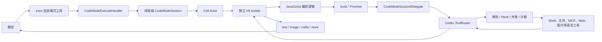
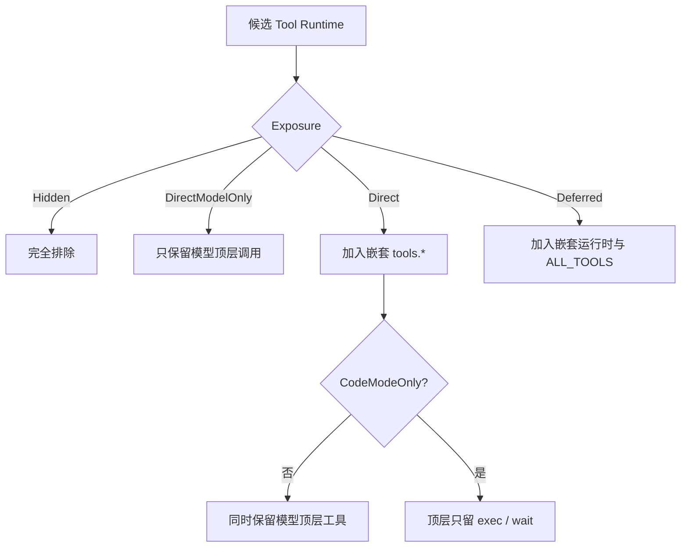
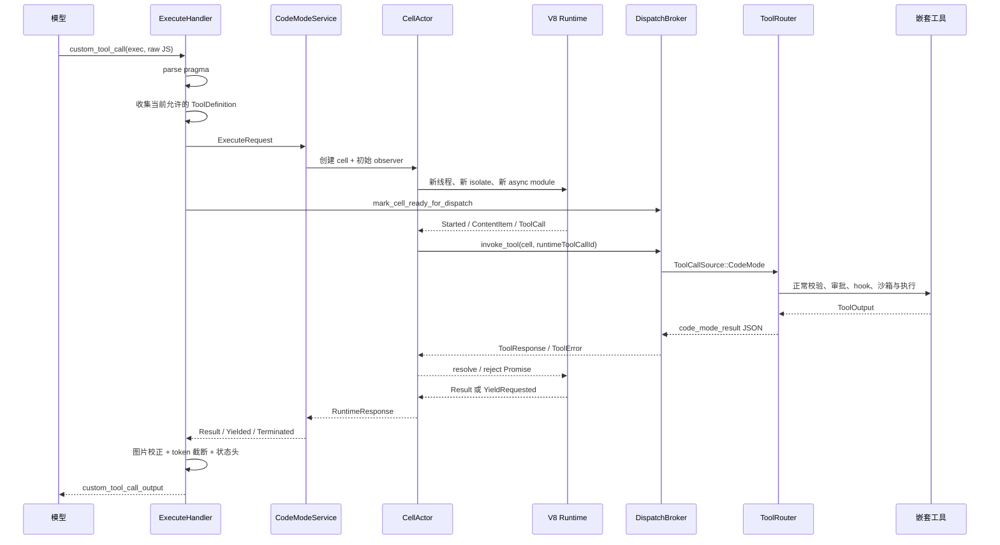
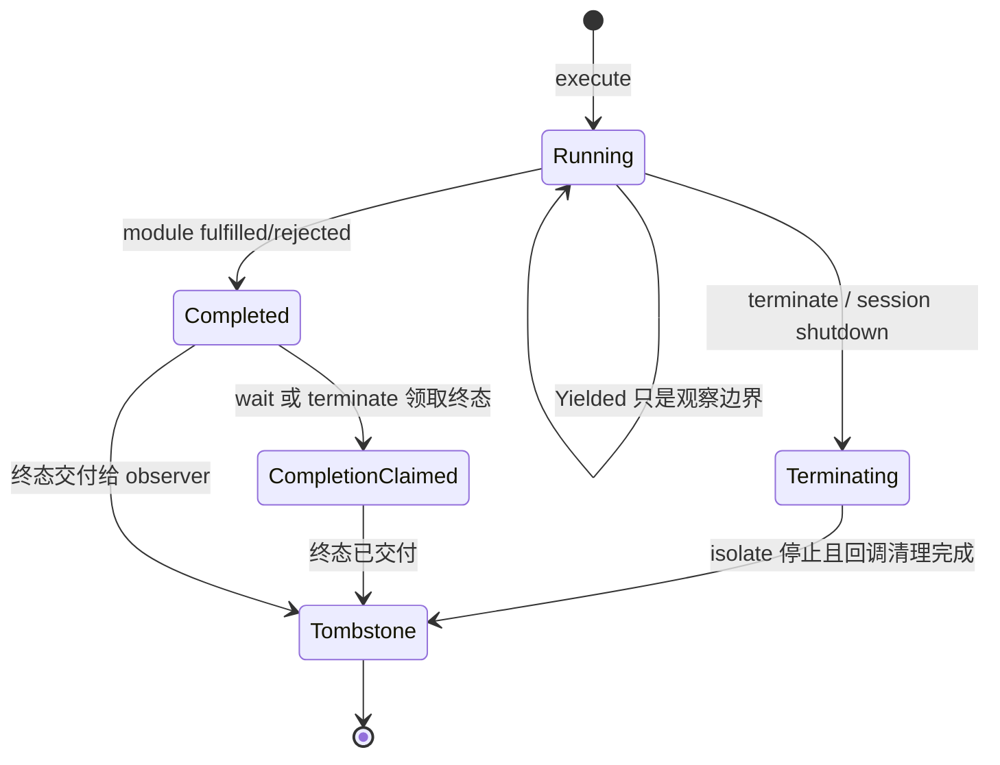
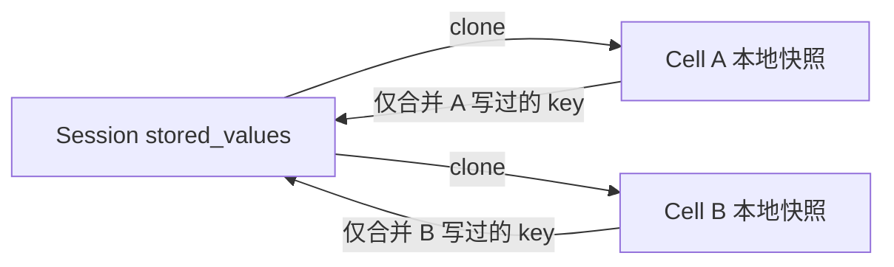
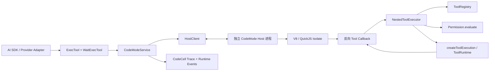

# Codex `exec` 工具设计与实现

> 文档日期：2026-07-17
> 上游源码快照：`C:\Projects\codex`，commit `0f44bca9154e056a32fde7a89026b4620599e6f2`
> Anybox 对照工程：`C:\Projects\Anybox`
> 适用对象：Agent 平台、工具运行时、安全审批、桌面端基础设施与可观测性开发人员
> 文档目标：解释当前会话中 `functions.exec` 背后的 Code Mode 设计、真实调用链、V8 执行模型、长任务协议、安全边界，以及在 Anybox 中实现同类能力的工程路线。

## 0. 范围、证据与术语

本文讨论的 `exec` 是 Codex Code Mode 暴露给模型的 JavaScript 编排工具：

```js
const result = await tools.shell_command({ command: "git status" });
text(result);
```

它不是以下同名或近似概念：

| 名称 | 含义 | 与本文 `exec` 的关系 |
|---|---|---|
| `exec` | 在受控 V8 isolate 中运行 JavaScript，并编排其他工具 | 本文主题 |
| `wait` | 继续观察或终止已 yield 的 `exec` cell | `exec` 的配套控制工具 |
| `exec_command` / `shell_command` | 执行操作系统命令的终端工具 | 可被 `exec` 作为嵌套工具调用 |
| `unified_exec` | Codex 的 PTY/进程执行子系统 | shell 工具的实现能力，不是 JavaScript 编排层 |
| Anybox `kind: "exec"` | Anybox 对 shell/terminal 工具的能力分类 | 权限语义相近，但不是 Code Mode |
| JavaScript `RegExp.prototype.exec` | 正则匹配 API | 完全无关 |

本文的实现事实来自本地 Codex Rust 源码；“Anybox 落地设计”部分是基于 Anybox 当前架构给出的实施建议，不表示 Anybox 已经具备这些能力。公开 Codex Manual 目前把 Code Mode namespaces 标为开发中且默认关闭，因此它仍应被视作可演进接口，而不是长期稳定的公开协议。参见 [Codex Manual](https://developers.openai.com/codex/codex-manual.md)。

---

## 1. 一句话结论

`exec` 不是“另一个 shell”，而是一个**无 Node 权限的 JavaScript 控制平面**：模型用 JavaScript 表达顺序、并行、条件、数据转换和长任务等待，V8 只负责计算与 Promise 调度；文件、网络、shell、MCP、图片生成等副作用仍由原有工具系统执行，并继续经过正常的参数校验、并发门控、审批、hook、沙箱和追踪链路。



这种分层带来三个核心收益：

1. 模型不必为每个中间结果重新进行一次推理，可以在一次 `exec` 中完成筛选、聚合和并行调用。
2. JavaScript 本身没有宿主机权限，真实副作用统一收口到已有工具治理层。
3. 长时间运行的脚本可以 yield 出模型响应，再通过 `wait` 继续观察或终止，而不必把一次工具调用永久挂住。

---

## 2. 设计目标与非目标

### 2.1 设计目标

| 目标 | 实现方式 |
|---|---|
| 降低多工具编排的模型往返次数 | 在一个 async JavaScript module 中顺序或并行调用 `tools.*` |
| 保留原工具安全策略 | 嵌套调用重新进入 `ToolCallRuntime` 和 `ToolRouter`，不直接执行副作用 |
| 支持结构化中间数据 | 嵌套工具结果以 JSON 值返回 V8，脚本可过滤、排序、映射和聚合 |
| 支持长任务 | `yield_time_ms`、`yield_control()`、cell ID 和独立 `wait` 工具 |
| 控制模型上下文成本 | JavaScript 只用 `text()`/`image()` 显式输出，外层结果再按 token 截断 |
| 隔离不可信编排代码 | 每个 cell 使用新的 V8 isolate；默认通过独立 host 进程运行 |
| 支持会话内轻量状态 | `store()`/`load()` 在同一个 Code Mode session 内共享 JSON 值 |
| 可追踪嵌套调用归属 | `ToolCallSource::CodeMode` 记录 cell ID 和 runtime tool call ID |

### 2.2 明确的非目标

- `exec` 不提供 Node.js API，不提供 `fs`、`process`、`require`、网络客户端或 shell 内建。
- `exec` 不替代 shell 工具；需要运行命令时仍要调用 `tools.exec_command`、`tools.shell_command` 等。
- `exec` 不是持久 JavaScript REPL。每个 cell 的 isolate 都是新的，跨 cell 只保留 `store()` 写入的 JSON 值。
- `exec` 不保证未 `await` 的异步工作完成。主 module 结束后 isolate 生命周期结束，悬空 Promise 会被丢弃。
- `exec` 的外层输出预算不限制脚本内部变量大小，也不等同于嵌套工具自己的输出预算。
- 独立 host 进程主要提供故障与资源域隔离，不应被误认为完整的操作系统安全沙箱。

---

## 3. 模型可见接口

### 3.1 `exec` 是自由格式工具

`exec` 使用 Responses API 的 freeform tool，而不是普通 JSON function tool。输入必须是原始 JavaScript 源码：

```js
const result = await tools.read_file({ path: "README.md" });
text(result);
```

以下输入形式是错误的：

```text
{"code":"text('hello')"}
```

~~~text
```js
text("hello")
```
~~~

工具规格使用 Lark grammar 约束输入至少包含源码，并允许第一行 pragma：

```lark
start: pragma_source | plain_source
pragma_source: PRAGMA_LINE NEWLINE SOURCE
plain_source: SOURCE

PRAGMA_LINE: /[ \t]*\/\/ @exec:[^\r\n]*/
NEWLINE: /\r?\n/
SOURCE: /[\s\S]+/
```

### 3.2 第一行 pragma

```js
// @exec: {"yield_time_ms": 30000, "max_output_tokens": 2000}
const result = await tools.some_tool({ id: "123" });
text(result);
```

| 字段 | 类型 | 默认值 | 语义 |
|---|---:|---:|---|
| `yield_time_ms` | 非负安全整数 | `10000` | 首次观察最多等待多久；到期时脚本继续运行，但当前调用返回 cell ID |
| `max_output_tokens` | 非负安全整数 | `10000` | 本次 `exec` 直接返回给模型的输出预算 |

解析器有意保持严格：

- pragma 必须位于第一行，可有前导空白。
- pragma 后必须有换行和非空 JavaScript 源码。
- JSON 只能包含上述两个字段，未知字段直接报错。
- 数值不能超过 JavaScript 安全整数上限 `2^53 - 1`。
- pragma 只控制外层观察与输出，不会自动传给嵌套工具。

### 3.3 `wait` 工具

`wait` 是普通 JSON function tool：

```ts
type WaitArgs = {
  cell_id: string;
  yield_time_ms?: number; // 默认 10000
  max_tokens?: number;   // 默认 10000
  terminate?: boolean;   // 默认 false
};
```

典型调用：

```json
{
  "cell_id": "7",
  "yield_time_ms": 30000,
  "max_tokens": 2000
}
```

终止调用：

```json
{
  "cell_id": "7",
  "terminate": true
}
```

`wait` 只返回上次观察之后新增的输出。cell 仍未结束时，它可以再次返回同一个 cell ID；完成或终止后，cell 被关闭并从 session registry 移除。

### 3.4 JavaScript 全局对象

| 全局 | 签名或形态 | 用途 |
|---|---|---|
| `tools` | `Record<string, (input) => Promise<unknown>>` | 调用当前允许的嵌套工具 |
| `ALL_TOOLS` | `Array<{name, description}>` | 查询所有已启用工具的元数据，包括可能延迟展示的工具 |
| `text` | `(value) => void` | 追加文本输出；对象优先 JSON 序列化 |
| `image` | `(image, detail?) => void` | 追加 base64 data URL、图片对象或 MCP image block |
| `generatedImage` | `({image_url, output_hint?}) => void` | 转发图片生成结果，并可附加文本提示 |
| `store` | `(key, serializableValue) => void` | 写入当前 cell 的 JSON 状态，并在完成时合并到 session |
| `load` | `(key) => unknown` | 读取 cell 启动时的 session 快照或当前 cell 已写入值 |
| `notify` | `(value) => void` | 在当前 `exec` 尚未结束时注入额外 `custom_tool_call_output` |
| `yield_control` | `() => void` | 请求当前观察立即 yield；脚本继续运行 |
| `exit` | `() => never` | 通过内部 sentinel 异常立即成功结束 module |
| `setTimeout` | `(callback, delayMs?) => number` | 安排一次回调 |
| `clearTimeout` | `(id?) => void` | 取消尚未触发的回调 |

运行时会移除 `console`、`Atomics`、`SharedArrayBuffer` 和 `WebAssembly`。静态与动态 `import` 都不支持；所有模块解析都会失败。没有 Node、DOM、文件、网络或控制台绑定。

### 3.5 常用编排示例

顺序调用：

```js
const config = await tools.read_file({ path: "package.json" });
const status = await tools.shell_command({ command: "git status --short" });
text({ config, status });
```

并行调用：

```js
const [status, branch, recent] = await Promise.all([
  tools.shell_command({ command: "git status --short" }),
  tools.shell_command({ command: "git branch --show-current" }),
  tools.shell_command({ command: "git log -5 --oneline" }),
]);
text({ status, branch, recent });
```

筛选后只输出必要信息：

```js
const toolsWithSearch = ALL_TOOLS
  .filter(({ name, description }) =>
    /search/i.test(name) || /search/i.test(description)
  )
  .slice(0, 20);
text(toolsWithSearch);
```

主动 yield：

```js
text("第一阶段已完成");
yield_control();

const result = await tools.long_running_tool({ task: "render" });
text(result);
```

会话状态：

```js
const count = (load("count") ?? 0) + 1;
store("count", count);
text({ count });
```

---

## 4. 代码模块与职责

### 4.1 上游 Codex 模块图

| 模块 | 主要职责 |
|---|---|
| `codex-rs/code-mode-protocol` | 公共类型、工具描述、pragma 解析、schema 到 TypeScript、host IPC 协议 |
| `codex-rs/code-mode` | V8 runtime、cell actor、session runtime、进程内与远程 session 实现 |
| `codex-rs/code-mode-host` | 独立 host 进程、stdio IPC、多 session/多 cell 管理、限流与反向 delegate |
| `codex-rs/tools/src/code_mode.rs` | 把 Codex `ToolSpec` 转成 Code Mode 工具定义，规范化名称和描述 |
| `codex-rs/core/src/tools/code_mode` | `exec`/`wait` handler、嵌套工具分发、输出适配、截断、追踪 |
| `codex-rs/core/src/tools/spec_plan.rs` | 决定哪些工具直接暴露、哪些进入 `tools`、哪些隐藏或延迟加载 |
| `codex-rs/rollout-trace/src/code_cell.rs` | 把 `exec` 记录为一等 `CodeCell`，关联输出与嵌套工具调用 |

### 4.2 核心协议类型

```rust
pub struct ExecuteRequest {
    pub tool_call_id: String,
    pub enabled_tools: Vec<ToolDefinition>,
    pub source: String,
    pub yield_time_ms: Option<u64>,
    pub max_output_tokens: Option<usize>,
}

pub enum RuntimeResponse {
    Yielded { cell_id: CellId, content_items: Vec<ContentItem> },
    Terminated { cell_id: CellId, content_items: Vec<ContentItem> },
    Result {
        cell_id: CellId,
        content_items: Vec<ContentItem>,
        error_text: Option<String>,
    },
}
```

`RuntimeResponse` 刻意把“是否还活着”和“输出内容”放在同一个边界上，使进程内实现与独立 host 实现拥有同一接口。

---

## 5. 工具规划与暴露策略

### 5.1 Tool Mode 的选择

每个 turn 的有效模式按以下优先级决定：

1. 如果模型元数据声明了 `tool_mode`，使用模型声明。
2. 否则启用 `code_mode_only` 时使用 `CodeModeOnly`。
3. 否则启用 `code_mode` 时使用 `CodeMode`。
4. 否则使用 `Direct`。

`code_mode_only` 会自动依赖并启用 `code_mode`。当前 feature 元数据中，`code_mode` 和 `code_mode_only` 仍是 under development 且默认关闭；`code_mode_host` 已标记 stable 且默认开启。

### 5.2 三种可见性



配置还可以按 namespace 精确调整：

```toml
[features.code_mode]
enabled = true
excluded_tool_namespaces = ["mcp__sensitive"]
direct_only_tool_namespaces = ["mcp__history"]
```

| 配置 | 效果 |
|---|---|
| `excluded_tool_namespaces` | namespace 不进入嵌套 `tools`；如果原本是 direct 工具，仍可直接暴露 |
| `direct_only_tool_namespaces` | 强制作为模型顶层工具，跳过 defer，并从嵌套 `tools` 移除 |

### 5.3 名称规范化

命名空间工具会先拼成稳定全名：

```text
namespace = mcp__codex_apps
tool name = notion_search
code mode name = mcp__codex_apps__notion_search
```

随后转换成合法 JavaScript identifier：

- 首字符允许 ASCII 字母、`_`、`$`。
- 后续允许 ASCII 字母、数字、`_`、`$`。
- 其他字符替换为 `_`。
- 空名称归一化为 `_`。

原始 `ToolName` 仍保留在元数据里，JavaScript 名称只用于 `tools` 对象的属性。

### 5.4 Schema 到 TypeScript 声明

工具的 JSON Schema 会被渲染成模型可读的 TypeScript：

```ts
declare const tools: {
  weather(args: {
    // City to query.
    city: string;
    unit?: "celsius" | "fahrenheit";
  }): Promise<{ forecast: string }>;
};
```

function tool 接受对象，freeform tool 接受字符串。MCP 工具如果有 `structuredContent` schema，会被渲染为 `CallToolResult<TStructured>`，并共享一份 MCP content block 类型定义。

在 `CodeModeOnly` 下，完整工具声明会集中写入 `exec` 描述；普通 `CodeMode` 下，直接工具仍可见，并在各自描述中附带 `exec tool declaration`。

---

## 6. 一次 `exec` 的完整调用链



关键步骤如下：

1. `CodeModeExecuteHandler` 验证调用确实是 un-namespaced `exec` 的 custom/freeform payload。
2. `parse_exec_source` 拆出第一行 pragma，并返回纯 JavaScript。
3. handler 从本轮 `nested_tool_specs` 重新构造 `ToolDefinition`，不会接受脚本自行声明任意工具。
4. `CodeModeService` 懒初始化一个线程级 session。不同 Codex thread 使用不同 session，同一 thread 内的 cell 共享 `store/load`。
5. session 分配递增 cell ID，从共享状态复制快照，启动 `CellActor`。
6. handler 先创建 CodeCell trace，再打开 dispatch gate，避免 cell 的早期工具调用在宿主 turn 未准备好时被错误路由。
7. V8 中的 `tools.foo()` 只生成 `RuntimeEvent::ToolCall` 和 Promise resolver，不直接执行工具。
8. broker 把调用交回当前 turn 的 `ToolCallRuntime`，结果转换为 JSON 后再 resolve Promise。
9. 首次观察得到 terminal response 时立即关闭 cell；得到 `Yielded` 时保留 cell 等待后续 `wait`。
10. handler 等待当前 elicitation/审批状态清空，再向模型提交最终工具输出。

---

## 7. V8 执行内核

### 7.1 每个 cell 一个 isolate

运行时为每个 cell 创建：

- 一个专用 OS thread；
- 一个新的 `v8::Isolate`；
- 一个新的 `v8::Context`；
- 一份 cell 启动时的 stored values 快照；
- 一张 pending Promise resolver 表；
- 一张 timeout callback 表；
- 独立的工具调用 ID 和 timer ID 计数器。

V8 平台是进程级单例。默认允许 JIT，也可在进程首次初始化前用 `V8JitMode::Disabled` 设置 `--jitless`；V8 初始化后不能切换模式。

### 7.2 async module 而不是脚本拼接

源码以 `exec_main.mjs` 为 origin 编译为 ES module，随后 instantiate、evaluate 并执行 microtask checkpoint。这样顶层 `await` 可以自然工作：

```js
const result = await tools.some_tool({ id: 1 });
text(result);
```

module evaluation 的返回 Promise 决定 cell 是否完成：

- fulfilled：成功完成；
- rejected：生成 `error_text`；
- pending：运行时等待工具结果、timer 或控制命令；
- `exit()` 抛出的内部 sentinel：按成功完成处理。

### 7.3 嵌套工具 Promise 桥

`tools.foo(input)` 的实现步骤：

1. 把第一个参数用 `JSON.stringify` 语义转换为 `serde_json::Value`。
2. 新建 `PromiseResolver`，以 `tool-N` 存入 `pending_tool_calls`。
3. 发出 `RuntimeEvent::ToolCall { id, name, kind, input }`。
4. cell actor 异步执行宿主工具。
5. 成功时发送 `RuntimeCommand::ToolResponse`，失败时发送 `ToolError`。
6. V8 thread 取回 resolver，resolve 为 JSON 值或 reject 为错误文本。
7. 执行 microtask checkpoint，让等待该 Promise 的 JavaScript 继续运行。

函数工具最终要求输入为 JSON object；freeform 工具要求输入为 string。即使 JavaScript 能传任意 JSON 值，Core 在重新构造 `ToolPayload` 时还会做第二次形态校验。

### 7.4 Timer 实现

当前 `setTimeout` 不是 Node event loop，而是：

1. 保存一个 V8 `Global<Function>`。
2. 为每个 timer 启动一个 Rust thread 并 sleep。
3. 到时向 runtime command channel 发送 `TimeoutFired`。
4. V8 thread 取回并调用 callback，再执行 microtasks。

timer 本身不会让已完成的主 module 保持存活。因此：

```js
setTimeout(() => text("late"), 1000);
```

module 会立即完成，`late` 不保证输出。必须显式等待：

```js
await new Promise((resolve) => setTimeout(resolve, 1000));
text("late");
```

---

## 8. Cell Actor、状态机与 `wait`

### 8.1 状态模型



`Yielded` 不是 `CellState` 的持久 phase。它只是“当前 observer 收到一次增量输出”的观察结果，cell 仍然是 Running。

### 8.2 两种观察模式

| 模式 | 用途 | 返回边界 |
|---|---|---|
| `YieldAfter(duration)` | 公开 `exec` 与 `wait` | 完成、主动 yield 或时间到期 |
| `PendingFrontier` | host/内部协议协调 | V8 没有立即可运行工作、正在等待外部事件时 |

同一 cell 同时只允许一个 observer。新的观察在已有 observer 未结束时返回 Busy，防止多个 `wait` 竞争消费增量输出。

### 8.3 时间到期不是取消

当 `yield_time_ms` 到期：

- actor 取走当前累积输出并返回 `Yielded`；
- 模型看到 `Script running with cell ID N`；
- V8 thread 和嵌套工具继续运行；
- 下一次 `wait` 只收到之后新增的输出或终态。

`yield_control()` 也只触发同样的观察交付，不停止 JavaScript。

### 8.4 终止

`wait({ terminate: true })` 会：

1. 原子地把 cell 标记为 Terminating，拒绝新的 observer。
2. 取消 cell token，并向所有子 callback token 传播取消。
3. 向 runtime command/control channel 同时发送 terminate。
4. 调用线程安全的 `v8::IsolateHandle::terminate_execution()`，可停止 CPU 死循环。
5. 清理 notification/tool tasks，返回仍未交付的增量输出。
6. 将 cell tombstone 化并从 session registry 删除。

终止与正常完成竞争时，`CellState` 是唯一线性化点：只有一方能够提交共享状态和交付终态。

---

## 9. 嵌套工具、审批与并发

### 9.1 不绕过 ToolRouter

Code Mode 不保存一套“简化版工具执行器”。它把嵌套调用重新构造成普通 `ToolCall`：

```rust
ToolCall {
    tool_name,
    call_id: format!("exec-{}", Uuid::new_v4()),
    payload,
}
```

同时附加来源：

```rust
ToolCallSource::CodeMode {
    cell_id,
    runtime_tool_call_id,
}
```

因此嵌套调用继续使用：

- 工具 registry 与真实 handler；
- 参数解析和 schema 校验；
- ToolExposure 与 agent/turn 上下文；
- 并发读写锁；
- 审批与 elicitation；
- PreToolUse / PostToolUse 等 lifecycle；
- shell sandbox、网络限制和进程终止；
- diff tracker、telemetry 和 rollout trace。

唯一被明确禁止的是 `exec` 递归调用自身。`wait` 也不会进入嵌套工具集合。

### 9.2 并发语义

JavaScript 可以自然使用 `Promise.all`。每个 `RuntimeEvent::ToolCall` 都会在 actor 的 `JoinSet` 中产生一个独立任务，因此多个调用可以并发等待。

真正是否并行执行仍由 `ToolCallRuntime` 决定：

- 支持并行的工具取得共享读锁；
- 不支持并行的工具取得独占写锁；
- cell 取消时，等待与执行中的工具都收到 cancellation token；
- 对需要底层完成清理的 runtime，取消路径会等待进程终止后再形成 terminal outcome。

这意味着 `Promise.all` 表达的是“允许并发”，不是强制所有工具无条件同时执行。

### 9.3 工具输出如何回到 JavaScript

每种 `ToolOutput` 都可以实现 `code_mode_result()`：

| 输出类型 | JavaScript 中的典型值 |
|---|---|
| 普通文本 function tool | string |
| `JsonToolOutput` | 原始 JSON value |
| MCP `CallToolResult` | 包含 `content`、`structuredContent`、`isError`、`_meta` 的 object |
| unified exec | `{ chunk_id?, wall_time_seconds, exit_code?, session_id?, original_token_count?, output }` |
| apply patch | 当前实现返回空 object |

未覆盖的输出类型会先转换成正常模型响应，再归一化为 string 或 JSON。这个扩展点非常重要：它避免脚本反向解析带展示标题、wall time 或 UI 文案的模型文本。

### 9.4 `wait` 自身不触发 tool hooks

`wait` 是已有 cell 的运行时控制操作，不代表新的用户副作用。它的 `CoreToolRuntime` 明确关闭 PreToolUse 与 PostToolUse payload；但 cell 内真正调用的嵌套工具仍正常进入 hooks。

---

## 10. 输出、图片、通知与状态

### 10.1 文本输出

`text(value)` 的序列化规则：

- `undefined`、`null`、boolean、number、bigint、string：转成字符串；
- object/array：优先 `JSON.stringify`；
- stringify 抛错时，把异常反馈给 JavaScript；
- 输出按调用顺序作为独立 content item 进入 actor 缓冲区。

### 10.2 图片输出

`image()` 接受：

1. 非空图片 URL string；
2. `{ image_url, detail? }`；
3. MCP `{ type: "image", data, mimeType, _meta? }` block。

安全约束：

- `http://` 和 `https://` 图片 URL 被拒绝，要求传 base64 data URI。
- MCP raw base64 会被组装为 `data:<mime>;base64,...`。
- detail 只接受 `auto | low | high | original`。
- 未指定 detail 时默认 `high`。
- 如果当前模型不支持 original detail，Core 会在最终响应前降级校正。

`generatedImage()` 在图片外还会读取可选 `output_hint` 并追加为文本 content item。

### 10.3 `notify()` 与普通输出的区别

`text()` 只进入当前 cell 的增量输出缓冲区；`notify()` 会通过 session delegate 调用 `Session::inject_if_running`，立即插入一个与原 `exec` call ID 对应的额外 `custom_tool_call_output`。

适用场景：

- 长脚本希望在终态之前向模型暴露里程碑；
- 外部任务完成事件需要唤醒当前推理链；
- 某个结果需要独立进入 conversation，而不是等待下一次 `wait`。

空白通知会被拒绝或忽略。通知任务在脚本正常完成时会被 drain；终止时会取消。

### 10.4 `store()` / `load()` 一致性

存储只接受 JSON 可序列化值。实现采用“启动快照 + 写集合并”：



重要语义：

- `store()` 立即更新当前 cell 的本地 `stored_values`，所以随后 `load()` 可见。
- cell 正常完成时只把 `stored_value_writes` 合并回 session，不会用旧快照覆盖其他 cell 新写的无关 key。
- 并发 cell 写不同 key 可安全合并。
- 并发 cell 写同一 key 时，后完成的 commit 覆盖先完成值。
- cell 被 terminate 时不会提交写集合。
- 当前实现中，JavaScript 以普通异常失败仍会形成 completed result，因此异常发生前的 `store()` 写入会提交；如果业务需要事务语义，脚本必须在成功路径末尾再 store。
- 不同 Codex thread/session 的状态隔离；独立 host 重启或连接重建后不保证保留内存状态。

### 10.5 三层输出预算

```text
嵌套工具预算
  → 限制返回到 JavaScript 变量的值

exec / wait 外层预算
  → 限制 text()/image() 最终交付给模型的本次增量

conversation/history 预算
  → 工具输出进入上下文时可能再次被全局策略截断
```

例如：

```js
// @exec: {"max_output_tokens": 1000}
const result = await tools.exec_command({
  cmd: "generate-large-output",
  max_output_tokens: 20000,
});
text(result.output);
```

脚本变量最多先受嵌套工具的 `20000` token 预算影响；`text()` 发出后，外层又按 `1000` token 截断。两者不可混为一谈。

最终输出会在首项前添加状态头：

```text
Script completed
Wall time 1.2 seconds
Output:
```

或：

```text
Script running with cell ID 7
Wall time 10.0 seconds
Output:
```

脚本失败时，已累积输出仍会返回，并追加：

```text
Script error:
<stack or error text>
```

---

## 11. 独立 Host 进程与 IPC

### 11.1 为什么需要进程边界

V8 isolate 已经隔离 JavaScript heap 和 globals，但仍与宿主进程共享崩溃与资源域。`code_mode_host` 把 V8 runtime 放入独立进程，使以下问题更容易控制：

- V8 panic 或 native crash 不直接带走主 Codex 进程；
- CPU 死循环和部分资源泄漏可以通过终止 host/cell 回收；
- 多个 Codex thread 的 Code Mode session 可复用一个受监督 host 连接；
- IPC 边界强制所有数据经过可序列化协议。

如果找不到 `codex-code-mode-host` 可执行文件，provider 会退回进程内 session；其他 host 启动或握手错误不会静默回退。

### 11.2 连接与握手

主进程通过 child stdin/stdout 与 host 通信：

- 每帧：4 字节 little-endian 长度 + JSON payload；
- 单帧最大 `64 MiB`；
- 握手超时 `10s`；
- 当前协议版本 `V1`；
- capability 集合已预留，但 V1 host 当前声明空 capability；
- host stderr 按行进入 debug/warn 日志；
- child 启用 `kill_on_drop`，Unix 下放入独立 process group。

### 11.3 双向协议

Client 到 Host：

```text
connection/hello
operation/request
operation/cancel
delegate/response
```

Host 到 Client：

```text
connection/ready | connection/rejected
operation/response
execute/initialResponse
delegate/request
delegate/cancel
cell/closed
```

Host request 方法：

```text
session/open
session/execute
session/wait
session/terminate
session/shutdown
```

这里最关键的是**反向 delegate**：JavaScript 在 host 内触发 `tools.foo()` 后，host 不能自己执行真实工具，而是把 `tool/invoke` 请求发回 Codex 主进程。主进程完成审批与执行后，再用 `delegate/response` 返回 JSON。

### 11.4 容量限制

独立 host 当前设置了明确的保护阈值：

| 资源 | 限制 |
|---|---:|
| 单 IPC frame | `64 MiB` |
| host in-flight operation request | `256` |
| host active cell | `128` |
| host pending delegate call | `256` |
| 单 cell 路由消息队列 | `128` |
| host outgoing frame queue | `128` |
| 记忆的 recent request ID | `4096` |
| 记忆的 recent session ID | `4096` |
| host shutdown 等待 | `5s` |

超限通常返回明确错误；队列不可用、关键任务 panic 或协议不一致会使 peer 断开，避免在半失效连接上继续执行。

### 11.5 重连语义

`ProcessOwnedCodeModeSession` 维护 `New → Opening → Open → Closing → Closed` 状态。连接死亡后，下一次操作可创建新 connection 和新 generation 的 remote session；旧 session cleanup 会被保留并等待完成。

这保证控制面可恢复，但内存型 `store/load` 状态属于旧 host session，不应当作持久存储。

---

## 12. 安全模型与边界

### 12.1 分层安全模型

| 层 | 防护 | 不解决的问题 |
|---|---|---|
| Freeform grammar + pragma parser | 拒绝空输入、非法 pragma 和未知字段 | 不分析 JavaScript 是否会死循环 |
| V8 Context | 没有 Node/DOM/文件/网络绑定，禁用 import 与部分高风险 globals | V8 自身仍可消耗 CPU/内存 |
| 新 isolate / 专用 thread | cell 之间 heap 隔离，可线程安全 terminate | 同进程模式仍共享 native 进程故障域 |
| 独立 host 进程 | 隔离 V8 崩溃与大部分资源故障 | 不是完整 OS sandbox，没有自动文件/网络权限模型 |
| 工具 allowlist | 脚本只能调用本轮 `enabled_tools` | 工具本身若设计不安全仍可能产生风险 |
| ToolRouter | 参数校验、审批、hooks、并发、沙箱与取消 | 依赖各工具正确声明和实现策略 |
| 输出归一化 | token 截断、图片 URL 限制、detail 校正 | 截断发生前仍可能暂存较大内存数据 |
| IPC 限额 | 限制帧、并发请求、active cells 和 delegate calls | 进程内 fallback 不拥有相同 IPC 限额 |

### 12.2 最重要的安全不变量

1. JavaScript 永远不能根据字符串动态获得未启用工具；`tools` 由宿主根据本轮 ToolSpec 构造。
2. `tools.*` 只能发出请求，不能直接访问真实资源。
3. 嵌套工具必须走与顶层工具相同的权限和沙箱路径。
4. `exec` 不能调用自身，避免无限递归创建 cell。
5. cell 终止必须同时停止 V8、取消嵌套工具、拒绝状态提交并关闭路由。
6. 图片输出不接受远程 HTTP URL，避免把未验证外部资源直接塞入模型 content item。
7. session 状态只能保存 JSON，可避免把宿主对象、函数、Promise 或 native handle 跨 cell 泄漏。

### 12.3 当前值得关注的限制

这些是从实现可直接推导出的工程风险，不应被文档化能力掩盖：

- 每个 `setTimeout` 启动一个 Rust thread，当前没有 cell 级 timer 数量上限；恶意脚本可制造线程压力。
- 没有显式的 JavaScript heap 上限或 CPU 配额；CPU 死循环依靠 yield 后由上层决定 terminate。
- 源码大小主要受上游请求与 `64 MiB` IPC frame 限制，进程内路径没有同等 frame 限制。
- content items 在外层截断之前先积累到内存，超大 `text()` 或大量图片仍可能造成瞬时内存压力。
- 正常 JavaScript 异常会提交此前的 `store()` 写入，不具备事务回滚。
- host 可执行文件缺失时自动回退进程内，功能可用但崩溃隔离减弱；应有 telemetry 明确记录该状态。
- 名称规范化理论上可能让两个不同原始名称落到同一 JavaScript identifier；registry 应在进入 V8 前检查规范化后的唯一性。
- 当前 `code_mode` 仍处于 under-development，工具描述和协议细节可能演进。

---

## 13. 错误与取消模型

| 场景 | 表现 |
|---|---|
| 空源码或非法 pragma | handler 直接返回面向模型的参数错误，不创建 cell |
| JavaScript 语法错误 | `Script failed`，附编译异常文本 |
| JavaScript runtime error | 返回此前累积输出，再附 `Script error` |
| 嵌套工具参数形态错误 | 对应 Promise reject，脚本可 `try/catch` |
| 嵌套工具执行失败 | Promise reject；未捕获时成为脚本失败 |
| `wait` 找不到 cell | 普通 `wait` 结果：`exec cell <id> not found` |
| 同一 cell 并发 `wait` | Busy observer 错误 |
| cell 已在终止 | AlreadyTerminating |
| V8 thread panic | 记录 failure，cell 形成 runtime-ended 错误；独立 host 可断开连接 |
| IPC frame 过大 | 返回 frame limit 错误，无法安全响应时断开 |
| host binary 不存在 | 自动回退进程内 session |
| host 握手失败/超时 | kill 并 reap child，向上返回连接错误 |
| turn/session shutdown | 取消所有 cell 与 delegate，等待任务清理 |

嵌套工具错误是 JavaScript 可处理的业务异常：

```js
try {
  const result = await tools.some_tool({ id: "missing" });
  text(result);
} catch (error) {
  text({ recovered: true, error: String(error) });
}
```

而 host 协议损坏、关键任务 panic 等属于运行时基础设施错误，通常会关闭连接而不是继续容错执行。

---

## 14. 可观测性与测试策略

### 14.1 一等 CodeCell Trace

Rollout trace 不把 `exec` 当作普通黑盒工具，而是记录：

- `CodeCellStarted`：turn、runtime cell ID、模型 `exec` call ID、源码；
- `CodeCellInitialResponse`：首次状态是 Yielded、Completed、Failed 或 Terminated；
- `CodeCellEnded`：最终 terminal 状态；
- nested tool requester：归属具体 CodeCell；
- `output_item_ids`：把模型可见 `custom_tool_call_output` 与 cell 关联。

这样可以回答：

- 哪段 JavaScript 触发了某个 shell/MCP 调用；
- cell 在哪个 yield 后完成；
- 终止来自用户、session shutdown 还是 runtime failure；
- 工具输出属于顶层调用还是 Code Mode 嵌套调用。

### 14.2 上游测试分层

| 测试层 | 重点 |
|---|---|
| `code-mode-protocol` unit tests | pragma、schema-to-TS、IPC codec、wire conversion |
| `code-mode` runtime tests | V8 module、Promise bridge、timer、图片、store/load、终止 |
| cell actor tests | completion/terminate 竞争、observer、状态提交线性化 |
| remote session tests | host 重连、session generation、cleanup、delegate cancellation |
| `code-mode-host` tests | 握手、并发上限、重复 ID、stdio 协议与断开 |
| Core integration tests | 工具暴露、并行 nested calls、审批、yield/wait、输出预算、trace |

### 14.3 实现同类能力时的最低验收矩阵

| 类别 | 必测用例 |
|---|---|
| 解析 | 无 pragma、合法 pragma、未知字段、仅 pragma、超大整数 |
| 隔离 | 无 `process`/`require`/`fs`/网络/import；每 cell globals 不共享 |
| 工具桥 | function/freeform、JSON 往返、Promise resolve/reject、递归禁用 |
| 并发 | `Promise.all`、exclusive 工具串行化、取消传播 |
| 长任务 | 时间 yield、主动 yield、多次 wait、terminal wait、missing cell |
| 终止 | CPU 死循环、等待工具、等待 timer、重复 terminate |
| 状态 | 跨 cell、跨 session 隔离、并发不同 key、同 key 覆盖、terminate 不提交 |
| 输出 | text primitive/object、失败保留输出、三层截断、图片 detail |
| 审批 | allow、deny、ask 后恢复、cell 取消时撤销审批 continuation |
| IPC | 握手不兼容、frame 超限、host crash、重连、队列满 |
| 追踪 | cell source、nested requester、yield 到 terminal、输出关联 |

---

## 15. Anybox 当前架构映射

Anybox 已具备实现 Code Mode 所需的大部分宿主能力，但还缺少“受控 JavaScript cell”这一层。

### 15.1 可直接复用的能力

| Anybox 现有模块 | 可复用职责 |
|---|---|
| `src/tool/tool.ts` | `ToolInfo`、`ToolRuntime`、capabilities、参数校验、输出规范化 |
| `src/tool/registry.ts` | builtin/MCP/custom 工具聚合、别名与模型名称唯一性 |
| `src/tool/execution.ts` | agent/global/read-only 访问控制、Permission.evaluate、结果持久化 |
| `src/session/core/resolve-tools.ts` | 把 ToolRuntime 转成 AI SDK ToolSet |
| `src/permission/permission.ts` | allow/ask/deny、risk、审批记录与恢复 |
| `src/tool/parallel-tool.ts` | 子工具复用、并发资格、父子 call ID、JSON model output 的先例 |
| `src/tool/shell-command.ts` | 多 shell 实现、危险命令检测、timeout、输出上限、后台任务 |
| `src/session/runtime/*` | turn 事件、运行状态、stream、trace、停止与恢复 |

### 15.2 当前差距

| 差距 | 影响 |
|---|---|
| AI SDK 当前只注册普通 object-schema tool | 不能直接表达 Codex 风格 raw freeform JavaScript，需要 provider adapter 或先使用 `{ source }` |
| 没有 cell/session runtime | 无法 yield、wait、terminate 或跨 cell store/load |
| 没有安全 JS isolate/sidecar | 不能把 Node `vm` 当作不可信代码安全边界 |
| `ToolRuntime` 没有专用 `toCodeModeResult` | 嵌套调用可能只能拿到展示文本，难以稳定处理结构化结果 |
| 审批恢复绑定顶层 `Message.ToolPart` | nested call 遇到 `ask` 时无法自然挂起 cell 并在批准后 resolve Promise |
| `ParallelTool` 只允许 read/search | 可作为安全 MVP，但无法覆盖完整编排 |
| 缺少 CodeCell trace 类型 | nested 调用只能看作普通工具，难以还原父子关系 |

---

## 16. Anybox 推荐实现

### 16.1 推荐架构



不建议直接使用 Node `vm.runInNewContext` 执行模型源码并把它当作安全隔离。Node `vm` 适合受信代码上下文分离，不是强安全边界。可选路线：

| 路线 | 优点 | 代价 | 建议 |
|---|---|---|---|
| Rust sidecar + V8 | 最接近 Codex，强类型协议、可终止 isolate、主进程故障隔离 | 构建和跨平台发布复杂 | 完整版首选 |
| 独立 Node child + `isolated-vm` | 与 TypeScript 集成快，仍有进程边界 | native addon 打包与 Electron ABI 维护 | 可行但需严格版本治理 |
| QuickJS/WASM sidecar | 内存限制较容易、运行时较小 | Promise/宿主桥和性能需自行验证 | 适合可控 MVP |
| Node worker + `vm` | 实现最快 | 安全边界不足，逃逸风险由 Node 版本与封装承担 | 仅限可信内部脚本，不用于模型任意源码 |

### 16.2 建议目录

```text
packages/anyboxagent/src/code-mode/
  protocol.ts              # ExecuteRequest、WaitRequest、RuntimeResponse、ToolDefinition
  tool-catalog.ts          # ToolInfo → CodeMode ToolDefinition，名称和 schema
  service.ts               # session 生命周期与 provider 选择
  session.ts               # cell registry、store/load、shutdown
  cell.ts                  # actor/state machine、observer、terminate
  nested-tool-executor.ts  # 访问控制、审批、执行、结构化结果
  response.ts              # 状态头、图片、截断、模型输出
  trace.ts                 # CodeCell 与 nested requester 事件
  host-client.ts           # IPC、握手、重连、request map

packages/anyboxagent/src/tool/
  exec-code-mode.ts        # 模型入口
  wait-exec.ts             # cell 控制入口

packages/code-mode-host/
  src/main.*               # 独立运行时进程
  src/runtime.*            # isolate 与 globals
  src/peer.*               # 反向 delegate、限流和路由
```

如果新增 Rust sidecar，建议把 wire protocol 定义放在语言中立 JSON schema 中，再分别生成 Rust/TypeScript 类型，避免两边手写漂移。

### 16.3 Anybox ToolRuntime 扩展

建议为工具增加专用 Code Mode 输出适配器：

```ts
export interface ToolRuntime<...> {
  // 现有字段省略
  toModelOutput?(result: ToolOutput): Awaitable<ToolModelOutput>
  toCodeModeResult?(
    result: ToolOutput,
    input: unknown,
  ): Awaitable<JSONValue>
}
```

默认规则可以是：

1. `result.data` 是 JSON 时优先返回 `data`。
2. 否则 `toModelOutput()` 为 JSON 时返回其 JSON value。
3. 否则返回 `result.text`。
4. MCP 保留完整 `CallToolResult`。
5. shell 返回 `{ output, exitCode, timedOut, aborted, stdout, stderr, ... }`，不要只返回拼接展示文本。

### 16.4 NestedToolExecutor

不要让 host 直接 import 某个工具文件。统一入口应复用 Anybox 现有访问控制：

```ts
type NestedToolCall = {
  sessionID: string
  messageID: string
  parentExecCallID: string
  cellID: string
  runtimeToolCallID: string
  toolName: string
  input: JSONValue
}
```

执行顺序：

1. 从 `ToolRegistry.tools()` 解析 tool/alias。
2. 禁止 `exec` 与 `wait_exec` 自调用。
3. 复用 `getToolAccessFailure` 检查 agent、global selection 和 read-only session。
4. 调用 `createToolExecution`，使用稳定父子 call ID，例如 `<execCallID>:<cellID>:<runtimeID>`。
5. 先调用 `needsApproval`。
6. allow 时执行并调用 `toCodeModeResult`。
7. deny 时 reject JavaScript Promise。
8. ask 时挂起 delegate，不得绕过审批或简单当作永久错误。

### 16.5 审批 continuation 是最大难点

Anybox 当前审批恢复逻辑以顶层 `Message.ToolPart` 为中心。Code Mode 中的审批对象是 cell 内某个 Promise，因此需要新的 continuation：

```text
Nested call asks for approval
  → 创建 permission request
  → cell 保持 pending/yielded
  → 保存 {cellID, runtimeToolCallID, toolName, input}
  → 用户 allow/deny
  → allow: 用相同 runtimeToolCallID 执行并 resolve Promise
  → deny: reject Promise
  → cell 已终止: 自动撤销 continuation，不再执行
```

建议扩展 permission request 的 runtime snapshot，让它能表达 `requester: "code-cell"`，而不是伪造顶层 ToolPart。必须保证批准后执行仍使用批准时冻结的 tool、input、cwd、agent 和 policy snapshot，避免 TOCTOU。

安全 MVP 可以先规定：

- Code Mode 只允许 `readOnly === true`、`concurrency === "safe"` 且评估结果为 allow 的工具；
- 遇到 ask/deny 直接 reject Promise；
- 完成 nested approval continuation 后再开放 write/exec 工具。

### 16.6 Provider 入口

Anybox 当前 `resolveTools()` 使用 AI SDK 的普通 `tool()`，参数必须是对象 schema。建议分两阶段：

阶段一使用兼容入口：

```ts
const ExecParameters = z.object({
  source: z.string().min(1),
  yieldTimeMs: z.number().int().nonnegative().optional(),
  maxOutputTokens: z.number().int().positive().optional(),
})
```

阶段二再按 provider 能力注册 raw custom/freeform tool，以获得与 Codex 相同的调用体验。两种入口在 handler 内都应归一化成同一 `ExecuteRequest`，不要维护两套 runtime。

### 16.7 功能分期

| 阶段 | 范围 | 验收目标 |
|---|---|---|
| A：安全编排 MVP | `{source}` function tool、独立 runtime、只读 allow-only nested tools、`text` | 顺序/并行编排可用，不新增副作用绕过 |
| B：长任务 | cell ID、yield、wait、terminate、timer、取消传播 | CPU loop 可终止，多次 wait 只返回增量 |
| C：完整宿主桥 | write/exec tools、nested approval continuation、hooks、结构化结果 | 与顶层工具拥有相同治理 |
| D：多模态与状态 | image/generatedImage、notify、store/load | 图片与 session 状态语义完整 |
| E：产品化 | raw freeform provider adapter、CodeCell trace、IPC 限流、host 重连 | 可发布、可诊断、可灰度与回滚 |

---

## 17. Anybox 实现不变量

在代码评审和测试中应把以下规则作为硬约束：

1. Code Mode host 不直接拥有 Anybox tool 实现，只能通过反向 delegate 请求主进程。
2. nested call 必须复用 `ToolRegistry`、agent policy、global selection、read-only session 与 `Permission.evaluate`。
3. 主进程只把当前 session 真正允许的工具放入 `tools`，不能让脚本按任意字符串调用 registry 隐藏工具。
4. JavaScript runtime 不继承 Node globals、Electron remote、预加载 bridge 或桌面 IPC。
5. `exec`/`wait` 不能递归进入 `tools`。
6. cell 终止后，所有未完成 nested approval、tool call、timer 和 notify 都必须取消。
7. tool result 进入 JavaScript 前要有独立大小上限；JavaScript 输出进入模型前还要有外层上限。
8. `store/load` 只能接受有总大小上限的 JSON，并按 session 隔离。
9. host crash、fallback 到弱隔离模式、frame 超限和强制 terminate 必须可观测。
10. CodeCell trace 必须能关联父 `exec` call、cell、runtime tool call 和真实 Anybox tool call。

---

## 18. 源码索引

### 18.1 Codex 上游

| 主题 | 源码路径 |
|---|---|
| `exec`/`wait` 常量与公共导出 | `C:\Projects\codex\codex-rs\code-mode-protocol\src\lib.rs` |
| pragma、工具描述、TypeScript 渲染 | `C:\Projects\codex\codex-rs\code-mode-protocol\src\description.rs` |
| Execute/Wait/RuntimeResponse | `C:\Projects\codex\codex-rs\code-mode-protocol\src\runtime.rs` |
| Session trait 与 delegate | `C:\Projects\codex\codex-rs\code-mode-protocol\src\session.rs` |
| IPC message | `C:\Projects\codex\codex-rs\code-mode-protocol\src\host\message.rs` |
| IPC framing | `C:\Projects\codex\codex-rs\code-mode-protocol\src\host\codec.rs` |
| V8 runtime loop | `C:\Projects\codex\codex-rs\code-mode\src\runtime\mod.rs` |
| globals 安装 | `C:\Projects\codex\codex-rs\code-mode\src\runtime\globals.rs` |
| tools/text/image/store/notify 回调 | `C:\Projects\codex\codex-rs\code-mode\src\runtime\callbacks.rs` |
| module 编译与 Promise 完成 | `C:\Projects\codex\codex-rs\code-mode\src\runtime\module_loader.rs` |
| timer | `C:\Projects\codex\codex-rs\code-mode\src\runtime\timers.rs` |
| cell actor | `C:\Projects\codex\codex-rs\code-mode\src\cell_actor\mod.rs` |
| cell 线性化状态 | `C:\Projects\codex\codex-rs\code-mode\src\cell_actor\types.rs` |
| session runtime 与 stored values | `C:\Projects\codex\codex-rs\code-mode\src\session_runtime\mod.rs` |
| 进程内 session | `C:\Projects\codex\codex-rs\code-mode\src\service.rs` |
| 远程 session/provider | `C:\Projects\codex\codex-rs\code-mode\src\remote_session.rs` |
| host client connection | `C:\Projects\codex\codex-rs\code-mode\src\remote_session\connection.rs` |
| 独立 host | `C:\Projects\codex\codex-rs\code-mode-host\src\lib.rs` |
| host 反向 delegate/路由 | `C:\Projects\codex\codex-rs\code-mode-host\src\peer.rs` |
| ToolSpec 转换 | `C:\Projects\codex\codex-rs\tools\src\code_mode.rs` |
| 工具规划与暴露 | `C:\Projects\codex\codex-rs\core\src\tools\spec_plan.rs` |
| execute handler | `C:\Projects\codex\codex-rs\core\src\tools\code_mode\execute_handler.rs` |
| wait handler | `C:\Projects\codex\codex-rs\core\src\tools\code_mode\wait_handler.rs` |
| nested dispatch broker | `C:\Projects\codex\codex-rs\core\src\tools\code_mode\delegate.rs` |
| 输出、截断与 nested payload | `C:\Projects\codex\codex-rs\core\src\tools\code_mode\mod.rs` |
| ToolOutput 的 Code Mode 结果 | `C:\Projects\codex\codex-rs\tools\src\tool_output.rs` |
| CodeCell trace | `C:\Projects\codex\codex-rs\rollout-trace\src\code_cell.rs` |

### 18.2 Anybox 对照

| 主题 | 源码路径 |
|---|---|
| 工具抽象 | `C:\Projects\Anybox\packages\anyboxagent\src\tool\tool.ts` |
| 工具 registry | `C:\Projects\Anybox\packages\anyboxagent\src\tool\registry.ts` |
| 访问控制与执行 | `C:\Projects\Anybox\packages\anyboxagent\src\tool\execution.ts` |
| AI SDK ToolSet 解析 | `C:\Projects\Anybox\packages\anyboxagent\src\session\core\resolve-tools.ts` |
| 权限引擎 | `C:\Projects\Anybox\packages\anyboxagent\src\permission\permission.ts` |
| 并行子工具先例 | `C:\Projects\Anybox\packages\anyboxagent\src\tool\parallel-tool.ts` |
| shell 工具 | `C:\Projects\Anybox\packages\anyboxagent\src\tool\shell-command.ts` |
| session runtime | `C:\Projects\Anybox\packages\anyboxagent\src\session\runtime` |

---

## 19. 总结

Codex `exec` 的关键创新不是“允许模型写 JavaScript”，而是把 JavaScript限制为一个无直接权限的编排语言，并围绕它建立五个稳定边界：

```text
模型自由格式输入
  → 严格 pragma 与工具目录
  → 隔离 V8 cell
  → 反向委托到原 ToolRouter
  → 可 yield、可终止、可追踪的结果协议
```

Anybox 已经拥有 ToolRegistry、权限引擎、shell 安全检查、并行工具和 session runtime 等宿主基础。真正需要新增的不是一个简单 `eval` 工具，而是：独立且可终止的 JavaScript runtime、cell actor、双向 delegate 协议、nested approval continuation、结构化 Code Mode 输出，以及一等 CodeCell trace。只要这些边界保持清晰，`exec` 就能提升 Agent 编排效率，而不会把现有安全治理架空。
