# HTML 背景功能设计方案

更新日期：2026-06-24

## 1. 文档定位

本文记录 Anybox 桌面端“用户生成 HTML 作为应用背景”的功能设计。它是产品、前端、Electron 主进程和安全实现的共同设计入口，不替代源码。

核心结论：

- 该能力应定义为“隔离的 HTML 背景层”，不是“用户自定义 Anybox 前端”。
- 第一版只实现静态安全模式：HTML/CSS 可以作为视觉背景，默认不允许 JavaScript、网络、表单、弹窗、下载、输入事件和 Anybox IPC。
- 后续如需支持 JavaScript、Canvas、WebGL 或远程资源，应作为明确的“受信任动态背景模式”，并走更严格的 Electron `webview` 隔离、权限拦截和资源白名单。

主要相关实现文件：

- `packages/desktop/src/renderer/src/App.tsx`
- `packages/desktop/src/renderer/src/app/use-desktop-shell.ts`
- `packages/desktop/src/renderer/src/app/thread-html.tsx`
- `packages/desktop/src/renderer/src/app/preview/UnifiedPreviewPanel.tsx`
- `packages/desktop/src/renderer/src/styles/shell.css`
- `packages/desktop/src/renderer/src/styles/settings.css`
- `packages/desktop/src/renderer/src/styles/tokens.css`
- `packages/desktop/src/main/window.ts`
- `packages/desktop/src/main/ipc.ts`
- `packages/desktop/src/shared/appearance.ts`

相关测试建议文件：

- `packages/desktop/src/renderer/src/App.test.tsx`
- `packages/desktop/src/renderer/src/app/thread-html.test.tsx`
- `packages/desktop/src/main/ipc.test.ts`
- 新增 `packages/desktop/src/main/html-background-protocol.test.ts`
- 新增 `packages/desktop/src/renderer/src/app/html-background/HtmlBackgroundLayer.test.tsx`

## 2. 背景与问题

用户希望把自己或 AI 生成的 HTML 用作 Anybox 前端背景。这个需求有三个动机：

1. 个性化工作空间，例如动态壁纸、项目氛围板、品牌背景。
2. AI 生成内容的连续利用，例如让 agent 生成一个 HTML 视觉背景后直接应用到桌面端。
3. 让工作区状态更有区分度，例如不同项目使用不同背景。

但是 HTML 是高风险载体。AI 生成或用户粘贴的 HTML 可能包含脚本、远程资源、表单、钓鱼 UI、下载、键盘监听、无限动画、WebGL 高负载等内容。在 Electron 桌面端，如果把这些内容直接注入主 React DOM 或给它访问预加载桥接，就会把“外观定制”升级成“任意前端代码执行”。

因此设计目标不是让用户 HTML 成为 Anybox 的前端，而是让它成为一个被强隔离、可随时禁用、不会影响主 UI 的背景层。

## 3. 设计目标

### 3.1 产品目标

- 支持用户选择本地 HTML 文件、HTML artifact 或受控背景目录作为背景来源。
- 支持全局背景和工作区背景。
- 提供透明度、模糊、暗化或亮化遮罩、缩放方式、暂停动画、恢复默认等控制。
- 默认不影响 Anybox 的工作流、可读性、窗口拖拽、侧栏、composer、terminal 和 preview。
- 背景加载失败时自动回退到默认主题，不阻断应用启动。

### 3.2 安全目标

- 用户 HTML 不能访问 Anybox 主 React DOM。
- 用户 HTML 不能访问 Electron preload 暴露的 `window.desktop` 或任何 IPC。
- 用户 HTML 默认不能执行 JavaScript。
- 用户 HTML 默认不能发起网络请求。
- 用户 HTML 默认不能读取任意本地文件，只能读取经过主进程映射和校验的背景资源。
- 用户 HTML 默认不能接收鼠标和键盘事件。
- 用户 HTML 默认不能打开新窗口、弹窗、下载、表单提交或请求系统权限。
- 崩溃、卡顿或高风险配置必须可自动禁用和手动恢复。

### 3.3 视觉目标

- Anybox 仍保持安静、成熟、克制的桌面生产力工具气质。
- 背景只作为低优先级视觉层，不抢正文、trace、侧栏和工具控件的注意力。
- 明暗主题均可读。
- 不引入大面积装饰性卡片、玻璃拟态或无法控制的视觉噪声。
- 所有新增 UI 控件放入现有外观设置区域，使用紧凑设置行和现有 token。

## 4. 非目标

第一版不做这些能力：

- 不允许用户 HTML 作为插件 UI 操作 Anybox 会话、文件、终端或 MCP。
- 不允许用户 HTML 直接调用 Anybox API。
- 不允许用户 HTML 覆盖或替换主界面布局。
- 不允许用户 HTML 处理全局快捷键。
- 不允许用户 HTML 默认访问外网资源。
- 不把主 shell、sidebar、workbench、thread 的 surface 全部改成透明。
- 不把该能力做成 WebView 应用商店或第三方主题系统。

这些能力如果未来需要，应进入插件系统或主题系统的独立设计，而不是混入背景功能。

## 5. 现有基础

Anybox 当前已有几类可以复用或借鉴的机制：

1. Assistant HTML 响应已经通过 sandboxed iframe 渲染，并使用 DOMPurify 清洗。入口为 `ThreadHtml`。
2. URL/HTML preview 已经支持 iframe 和 Electron `webview` 两种渲染路径。入口为 `UnifiedPreviewPanel`。
3. 主窗口 `BrowserWindow` 已设置 `contextIsolation: true`、`nodeIntegration: false`，但 `webviewTag: true` 已启用。
4. 外观设置已有 `appearance` 配置文档，保存逻辑集中在 `useDesktopShell`。
5. 渲染层有明确的 shell、settings、tokens CSS 归属。

这些能力说明“隔离渲染 HTML”在项目内已有先例，但背景场景比消息 HTML 更敏感，因为它是全局常驻层。因此背景功能应该比 `ThreadHtml` 更严格，而不是直接复用相同 sandbox 选项。

## 6. 威胁模型

### 6.1 输入来源

HTML 背景可能来自：

- 用户手写文件。
- agent 生成的 artifact。
- 从网页复制的 HTML。
- 下载的模板。
- 插件或第三方工具生成的目录。

这些来源都应视为不可信，除非用户显式开启“受信任动态背景模式”。

### 6.2 主要攻击与故障

| 风险 | 示例 | 默认策略 |
| --- | --- | --- |
| 脚本执行 | `<script>fetch(...)</script>`、事件属性 `onclick` | 静态模式删除脚本并设置 CSP `script-src 'none'` |
| IPC 访问 | 通过父窗口或 preload 调用 `window.desktop` | 背景 frame 不挂 preload，不暴露 Anybox API |
| 主 DOM 污染 | HTML 直接插入 React DOM | 永远不直接注入主 DOM，只放入隔离 frame |
| 网络追踪 | CSS `@import`、远程图片、fetch | 默认 `connect-src 'none'`，远程资源禁用 |
| 本地文件读取 | `file:///C:/Users/...`、路径跳出 | 禁止 `file://`，使用专用协议和路径沙箱 |
| UI 钓鱼 | 背景伪造登录框、权限弹窗 | 背景默认 `pointer-events: none`，不能交互 |
| 点击劫持 | 背景覆盖按钮或截获点击 | 背景层 z-index 低于主 UI，默认不接收事件 |
| 弹窗与下载 | `window.open`、自动下载 | 禁止 popup、download、navigation |
| 性能消耗 | 大视频、无限动画、WebGL | 静态模式禁 JS；动态模式加大小、崩溃和暂停策略 |
| 可读性破坏 | 高对比动画或闪烁背景 | 提供统一遮罩、透明度、模糊和暂停 |

### 6.3 安全原则

1. 默认拒绝：没有明确用途的能力默认禁止。
2. 单向隔离：主应用可以加载背景，背景不能观察或控制主应用。
3. 可撤销：任何背景配置必须能一键禁用。
4. 可恢复：加载失败或崩溃不能影响 Anybox 启动。
5. 权限分级：静态背景和受信任动态背景必须是两个清晰模式。
6. 协议最小化：背景资源走专用协议，不复用任意 `file://`。
7. 设置显式化：危险能力必须有明确开关、说明和确认。

## 7. 总体架构

HTML 背景位于主窗口 shell 的最底层，主应用 shell 位于其上方。

```text
BrowserWindow
└─ Renderer document
   └─ div.window-shell
      ├─ HtmlBackgroundLayer
      │  ├─ iframe.html-background-frame  # 静态安全模式
      │  └─ webview.html-background-webview  # 后续受信任动态模式
      ├─ div.html-background-scrim
      └─ div.app-shell
         ├─ ActivityRail
         ├─ Sidebar
         ├─ WorkbenchShell
         ├─ RightSidebar
         └─ WindowChrome
```

数据流：

```mermaid
flowchart LR
  settings["Appearance Settings"]
  config["HtmlBackgroundConfig"]
  ipc["desktop IPC"]
  main["Main process"]
  protocol["anybox-bg:// protocol"]
  sanitizer["Sanitizer + CSP"]
  layer["HtmlBackgroundLayer"]
  shell["Anybox app-shell"]

  settings --> config
  config --> ipc
  ipc --> main
  main --> protocol
  protocol --> sanitizer
  sanitizer --> layer
  layer --> shell
```



关键边界：

- `HtmlBackgroundLayer` 是视觉层，不是应用子页面。
- 背景 frame 和主 React 应用不共享 DOM。
- 背景内容不持有任何 Anybox IPC 能力。
- 主 UI 的点击、拖拽、键盘焦点仍属于 `.app-shell`。

## 8. 渲染模式

### 8.1 静态安全模式

静态安全模式是 MVP 和默认模式。

特征：

- 使用 `<iframe sandbox="">` 或等价的严格 sandbox。
- 使用 `srcDoc` 或 `anybox-bg://` 加载经过清洗的 HTML。
- 不设置 `allow-scripts`。
- 不设置 `allow-forms`。
- 不设置 `allow-popups`。
- 不设置 `allow-downloads`。
- 原则上不设置 `allow-same-origin`。
- frame 容器默认 `pointer-events: none`。

建议 JSX：

```tsx
<div className="html-background-layer" aria-hidden="true">
  <iframe
    className="html-background-frame"
    sandbox=""
    srcDoc={htmlDocument}
    tabIndex={-1}
    title="HTML background"
  />
</div>
```

如果后续因为资源协议或浏览器限制必须使用 `src` 而非 `srcDoc`，也应保持严格 sandbox，并由主进程协议返回已经注入 CSP 的 HTML。

### 8.2 受信任动态模式

受信任动态模式只有用户明确开启时才可用。当前原型先使用 sandbox iframe 支持单文件动态 HTML；后续如果需要完整资源目录、独立存储或更强拦截，再升级为 Electron `webview` 方案。

特征：

- 当前原型使用 `<iframe sandbox="allow-scripts">`，不使用主 React DOM。
- 不设置 `allow-same-origin`，让背景脚本运行在隔离 origin。
- 不挂 Anybox preload。
- 禁止 popup、download、permission request、form submit、top navigation。
- 禁止跨出背景入口的任意导航。
- 当前动态模式允许 `http:` / `https:` 模块资源以支持 Three.js 等单文件 HTML。
- 支持暂停、重载、安全禁用。

动态模式用于这些场景：

- 用户明确需要 JavaScript 动画。
- 背景使用 Canvas、WebGL、Three.js。
- 背景使用视频或交互式可视化，但仍不应接收主 UI 事件。

动态模式仍不允许：

- 调用 Anybox IPC。
- 读写工作区文件。
- 控制主界面。
- 绕过权限拦截发起下载、弹窗、系统权限请求。

## 9. 资源加载与专用协议

### 9.1 为什么不能直接用 file://

直接允许背景 HTML 读取 `file://` 会导致几个问题：

- 难以限制读取范围。
- 相对路径和绝对路径可能跳出用户选择目录。
- CSP 和 MIME 控制困难。
- Windows 路径、UNC 路径和 URL 编码容易出现绕过。
- 很难在配置撤销后阻止旧资源继续被访问。

因此应新增专用协议，例如：

```text
anybox-bg://background/<backgroundId>/index.html
anybox-bg://background/<backgroundId>/assets/image.png
```

### 9.2 协议映射规则

主进程维护一个内存映射：

```ts
type HtmlBackgroundResourceRoot = {
  backgroundId: string
  rootDirectory: string
  entryFile: string
  createdAt: number
}
```

协议处理流程：

1. 解析 URL 中的 `backgroundId` 和相对路径。
2. 查找当前启用的背景资源根。
3. 将相对路径 resolve 到本地绝对路径。
4. 校验 resolved path 仍在 rootDirectory 内。
5. 拒绝目录访问、软链接逃逸和未知 MIME 类型。
6. 对 HTML 入口执行清洗和 CSP 注入。
7. 对资源执行大小限制和 MIME 返回。

路径校验必须使用标准 path API，不使用字符串前缀拼接。Windows 下需要处理大小写、盘符、UNC 和路径分隔符。

### 9.3 资源限制

建议默认限制：

| 项 | 默认限制 |
| --- | --- |
| HTML 文件大小 | 1 MB |
| 单张图片 | 10 MB |
| 字体文件 | 5 MB |
| CSS 文件 | 1 MB |
| 视频/音频 | 静态模式默认禁用 |
| 背景目录总资源 | 50 MB |
| 入口文件 | 明确选择的 `.html` 或目录内 `index.html` |

这些限制应可在代码中集中配置，错误信息需要能在设置页展示。

## 10. HTML 清洗策略

静态模式下，HTML 需要通过 sanitizer 归一化。

### 10.1 允许内容

允许：

- 基本文档标签：`html`、`head`、`body`、`main`、`section`、`div`、`span`。
- 文本排版标签：`p`、`h1` 到 `h6`、`strong`、`em`、`code`、`pre`。
- 列表和表格：`ul`、`ol`、`li`、`table`、`thead`、`tbody`、`tr`、`th`、`td`。
- 媒体：`img`。
- 样式：`style`，但 CSS 内容需要二次清洗。

可选允许：

- `svg` 静态图形。若允许，需要独立评估 SVG 中的 script、foreignObject、external resource、animation。
- `canvas` 静态模式下没有 JS，允许意义有限，可先禁用。

### 10.2 禁止内容

禁止：

- `script`
- `iframe`
- `frame`
- `object`
- `embed`
- `form`
- `input`
- `textarea`
- `button`
- `select`
- `option`
- `link rel=import`
- `meta http-equiv=refresh`
- `base`
- `audio`
- `video`
- `source`
- `track`

所有 `on*` 事件属性必须移除。

所有 `href`、`src`、`srcset`、CSS `url(...)` 必须走 URL 白名单。

### 10.3 CSS 清洗

CSS 是背景功能的价值来源，但也是资源加载入口。静态模式应允许内联 CSS，同时限制外部能力。

必须删除：

- `@import`
- `behavior`
- `-moz-binding`
- `expression(...)`
- 任意远程 `url(http://...)` 和 `url(https://...)`
- `url(file://...)`
- `url(javascript:...)`
- 未经协议允许的 `url(...)`

允许：

- 普通布局、颜色、字体、动画 CSS。
- `url(data:image/...)`，可加大小限制。
- `url(anybox-bg://...)`。
- 未来可允许 `blob:`，但需要评估创建来源。

如果 CSS 清洗成本过高，第一版可以采用更保守策略：允许 `<style>`，但删除所有 `url(...)` 和 `@import`，只支持纯 CSS 视觉。

## 11. CSP 策略

静态模式 HTML 应注入 CSP。建议默认：

```html
<meta
  http-equiv="Content-Security-Policy"
  content="
    default-src 'none';
    script-src 'none';
    connect-src 'none';
    frame-src 'none';
    object-src 'none';
    form-action 'none';
    base-uri 'none';
    img-src data: blob: anybox-bg:;
    style-src 'unsafe-inline';
    font-src data: anybox-bg:;
    media-src 'none';
  "
>
```

如果未来允许视频背景，应只在明确开关下将 `media-src` 放开到 `anybox-bg:`，仍不允许远程媒体。

动态模式需要按用户白名单生成 CSP，并同时在 Electron 层拦截请求。CSP 不是唯一防线。

## 12. Electron 安全边界

### 12.1 主窗口

主窗口保持现有安全设置：

- `contextIsolation: true`
- `nodeIntegration: false`
- `webviewTag: true`

背景功能不应要求放宽主窗口安全设置。

### 12.2 iframe 静态模式

iframe 静态模式不需要 Electron 特权：

- 不挂 preload。
- 不访问 parent。
- 不允许 script。
- 不接收 pointer event。

### 12.3 webview 动态模式

动态模式需要主进程拦截：

- `setWindowOpenHandler`：全部拒绝。
- `will-navigate`：只允许背景入口和白名单资源。
- `will-redirect`：按同样规则校验。
- `session.setPermissionRequestHandler`：默认拒绝所有权限。
- `will-download`：全部取消。
- `webRequest.onBeforeRequest`：拦截非白名单请求。
- `render-process-gone`：记录崩溃，超过阈值自动禁用背景。

动态模式不应复用 preview 的 `partition="persist:preview"`，避免 cookies、cache、service worker 或权限状态互相污染。

## 13. IPC 与配置接口

### 13.1 IPC 原则

背景 frame 不直接拥有 IPC。所有背景配置由主 React 应用通过 preload 暴露的桌面桥接调用主进程。

新增 IPC 应只处理配置和资源注册，不处理背景内部消息。

建议接口：

```ts
type HtmlBackgroundConfig = {
  enabled: boolean
  renderMode: "static" | "dynamic"
  mode: "static" | "trusted-dynamic"
  scope: "global" | "workspace"
  sourceKind: "file" | "artifact" | "directory"
  sourcePath?: string
  artifactId?: string
  opacity: number
  surfaceOpacity: number
  blurPx: number
  dim: number
  scale: "cover" | "contain" | "stretch"
  motion: "auto" | "paused"
  allowNetwork: boolean
  allowedOrigins: string[]
  updatedAt: number
}
```

主进程返回快照：

```ts
type HtmlBackgroundSnapshot = {
  config: HtmlBackgroundConfig
  status: "disabled" | "ready" | "loading" | "error" | "blocked"
  safeUrl: string | null
  error: string | null
}
```

### 13.2 配置存储

配置可以作为外观配置的一部分保存，也可以使用独立文件。建议使用独立文件：

```text
<userData>/html-background.json
```

原因：

- HTML 背景包含文件路径、权限模式和资源状态，不只是颜色主题。
- 以后支持工作区级配置时，独立文件更容易管理作用域。
- 安全模式、禁用状态和崩溃计数不应污染 appearance token 文档。

外观设置页只负责读写该配置，并在当前 appearance 区域中展示控件。

## 14. 设置页设计

入口放在 Settings > Appearance。

建议信息结构：

```text
Appearance
├─ Brand / Theme / Font / Code Theme
├─ HTML Background
│  ├─ Enable HTML background
│  ├─ Source
│  │  ├─ Choose HTML file
│  │  ├─ Choose directory
│  │  └─ Use current artifact
│  ├─ Rendering
│  │  ├─ Static safe mode
│  │  └─ Dynamic script background  # explicit trusted switch
│  ├─ Visual controls
│  │  ├─ Opacity
│  │  ├─ Surface opacity
│  │  ├─ Blur
│  │  ├─ Dim / brighten
│  │  ├─ Scale
│  │  └─ Pause motion
│  ├─ Safety
│  │  ├─ Network disabled
│  │  ├─ JavaScript disabled
│  │  └─ Last load status
│  └─ Reset background
```

UI 规则：

- 使用紧凑设置行，不做营销式预览大卡片。
- 危险能力使用明确开关和确认。
- 加载错误放在来源控件附近。
- 背景预览可以是一个小型只读缩略区域，不应嵌套重卡片。
- 文案应强调安全模式，而不是解释整套 HTML 技术。

危险开关文案示例：

- “允许 JavaScript 运行”只出现在受信任动态模式。
- “允许网络资源”默认关闭，开启后需要用户填写 origin 白名单。
- “启用交互”默认不提供；若以后提供，应只作为临时预览按钮，不作为常驻背景行为。

## 15. 渲染层组件设计

建议新增目录：

```text
packages/desktop/src/renderer/src/app/html-background/
├─ HtmlBackgroundLayer.tsx
├─ html-background-config.ts
├─ html-background-sanitize.ts
└─ HtmlBackgroundLayer.test.tsx
```

`HtmlBackgroundLayer` 只做三件事：

1. 根据配置决定是否渲染背景。
2. 渲染静态 iframe 或动态 webview。
3. 应用视觉控制变量，例如 opacity、blur、dim、scale。

不应该在该组件内实现复杂设置表单、文件选择、协议注册或 IPC 细节。

CSS 归属：

- 顶层层级和 shell 背景：`shell.css`
- 设置页控件：`settings.css`
- 可复用语义 token：`tokens.css`

建议 CSS：

```css
.window-shell {
  position: relative;
  isolation: isolate;
  background: var(--surface-app);
}

.html-background-layer {
  position: absolute;
  inset: 0;
  z-index: 0;
  overflow: hidden;
  pointer-events: none;
  background: var(--surface-app);
}

.html-background-frame,
.html-background-webview {
  width: 100%;
  height: 100%;
  border: 0;
  pointer-events: none;
  opacity: var(--html-background-opacity);
  filter: blur(var(--html-background-blur));
}

.html-background-scrim {
  position: absolute;
  inset: 0;
  z-index: 0;
  pointer-events: none;
  background: var(--semantic-html-background-scrim);
}

.app-shell {
  position: relative;
  z-index: 1;
  background: var(--surface-app);
}

.window-shell[data-background-mode="custom-html"] .app-shell {
  background: transparent;
}
```

注意：

- 不要使用硬编码颜色；新增 scrim token 时需补 light/dark 成对值。
- 窗口最外层和 HTML 背景兜底由 `--surface-app` 控制；`--surface-shell` 只控制工作台与内部 shell 容器。
- 不要让 hover/focus 改变背景层尺寸。
- 不要让背景层进入 tab order。
- 不要让背景层影响窗口 drag region。

## 16. 视觉与主题策略

第一版不应把所有内容 surface 全部改成透明，但需要让顶层 shell surface 具备受控透出能力。推荐策略：

1. 背景先出现在窗口最外层、工作台空白区和面板间隙。
2. activity rail、sidebar、top chrome、dock tab、composer 外壳使用统一的 `surfaceOpacity` 控制不透明度。
3. 正文消息、trace、diff、terminal、弹窗和菜单仍使用原有实底 surface，保证可读性。
4. 同时提供全局 scrim、背景 opacity、blur 和暂停动画，让用户在可见度与干扰之间调节。

新增 token 建议：

```css
--semantic-html-background-scrim-light
--semantic-html-background-scrim-dark
--semantic-html-background-scrim
```

当前实现可在 `.window-shell.has-html-background` 上派生运行时 surface 变量，例如：

```css
--html-background-surface-opacity
--html-background-shell-surface
--html-background-panel-surface
--html-background-sidebar-surface
--html-background-tab-surface
--html-background-composer-surface
```

不要在组件 CSS 内直接写 `rgba(...)`。需要半透明值时，通过 token 表达。

## 17. 性能与稳定性

### 17.1 静态模式

静态模式禁用 JS，性能风险主要来自：

- 大图片。
- 大量 CSS 动画。
- 复杂 SVG。
- 过大的 DOM。

保护措施：

- 限制 HTML 和资源大小。
- 背景 iframe 加载超时。
- 提供暂停动画开关，通过注入 CSS 实现：

```css
*, *::before, *::after {
  animation-play-state: paused !important;
  transition: none !important;
}
```

- 当 `prefers-reduced-motion` 开启时默认暂停动画。

### 17.2 动态模式

动态模式额外保护：

- 页面不可见时暂停或销毁 webview。
- 窗口最小化时暂停或销毁 webview。
- 发生 `render-process-gone` 后自动禁用并记录错误。
- 连续崩溃超过阈值后进入 blocked 状态。
- 设置页显示最近错误和恢复按钮。

### 17.3 安全模式启动

如果背景导致启动异常，应支持安全模式：

- 启动时读取配置失败：忽略背景配置。
- 上次崩溃标记存在：默认禁用背景。
- 可通过环境变量跳过背景，例如 `ANYBOX_DISABLE_HTML_BACKGROUND=1`。

## 18. 错误与回退

状态机：

```text
disabled
  └─ enable -> loading
loading
  ├─ success -> ready
  ├─ sanitize error -> error
  ├─ file missing -> error
  ├─ protocol blocked -> error
  └─ crash threshold -> blocked
ready
  ├─ disable -> disabled
  ├─ reload -> loading
  └─ crash -> error / blocked
error
  ├─ fix source -> loading
  └─ disable -> disabled
blocked
  └─ reset background -> disabled
```

错误信息应短且可操作：

- “HTML 文件不存在。请选择新的背景文件。”
- “背景目录中的资源超过大小限制。”
- “背景已阻止远程资源请求。”
- “背景连续崩溃，已自动禁用。”

主界面不弹全局模态。错误显示在设置页，并可以用 toast 提示一次。

## 19. 测试计划

### 19.1 Sanitizer 测试

覆盖：

- 移除 `<script>`。
- 移除事件属性。
- 移除 `<iframe>`、`form`、`input`、`button`。
- 移除 `javascript:` URL。
- 移除 `file://` URL。
- 移除 CSS `@import`。
- 移除远程 CSS `url(https://...)`。
- 保留普通布局和文本。
- 注入 CSP。

### 19.2 协议测试

覆盖：

- 合法资源返回正确 MIME。
- `..` 路径逃逸被拒绝。
- URL 编码逃逸被拒绝。
- Windows 盘符逃逸被拒绝。
- UNC 路径逃逸被拒绝。
- 软链接逃逸被拒绝。
- 超大资源被拒绝。
- 未知 MIME 被拒绝。
- 未注册 `backgroundId` 被拒绝。

### 19.3 渲染层测试

覆盖：

- 禁用时不渲染背景层。
- 静态模式渲染 sandbox iframe。
- iframe 不在 tab order 中。
- 背景层 `aria-hidden`。
- 背景层默认 `pointer-events: none`。
- app shell z-index 高于背景层。
- opacity、blur、dim 设置写入 CSS 变量。
- 加载错误显示为设置页状态，不阻断 app shell。

### 19.4 Electron 动态模式测试

后续动态模式覆盖：

- webview 使用独立 partition。
- 不挂 preload。
- popup 被拒绝。
- download 被取消。
- permission request 全部拒绝。
- 非白名单导航被阻止。
- 崩溃后进入 error 或 blocked。

### 19.5 视觉检查

手动检查：

- light theme。
- dark theme。
- 窄窗口。
- 多 pane workbench。
- 左侧栏隐藏/显示。
- 右侧检查器打开/关闭。
- composer 聚焦。
- terminal 打开。
- preview 打开。
- `prefers-reduced-motion`。

## 20. 实施阶段

### 阶段 1：静态背景 MVP

目标：安全地显示本地 HTML/CSS 背景。

任务：

1. 新增 `HtmlBackgroundConfig` 类型和默认配置。
2. 新增主进程配置读写 IPC。
3. 新增背景资源注册和 `anybox-bg://` 协议。
4. 新增 HTML sanitizer 和 CSP 注入。
5. 新增 `HtmlBackgroundLayer`。
6. 在 `.window-shell` 内挂载背景层。
7. 在 Settings > Appearance 加入启用、选择文件、透明度、界面不透明度、模糊、遮罩、重置。
8. 添加 sanitizer、协议、渲染层和设置保存测试。

验收标准：

- 恶意 HTML 不执行脚本。
- 远程资源默认不加载。
- 背景不抢点击和键盘焦点。
- 背景加载失败不影响 Anybox 使用。
- 明暗主题下主 UI 仍可读。

### 阶段 2：工作区级背景

目标：支持不同 workspace 使用不同背景。

任务：

1. 配置增加 workspace scope。
2. 工作区切换时解析当前背景。
3. 缓存最近背景状态。
4. 设置页显示当前作用域。
5. 处理 workspace 删除或路径变更后的回退。

验收标准：

- 切换项目时背景随工作区变化。
- 全局背景可作为 fallback。
- 工作区路径不存在时自动回退。

### 阶段 3：受信任动态模式

目标：在明确授权下支持 JS/Canvas/WebGL 背景。

任务：

1. 新增 advanced toggle 和确认流程。
2. 使用独立 webview partition。
3. 主进程增加 webview 权限和请求拦截。
4. 增加 origin 白名单。
5. 增加崩溃自动禁用。
6. 增加暂停、重载、清除动态背景数据。

验收标准：

- 动态背景不能访问 Anybox IPC。
- 默认网络仍关闭。
- 非白名单请求被拦截。
- 崩溃不会影响主应用。

## 21. 开放问题

1. 是否需要允许用户直接从 assistant artifact 一键设为背景？
2. 背景配置应是全局优先还是 workspace 优先？
3. 静态模式是否允许 SVG？如果允许，需要单独清洗策略。
4. 是否允许本地字体文件？如果允许，需要 font MIME 和大小限制。
5. 是否需要导出/导入背景包？
6. 受信任动态模式是否应该进入插件系统，而不是外观设置？
7. 背景错误是否需要进入诊断日志页面？

## 22. 推荐决策

推荐按下面决策推进：

1. 默认模式只做静态安全模式。
2. 背景内容永远不直接注入主 React DOM。
3. 使用专用 `anybox-bg://` 协议，不允许直接 `file://`。
4. 默认禁用 JS、网络、表单、弹窗、下载和输入事件。
5. 背景层默认 `pointer-events: none`。
6. 设置页提供显式的动态脚本背景开关，默认关闭，并用文案说明只对可信 HTML 开启。
7. 动态模式必须继续保持 sandbox 隔离，不授予同源、表单、弹窗、下载、点击事件或 Anybox IPC 能力。

这样可以先满足“AI 生成 HTML 作为背景”的主要体验，同时把 Electron 桌面端最关键的安全边界留住。
