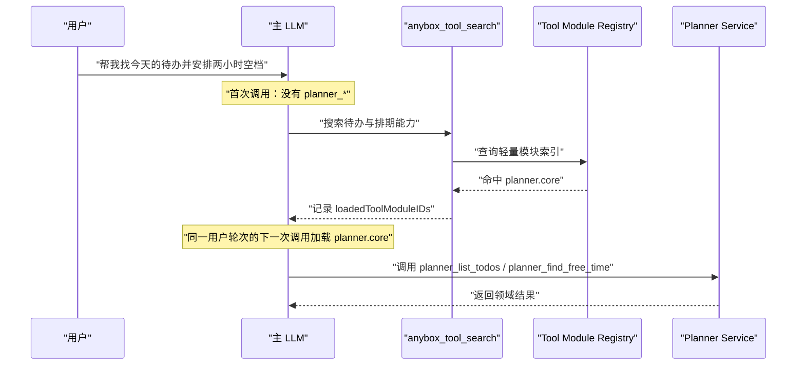
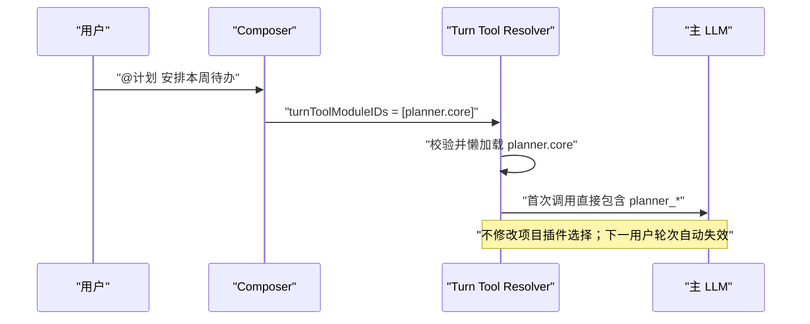
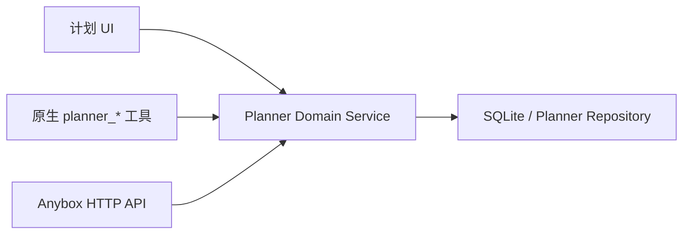

# ADR：原生 Tool Module 的渐进式披露与当前轮激活

| 项目 | 内容 |
| --- | --- |
| 状态 | Accepted；运行时与 `planner.core` 首个模块均已实现，通用化由 [Tool Module V2 ADR](./tool-module-v2-architecture-decision.md) 接续；Calendar MCP 插件兼容层已于 2026-08-04 退役 |
| 决策日期 | 2026-08-01 |
| 适用范围 | Anybox Agent 工具注册、会话请求、Composer 模块标签 |
| 产品依据 | [Anybox 计划模块产品需求（PRD）](./planner-product-requirements.md) |

## 1. 决策摘要

Anybox 新增“原生 Tool Module”机制，用于承载 Planner 等应用内部领域工具。原生模块：

- 不属于 `builtinTools()`，不会默认出现在模型工具列表中。
- 不需要启动 MCP server，也不通过本地 HTTP 回环访问 Anybox 自身。
- 只在当前用户轮次被激活后加载和初始化。
- 支持两条激活路径：主 LLM 调用通用工具搜索，或用户通过 `@计划` / `/计划` / 命令面板主动加载。
- 不引入主 LLM 调用前的意图解析器、分类模型或隐藏的语义路由器。
- 在工具搜索不可用、被拒绝或失败时保持隐藏，不得回退为全量直接暴露。

Anybox 内部 Planner 工具直接调用 Planner 领域服务。旧 Calendar MCP 插件不再分发或安装；桌面排程视图仍可通过内部 HTTP API 访问同一领域服务。

## 2. 背景与现状

### 2.1 当前已有能力

当前工具解析已经提供一部分可复用基础：

- `turnMcpServerIDs` 能让用户显式选择的 MCP server 只在当前轮直接暴露。
- `anybox_tool_search` 能搜索 deferred MCP 工具，并在同一用户轮次的下一次模型调用中恢复已发现工具。
- `readTurnDiscoveredToolNames()` 以当前 user message 为边界恢复发现状态，下一条普通 user message 会终止该状态。
- 工具权限、只读会话和审批继续由统一 execution/permission 链路处理。

### 2.2 当前实现不能直接满足的部分

| 当前行为 | 与目标的差距 |
| --- | --- |
| `builtinTools()` 中的工具默认进入候选集合 | Planner 工具不能常驻 builtin registry |
| `ToolRegistry.tools()` 汇总 builtin、MCP 和 custom 工具 | 缺少独立、懒加载的原生模块目录 |
| `ToolSource` 只有 MCP source | 无法表达 native module 的归属与生命周期 |
| deferred MCP 在决定可见性前已经创建 execution | 工具虽然隐藏，但运行时并非真正按需初始化 |
| 工具搜索描述会列出 deferred MCP sources | 会把能力目录静态写进模型上下文，不符合严格渐进披露 |
| 工具搜索关闭或被拒绝时 deferred 工具回退为 direct | 原生模块必须 fail closed，不能因此全部暴露 |
| `@plugin` 修改项目 `selected_plugins` | 它是持久化插件能力选择，不是一次性工具加载 |

因此，现有实现提供了“当前轮状态”和“下一次模型调用恢复发现结果”的骨架，但没有完整支持原生模块的严格按需注册。

### 2.3 已退役的 Calendar 插件边界

早期 Calendar 插件使用标准 stdio MCP server：

```text
LLM / MCP client
  -> Calendar MCP server.js
  -> http://127.0.0.1:4096/api/calendar
  -> anyboxagent Calendar domain + SQLite
```

它的 MCP 进程只是协议适配器，领域逻辑和数据始终位于 Anybox runtime。随着 Planner 收敛为 Todo-first 产品且原生工具完成覆盖，这条额外的 `stdio -> HTTP -> 自身` 链路已没有产品消费者，并于 2026-08-04 删除。Calendar HTTP API、事件数据和排程投影仍是桌面端内部能力，不属于已删除的插件包。

## 3. 架构原则

1. **一个主 LLM**：用户原始消息直接进入主 LLM，不在前面增加语义分类调用。
2. **两种显式加载方式**：LLM 通过工具搜索加载，或用户通过结构化指令加载。
3. **当前轮有效**：激活不是项目设置，也不是会话永久状态。
4. **模块按需初始化**：未激活模块只保留轻量目录信息，不构造工具 execution。
5. **搜索描述保持通用**：候选模块目录留在运行时索引，不展开到 prompt。
6. **模块有边界**：一次搜索加载一个有限工具包，不借机注册所有 Anybox 原生能力。
7. **权限不变**：加载工具不等于批准工具调用；每个工具仍走统一权限策略。
8. **领域逻辑单一**：UI、HTTP 和原生工具共享同一 service。

## 4. 决策

### 4.1 新增独立的 Native Tool Module Registry

原生模块不加入全局 `builtinTools()`，而是注册轻量 descriptor：

```ts
type NativeToolModuleDescriptor = {
  id: string
  title: string
  description: string
  keywords: string[]
  load: () => Promise<Tool.ToolInfo[]>
}
```

约束：

- `id` 是稳定的、provider-safe 的内部标识，例如 `planner.core`。
- `title / description / keywords` 只进入本地搜索索引，不自动拼接到工具搜索 description。
- `load()` 只在模块激活后调用。
- `load()` 返回的工具仍由现有 Tool execution 与 Permission 链路执行。
- Registry 不接受 renderer 传入文件路径、代码或工具 schema；客户端只能提交服务端已知的 module ID。

MVP 只注册一个有边界的 `planner.core` 包：

```text
planner_list_todos
planner_get_todo
planner_create_todo
planner_update_todo
planner_complete_todo
planner_schedule_todo
planner_find_free_time
planner_create_proposal
planner_accept_proposal
planner_dismiss_proposal
```

当工具数量、权限或加载成本明显分化时，再拆为 `planner.todos`、`planner.schedule`、`planner.automation`，而不是让一个模块无限增长。

### 4.2 路径 A：主 LLM 渐进式发现

首次模型调用只包含核心工具，以及存在可搜索候选时的通用 `anybox_tool_search`。

工具描述固定为能力级说明，例如：

```text
Search and load optional Anybox capability modules or deferred tools needed for
the current request. Loaded tools are available on the next model call in this
user turn only.
```

描述不得追加完整模块列表、source 列表、工具名或参数 schema。运行时使用用户 query 在内部索引中匹配：

- 原生 module descriptor。
- 仍采用 deferred 模式的 MCP 工具定义。

命中原生模块时，工具结果写入结构化元数据：

```ts
type ToolSearchMetadata = {
  kind: 'tool-search'
  loadedToolNames?: string[]       // 兼容现有 deferred MCP
  loadedToolModuleIDs?: string[]   // 新增原生模块发现
}
```

下一次模型调用根据当前轮消息历史恢复 `loadedToolModuleIDs`，此时才执行 module `load()` 并注入其工具定义。



这里的能力选择由主 LLM 通过普通工具调用完成，不是主调用前的意图解析器。

### 4.3 路径 B：用户主动加载

Composer 新增结构化 `tool-module` 标签。以下入口都编译为同一语义：

- `@计划`
- `/计划`
- 命令面板“为本轮加载计划工具”

提交请求增加：

```ts
type SessionPromptInput = {
  // existing fields...
  turnToolModuleIDs?: string[]
}
```

renderer 只发送规范化 module ID，例如 `planner.core`。服务端重新验证 module 是否存在、是否启用、是否允许当前 Agent 使用。

这条路径在本轮第一次模型调用前激活模块，不调用工具搜索，也不写入项目 `selected_plugins`。



### 4.4 激活集合与轮次边界

内部解析使用两个来源：

```ts
requestedToolModuleIDs  // 来自当前 user message 的结构化标签
discoveredToolModuleIDs // 来自当前 user turn 内 tool_search 的完成记录

activeToolModuleIDs = union(
  requestedToolModuleIDs,
  discoveredToolModuleIDs,
)
```

边界规则：

- 当前 user message 是激活范围的起点。
- 该轮产生的 assistant、tool 和 internal message 均可恢复发现状态。
- 遇到下一条非 internal user message，上一轮发现状态终止。
- 重试、工具调用后的下一次模型请求和进程内恢复必须保留同一轮发现结果。
- 新会话、下一轮、打开同一项目或重新启动应用都不会把历史激活变成默认能力。

### 4.5 ToolSource 扩展

`ToolSource` 从 MCP-only union 扩展为显式来源：

```ts
type ToolSource =
  | {
      kind: 'mcp'
      id: string
      name: string
      description?: string
    }
  | {
      kind: 'native-module'
      id: string
      name: string
      description?: string
    }
```

来源用于：

- 解析 direct / deferred / active module 可见性。
- 权限、审计和 UI 来源展示。
- 防止模块工具与 builtin、MCP 或其他模块重名。

模块 ID 不能复用 MCP server ID 的含义；`turnMcpServerIDs` 与 `turnToolModuleIDs` 保持两个独立字段。

### 4.6 工具解析顺序

新的 `resolveToolPlan()` 按以下顺序工作：

1. 加载 builtin 目录和允许的当前项目 MCP 目录。
2. 读取 `turnToolModuleIDs` 与本轮工具搜索发现记录。
3. 校验并去重 active native module IDs。
4. 仅对 active module 调用 `load()`。
5. 对当前可用工具应用 Agent、全局选择、只读模式和审批策略。
6. 为未激活模块和 deferred MCP 创建轻量搜索索引。
7. 只对直接可见或本轮已发现的工具创建 execution。
8. 生成本次模型调用的 `visibleTools`。

第 7 步要求调整当前“先为 registry 中所有工具创建 execution、再决定 exposure”的顺序。真正的按需加载必须同时避免工具 schema 暴露和未使用 runtime 初始化。

### 4.7 搜索不可用时严格隐藏

原生模块采用 fail-closed 语义：

| 状态 | 行为 |
| --- | --- |
| 工具搜索开启且允许 | 可通过搜索发现，也可通过 `@` 直接加载 |
| 工具搜索关闭或被 Agent 拒绝 | 不能搜索；仍可通过合法 `@` 直接加载 |
| 模块被禁用或当前 Agent 无权使用 | 搜索不返回，`@` 请求被忽略并给出可诊断错误 |
| 模块加载失败 | 不暴露部分工具，记录错误并向模型提供可处理的失败信息 |
| 无匹配模块 | 返回空结果，不扩大可见工具集合 |

任何一种失败都不得让全部原生模块变为 direct。现有 MCP 是否保留旧 fallback 可单独迁移，但该 fallback 绝不能应用到 `native-module` source。

## 5. Planner 的最终边界



决策结果：

- Anybox 内部 Agent 使用原生 `planner_*` 工具。
- 不再提供 Calendar MCP 插件或外部 MCP 兼容面。
- `/api/calendar` 作为桌面排程视图的内部兼容 API 保留，并转发到 Planner service。
- UI、HTTP API 和原生工具对同一 Todo 使用同一 ID、权限语义和事务规则。

## 6. Composer 与产品交互契约

### 6.1 标签不是持久化选择

`tool-module` 标签只属于待提交的这一条消息。发送完成、清空草稿或开始下一轮后，不自动保留。

它与现有概念的区别：

| 概念 | 生命周期 | 用途 |
| --- | --- | --- |
| `selected_plugins` | 项目持久化 | 启用插件完整能力 |
| `turnMcpServerIDs` | 当前轮 | 显式加载某个 MCP source |
| `turnToolModuleIDs` | 当前轮 | 显式加载 Anybox 原生工具模块 |
| skill mention | 按 skill 读取协议 | 加载工作流说明或资源 |

### 6.2 用户可见反馈

- Composer 标签显示“计划”，而不是内部 ID `planner.core`。
- 发送后的用户消息保留紧凑的模块来源标签，便于审计和重试。
- 工具活动区显示“已为本轮加载计划工具”，不宣称模块被永久启用。
- 模块不可用时给出明确原因，不静默改用其他插件或相似工具。

### 6.3 语法识别边界

`@计划` 和 `/计划` 是确定性的结构化指令解析，不分析普通自然语言含义。普通文本是否需要工具由主 LLM 自己决定，并通过 `anybox_tool_search` 显式行动。

## 7. 权限、安全与审计

- 加载 module 是只读的能力发现动作，不代表任何领域写入获批。
- 每个 `planner_*` 工具声明 read-only、write、destructive 等 capabilities，并沿用现有 `needsApproval`。
- 批量计划变更优先返回 Proposal，再由单独接受动作提交。
- renderer 提交的 module ID 必须在服务端 registry 中查找；禁止任意动态 import 路径。
- 审计记录至少包含 user turn、module ID、tool ID、工具风险、审批结果和执行结果。
- read-only session 只暴露模块中的只读工具；不能因为整个模块被加载而绕过过滤。
- 模块目录和搜索索引不得包含 secret、连接凭据或用户数据。

## 8. 代码改造范围

以下路径是实施基线；文件可在实现时按现有模块约定细分，但契约不得改变。

| 区域 | 主要改动 |
| --- | --- |
| `packages/anyboxagent/src/tool/tool.ts` | 扩展 `ToolSource` 为 MCP/native-module union |
| `packages/anyboxagent/src/tool/registry.ts` | 保持 builtin registry；不要把 Planner 放入 `builtinTools()` |
| `packages/anyboxagent/src/tool/module.ts` | 新增轻量 module descriptor、服务端校验与懒加载 registry |
| `packages/anyboxagent/src/session/core/resolve-tools.ts` | 合并本轮请求/发现 module，激活后加载，改变 execution 初始化顺序 |
| `packages/anyboxagent/src/session/core/tool-search.ts` | 索引 module descriptors 与 deferred MCP，不向 prompt 枚举目录 |
| `packages/anyboxagent/src/tool/tool-search.ts` | 更新通用描述与搜索结果 metadata contract |
| `packages/shared/src/session.ts` | 新增并校验 `turnToolModuleIDs?: string[]` |
| `packages/anyboxagent/src/session/core/message.ts` | 持久化当前 user message 的 module IDs |
| `packages/anyboxagent/src/session/core/prompt.ts` | 把字段传入工具计划解析并支持当前轮恢复 |
| `packages/anyboxagent/src/server/usecases/session.ts` | 接收、规范化并转发当前轮 module IDs |
| `packages/desktop/src/renderer/src/app/composer/draft-state.ts` | 新增 `tool-module` 结构化标签与编译结果 |
| `packages/desktop/src/renderer/src/app/composer/composer-controller.ts` | 只在当前提交发送 `turnToolModuleIDs` |
| `packages/desktop/src/renderer/src/app/composer/Composer.tsx` | 提供 `@计划`、`/计划` 与命令面板入口，不改项目 plugin selection |

Planner 领域层和工具实现应位于独立目录，例如：

```text
packages/anyboxagent/src/planner/
  planner.ts
  repository.ts
  types.ts
  tools.ts
```

具体目录不是本 ADR 的兼容 API；领域单一来源和工具生命周期才是约束。

## 9. 测试契约

### 9.1 运行时单元测试

1. 未激活时 `visibleTools`、`registryTools` 和 module `load()` 调用均不包含 Planner 工具。
2. 搜索命中 `planner.core` 后，同一轮下一次解析加载 Planner 工具。
3. 下一条 user message 不恢复上一轮 module discovery。
4. `turnToolModuleIDs=['planner.core']` 使首次模型调用直接包含 Planner 工具。
5. 重复 module ID 去重，未知 ID 可诊断且不导致全局失败。
6. 搜索关闭、工具被拒绝、模块被禁用时均不回退为全量 direct。
7. read-only Agent 只得到模块中的只读工具。
8. module load 失败时不产生半注册状态。
9. native module、builtin 与 MCP 工具名冲突时启动/测试阶段立即失败。
10. 工具搜索描述中不存在原生模块枚举和完整工具 schema。

### 9.2 会话契约测试

- shared schema 接受字符串数组、拒绝非数组或非法 ID。
- prompt/message 序列化与恢复保留当前轮 module IDs。
- retry、tool continuation 和历史消息 replay 不越过 user-turn 边界。
- 旧会话没有该字段时行为保持兼容。

### 9.3 Desktop 测试

- `@计划`、`/计划` 和命令面板生成相同的结构化标签。
- 提交只发送 `turnToolModuleIDs`，不调用项目 plugin selection 更新接口。
- 删除标签后不发送 module ID。
- 发送后新草稿不继承上一轮标签。
- 插件、MCP、skill 与 tool-module 标签可同时存在且不会互相覆盖。

### 9.4 Planner 集成测试

- UI、原生工具和 Calendar HTTP API 读取同一 Todo。
- 原生工具排期后 Calendar 立即显示同一记录。
- Calendar HTTP API 改期后原生工具返回相同时间和版本。
- Proposal 接受前无正式数据变更，接受后事务提交。
- 工具写操作遵循审批和审计策略。

## 10. 实施顺序

1. 扩展 shared/session/message contract，并新增空的 module registry。
2. 为 `resolveToolPlan()` 增加当前轮 module 激活和真正的 lazy execution。
3. 改造 `anybox_tool_search` 的通用描述、模块索引与 metadata 恢复。
4. 增加严格隐藏、失败关闭和轮次恢复测试。
5. 实现 Composer `tool-module` 标签、`@计划` 与 `/计划`。
6. 抽取 Planner domain service，建立现有 Calendar 数据兼容层。
7. 实现并注册 `planner.core`，打通权限与审计。
8. 将桌面 Calendar API 切换到同一 Planner service。
9. 原生工具覆盖稳定后，卸载并删除无消费者的 Calendar MCP 插件。
10. 更新公开工具文档中关于 deferred fallback 和搜索描述的说明。

每一步都应保持旧会话、现有 MCP 和未使用 Planner 的普通对话可运行；不得以一次性大迁移替换所有工具注册逻辑。

## 11. 被否决的方案

### 11.1 将 Planner 工具加入 `builtinTools()`

否决原因：工具定义长期占用上下文；领域能力与核心执行工具混杂；无法满足只有用户需要时才注册。

### 11.2 在主 LLM 前增加“模块意图解析器”

否决原因：增加一次模型调用、延迟和误判；形成不可见的第二决策者；用户显式指令与主 LLM 工具选择已经足够表达加载动作。

### 11.3 复用项目 `selected_plugins`

否决原因：该状态是持久化能力配置，会把一次对话意图扩展到后续所有轮次；插件还可能同时携带 Skill、MCP 和 connector，粒度过大。

### 11.4 Anybox 内部继续通过 Calendar MCP 回环

否决原因：Anybox 已经拥有领域 runtime，再经过 stdio 子进程和本地 HTTP 只增加故障面。当前产品也没有需要这层兼容协议的外部 MCP 消费者；未来若重新引入外部集成，应作为明确受支持的独立接口设计。

### 11.5 搜索失效时把全部模块直接暴露

否决原因：这会在最需要安全降级时违反核心产品约束。原生模块必须保持隐藏，用户仍可通过合法结构化标签主动加载。

## 12. 后果

### 正向结果

- 普通对话不会携带 Planner 工具 schema。
- 用户既可以明确控制，也可以让主 LLM 按需发现能力。
- 不增加前置语义路由器。
- 原生能力移除了 Calendar MCP 回环进程及其安装、序列化和诊断成本。
- 当前轮状态、权限和审计边界明确，可扩展到其他内部模块。

### 成本与风险

- 工具 Registry 从单一列表演进为 builtin、MCP、custom 和 native module 多类来源。
- resolver 必须处理模块发现、懒加载、重试恢复和失败原子性。
- Composer 需要新增一种与 plugin/MCP/skill 不同的标签语义。
- 工具搜索的现有 MCP fallback 与 source 枚举行为需要谨慎迁移和回归。
- 模块粒度如果失控，仍可能在激活后一次注入过多工具，因此需要持续设定包大小上限和拆分标准。

这些成本由自动化测试、清晰的 module descriptor 契约和分阶段迁移控制。
