# Thread View 前端设计说明

更新日期：2026-08-01

## 1. 文档定位

本文记录桌面端 `ThreadView` 的当前前端设计。它是维护入口，不替代源码；当 `ThreadView` 的布局、信息层级、trace 呈现、权限确认或 composer 行为发生变化时，需要同步更新本文。

主要实现文件：

- `packages/desktop/src/renderer/src/app/thread/ThreadView.tsx`
- `packages/desktop/src/renderer/src/app/thread/BranchThreadView.tsx`
- `packages/desktop/src/renderer/src/app/thread/branch-thread-layout.ts`
- `packages/desktop/src/renderer/src/app/sidebar/BranchChatPanel.tsx`
- `packages/desktop/src/renderer/src/app/session-message-tree.ts`
- `packages/desktop/src/renderer/src/app/sidebar/SessionMessageInspectorPanel.tsx`
- `packages/desktop/src/renderer/src/app/sidebar/RightSidebar.tsx`
- `packages/desktop/src/renderer/src/app/thread/use-thread-projection.ts`
- `packages/desktop/src/renderer/src/app/thread/thread-execution-groups.ts`
- `packages/desktop/src/renderer/src/app/thread/thread-presentation-store.ts`
- `packages/desktop/src/renderer/src/app/thread/thread-display-rows.ts`
- `packages/desktop/src/renderer/src/app/thread/use-thread-virtual-list.ts`
- `packages/desktop/src/renderer/src/app/thread/use-thread-scroll-controller.ts`
- `packages/desktop/src/renderer/src/app/thread/use-thread-content-observer.ts`
- `packages/desktop/src/renderer/src/app/thread/use-thread-turn-navigation.ts`
- `packages/desktop/src/renderer/src/app/thread/ThreadRows.tsx`
- `packages/desktop/src/renderer/src/app/thread/ThreadRowRenderer.tsx`
- `packages/desktop/src/renderer/src/app/thread/ThreadTurnNavigator.tsx`
- `packages/desktop/src/renderer/src/app/thread/CompletedThreadMarkdown.tsx`
- `packages/desktop/src/renderer/src/app/thread/SizeAwareStreamingMarkdown.tsx`
- `packages/desktop/src/renderer/src/app/thread/thread-markdown-worker-client.ts`
- `packages/desktop/src/renderer/src/app/thread-markdown-parser.ts`
- `packages/desktop/src/renderer/src/app/thread-markdown.worker.ts`
- `packages/desktop/src/renderer/src/app/thread/thread-interaction-store.ts`
- `packages/desktop/src/renderer/src/app/thread/thread-execution-groups.test.ts`
- `packages/desktop/src/renderer/src/app/thread/thread-presentation-store.test.ts`
- `packages/desktop/src/renderer/src/app/thread/use-thread-scroll-controller.test.ts`
- `packages/desktop/src/renderer/src/styles/thread.css`
- `packages/desktop/src/renderer/src/styles/branch-thread.css`
- `packages/desktop/src/renderer/src/styles/right-sidebar.css`
- `packages/desktop/src/renderer/src/app/workbench/WorkbenchPaneSurface.tsx`
- `packages/desktop/src/renderer/src/styles/workbench.css`
- `packages/desktop/src/renderer/src/styles/composer.css`
- `packages/desktop/src/renderer/src/styles/responsive.css`

相关测试：

- `packages/desktop/src/renderer/src/app/thread/ThreadView.test.tsx`
- `packages/desktop/src/renderer/src/app/thread/BranchThreadView.test.tsx`
- `packages/desktop/src/renderer/src/app/thread/branch-thread-layout.test.ts`
- `packages/desktop/src/renderer/src/app/session-message-tree.test.ts`
- `packages/desktop/src/renderer/src/app/sidebar/SessionMessageInspectorPanel.test.tsx`
- `packages/desktop/src/renderer/src/app/sidebar/RightSidebar.test.tsx`
- `packages/desktop/src/renderer/src/app/thread/thread-display-rows.test.ts`
- `packages/desktop/src/renderer/src/app/thread/SizeAwareStreamingMarkdown.test.tsx`
- `packages/desktop/src/renderer/src/app/thread/CompletedThreadMarkdown.test.tsx`
- `packages/desktop/src/renderer/src/app/thread/thread-markdown-worker-client.test.ts`
- `packages/desktop/src/renderer/src/app/thread-markdown-parser.test.ts`
- `packages/desktop/src/renderer/src/app/thread/thread-interaction-store.test.ts`
- `packages/desktop/src/renderer/src/App.test.tsx`

### 命名边界

前端 `ThreadView` 只把 `ThreadMessage` 投影为 UI row：user message row、assistant trace/response/file-change/action row、permission request row。这里的 message 不是 backend runtime turn。

backend `Turn` 保留给一次执行生命周期/runtime 容器，包括 `turnID`、`backendTurnID`、runtime debug/export、agent-session turn target 等字段。文档和前端代码里提到 `turn` 时，应只出现在这些 backend/runtime 语义中。
## 2. 设计目标

Thread view 不是普通聊天窗口，而是 agent 工作台里的执行记录视图。它需要同时支持三类阅读：

1. 用户快速读取最终回复。
2. 开发者扫描 agent 的 reasoning、tool、workflow、file change 等执行轨迹。
3. 用户在不切换主 active path 的前提下，对消息树中的另一条路径进行只读探索。

因此当前设计优先级是：

- 主回复优先，trace 信息降噪。
- 桌面端高密度，可长时间扫描。
- 关键动作贴近对应消息，例如复制回复、切换分支、fork 和批准工具调用。
- 多 pane 工作台里保持固定宽度、可读行长和独立滚动。

## 3. 工作台嵌入关系

`WorkbenchPaneSurface` 在 pane 主体区域选择线性或分支投影。代码层级是：

```text
section.workbench-pane  # Dockview panel 的内容根
└─ div.workbench-pane-stage  # pane 内容舞台
   └─ div.workbench-pane-live-region.is-dockview-managed  # pane 内实际渲染区
      ├─ SessionCanvasTopMenu  # 当前 session 的工具条
      ├─ Linear: ThreadView  # active path 的完整阅读与执行记录区
      ├─ Branch: BranchThreadView  # 完整历史的轻量地图
      └─ div.composer-stack  # 底部输入区栈
         ├─ ComposerPendingSteerDrawer  # 已提交但不打断运行的补充输入
         ├─ Composer  # 主输入框；底栏依次包含附件、模型、reasoning、上下文压力和发送/停止
         ├─ ComposerBranchParentNotice  # 分支续写提示
         ├─ ComposerPlanModeNotice  # plan mode 状态提示
         └─ ComposerUtilityBar?  # 仅承载可用的 Git 分支控件；无内容时不占位
```

Dockview 的 tab/header chrome 位于 `WorkbenchPaneSurface` 外部，不属于 `section.workbench-pane` 内容根。视觉调试截图中，pane 对应的是中间 Dockview 内的内容面板；它包含绿色 `SessionCanvasTopMenu`、蓝色 `ThreadView` 区、紫色 `Composer`，以及仅在 Git 分支控件可用时出现的底部浅绿 `ComposerUtilityBar`。左侧 sidebar、右侧 sidebar、顶层 Dockview tab 条都不是这个 pane 的主体内容。

从用户可见区域看，一个 pane 的主要结构是：

```text
PaneTabBar
SessionCanvasTopMenu
ThreadView | BranchThreadView
ComposerTaskProgress
Composer
ComposerUtilityBar?
```

`workbench-pane-live-region` 使用 CSS grid 管理这些区域，其中当前 session view 占据 `minmax(0, 1fr)` 主阅读区，composer 固定在底部。`ThreadView` 内部的 `thread-column` 是独立滚动容器；`BranchThreadView` 使用整个主阅读区承载可平移、缩放的分支地图，节点详情交给 Right Sidebar。

### Linear / Branch 视图边界

`SessionCanvasTopMenu` 在普通 session 中显示与工具权限选择器同构的 `Linear / Branch` 下拉框；触发器展示当前视图，展开项使用单选菜单语义。当前实现是一个可回退的 Branch 首版：

- `sessionViewMode` 属于当前 workbench tab 的 renderer 内存状态，不写回 session，也不调用后端。
- Linear 继续消费 active history 的 canonical `ThreadTurn[]`，保留 streaming、trace、权限交互、bottom-lock 和虚拟列表。
- Branch 消费 `view: "all"` 派生的 `SessionMessageTree`，`buildBranchThreadLayout()` 只计算节点坐标和 active-path edge；节点只渲染 role、状态和短摘要。
- 单击 Branch 节点会改变 `BranchThreadView` 内的 `inspectedMessageID`，同时打开或更新 Right Sidebar 中唯一的上下文页签 `message-inspector`；右侧栏若已折叠会自动展开。同一次选择还会通过既有 `onForkFromMessage` 链路，把该节点写入当前 workbench tab 的 `composerParentMessageID`。
- `message-inspector` 以 `sessionID + messageID` 为目标。选中 assistant 时显示其最近的父级 user message 与该 assistant；选中 user 时默认显示 active-path 上的直接 assistant 回复，有多个直接回复时允许只在详情内切换查看。
- inspect 不会调用 branch select，也不会立即修改持久化的 `activeMessageID`。它只设置 renderer 内存中的 Composer 续写锚点；右侧栏的“当前”与“正在查看”标记继续区分 session 分支头和瞬时查看目标。
- `SessionMessageInspectorPanel` 只挂载当前一组 user/assistant Markdown；不会在每个地图节点内挂载完整 `ThreadView`，也不会在中央地图旁保留第二个详情区。
- 当前 `SessionMessageTree` 只保留 user message 与每个 backend turn 的最终 assistant 文本，且单节点正文有长度上限。因此首版详情不宣称能重放历史 trace、tool、permission 或 file changes；这些能力需要后续保留可索引的全历史 turn projection。
- Branch 的 `pan / zoom / inspected / keyboard focus` snapshot 以 `tab + session` 为 key 保存在 pane 组件内存中，切回 Linear 再返回时恢复；它不持久化到 session 或磁盘。
- Composer 仍是两种视图共同的 sibling。Branch 节点选择会显示 `ComposerBranchParentNotice`；下一次非并发发送把所选 message ID 作为 `parentMessageID` 交给既有发送服务，成功提交后清除该 tab 的显式 parent。新消息由后端按该 parent 建立分支，其他历史分支保持不变。

中央 Branch 视图是完整消息树拓扑的唯一界面；Right Sidebar 不再提供独立的 Message Tree 入口或页签。`message-inspector` 是由 Branch 节点点击打开的上下文页签，不出现在 Right Sidebar 的通用新增页签 launcher 中；再次点击其他节点会复用并更新同一个页签。

### Branch Map、主 ThreadView 与 Branch Chat

三种界面共享消息树，但职责不同：

```text
Session message tree
├─ Central Branch Map                 # 全树拓扑、选择与 inspect
├─ Main ThreadView                    # root → Session.activeMessageID
└─ Right Sidebar Branch Chat
   └─ detached Branch ThreadView      # root → tab.headMessageID 的投影
```

- 中央 `BranchThreadView` 是消息树地图，不负责重放完整 trace，也不是 Branch Chat。
- 主 `ThreadView` 只投影 `Session.activeMessageID` 指向的 active path。
- 产品名称 `Branch Chat` 指右侧页签；实现上它是 detached branch 的 `ThreadView` 投影，不是 Session、branch record 或新的会话类型。
- Branch Chat 复用标准 `ThreadView` 的 response、reasoning、tool、permission、question 和 file-change 渲染管线；右侧 `Composer` 与它保持 sibling 关系。

Branch Chat 不增加持久化的 branch ID、anchor、head、标题或最近列表。数据库中的唯一真相仍是 message 的 `parentMessageID`：

```text
response(anchor)
├─ user(main)   → response(main)
├─ user(branch) → response(branch)
└─ user(branch) → response(branch)
```

右侧页签只保存 renderer 生命周期内的展示目标：

```ts
{
  tabID,
  sessionID,
  originMessageID,
  headMessageID,
  anchorStrategy: "latest-at-send" | "selected",
  phase: "draft" | "committed"
}
```

Draft 的 `originMessageID` 与 `headMessageID` 相同。首次请求被接受后进入 committed；首条 user message 的 `parentMessageID` 永久表达分叉边，后续 head 随该 execution 的新消息推进。页签关闭只移除 renderer 状态，不删除消息，也不取消仍在运行的 execution。

#### 查询与可见投影

后端 branch history 使用 `view: "branch" + headMessageID`，由 `Message.listBranch(sessionID, headMessageID)` 从 head 沿 parent 回溯并返回 root → head 的完整 message、part 和 turn 数据。缺失 parent、循环和跨 Session parent 会被拒绝。模型每轮同样从 execution 当前 head 重建完整上下文，不能读取 detached execution 之外的 `Session.activeMessageID`。

右侧 UI 不直接显示完整 root → head：

1. 页签顶部只保留极薄的工具栏：左侧是“最近分支”入口，右侧是 `⋯` 高级入口和常驻的“工具只读”安全状态。“最近分支”只展开消息树实时推导的非主 leaf，不在工具栏内常驻列表；没有可用分支时入口保持禁用。默认界面不显示来源摘要、选择器、跟随、定位、详情或锁定状态。
2. `ThreadView` 只接收 origin 之后的 messages/turns。
3. Composer、引用卡、Queue / Steer 和权限区域固定在底部。

因此 UI 截断不会截断模型上下文。已经打开的页签保持自己的 origin；关闭后从非主 leaf 重开时，以 leaf path 和当前 active path 的最后公共节点重新计算 origin。

#### 入口与分支起点

- Right Sidebar 通用新增入口以 `anchorStrategy: "latest-at-send"` 创建 draft。创建时的 `originMessageID/headMessageID` 只用于临时展示；用户首次发送时重新读取当前 Session active path 上最新的有效完成回复，并把它作为 detached branch 的 parent。没有有效回复时入口禁用；若候选在发送前失效，则不发送并保留草稿。
- 回复分支按钮、response 文本引用、最近分支、Message Inspector 和高级选择器使用 `anchorStrategy: "selected"`，固定使用明确选择的回复；之后出现的新回复不会改写它。
- `⋯` 直接打开使用 portal 渲染的高级列表。Draft 沿主 active path 按从旧到新列出有效回复，阅读方向与主 ThreadView 一致；`latest-at-send` 单独取最后一个有效候选，不依赖列表首项。打开列表时自动把当前选择或最新回复滚入视口。文案使用“从哪条回复开始”，不向普通用户暴露“锚点”术语；选择后切换为 `"selected"`，并立即让 focused 主 ThreadView 定位到该回复所属轮次的 user message，使 user message 与 response 开头连续可见。列表保持打开，默认界面不增加来源条或特殊标记。
- Committed 分支中的同一入口只读展示实际起点，不提供修改操作，并可通过 `paneID + messageID` 在同 Session 的 focused 主线程中定位。
- 高级列表与最近分支列表都支持 Escape、方向键、Home / End、Enter / Space、点击外部空白或 Branch Chat Composer 关闭和焦点归还；两个弹层互斥。高级列表中的选项选择与面板内定位动作不关闭列表，最近分支选择后关闭弹层并打开或聚焦目标页签。两个列表都使用 fixed portal 定位，在窄于 360px 的右侧容器中仍限制于 viewport。
- 主 ThreadView 与 Branch Chat 内最终 response 的 branch icon 每次都新建独立 draft 页签；它不再把 parent 写入主 Composer。
- response 选区右键菜单会创建 draft，并把选中文字作为结构化引用。选区必须完整属于同一条可分支 assistant response；链接内有有效选区时，ThreadView 选区菜单优先于链接菜单。
- Message Inspector 的 Branch Chat 动作对中间 response 创建 draft；对已有非主 leaf 则使用计算出的 origin/head 重开 committed 分支。

Branch Chat 顶部工具栏的“最近分支”不读取页签历史，而是实时扫描当前 Session 消息树中的非主 leaf。标题取分叉后的第一条 user message，摘要取 leaf response，时间取 leaf；generating、queued、waiting permission 和 error 由 turn parts 与瞬时 execution snapshot 合并显示。相同 leaf 已打开时聚焦已有页签；相同 anchor 的新 draft 不去重。Right Sidebar 通用新增页签 launcher 不再常驻渲染最近分支列表。

#### Execution 隔离与只读边界

发送协议使用线程目标，而不是 Branch Chat ID：

```ts
type AgentThreadTarget =
  | { kind: "active-thread"; parentMessageID?: string | null }
  | { kind: "detached-branch"; parentMessageID: string }
```

- main execution 使用固定的 `active-thread` slot，并显式推进 `Session.activeMessageID`。
- detached 首轮使用新的 `clientTurnID` 建立 execution；同一 Branch Chat 的 Queue / Steer 复用正在运行的 execution，真正执行时从 execution 最新 head 继续。
- 同一 Session 的 main 与多个 detached executions 可并行；停止操作通过 execution/turn 精确路由。
- 所有 runtime event 携带 `turnID`、`executionID` 和 target kind。中央 stream controller 会过滤 detached event，只刷新 message tree、权限和聚合 runtime 状态；每个 Branch Chat 页签只消费属于自身 execution/turn 的事件。
- renderer 重载后，可通过 branch history 中 running turn 的 execution ID 与 runtime execution snapshot 重新关联。
- detached target 在工具解析层只暴露显式 `readOnly` 工具；权限评估与已批准工具执行层再次拒绝写入型调用。右侧固定显示“工具只读”，不提供权限模式切换。

#### 结构化 response 引用

选区引用持久化为 user message part，而不是拼进可编辑文本：

```ts
{
  type: "message-quote",
  sourceMessageID,
  text
}
```

Composer 中引用是可移除、不可编辑的卡片；只有引用也允许发送。后端验证来源属于同一 Session 且为 assistant message，历史恢复后继续按引用卡渲染。模型输入会把快照转换成带转义边界的 `<message-quote source_message_id="…">…</message-quote>` 文本块。

截图中的蓝色大块不是正常主题色，也不是 semantic token。它来自 debug region 模式：

```css
.window-shell.debug-ui-regions .thread-shell,
.window-shell.debug-ui-regions .thread-column {
  background: var(--debug-region-thread-shell);
}
```

`--debug-region-thread-shell` 当前值为 `#bee3f8`。普通模式下 `.thread-shell` 和 `.thread-column` 自身不设置背景，保持透明，露出父级 pane/shell 背景。

工作台的大面积 shell 背景由 `.canvas.is-workbench` 单点绘制。Dockview 的外框、view、group view 和 content container 保持透明，避免带 alpha 的 `surface-shell` 在嵌套容器中重复合成并产生比其他 full-surface 页面更深的颜色；tab bar、活动标签和 composer 仍分别消费自己的语义 surface。

宽度策略：

- `workbench-pane-live-region` 定义 `--pane-content-max-width: 880px`。
- `thread-shell` 负责左右 gutter。
- `thread-column` 居中，最大宽度等于 pane 内容宽度。
- 多 pane 模式下仍保持 `width: 100%`，避免 split pane 中出现额外横向压缩。

### 链接导航

ThreadView 中规范化后的 `http` / `https` 链接默认交给右侧 Anybox 内置浏览器，并在右侧栏折叠时自动展开。链接右键菜单提供“在 Anybox 内置浏览器中打开”和“在系统浏览器中打开”两个显式动作；系统浏览器动作继续通过 Electron `openExternalUrl` 执行。本地文件和 `agent://artifact/*` 链接保持原有文件预览与 Artifact 路由，不进入网页链接菜单。

## 4. 内容模型

Canonical conversation state is `ConversationTurnMap = Record<string, ThreadTurn[]>`.
`ThreadTurn` represents one backend execution lifecycle. `ThreadMessage` records user or assistant messages inside that lifecycle. Permission approval can continue the same user request in a new backend turn; that continuation carries `resume: true` and retains the original `userMessageID`.
`ThreadView` still receives `activeMessages: ThreadMessage[]` as its render view. The main workbench also passes the canonical `activeTurns: ThreadTurn[]` for semantic turn navigation:

```ts
const activeMessages = turns.flatMap((turn) => turn.messages)
```

Do not treat `activeMessages` as the source of truth. New stream/history state should update `ThreadTurn[]` first, then derive flat messages for `ThreadView` and legacy selectors. `ThreadTurnNavigator` creates a read-only projection from each turn's `userMessageID` to the corresponding `user-message` display row; assistant rows, trace rows, permission rows, workflow/debug rows, and stream-inserted user rows never create navigation turns.

Live composer sends initially create a `pending:*` turn. When an authoritative runtime turn ID arrives, `bindPendingThreadTurnToCanonical()` must rename or merge that pending turn in the same conversation-store transaction that applies `turn.started` metadata. Matching is limited to explicit optimistic user IDs, assistant placeholder IDs, or an assistant already carrying the backend turn ID; adjacency, text equality, and timestamps are never identity evidence. Placeholder-to-segment binding performs the same re-homing before updating the assistant identity, so React never observes two assistant-bearing `ThreadTurn` objects for one backend execution.

### 用户消息发送状态与乐观生命周期

普通新回合在调用 bridge 之前同步构造 `UserThreadMessage`，设置 `delivery: { status: "pending" }`，并写入 `pending:${messageID}` turn。新会话 Composer 在 `createFolderSession` 返回并把 create tab 替换成 ThreadView 后，必须先写入这条 optimistic user row，再等待 session model selection、project model preference 或初始 workflow mode 等 pre-send 初始化；这些初始化不能让新 ThreadView 暂时保持空白。`delivery` 缺失表示后端已经确认；它只属于当前 renderer 生命周期，不进入 IPC/后端协议，也不写入 user-message presentation storage。Queue 与 Steer 继续走 pending drawer / stream insertion，不创建第二条 optimistic user row。

发送状态严格按下面的权威边界推进：

```text
Composer submit
  └─ pending user row + retry request snapshot
       ├─ turn.started / execution.mode
       │    └─ bind pending:* → canonical turnID（仍是 pending）
       ├─ message.recorded(role=user)
       │    └─ clear delivery → confirmed；删除完整请求快照
       └─ request error / turn.failed / turn.cancelled before confirmation
            └─ failed；保留 user row，移除无有效内容的 assistant placeholder
                 └─ retry
                      └─ 同一 message ID / row，新的 clientTurnID，原请求参数
```

`message.recorded(role="user")` 是唯一确认信号；`sendTurn` Promise、`turn.started`、execution mode 和超时都不能关闭 Loader。确认后的 assistant error/cancel 只更新 assistant runtime UI，不再回写用户消息状态。失败或取消后迟到的同一次权威 user record 仍可确认；一旦用户发起重试，registry 会先清除旧 attempt 的 client/turn/assistant identity，旧事件不能匹配或覆盖新 attempt。

主 Thread 使用工作区级 optimistic registry；每项在确认前保存完整、不可从气泡反推的 transport request snapshot，包括原始 text/display text、附件、引用、question answer、parent、model、reasoning、skills、MCP 和当前轮原生 Tool Module。重试不回填 Composer，不追加第二条 user message。带 `delivery` 的消息不会进入 presentation persistence，所以未落库的失败消息不会跨页面重载恢复；重载始终以 backend history 为准。

Branch Chat 使用页签组件级 registry，渲染 turn 是 `backend branch history + live assistant overlay + optimistic user turns` 的合成。确认后删除完整 request，只保留当前 tab 生命周期内的 message/turn alias，以便 history refresh 继续复用 optimistic message ID 和 virtual row ID。切换 tab 不卸载面板时状态保留；关闭 tab 后自然丢弃本地 optimistic/retry 状态，但不会额外取消已经开始的 detached execution。

### Composer 当前轮 Tool Module 标签

Composer 的 `tool-module` 标签用于一次性加载 Anybox 原生能力，不属于项目插件选择。当前 `@计划`、`/计划`、`/planner` 以及命令菜单中的“计划”入口统一编译为 `turnToolModuleIDs: ["planner.core"]`：

- `displayText` 保留用户可见的 `@计划`，用于 optimistic row、历史呈现和重试识别；发送给模型的 `transportText` 去除该控制 token。
- 结构化 module ID 必须随 Queue、Steer、retry、新会话首发和 Branch Chat 发送快照一起传播。
- 标签只作用于该 user turn，不写入 `selected_plugins`，也不自动继承到下一份 Composer 草稿或下一条普通 user message。
- `/计划` 是加载 Planner 工具的确定性快捷指令；英文 `/plan` 继续只切换 Plan Mode，两者语义不得合并。
- 普通自然语言不在 renderer 中做模块意图判断；未显式标记时，由主 LLM 自行调用通用工具搜索完成渐进式发现。

### Turn execution disclosure

桌面端长 turn 会在 semantic rows 生成后派生 `ThreadExecutionGroup`。分组边界来自 canonical `ThreadTurn`、`lastMessageID` 和 `finalSegmentID`，而不是相邻 DOM 或 user row。最终 response block 的边界在 trace visibility 过滤前计算；最终 response、response 后置内容、未解决 permission/question 和用户插入内容始终不会进入可折叠前缀。运行期间的所有 text 都是候选输出，可能仍是进度说明或中间 response；即使已经出现非空 response block，也继续完整展示 reasoning、tools 等 process rows，且不生成 execution summary。只有 turn 以 `completed` 完成并解析出最终 response 后，满足长度阈值的前置连续 process prefix 才生成“已处理”summary 并默认折叠。blocked、failed、cancelled、stopped 或 continued-by-user turn 均不把已有 text 推断成最终 response，也不生成 disclosure。response 之前的 error、失败 tool/workflow 属于已完成 turn 内的可恢复执行过程，随 process prefix 折叠；没有可解析最终 response 的 completed turn 同样保持全部内容直接可见。

一个用户可见的连续执行在任一投影帧最多产生一个 execution summary。状态层重建历史时必须把共享 `userMessageID` 的 user row 保留在原始非 resume turn，不能移动到后创建的续跑 turn。投影层只对具有相同 backend/segment/raw-turn 强身份的相邻 canonical wrappers，或“共享 `userMessageID` 且至少一侧明确带有 `resume: true`”的审批续跑链做保守合并；合并后的状态和最终 response 取最新 authoritative turn，过程 rows 仍按原始消息顺序排列，因此最终回复位于整个审批前后 trace 之后。普通 user、steer、stream insertion 或 `continued_by_user` 边界会阻止跨界 disclosure。Legacy candidates 和仅共享 user ID、但没有明确 resume 元数据的两个真实 turn 不自动合并。

投影顺序固定为：完整 base rows → execution group 派生 → diff/actions decoration → disclosure 裁剪。展开时输出 summary 与原 process rows；折叠时 process rows 从 `displayRows` 中真正移除，只保留 `assistant-execution-summary`、最终结果与后置 rows。summary 不持有隐藏 DOM，因此仍保持逐行虚拟化和 lazy mount。

`ThreadPresentationStore` 以 `scrollStateKey + groupID` 保存 `auto | expanded | collapsed` 语义。disclosure 可用后，`auto` 默认折叠；显式用户选择覆盖后续 late hydration 和虚拟卸载。非 completed process 始终不渲染 summary，streaming text 本身不会开启 disclosure；turn 以 `completed` 完成且最终 response 可解析后才提供折叠入口。没有可解析最终 response 的 completed turn 仍不提供折叠入口；异常终态保持失败或终态 trace 以及此前 process rows 直接可见。pending group 被 canonical group 认领时，显式 preference 和 eligibility/auto-collapse 状态迁移到 canonical group，冲突时以 expanded 为安全优先级。store 只属于当前应用生命周期，不写回 conversation、IPC 或磁盘。

自动折叠和手动 toggle 都使用 projection layout transaction。事务记录 surviving `rowID + viewportOffset + turnID`，临时 pin summary/outcome row，暂停普通 follow sync 与 TanStack size compensation，并在新投影提交后最多用两个 animation frame 做 DOM rect 校正。虚拟 thread column 使用 `overflow-anchor: none`，避免浏览器原生 anchoring 与应用语义锚竞争；事务期间若收到用户滚动意图，保留 disclosure 结果但取消余下校正。

存在 execution group 时，`ThreadTurnNavigator` 始终把 summary row 作为该 turn 的稳定导航锚点。copy、branch、fork 和 response actions 仍归属于最终 response owner，不归属于 summary。

数据层级可以按下面的树理解：

```text
ConversationTurnMap
└─ sessionID: ThreadTurn[]
   └─ ThreadTurn
      ├─ turnID  # backend RuntimeEvent.turnID; local pending may use pending:*
      ├─ status / phase / timestamps / resume?
      ├─ userMessageID?
      └─ messages: ThreadMessage[]
         ├─ UserThreadMessage
         │  ├─ text / displayText
         │  ├─ references[]
         │  ├─ attachments[]
         │  ├─ diffSummary?
         │  ├─ submissionMode?
         │  └─ delivery?  # renderer-only pending / failed; absent = confirmed
         └─ AssistantThreadMessage
            ├─ id  # frontend message instance id
            ├─ messageID?  # backend assistant message id
            ├─ backendTurnID  # owning turn id
            ├─ segmentID  # assistant segment boundary
            ├─ llmCallID?
            ├─ runtime
            │  └─ phase
            ├─ diffSummary?
            └─ items: AssistantTraceItem[]
               ├─ kind
               ├─ section?
               ├─ status?
               ├─ text?
               ├─ detail?
               ├─ filePaths?
               ├─ draftPatch?
               ├─ debugEntries?
               ├─ errorInfo?  # error context + 原始 name/message/code/status/provider/model
               └─ questionPrompt? / image src? / patch payload?
```

assistant trace 会按原始 item 顺序投影为 row；section 只决定 row 的语义、样式和可见性，不会改变原始 item 的相对顺序，也不会把多个原始 item 合并成一个 canonical row。section 不是简单等同于 `item.kind`，而是由 `traceSectionKeyForItem` 和 `defaultTraceSectionKeyForItem` 计算得出；是否显示某类 trace 由 `assistantTraceVisibility` 控制。

```text
AssistantTraceItem[]
├─ response  # 用户最应该阅读的最终回复
│  ├─ text：最终回复正文；可能被解析为 ProposedPlanCard
│  └─ question：需要用户回答的问题，也可能出现在 response 语境
├─ reasoning  # 模型思考或摘要式推理
│  └─ reasoning：模型思考或摘要式推理
├─ tools  # 工具调用与运行状态
│  └─ tool：工具调用、输入、输出、运行状态
├─ sources  # 来源信息
│  └─ source：来源信息
├─ approvals  # 审批或用户确认
│  └─ permission/question 相关审批信息
├─ file-change  # 文件与产物变更
│  ├─ patch：补丁或 draft patch
│  ├─ file：文件结果
│  └─ image：生成或展示的图片
├─ workflow  # 执行流程事件
│  ├─ step
│  ├─ retry
│  ├─ snapshot
│  ├─ task-state
│  ├─ subtask
│  └─ compaction
└─ debug  # 默认隐藏的开发调试信息
   └─ debugEntries / developer metadata
```

streaming 更新需要保持历史 trace 的 structural sharing：

- stream merge 只替换真正变化的 live item；已完成且语义未变化的 `AssistantTraceItem` 必须复用旧对象引用。
- `thread-display-rows.ts` 为每个 `AssistantTraceItem` 建立稳定 row metadata；streaming 文本变化只更新对应 live row，不改变 `rowID`。
- `buildThreadDisplayContext()` 通过线性多遍索引一次预计算 folding、final/latest、trailing diff 和 stream insertion；row builder 不再为每条 assistant message 重扫完整 message 列表。
- 增量 row cache 以不可变 message/item 引用作为 revision 信号，不序列化 tool output、图片、patch、diff 或 session payload。conversation store 若新增原地 mutation，必须同时引入显式 revision，不能在 projection 层恢复 payload `JSON.stringify`。
- live 判定只覆盖 `isStreaming`、`draftPatch.isStreaming`、以及 pending/running/waiting-approval tool；如果 live item 出现在历史中间，则回退到原整段渲染，保证顺序优先。
- question answered 状态在 trace item 边界降成 boolean；不要把整份 answered question Set 传给所有 trace item。

`ThreadView` 自身使用非 memo 的轻量 action adapter 接收最新业务 callback；昂贵的 visible viewport 只消费稳定 action port 和 capability 数据。业务动作必须在点击时读取最新 draft/model/skills，不能依赖忽略 callback identity 的 memo comparator。

### 数据到渲染流程图

这张图表达从会话数据到屏幕 UI 的主路径。更适合视觉阅读的离线版本见 [`thread-view-render-flow.html`](./thread-view-render-flow.html)。

```mermaid
flowchart LR
  subgraph data["数据输入"]
    composer["Composer 普通提交"]
    delivery["optimistic registry\nrequest snapshot + active attempt"]
    recorded["message.recorded(role=user)"]
    turns["ConversationTurnMap / ThreadTurn[]"]
    messages["activeMessages: ThreadMessage[]\n(derived flat view)"]
    session["activeSession / messageTree"]
    pending["pendingPermissionRequests"]
  end

  subgraph normalize["ThreadView 归一化"]
    derive["deriveActiveMessages(turns)"]
    projection["useThreadProjection()"]
    context["buildThreadDisplayContext()"]
    baseRows["buildThreadDisplayRowsIncremental()"]
    displayRows["decorateThreadDisplayRowsIncremental()"]
    virtual["useThreadVirtualList()\nactive session 行窗口 + focused-row pin"]
    scroll["useThreadScrollController()\n锁底 / 恢复 / 用户意图"]
  end

  subgraph shell["Thread 外壳"]
    visible["VisibleThreadView"]
    column["section.thread-shell\n+ div.thread-column"]
    rows["ThreadRows"]
  end

  subgraph rowRender["行级渲染"]
    dispatch["ThreadRowRenderer(row)"]
    user["UserThreadMessageArticle"]
    permission["PermissionRequestInlinePrompt"]
    responseItem["assistant response row"]
    reasoningItem["assistant reasoning row"]
    toolItem["assistant tool row"]
    questionItem["assistant question row"]
    fileChange["assistant file-change row"]
    workflowItem["assistant workflow/source/approval/debug row"]
    diff["assistant diff row"]
    actions["assistant actions row"]
    trace["TraceItemView"]
  end

  subgraph output["屏幕结果"]
    response["最终回复正文"]
    traces["reasoning / tools / workflow"]
    actionUi["copy / branch / fork"]
    lightbox["ImageLightbox"]
  end

  composer --> delivery --> turns
  recorded --> delivery
  delivery -->|confirm / fail / retry in place| turns
  turns --> derive --> messages --> projection --> context --> baseRows --> displayRows
  session --> projection
  pending --> projection
  session --> displayRows
  displayRows --> virtual
  displayRows --> visible
  scroll --> column
  visible --> column
  column --> rows
  virtual --> rows
  rows --> dispatch
  dispatch --> user
  dispatch --> permission
  dispatch --> responseItem
  dispatch --> reasoningItem
  dispatch --> toolItem
  dispatch --> questionItem
  dispatch --> fileChange
  dispatch --> workflowItem
  dispatch --> diff
  dispatch --> actions
  responseItem --> trace
  reasoningItem --> trace
  toolItem --> trace
  questionItem --> trace
  fileChange --> trace
  workflowItem --> trace
  trace --> response
  trace --> traces
  actions --> actionUi
  trace --> lightbox
```



### UI 组件树

`ThreadView` 的组件层级用树表达最清楚：

```text
ThreadView
├─ InactiveThreadView  # 非 active panel 时保留占位
│  └─ section.thread-shell[aria-hidden]
│     └─ div.thread-column
└─ VisibleThreadView  # 正常可见状态
   └─ section.thread-shell  # thread 区域外壳
      ├─ ThreadTurnNavigator?  # 主 pane 的固定语义轮次导航，不参与正文滚动
      │  ├─ button.thread-turn-navigator-marker[]
      │  ├─ hover/focus label
      │  └─ narrow-pane compact trigger + popover
      ├─ div.thread-column  # 独立滚动列
      │  ├─ empty state: article.thread-row.assistant-empty-state-row
      │  │  └─ TraceItemView(system)
      │  └─ ThreadRows  # active session 统一使用虚拟 row 窗口
      │     └─ div.thread-virtual-spacer
      │        └─ div.thread-virtual-row[]  # visible + overscan + focused row
      │           └─ ThreadRowRenderer(row)
      └─ ImageLightbox?  # 图片预览浮层
```

当前 active session 统一使用 TanStack virtual path：`thread-column` 带 `is-virtualized`，`thread-virtual-spacer` 和 absolute positioned `thread-virtual-row` 由 `useThreadVirtualList` 维护 offset、真实高度缓存、total size 和可见窗口。这样 turn navigation、滚动 snapshot 与 row 测量只有一套坐标语义。

虚拟 row 的重要交互状态不能依赖组件生命周期。question draft、selected options 和 submission operation 保存在 scope + row keyed interaction store 中；当前键盘焦点所在 row 通过 custom `rangeExtractor` 额外挂载，离开可见区时仍保留 DOM focus/selection，blur 后恢复正常卸载。纯动画、hover 和 copied 状态仍留在本地组件。

`content-visibility` 不叠加到 `.thread-virtual-row` 上。虚拟列表依赖 JS 测量和缓存真实 row 高度；让浏览器延迟虚拟 row 的高度计算会干扰滚动布局。

`ThreadRowRenderer` 是 `thread-column` 的主要 UI 分发表；`VisibleThreadView` 只保留一个很薄的 `renderDisplayRow(row)` wrapper，用来注入 copy、lightbox、branch switch 和 Branch Chat 等 handler：

```text
ThreadRowRenderer(row)
├─ row.kind = user-message  # 用户消息
│  └─ UserThreadMessageArticle
│     ├─ UserThreadMessageBubble
│     │  └─ CollapsibleUserMessageText
│     ├─ MessageDiffCard?
│     └─ copy user message button
├─ row.kind = permission-request  # 阻塞式权限决策
│  └─ PermissionRequestInlinePrompt
├─ row.kind = assistant-response-row
│  └─ article.assistant-response-row
│     └─ AssistantTraceSection
│        └─ TraceItemView
├─ row.kind = assistant-reasoning-row
│  └─ article.assistant-reasoning-row
│     └─ AssistantTraceSection
│        └─ TraceItemView
├─ row.kind = assistant-tool-row
│  └─ article.assistant-tool-row
│     └─ AssistantTraceSection
│        └─ TraceItemView
├─ row.kind = assistant-question-row
│  └─ article.assistant-question-row
│     └─ AssistantTraceSection
│        └─ TraceItemView
├─ row.kind = assistant-workflow-row / assistant-source-row / assistant-approval-row / assistant-debug-row
│  └─ article.assistant-*-row
│     └─ AssistantTraceSection
│        └─ TraceItemView
├─ row.kind = assistant-file-change-row
│  └─ article.assistant-file-change-row
│     └─ AssistantTraceSection
│        └─ TraceItemView[]
├─ row.kind = assistant-ephemeral-state
│  └─ article.assistant-ephemeral-state-row
│     └─ AssistantMessagePlaceholder
├─ row.kind = assistant-inserted-user-message
│  └─ UserThreadMessageArticle.assistant-stream-insertion-user-message
├─ row.kind = assistant-diff-card
│  └─ article.assistant-diff-row
│     └─ MessageDiffCard
├─ row.kind = assistant-actions
│  └─ article.assistant-actions-row
│     └─ div.assistant-response-actions
│        ├─ BranchSwitcher
│        ├─ copy assistant response button
│        └─ Branch Chat button
```

`TraceItemView` 按 `item.kind` 分发到不同 renderer。多数简单类型最终走 `GenericTraceItemView`，复杂类型会渲染专用 UI：

```text
TraceItemView
└─ TraceItemRenderBoundary  # 单条 trace 的错误隔离
   └─ traceItemRenderers[item.kind]  # 根据 kind 选择 renderer
      ├─ system → SystemTraceItemView → GenericTraceItemView
      ├─ source → SourceTraceItemView → GenericTraceItemView
      ├─ file → FileTraceItemView → GenericTraceItemView
      ├─ error → ErrorTraceItemView → 本地化错误 presentation → GenericTraceItemView
      ├─ text → TextTraceItemView  # 普通文本或 proposed plan
      │  ├─ ProposedPlanCard?
      │  └─ GenericTraceItemView
      ├─ reasoning → ReasoningTraceItemView  # 可折叠推理内容
      ├─ question → QuestionTraceItemView  # ask-user 控件
      ├─ tool → ToolTraceItemView  # 工具调用与 input/output
      ├─ image → ImageTraceItemView  # thumbnail 与 lightbox 入口
      │  ├─ TraceItemHeader
      │  ├─ TraceImagePreview
      │  └─ TraceItemDebugEntries
      ├─ patch → PatchTraceItemView  # 文件变更预览
      │  └─ PatchFileChangePreview
      ├─ subtask → SubtaskTraceItemView
      ├─ compaction → CompactionTraceItemView
      ├─ step → StepTraceItemView
      ├─ retry → RetryTraceItemView
      ├─ snapshot → SnapshotTraceItemView
      └─ task-state → TaskStateTraceItemView
```

注意：主 pane 底部的紫色主输入框 `Composer` 不是主 `ThreadView` 的子组件，它是 `WorkbenchPaneSurface` 中 `ThreadView` 后面的 sibling。上下文压力入口属于 Composer 底栏，并位于 reasoning selector 之后、发送/停止动作之前。Branch Chat 也保持同一结构：右侧 `ThreadView` 与其本地 Composer 是 sibling，草稿、附件、model、reasoning、上下文压力、skills 和 MCP 选择按页签隔离；Branch Chat 不再挂载独立的 `ComposerUtilityBar`。

## 5. 视觉层级

### 主回复

`response` section 被设计成最轻的形态：

- 外层 section 透明、无边框。
- response trace item 隐藏 header。
- 非 streaming Markdown 在 16000 字符以内继续使用同步 `ThreadMarkdown`。16001–256000 字符由专用 Web Worker 完成全文 GFM 解析和 MDAST→HAST，再按约 8000 字符的 HAST 顶层 block 逐块返回；主线程先请求首尾 block，随后一次提交一个中间 block，避免一次长解析和大提交阻塞输入、滚动。
- 超过 256000 字符的 completed response 默认保留最多 12000 字符的 plain-text 首尾预览，用户显式选择“渲染完整格式”后才启动 Worker。单一 table、list、blockquote、paragraph 或 code block 不拆分；节点数超过 8000 或文本超过 256000 字符的 atomic block 同样先显示安全预览，防止一次挂载巨量 DOM。
- Worker 只处理 immutable completed Markdown；streaming Markdown 仍在 16000 字符以内保持完整语义渲染，超过阈值后切换为 bounded plain-text 首尾预览并保留最新 live tail。HTML response、proposed plan 和其他 Markdown surface 不进入 Worker 路径。
- ThreadView 从所属 workbench pane 或 Branch Chat workspace 接收工作区目录。Markdown 图片的绝对本地路径继续直接转换为 `anybox-local-image://`；相对路径以该工作区目录为基准解析，且拒绝通过 `..` 越出工作区。streaming 与 completed/Worker 分段渲染必须复用同一解析器。
- Worker 先返回 document manifest，主线程再按 index 请求 block HAST。缓存键包含 thread scope、semantic row、trace item field、完整 source text 和 pipeline version；缓存只持有 immutable HAST，不缓存 React element、handler 或 URL resolver，虚拟 row 重挂载时可以复用解析结果。
- 文本颜色使用主文本色，行高适合长文阅读。

这让最终回复接近文档正文，而不是一张卡片。

Completed Markdown 的 block 仍是单个 semantic response row 内部的渐进内容，不提升为外层 virtual rows。这样 turn navigator、scroll snapshot 和 focused-row pin 继续使用原有坐标模型；渐进 block 导致的高度变化仍由现有 `ResizeObserver` 与 bottom-lock 规则处理。

### 用户消息

用户 message 右对齐：

- `.user-message` 使用 `justify-items: end`。
- `.user-message-bubble-row` 在气泡左侧保留 delivery status slot；pending 使用 info 语义色的 `SessionRunningIcon`，failed 使用 error 语义图标与标准 icon button 重试动作。
- pending slot 提供 `role="status"` 和本地化 accessible name；失败详情放入 group label/title，重试按钮具有明确的 `aria-label`。`prefers-reduced-motion: reduce` 下停止旋转，但保留 Loader 图形和状态文本。
- `.user-bubble` 最大宽度为 `min(100%, 520px)`。
- 背景使用 `--surface-user-bubble`，区别于 assistant 正文。
- 附件以 strip 显示：raster 图片在 composer 和 user message 中使用 56px 缩略图，PDF、SVG 和不支持的文件保留文件名 chip，长文件名省略。

用户消息的设计意图是明确“这是输入”，但不占满整个阅读宽度。

pending、failed、confirmed 只替换同一个 `UserThreadMessage` 对象所在的 semantic row，不追加 row。用户处于 follow 模式时首次 optimistic append 继续锁底；用户已向上阅读时不强制跳转。后续 delivery 状态变化不产生新的 row ID，也不触发额外滚动。

### Reasoning 与 Tools

reasoning 和 tools 默认弱化：

- 完成后的 reasoning/tool item 会折叠。
- 样式整体比 response 更低对比。
- tool row 展开后直接显示 input/output 两个可访问 region，不再提供 input/output 内部二级 disclosure，也不显示可见的“输入/输出”标题。
- Shell command 工具只在 input region 展示一次 command。新执行结果的 output region 只展示状态、退出码、标准输出/错误输出、TTY 输出或后台 session 操作信息；workdir、shell、TTY 等唯一运行元数据继续保存在结构化结果和 debug metadata 中，不再重复拼接 command。
- 模型历史通过同一 `toolCallId` 配对结构化 `tool-call.input` 与 `tool-result.output`。Shell 的模型结果不重复发送 `title` 或 `command`，但继续保留 workdir、shell/version、状态、截断标记和后台 session 等后续推理所需字段。
- streaming reasoning 默认进入固定一行的 `live-compact` viewport，继续按真实 token 内容渲染，并通过自身 `scrollTop` 在绘制前跟随最新视觉行；显式换行和 pane 宽度造成的自动折行都会推进到下一行，不调用 `scrollIntoView`，也不改变外层 thread 的 bottom-lock。
- `live-compact` 点击后展开完整实时内容；该显式展开选择在同一 item 的后续 token 和完成事件中保持。用户再次收起时恢复单行跟随；从未手动展开的 reasoning 完成后回到现有首个非空行摘要。
- streaming 时继续用轻微 pulse 和 caret 表达运行中。最新视觉行前进时直接切换到新行，不增加翻页、滑动、淡入或额外逐字动画；pane 宽度重排同样只重新定位。流式 reasoning 的 virtual row 使用紧凑单行预估高度，展开后的高度继续由实测 `ResizeObserver` 更新。
- completed 折叠状态必须是真 lazy mount：完整 reasoning、tool input/output、patch diff 在对应 row 展开前不进入 DOM，也不交给 Markdown/RichText/DiffPreview 渲染。`live-compact` 为了让浏览器按实际宽度计算最新视觉行，会在裁剪 viewport 内保留当前完整流式文本；完成并折叠后立即恢复 bounded preview 与正文卸载。
- 超大内容先显示 bounded preview：reasoning 首行最多 480 字符；patch preview 最多 200 行或 20000 字符，用户显式展开对应 row 后才挂完整内容。
- 展开的 tool input/output 在视觉上合并为一个受控高度整体面板；每个 region 短内容自然高度，长内容默认在 180px 内部滚动；命令、路径、patch 和 shell 输出按终端式 `pre` 文本保留原始行，并通过横向滚动查看长行。有效的 JSON input/output 都会在展示层以两空格缩进；含换行的字符串使用 `"""` 边界还原为多行内容，字段字符串若完整地包含 JSON object/array，则使用 `json"""` 边界递归缩进，明确保留其字符串语义。`exec` 是首个工具专用 renderer：仅当 `toolName === "exec"` 且 input 能完整解析为只含一个非空 `code` 字符串字段的 object 时，把该字符串作为 JavaScript async body 交给共享 Shiki 只读代码视图，显示行号并跟随当前代码主题；output 仍走通用 JSON renderer。流式半截 JSON、历史异常参数或 schema 不匹配时自动退回通用 renderer，避免工具 schema 演进后静默隐藏新字段。代码只作为 React text node 展示，不执行、不注入 HTML；复制仍写入该 region 的原始文本。每个 input/output region 右上角都有浮层式 icon-only 复制和展开按钮：展开取消当前 region 的垂直高度限制；展开态只保留横向滚动，不建立纵向内部滚动容器，鼠标 hover 在内容区域时纵向滚轮应继续驱动外层 thread view。按钮不参与内容布局，只在右侧保留避让空间，默认隐藏，仅在对应 region hover 或键盘 focus 进入时显示；默认/hover/focus/active 状态消费 icon button semantic token。面板背景由 `--semantic-thread-tool-io-panel-surface` 单独控制。

当前实现末尾有较多 CSS override，会把早期卡片样式改成更轻的透明形态。后续调整时应优先收敛这些 override，避免同一类元素在文件前后出现冲突规则。

### File Change

file-change row 保留对应原始 patch/file/image item 的位置；相邻 file-change item 也会渲染成独立 row，不跨 response、reasoning、debug 或隐藏 item 聚合。为了避免长 trace 淹没回复，当前策略是：

- 每个 canonical file-change row 只消费一个原始 trace item。
- patch/file chip 可点击，并通过 `onFileChangeSelect` 打开右侧检查区域。
- patch 行默认只显示文件摘要；展开文件行先挂截断 diff preview，点击 full diff 后才把完整 patch 交给 `DiffPreview`。
- assistant/user message diff card 默认只挂摘要头；文件列表、单文件行和 inline `DiffPreview` 在用户展开后才进入 DOM，避免长 thread 中的历史 diff row 持续增加渲染压力。

### Debug

debug 信息由 developer mode 和 trace visibility 控制。默认不应该干扰普通使用者阅读。

error trace 通过结构化 `errorInfo` 保存错误来源、原始消息、错误码、HTTP 状态和 provider/model 上下文。`ErrorTraceItemView` 在渲染时按当前 locale 将稳定的 error context/code 映射为用户标题与说明；余额不足等已知错误显示可操作的本地化文案，未知错误显示本地化通用提示。`AI_APICallError`、服务端原始消息等技术信息不进入普通阅读层，仅在启用 `debugMetadata` 后以 `data-i18n-skip` 的诊断值展示，避免原文被 DOM 兼容翻译器改写。

## 6. 交互行为

### 自动滚动

`ThreadView` 通过 `useThreadScrollController` 维护 `follow / detached` 两种滚动模式：

- 切换 session 时强制滚动到底部。
- 如果用户当前接近底部，新的 message 或权限请求到来时继续锁底。
- 如果用户向上阅读历史，后续更新不会强行打断阅读位置。
- 向上的 wheel、`ArrowUp`、`PageUp` 和 `Home` 会在浏览器提交 `scroll` 事件前立即切换到 `detached`。向上意图在 `THREAD_USER_SCROLL_INTENT_WINDOW_MS = 800` 的窗口内保持权威；即使期间先到达同位置的程序化事件或 virtualizer 行高补偿事件，也不得根据 32px 底部阈值重新判定为 `follow`。向下 wheel、键盘或新的 pointer 拖动意图会覆盖旧方向。
- `useThreadVirtualList` 的 `scrollToFn` 只写入 `scrollTop`，依赖浏览器随后产生的原生 `scroll` 事件更新 virtualizer 与 controller，不同步手工派发事件。一次行高测量可能连续算出多个补偿 offset；同步派发会把浏览器原本可在同一帧合并的中间值暴露给 React，形成“向上滚动 → 中间值回到底边 → 再向上”的抖动。jsdom 不会为 `scrollTop` 赋值生成原生事件，因此相关虚拟跳转测试显式补发 `fireEvent.scroll`。
- 点击 `ThreadTurnNavigator` 的轮次节点时，`useThreadVirtualList` 通过目标 display row index 获取 TanStack virtualizer 的 start offset，并减去少量顶部阅读留白；即使目标 row 尚未挂载到 DOM，也不依赖 `scrollIntoView()`。
- 轮次跳转通过 `useThreadScrollController.navigateThreadToOffset()` 明确切换为 `detached`，同时保存 `pinnedToBottom: false` 的 scroll snapshot。点击最后一轮也只定位到该轮 user message，不会滚到 thread 最底部；用户随后手动回到底部时仍由原有 scroll intent 规则恢复 follow。
- Branch Chat 高级列表按 response 的公开 `messageID` 发起定位。`assistant-actions` row 只负责把该 ID 解析到 response owner；实际目标是该 response 前最近的常规 `user-message` row，使提问与回答开头连续进入视口。若当前投影不存在对应 user row，才回退到同一 owner 的第一条 `assistant-response-row` 或 `assistant-question-row`，不会定位到回复尾部的 actions row；offset 继续由 virtualizer 计算。
- 点击任务完成系统通知时，主进程把完成事件的 `turnID` 随 `focus-session` 事件传到目标窗口。工作区聚焦对应 session 后发出一次性 thread navigation request，复用轮次导航的 virtual row offset 定位到该轮 user message；若历史刷新后仍没有对应 turn，则回退到当前最后一轮 user message。
- 轮次可见状态由 `.thread-column` 自身的 React `onScroll` 直接触发；virtualizer 的 measurement key 变化通过 requestAnimationFrame 合并更新。每轮范围从该轮 user row 开始，到下一轮 user row 之前结束；范围与当前 viewport 相交的所有轮次标记会同时高亮。导航组件同时接收一个主 current index，供紧凑模式文案、`aria-current` 和标记列表自动滚动使用，不再自行监听或观察 sibling 滚动节点。这样 Dockview 重挂载不会留下旧滚动监听，且只有可见集合或主索引变化时才更新导航状态。
- 键盘焦点进入 virtual row 后，该 row ID 会加入 virtualizer range；用户滚动阅读其他位置时不会卸载正在输入或操作的控件，blur 后解除 pin。

底部锁定阈值为 `THREAD_BOTTOM_LOCK_THRESHOLD_PX = 32`。

拖拽调整 sidebar 宽度时仍持续提交真实 grid 宽度，保留正文实时换行和重排。`use-thread-content-observer` 会暂停逐帧滚动同步，`ThreadRows` 的主动 DOM measurement 也会记录 pending resize 状态；virtualizer 直接监听 `anybox:sidebar-resize-start/end`，在不触发整个 ThreadView 重渲染的情况下暂停行高变化产生的 TanStack 自动 `scrollTop` 补偿。virtualizer 保持固定 overscan，避免拖拽开始、过程中和结束时因缩减/恢复 overscan 频繁挂载或卸载 row。TanStack virtualizer 仍按 animation frame 消费 row `ResizeObserverEntry.borderBoxSize`，实时更新因文本换行而改变的 row 高度和 offset，避免绝对定位的虚拟 row 在拖拽期间重叠；只有缺少 entry 的同步测量路径才返回已有尺寸。等 `anybox:sidebar-resize-end` 后，ThreadRows 先批量读取所有已渲染 `.thread-virtual-row` 的真实高度，再统一写回 virtualizer，恢复默认滚动补偿，由 scroll controller 执行一次 scroll sync。virtualizer 的 scroll-element `ResizeObserver` 同样优先直接消费 entry 尺寸，只有 entry 尺寸不可用时才读取 DOM rect。

### 消息动作

assistant response 后方可显示动作行：

- copy assistant response。
- branch switcher（存在兄弟节点时）。
- fork from message。

桌面 hover 设备上，动作行默认隐藏；在 hover、focus-within 或复制反馈期间显示。键盘焦点必须仍能发现所有可用操作。

用户消息也支持复制，但只显示 copy icon。

### 权限请求

权限请求以 thread 内 inline prompt 显示：

- `PermissionRequestInlinePrompt` 只显示当前第一个 pending request。
- 如果 pending request 能通过 `approvalID` 或 `toolCallID` 匹配到可见的 `approvals` trace row，审批卡片嵌入该 `assistant-approval-row`，不再额外追加独立 `permission-request` row；只有缺少可匹配 trace 时才使用独立 prompt row 作为 fallback。
- 卡片内有风险 chip、summary、rationale、allow/deny 操作。
- details 默认折叠，包含 workdir、command、paths、body 等信息。
- 设计上使用 warning 语义色，强调这是阻塞主 session 的决策点。

### Ask User Question

agent 提问通过 `question` trace item 渲染：

- `ask-user-question` metadata 无论 pending 还是 answered 都投影为同一个 `question` row，并复用工具 `sourceID` 原位更新；不会在回答后退化成普通 tool trace。
- 待回答和提交中的 `assistant-question-row` 是 protected execution outcome，始终位于可折叠的 process prefix 之外；canonical metadata、结构化答案或历史 `questionAnswer` 快照确认问题已回答后，该 row 在最终回复之前归入 process prefix，并随“已处理”折叠。主 Thread View 与 Branch Chat 共用这套投影和渲染规则。
- 单选可以直接点 option button。
- 多选用 checkbox，再提交。
- freeform 使用输入框。
- 提交开始时立即切换为只读摘要；提交中与已回答状态只保留在 `data-question-state`、operation store 和必要的 `aria-busy` 中，不向用户显示“正在提交回答”或“已回答”状态文案。
- 已回答卡片保留原问题，并以本地化的“问题：”“回答：”短前缀组成紧凑的两行只读摘要；不插入“你的回答”等所有权文案，也不创建嵌套 answer surface。选项按 `value` 映射到 `label` 和自身 description，未知值显示原值，旧历史缺少结构化答案时回退到 `answerText`。未选项、编号、checkbox、输入框、发送按钮和 helper note 均不渲染。
- draft、selected options、规范化后的提交答案和 operation 状态存放在 thread interaction store；virtual row 卸载/重挂后仍可恢复。历史 user message 中的 `questionAnswer` 也会形成答案快照，供旧数据兼容。
- 提交使用原子 operation token 防止重复；失败时恢复完整控件、保留草稿和选择并显示错误，允许重试。canonical answered metadata 到达后以服务端答案为准并清理本地交互状态。

这类卡片在 response section 中使用轻量中性 surface；只有权限审批类阻塞点使用 warning 语义色。具体规则：

- 待回答态保留“需要你补充信息 / Needs your input”提示行，`questionPrompt.header` 只作为次级上下文显示；只读摘要隐藏整条提示行。
- 问题正文使用正文强调级别，不使用 pane/page 标题级字号。
- 单选项渲染为真实 button；默认态保持轻量，hover/focus 才增强底色、边框和文字。
- 多选项使用 checkbox row，选中状态不能只依赖位置表达。
- freeform 输入是补充回答区，不参与选项编号；当 options 与 freeform 同时存在时，输入框位于选项列表之后的独立 action row。
- helper note 只在待回答状态说明回答方式，使用 muted token；只读摘要不显示 helper note。
- 只读摘要中的问题和回答使用同一 card surface 与连续内容流，不额外增加回答标题、边框、底色或嵌套卡片。
- submit 是当前 question card 的唯一 primary action，default/hover/focus/disabled/loading 必须消费按钮 semantic token。

### 图片预览

图片 trace 支持 thumbnail 和 lightbox：

- thumbnail lazy load。
- lightbox 支持 fit width、fit contain、zoom、拖拽和关闭。
- 打开 lightbox 时 body 添加 `is-image-lightbox-open`，避免背景滚动干扰。

## 7. 响应式规则

主要响应式规则在 `responsive.css`：

- 小于 900px 时，assistant response actions 和 session banner 纵向排列。
- 小屏下 pane content gutter 降低到 10px。
- composer、存在时的 Git utility bar、菜单 panel 会全宽显示。
- permission request grid 在窄屏变成单列。
- `thread-shell` 使用 inline-size container query：pane 宽度达到 1000px 时，横线导航固定在当前 pane 左侧 16px 的留白轨道；621–999px 时仍邻近居中正文左侧；小于等于 620px 时隐藏横线导航并显示“第 n/m 轮”紧凑按钮。popover 保留全部轮次并可独立滚动，三种布局都不参与正文排版或改变正文宽度。

桌面端仍是主要目标；响应式规则保证窄窗口可用，但没有把 thread view 设计成移动优先体验。

## 8. 主题与 token

Thread view 使用项目的语义 token：

- `--seg-text-*`
- `--seg-border`
- `--surface-user-bubble`
- `--surface-trace`
- `--semantic-thread-response-text`
- `--semantic-thread-reasoning-text`
- `--semantic-thread-panel-surface`
- `--semantic-thread-panel-surface-muted`
- `--semantic-thread-tool-io-panel-surface`
- `--semantic-thread-panel-surface-hover`
- `--semantic-thread-user-message-diff-card-surface`
- `--semantic-thread-user-message-diff-card-border`
- `--semantic-thread-user-message-diff-divider`
- `--semantic-thread-user-message-diff-row-surface-hover`
- `--semantic-thread-user-message-diff-row-surface-focus`
- `--semantic-thread-user-message-diff-preview-surface`
- 轮次导航复用 `--semantic-thread-divider`、`--seg-text-*`、`--semantic-icon-button-*`、`--semantic-popup-panel-surface` 和 secondary button border token，没有新增硬编码主题颜色。
- `--semantic-markdown-text`
- `--semantic-markdown-divider`
- `--semantic-markdown-table-surface`
- `--semantic-question-card-surface`
- `--semantic-proposed-plan-card-surface`
- `--semantic-warning-*`

Thread view 的 assistant 文本有两组专用 semantic token：

- `semantic-thread-response-text`：assistant response 区域的普通 trace 文本。
- `semantic-thread-reasoning-text`：assistant reasoning 区域的 reasoning 文本。

Thread view 的面板背景使用专用 semantic token，不直接消费全局 `surface-panel` / `seg-panel`：

- `semantic-thread-panel-surface`：thread-owned 面板、默认 assistant card 和 HTML frame 背景。
- `semantic-thread-panel-surface-muted`：低强调 trace、metadata、nested panel 背景。
- `semantic-thread-tool-io-panel-surface`：tool input/output 合并滚动面板背景，可独立于普通 nested panel 调整；对应的 light/dark token 暴露在外观设置的 Thread View 分组。
- `semantic-thread-panel-surface-hover`：thread 面板内紧凑控件的 hover / focus 背景。

User-message 文件变更卡片使用一组专用 semantic token：

- `semantic-thread-user-message-diff-card-surface`：卡片背景。
- `semantic-thread-user-message-diff-card-border`：卡片外框和内嵌 diff preview 外框。
- `semantic-thread-user-message-diff-divider`：文件行分隔线。
- `semantic-thread-user-message-diff-row-surface-hover`：summary 和文件行 hover 背景。
- `semantic-thread-user-message-diff-row-surface-focus`：summary 和文件行键盘焦点背景。
- `semantic-thread-user-message-diff-preview-surface`：内嵌 diff preview 背景。

运行时 CSS 使用无 light/dark 后缀的变量：

- `--semantic-thread-response-text`
- `--semantic-thread-reasoning-text`
- `--semantic-thread-panel-surface`
- `--semantic-thread-panel-surface-muted`
- `--semantic-thread-tool-io-panel-surface`
- `--semantic-thread-panel-surface-hover`
- `--semantic-thread-user-message-diff-card-surface`
- `--semantic-thread-user-message-diff-card-border`
- `--semantic-thread-user-message-diff-divider`
- `--semantic-thread-user-message-diff-row-surface-hover`
- `--semantic-thread-user-message-diff-row-surface-focus`
- `--semantic-thread-user-message-diff-preview-surface`

它们在 light/dark theme 下分别映射到同名 `-light` / `-dark` token。需要注意，assistant response 如果进入 `ThreadMarkdown`，`.thread-markdown` 内部还会把 `--md-text` 指向 `--semantic-markdown-text`，所以 markdown 段落的最终颜色可能服从 markdown token，而不是 thread response token。Markdown 表格容器和普通内容单元格的默认背景使用独立的 `--semantic-markdown-table-surface`，表头和交替行继续分别使用 `--semantic-markdown-table-head-surface` 与 `--semantic-markdown-table-row-alt-surface`；Markdown thematic break 使用独立的 `--semantic-markdown-divider`，内置主题默认为透明但保留 `<hr>` 的章节语义和垂直留白。以上 token 都在 Appearance 的 Markdown 分组中提供 light/dark 配置。

`thread-shell` 和 `thread-column` 的面板背景当前没有对应的 `semantic-*` surface token。普通模式下它们透明；debug UI region 模式下才由 `--debug-region-thread-shell` 涂成蓝色。

历史样式中仍存在硬编码颜色，例如早期 trace、permission request、user bubble 的部分颜色定义。后续视觉调整应优先迁移到 token，避免 light/dark theme 或 appearance 设置下不一致。

## 9. 当前设计债

1. `thread.css` 是从 legacy styles 拆分出来的，存在“先定义卡片，再在文件末尾清空卡片”的覆盖链。
2. `ThreadRowRenderer` 已经承接 row kind 分发，但 `ThreadView.tsx` 仍保留 TraceItemView、各类 trace renderer 和 lightbox；后续应继续把 trace renderer 拆到独立模块，降低主文件变更冲突。
3. reasoning/tools/file-change 的视觉差异在最终 override 后偏弱，扫描执行状态时不够直观。
4. `thread-column` 的原生滚动位置仍较弱；主 pane 的语义轮次导航只表达 canonical user turns，不表达单条 trace 或 assistant 输出内部的精确滚动比例。
5. README 中提到的若干前端规格文档当前不存在，本文暂时作为 thread view 设计记录入口。

## 10. 维护约定

改动 thread view 时，按以下顺序检查：

1. 是否改变了 `ThreadMessage` 或 `AssistantTraceItem` 的分组、显示、折叠规则。
2. 是否影响 response、trace、file-change、permission、question 和 actions 的视觉层级。
3. 是否影响多 pane、窄屏和 right sidebar 场景。
4. 是否需要更新 `ThreadView.test.tsx` 或 `App.test.tsx` 中的行为断言。
5. 是否需要同步更新本文档。

如果只是调整颜色、间距、radius，优先改 token 或局部语义 class，不要继续增加文件末尾的大范围 override。
