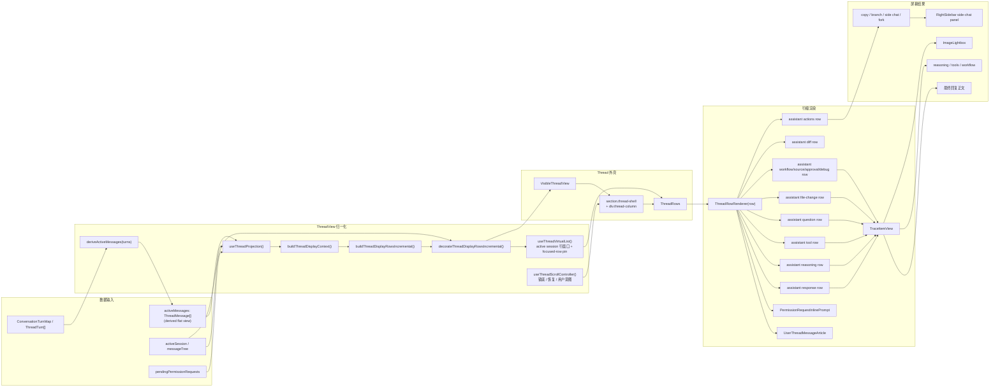

# Thread View 前端设计说明

更新日期：2026-07-11

## 1. 文档定位

本文记录桌面端 `ThreadView` 的当前前端设计。它是维护入口，不替代源码；当 `ThreadView` 的布局、信息层级、trace 呈现、side chat、权限确认或 composer 嵌套行为发生变化时，需要同步更新本文。

主要实现文件：

- `packages/desktop/src/renderer/src/app/thread/ThreadView.tsx`
- `packages/desktop/src/renderer/src/app/thread/use-thread-projection.ts`
- `packages/desktop/src/renderer/src/app/thread/thread-display-rows.ts`
- `packages/desktop/src/renderer/src/app/thread/use-thread-virtual-list.ts`
- `packages/desktop/src/renderer/src/app/thread/use-thread-scroll-controller.ts`
- `packages/desktop/src/renderer/src/app/thread/use-thread-content-observer.ts`
- `packages/desktop/src/renderer/src/app/thread/use-thread-turn-navigation.ts`
- `packages/desktop/src/renderer/src/app/thread/ThreadRows.tsx`
- `packages/desktop/src/renderer/src/app/thread/ThreadRowRenderer.tsx`
- `packages/desktop/src/renderer/src/app/thread/ThreadTurnNavigator.tsx`
- `packages/desktop/src/renderer/src/app/thread/CompletedThreadMarkdown.tsx`
- `packages/desktop/src/renderer/src/app/thread/SizeAwareStreamingMarkdown.tsx`
- `packages/desktop/src/renderer/src/app/thread/thread-markdown-worker-client.ts`
- `packages/desktop/src/renderer/src/app/thread-markdown-parser.ts`
- `packages/desktop/src/renderer/src/app/thread-markdown.worker.ts`
- `packages/desktop/src/renderer/src/app/thread/thread-interaction-store.ts`
- `packages/desktop/src/renderer/src/styles/thread.css`
- `packages/desktop/src/renderer/src/app/workbench/WorkbenchPaneSurface.tsx`
- `packages/desktop/src/renderer/src/styles/workbench.css`
- `packages/desktop/src/renderer/src/styles/composer.css`
- `packages/desktop/src/renderer/src/styles/responsive.css`

相关测试：

- `packages/desktop/src/renderer/src/app/thread/ThreadView.test.tsx`
- `packages/desktop/src/renderer/src/app/thread/thread-display-rows.test.ts`
- `packages/desktop/src/renderer/src/app/thread/SizeAwareStreamingMarkdown.test.tsx`
- `packages/desktop/src/renderer/src/app/thread/CompletedThreadMarkdown.test.tsx`
- `packages/desktop/src/renderer/src/app/thread/thread-markdown-worker-client.test.ts`
- `packages/desktop/src/renderer/src/app/thread-markdown-parser.test.ts`
- `packages/desktop/src/renderer/src/app/thread/thread-interaction-store.test.ts`
- `packages/desktop/src/renderer/src/App.test.tsx`

### 命名边界

前端 `ThreadView` 只把 `ThreadMessage` 投影为 UI row：user message row、assistant trace/response/file-change/action row、permission request row。这里的 message 不是 backend runtime turn。

backend `Turn` 保留给一次执行生命周期/runtime 容器，包括 `turnID`、`backendTurnID`、runtime debug/export、agent-session turn target 等字段。文档和前端代码里提到 `turn` 时，应只出现在这些 backend/runtime 语义中。
## 2. 设计目标

Thread view 不是普通聊天窗口，而是 agent 工作台里的执行记录视图。它需要同时支持三类阅读：

1. 用户快速读取最终回复。
2. 开发者扫描 agent 的 reasoning、tool、workflow、file change 等执行轨迹。
3. 用户在不中断主会话上下文的前提下，对某条 assistant 回复开启 side chat。

因此当前设计优先级是：

- 主回复优先，trace 信息降噪。
- 桌面端高密度，可长时间扫描。
- 关键动作贴近对应消息，例如复制回复、打开 side chat、批准工具调用。
- 多 pane 工作台里保持固定宽度、可读行长和独立滚动。

## 3. 工作台嵌入关系

`ThreadView` 由 `WorkbenchPaneSurface` 渲染在 pane 的主体区域。代码层级是：

```text
section.workbench-pane  # Dockview panel 的内容根
└─ div.workbench-pane-stage  # pane 内容舞台
   └─ div.workbench-pane-live-region.is-dockview-managed  # pane 内实际渲染区
      ├─ SessionCanvasTopMenu  # 当前 session 的工具条
      ├─ ThreadView  # 主阅读与执行记录区
      └─ div.composer-stack  # 底部输入区栈
         ├─ ComposerPendingSteerDrawer  # 已提交但不打断运行的补充输入
         ├─ Composer  # 主输入框
         ├─ ComposerBranchParentNotice  # 分支续写提示
         ├─ ComposerPlanModeNotice  # plan mode 状态提示
         └─ ComposerUtilityBar  # workspace/model/context 辅助信息
```

Dockview 的 tab/header chrome 位于 `WorkbenchPaneSurface` 外部，不属于 `section.workbench-pane` 内容根。视觉调试截图中，pane 对应的是中间 Dockview 内的内容面板；它包含绿色 `SessionCanvasTopMenu`、蓝色 `ThreadView` 区、紫色 `Composer` 和底部浅绿 `ComposerUtilityBar`。左侧 sidebar、右侧 sidebar、顶层 Dockview tab 条都不是这个 pane 的主体内容。

从用户可见区域看，一个 pane 的主要结构是：

```text
PaneTabBar
SessionCanvasTopMenu
ThreadView
ComposerTaskProgress
Composer
ComposerUtilityBar
```

`workbench-pane-live-region` 使用 CSS grid 管理这些区域，其中 thread 占据 `minmax(0, 1fr)` 主滚动区，composer 固定在底部。`ThreadView` 内部的 `thread-column` 是独立滚动容器。

截图中的蓝色大块不是正常主题色，也不是 semantic token。它来自 debug region 模式：

```css
.window-shell.debug-ui-regions .thread-shell,
.window-shell.debug-ui-regions .thread-column {
  background: var(--debug-region-thread-shell);
}
```

`--debug-region-thread-shell` 当前值为 `#bee3f8`。普通模式下 `.thread-shell` 和 `.thread-column` 自身不设置背景，保持透明，露出父级 pane/shell 背景。

宽度策略：

- `workbench-pane-live-region` 定义 `--pane-content-max-width: 880px`。
- `thread-shell` 负责左右 gutter。
- `thread-column` 居中，最大宽度等于 pane 内容宽度。
- 多 pane 模式下仍保持 `width: 100%`，避免 split pane 中出现额外横向压缩。

## 4. 内容模型

Canonical conversation state is `ConversationTurnMap = Record<string, ThreadTurn[]>`.
`ThreadTurn` represents one backend execution lifecycle. `ThreadMessage` records user or assistant messages inside that lifecycle.
`ThreadView` still receives `activeMessages: ThreadMessage[]` as its render view. The main workbench also passes the canonical `activeTurns: ThreadTurn[]` for semantic turn navigation:

```ts
const activeMessages = turns.flatMap((turn) => turn.messages)
```

Do not treat `activeMessages` as the source of truth. New stream/history state should update `ThreadTurn[]` first, then derive flat messages for `ThreadView`, side chat, and legacy selectors. `ThreadTurnNavigator` creates a read-only projection from each turn's `userMessageID` to the corresponding `user-message` display row; assistant rows, trace rows, permission rows, workflow/debug rows, and stream-inserted user rows never create navigation turns.

数据层级可以按下面的树理解：

```text
ConversationTurnMap
└─ sessionID: ThreadTurn[]
   └─ ThreadTurn
      ├─ turnID  # backend RuntimeEvent.turnID; local pending may use pending:*
      ├─ status / phase / timestamps
      ├─ userMessageID?
      └─ messages: ThreadMessage[]
         ├─ UserThreadMessage
         │  ├─ text / displayText
         │  ├─ references[]
         │  ├─ attachments[]
         │  ├─ diffSummary?
         │  └─ submissionMode?
         └─ AssistantThreadMessage
            ├─ id  # frontend message instance id
            ├─ messageID?  # backend assistant message id
            ├─ backendTurnID  # owning turn id
            ├─ segmentID  # assistant segment boundary
            ├─ llmCallID?
            ├─ runtime
            │  └─ phase
            ├─ diffSummary?
            └─ items: AssistantTraceItem[]
               ├─ kind
               ├─ section?
               ├─ status?
               ├─ text?
               ├─ detail?
               ├─ filePaths?
               ├─ draftPatch?
               ├─ debugEntries?
               └─ questionPrompt? / image src? / patch payload?
```

assistant trace 会按原始 item 顺序投影为 row；section 只决定 row 的语义、样式和可见性，不会改变原始 item 的相对顺序，也不会把多个原始 item 合并成一个 canonical row。section 不是简单等同于 `item.kind`，而是由 `traceSectionKeyForItem` 和 `defaultTraceSectionKeyForItem` 计算得出；是否显示某类 trace 由 `assistantTraceVisibility` 控制。

```text
AssistantTraceItem[]
├─ response  # 用户最应该阅读的最终回复
│  ├─ text：最终回复正文；可能被解析为 ProposedPlanCard
│  └─ question：需要用户回答的问题，也可能出现在 response 语境
├─ reasoning  # 模型思考或摘要式推理
│  └─ reasoning：模型思考或摘要式推理
├─ tools  # 工具调用与运行状态
│  └─ tool：工具调用、输入、输出、运行状态
├─ sources  # 来源信息
│  └─ source：来源信息
├─ approvals  # 审批或用户确认
│  └─ permission/question 相关审批信息
├─ file-change  # 文件与产物变更
│  ├─ patch：补丁或 draft patch
│  ├─ file：文件结果
│  └─ image：生成或展示的图片
├─ workflow  # 执行流程事件
│  ├─ step
│  ├─ retry
│  ├─ snapshot
│  ├─ task-state
│  ├─ subtask
│  └─ compaction
└─ debug  # 默认隐藏的开发调试信息
   └─ debugEntries / developer metadata
```

streaming 更新需要保持历史 trace 的 structural sharing：

- stream merge 只替换真正变化的 live item；已完成且语义未变化的 `AssistantTraceItem` 必须复用旧对象引用。
- `thread-display-rows.ts` 为每个 `AssistantTraceItem` 建立稳定 row metadata；streaming 文本变化只更新对应 live row，不改变 `rowID`。
- `buildThreadDisplayContext()` 通过线性多遍索引一次预计算 folding、final/latest、side-chat anchor、trailing diff 和 stream insertion；row builder 不再为每条 assistant message 重扫完整 message 列表。
- 增量 row cache 以不可变 message/item 引用作为 revision 信号，不序列化 tool output、图片、patch、diff 或 session payload。conversation store 若新增原地 mutation，必须同时引入显式 revision，不能在 projection 层恢复 payload `JSON.stringify`。
- live 判定只覆盖 `isStreaming`、`draftPatch.isStreaming`、以及 pending/running/waiting-approval tool；如果 live item 出现在历史中间，则回退到原整段渲染，保证顺序优先。
- question answered 状态在 trace item 边界降成 boolean；不要把整份 answered question Set 传给所有 trace item。

`ThreadView` 自身使用非 memo 的轻量 action adapter 接收最新业务 callback；昂贵的 visible viewport 只消费稳定 action port 和 capability 数据。业务动作必须在点击时读取最新 draft/model/skills，不能依赖忽略 callback identity 的 memo comparator。

### 数据到渲染流程图

这张图表达从会话数据到屏幕 UI 的主路径。更适合视觉阅读的离线版本见 [`thread-view-render-flow.html`](./thread-view-render-flow.html)。



### UI 组件树

`ThreadView` 的组件层级用树表达最清楚：

```text
ThreadView
├─ InactiveThreadView  # 非 active panel 时保留占位
│  └─ section.thread-shell[aria-hidden]
│     └─ div.thread-column
└─ VisibleThreadView  # 正常可见状态
   └─ section.thread-shell  # thread 区域外壳
      ├─ ThreadTurnNavigator?  # 主 pane 的固定语义轮次导航，不参与正文滚动
      │  ├─ button.thread-turn-navigator-marker[]
      │  ├─ hover/focus label
      │  └─ narrow-pane compact trigger + popover
      ├─ div.thread-column  # 独立滚动列
      │  ├─ empty state: article.thread-row.assistant-empty-state-row
      │  │  └─ TraceItemView(system)
      │  └─ ThreadRows  # active session 统一使用虚拟 row 窗口
      │     └─ div.thread-virtual-spacer
      │        └─ div.thread-virtual-row[]  # visible + overscan + focused row
      │           └─ ThreadRowRenderer(row)
      └─ ImageLightbox?  # 图片预览浮层
```

当前 active session 统一使用 TanStack virtual path：`thread-column` 带 `is-virtualized`，`thread-virtual-spacer` 和 absolute positioned `thread-virtual-row` 由 `useThreadVirtualList` 维护 offset、真实高度缓存、total size 和可见窗口。这样 turn navigation、滚动 snapshot 与 row 测量只有一套坐标语义。

虚拟 row 的重要交互状态不能依赖组件生命周期。question draft、selected options 和 submission operation 保存在 scope + row keyed interaction store 中；当前键盘焦点所在 row 通过 custom `rangeExtractor` 额外挂载，离开可见区时仍保留 DOM focus/selection，blur 后恢复正常卸载。纯动画、hover 和 copied 状态仍留在本地组件。

`content-visibility` 不叠加到 `.thread-virtual-row` 上。虚拟列表依赖 JS 测量和缓存真实 row 高度；让浏览器延迟虚拟 row 的高度计算会干扰滚动布局。

`ThreadRowRenderer` 是 `thread-column` 的主要 UI 分发表；`VisibleThreadView` 只保留一个很薄的 `renderDisplayRow(row)` wrapper，用来注入 copy/lightbox/side chat 等 handler：

```text
ThreadRowRenderer(row)
├─ row.kind = user-message  # 用户消息
│  └─ UserThreadMessageArticle
│     ├─ UserThreadMessageBubble
│     │  └─ CollapsibleUserMessageText
│     ├─ MessageDiffCard?
│     └─ copy user message button
├─ row.kind = permission-request  # 阻塞式权限决策
│  └─ PermissionRequestInlinePrompt
├─ row.kind = assistant-response-row
│  └─ article.assistant-response-row
│     └─ AssistantTraceSection
│        └─ TraceItemView
├─ row.kind = assistant-reasoning-row
│  └─ article.assistant-reasoning-row
│     └─ AssistantTraceSection
│        └─ TraceItemView
├─ row.kind = assistant-tool-row
│  └─ article.assistant-tool-row
│     └─ AssistantTraceSection
│        └─ TraceItemView
├─ row.kind = assistant-question-row
│  └─ article.assistant-question-row
│     └─ AssistantTraceSection
│        └─ TraceItemView
├─ row.kind = assistant-workflow-row / assistant-source-row / assistant-approval-row / assistant-debug-row
│  └─ article.assistant-*-row
│     └─ AssistantTraceSection
│        └─ TraceItemView
├─ row.kind = assistant-file-change-row
│  └─ article.assistant-file-change-row
│     └─ AssistantTraceSection
│        └─ TraceItemView[]
├─ row.kind = assistant-ephemeral-state
│  └─ article.assistant-ephemeral-state-row
│     └─ AssistantMessagePlaceholder
├─ row.kind = assistant-inserted-user-message
│  └─ UserThreadMessageArticle.assistant-stream-insertion-user-message
├─ row.kind = assistant-diff-card
│  └─ article.assistant-diff-row
│     └─ MessageDiffCard
├─ row.kind = assistant-actions
│  └─ article.assistant-actions-row
│     └─ div.assistant-response-actions
│        ├─ BranchSwitcher
│        ├─ copy assistant response button
│        ├─ side chat button
│        └─ fork button
```

`TraceItemView` 按 `item.kind` 分发到不同 renderer。多数简单类型最终走 `GenericTraceItemView`，复杂类型会渲染专用 UI：

```text
TraceItemView
└─ TraceItemRenderBoundary  # 单条 trace 的错误隔离
   └─ traceItemRenderers[item.kind]  # 根据 kind 选择 renderer
      ├─ system → SystemTraceItemView → GenericTraceItemView
      ├─ source → SourceTraceItemView → GenericTraceItemView
      ├─ file → FileTraceItemView → GenericTraceItemView
      ├─ error → ErrorTraceItemView → GenericTraceItemView
      ├─ text → TextTraceItemView  # 普通文本或 proposed plan
      │  ├─ ProposedPlanCard?
      │  └─ GenericTraceItemView
      ├─ reasoning → ReasoningTraceItemView  # 可折叠推理内容
      ├─ question → QuestionTraceItemView  # ask-user 控件
      ├─ tool → ToolTraceItemView  # 工具调用与 input/output
      ├─ image → ImageTraceItemView  # thumbnail 与 lightbox 入口
      │  ├─ TraceItemHeader
      │  ├─ TraceImagePreview
      │  └─ TraceItemDebugEntries
      ├─ patch → PatchTraceItemView  # 文件变更预览
      │  └─ PatchFileChangePreview
      ├─ subtask → SubtaskTraceItemView
      ├─ compaction → CompactionTraceItemView
      ├─ step → StepTraceItemView
      ├─ retry → RetryTraceItemView
      ├─ snapshot → SnapshotTraceItemView
      └─ task-state → TaskStateTraceItemView
```

side chat 不再作为主 `ThreadView` 的 display row 渲染。主线 assistant response 只渲染 actions row 中的 side chat button、count 和 active state；点击后由 workbench 打开右侧栏 side-chat tab：

```text
RightSidebar side-chat tab
└─ SideChatThread  # 当前由右侧栏承载，CSS class 暂沿用 inline-side-chat 前缀
├─ header.inline-side-chat-header
│  ├─ side chat tabs  # 多个 side chat thread
│  ├─ create side chat tab button
│  └─ hide side chat button
├─ inline-side-chat-tab-menu portal?  # tab 右键菜单
└─ div.inline-side-chat-body
   ├─ nested ThreadView?  # side chat 的消息历史
   └─ nested Composer  # side chat 专用输入框
```

注意：主 pane 底部的紫色主输入框 `Composer` 不是主 `ThreadView` 的子组件，它是 `WorkbenchPaneSurface` 中 `ThreadView` 后面的 sibling。side chat 专用 composer 属于右侧栏中的 `SideChatThread` 子树。

## 5. 视觉层级

### 主回复

`response` section 被设计成最轻的形态：

- 外层 section 透明、无边框。
- response trace item 隐藏 header。
- 非 streaming Markdown 在 16000 字符以内继续使用同步 `ThreadMarkdown`。16001–256000 字符由专用 Web Worker 完成全文 GFM 解析和 MDAST→HAST，再按约 8000 字符的 HAST 顶层 block 逐块返回；主线程先请求首尾 block，随后一次提交一个中间 block，避免一次长解析和大提交阻塞输入、滚动。
- 超过 256000 字符的 completed response 默认保留最多 12000 字符的 plain-text 首尾预览，用户显式选择“渲染完整格式”后才启动 Worker。单一 table、list、blockquote、paragraph 或 code block 不拆分；节点数超过 8000 或文本超过 256000 字符的 atomic block 同样先显示安全预览，防止一次挂载巨量 DOM。
- Worker 只处理 immutable completed Markdown；streaming Markdown 仍在 16000 字符以内保持完整语义渲染，超过阈值后切换为 bounded plain-text 首尾预览并保留最新 live tail。HTML response、proposed plan 和其他 Markdown surface 不进入 Worker 路径。
- Worker 先返回 document manifest，主线程再按 index 请求 block HAST。缓存键包含 thread scope、semantic row、trace item field、完整 source text 和 pipeline version；缓存只持有 immutable HAST，不缓存 React element、handler 或 URL resolver，虚拟 row 重挂载时可以复用解析结果。
- 文本颜色使用主文本色，行高适合长文阅读。

这让最终回复接近文档正文，而不是一张卡片。

Completed Markdown 的 block 仍是单个 semantic response row 内部的渐进内容，不提升为外层 virtual rows。这样 turn navigator、scroll snapshot、focused-row pin 和 side-chat scope 继续使用原有坐标模型；渐进 block 导致的高度变化仍由现有 `ResizeObserver` 与 bottom-lock 规则处理。

### 用户消息

用户 message 右对齐：

- `.user-message` 使用 `justify-items: end`。
- `.user-bubble` 最大宽度为 `min(100%, 520px)`。
- 背景使用 `--surface-user-bubble`，区别于 assistant 正文。
- 附件以 strip 显示：raster 图片在 composer 和 user message 中使用 56px 缩略图，PDF、SVG 和不支持的文件保留文件名 chip，长文件名省略。

用户消息的设计意图是明确“这是输入”，但不占满整个阅读宽度。

### Reasoning 与 Tools

reasoning 和 tools 默认弱化：

- 完成后的 reasoning/tool item 会折叠。
- 样式整体比 response 更低对比。
- tool row 展开后直接显示 input/output 两个可访问 region，不再提供 input/output 内部二级 disclosure，也不显示可见的“输入/输出”标题。
- streaming 时用轻微 pulse 和 caret 表达运行中。
- 折叠状态必须是真 lazy mount：完整 reasoning、tool input/output、patch diff 在对应 row 展开前不进入 DOM，也不交给 Markdown/RichText/DiffPreview 渲染。
- 超大内容先显示 bounded preview：reasoning 首行最多 480 字符；patch preview 最多 200 行或 20000 字符，用户显式展开对应 row 后才挂完整内容。
- 展开的 tool input/output 在视觉上合并为一个受控高度整体面板；每个 region 短内容自然高度，长内容默认在 180px 内部滚动；命令、路径、JSON、patch 和 shell 输出按终端式 `pre` 文本保留原始行，并通过横向滚动查看长行。每个 input/output region 右上角都有浮层式 icon-only 复制和展开按钮：复制写入该 region 的原始文本，展开取消当前 region 的垂直高度限制；展开态只保留横向滚动，不建立纵向内部滚动容器，鼠标 hover 在内容区域时纵向滚轮应继续驱动外层 thread view。按钮不参与内容布局，只在右侧保留避让空间，默认隐藏，仅在对应 region hover 或键盘 focus 进入时显示；默认/hover/focus/active 状态消费 icon button semantic token。面板背景由 `--semantic-thread-tool-io-panel-surface` 单独控制。

当前实现末尾有较多 CSS override，会把早期卡片样式改成更轻的透明形态。后续调整时应优先收敛这些 override，避免同一类元素在文件前后出现冲突规则。

### File Change

file-change row 保留对应原始 patch/file/image item 的位置；相邻 file-change item 也会渲染成独立 row，不跨 response、reasoning、debug 或隐藏 item 聚合。为了避免长 trace 淹没回复，当前策略是：

- 每个 canonical file-change row 只消费一个原始 trace item。
- patch/file chip 可点击，并通过 `onFileChangeSelect` 打开右侧检查区域。
- patch 行默认只显示文件摘要；展开文件行先挂截断 diff preview，点击 full diff 后才把完整 patch 交给 `DiffPreview`。
- assistant/user message diff card 默认只挂摘要头；文件列表、单文件行和 inline `DiffPreview` 在用户展开后才进入 DOM，避免长 thread 中的历史 diff row 持续增加渲染压力。

### Debug

debug 信息由 developer mode 和 trace visibility 控制。默认不应该干扰普通使用者阅读。

## 6. 交互行为

### 自动滚动

`ThreadView` 维护 `isPinnedToBottomRef`：

- 切换 session 时强制滚动到底部。
- 如果用户当前接近底部，新的 message 或权限请求到来时继续锁底。
- 如果用户向上阅读历史，后续更新不会强行打断阅读位置。
- 点击 `ThreadTurnNavigator` 的轮次节点时，`useThreadVirtualList` 通过目标 display row index 获取 TanStack virtualizer 的 start offset，并减去少量顶部阅读留白；即使目标 row 尚未挂载到 DOM，也不依赖 `scrollIntoView()`。
- 轮次跳转通过 `useThreadScrollController.navigateThreadToOffset()` 明确切换为 `detached`，同时保存 `pinnedToBottom: false` 的 scroll snapshot。点击最后一轮也只定位到该轮 user message，不会滚到 thread 最底部；用户随后手动回到底部时仍由原有 scroll intent 规则恢复 follow。
- 当前轮次由导航组件自己的 scroll/ResizeObserver + requestAnimationFrame 同步计算。它读取各 user row 的 virtual offset，只在 current index 变化时更新导航组件，避免每次正文 scroll 触发整个 `ThreadView` 重渲染。
- 键盘焦点进入 virtual row 后，该 row ID 会加入 virtualizer range；用户滚动阅读其他位置时不会卸载正在输入或操作的控件，blur 后解除 pin。

底部锁定阈值为 `THREAD_BOTTOM_LOCK_THRESHOLD_PX = 32`。

拖拽调整 sidebar 宽度时，`use-thread-content-observer` 会暂停逐帧滚动同步。非虚拟路径不测量虚拟 row；虚拟路径只记录 pending resize 状态，等 `anybox:sidebar-resize-end` 后统一重新观察当前内容、测量已渲染的 `.thread-virtual-row`，再执行一次 scroll sync。

### 消息动作

assistant response 后方可显示动作行：

- copy assistant response。
- open/hide side chat。

桌面 hover 设备上，动作行默认隐藏；当 hover、focus-within、已复制、已有 side chat 或 side chat 正在打开时常驻显示。这样能保持正文干净，但会牺牲 side chat 的发现性。

用户消息也支持复制，但只显示 copy icon。

### Side Chat

side chat 是挂在某条 assistant response 下的右侧栏讨论：

- 只允许主 session 的非 streaming assistant response 打开。
- side chat 锚点为 `message.messageID ?? message.id`。
- 打开后在 right sidebar 的 side-chat tab 中渲染 `SideChatThread`。
- `SideChatThread` 内部再次渲染一个 `ThreadView`，并在下方放置专用 `Composer`。
- nested `ThreadView` 显式设置 `showTurnNavigator={false}`，避免右侧窄栏出现重复轮次导航。
- side chat composer 隐藏 model selector 和项目 tag command，placeholder 为 `Ask a follow-up about this reply.`。
- side chat session banner 在右侧栏嵌套视图中关闭，避免重复说明。

视觉上，side chat 使用右侧栏 panel 承载，主 thread 中只保留 side chat action button 的 count / active state，不增加主线纵向长度。

### 权限请求

权限请求以 thread 内 inline prompt 显示：

- `PermissionRequestInlinePrompt` 只显示当前第一个 pending request。
- 如果 pending request 能通过 `approvalID` 或 `toolCallID` 匹配到可见的 `approvals` trace row，审批卡片嵌入该 `assistant-approval-row`，不再额外追加独立 `permission-request` row；只有缺少可匹配 trace 时才使用独立 prompt row 作为 fallback。
- 卡片内有风险 chip、summary、rationale、allow/deny 操作。
- details 默认折叠，包含 workdir、command、paths、body 等信息。
- 设计上使用 warning 语义色，强调这是阻塞主 session 的决策点。

### Ask User Question

agent 提问通过 `question` trace item 渲染：

- 单选可以直接点 option button。
- 多选用 checkbox，再提交。
- freeform 使用输入框。
- 已回答问题显示 answered note，避免重复提交。
- draft、selected options 和 operation 状态存放在 thread interaction store；virtual row 卸载/重挂后仍可恢复。
- 提交使用原子 operation token 防止重复；失败时保留草稿并显示错误，只有 canonical answered 状态到达后才清理本地交互状态。

这类卡片在 response section 中使用轻量中性 surface，保留紧凑标题、问题正文和回答控件；只有权限审批类阻塞点使用 warning 语义色。具体规则：

- 顶部状态行使用固定文案“需要你回答 / Needs your input”，`questionPrompt.header` 只作为次级上下文显示。
- 问题正文使用正文强调级别，不使用 pane/page 标题级字号。
- 单选项渲染为真实 button；默认态保持轻量，hover/focus 才增强底色、边框和文字。
- 多选项使用 checkbox row，选中状态不能只依赖位置表达。
- freeform 输入是补充回答区，不参与选项编号；当 options 与 freeform 同时存在时，输入框位于选项列表之后的独立 action row。
- helper note 只说明回答方式或已回答状态，使用 muted token。
- submit 是当前 question card 的唯一 primary action，default/hover/focus/disabled/loading 必须消费按钮 semantic token。

### 图片预览

图片 trace 支持 thumbnail 和 lightbox：

- thumbnail lazy load。
- lightbox 支持 fit width、fit contain、zoom、拖拽和关闭。
- 打开 lightbox 时 body 添加 `is-image-lightbox-open`，避免背景滚动干扰。

## 7. 响应式规则

主要响应式规则在 `responsive.css`：

- 小于 900px 时，assistant response actions 和 session banner 纵向排列。
- 小屏下 side chat 由 right sidebar panel 承载，不再挤压主 thread 的纵向 row。
- 小屏下 pane content gutter 降低到 10px。
- composer、utility bar、菜单 panel 会全宽显示。
- permission request grid 在窄屏变成单列。
- `thread-shell` 使用 inline-size container query：pane 宽度小于 620px 时，隐藏横线导航并显示“第 n/m 轮”紧凑按钮；popover 保留全部轮次并可独立滚动。普通宽度下横线列表固定在 thread 左侧，可滚动承载长会话，不挤压正文宽度。

桌面端仍是主要目标；响应式规则保证窄窗口可用，但没有把 thread view 设计成移动优先体验。

## 8. 主题与 token

Thread view 使用项目的语义 token：

- `--seg-text-*`
- `--seg-border`
- `--surface-user-bubble`
- `--surface-trace`
- `--semantic-thread-response-text`
- `--semantic-thread-reasoning-text`
- `--semantic-thread-panel-surface`
- `--semantic-thread-panel-surface-muted`
- `--semantic-thread-tool-io-panel-surface`
- `--semantic-thread-panel-surface-hover`
- `--semantic-thread-user-message-diff-card-surface`
- `--semantic-thread-user-message-diff-card-border`
- `--semantic-thread-user-message-diff-divider`
- `--semantic-thread-user-message-diff-row-surface-hover`
- `--semantic-thread-user-message-diff-row-surface-focus`
- `--semantic-thread-user-message-diff-preview-surface`
- 轮次导航复用 `--semantic-thread-divider`、`--seg-text-*`、`--semantic-icon-button-*`、`--semantic-popup-panel-surface` 和 secondary button border token，没有新增硬编码主题颜色。
- `--semantic-markdown-text`
- `--semantic-question-card-surface`
- `--semantic-proposed-plan-card-surface`
- `--semantic-warning-*`

Thread view 的 assistant 文本有两组专用 semantic token：

- `semantic-thread-response-text`：assistant response 区域的普通 trace 文本。
- `semantic-thread-reasoning-text`：assistant reasoning 区域的 reasoning 文本。

Thread view 的面板背景使用专用 semantic token，不直接消费全局 `surface-panel` / `seg-panel`：

- `semantic-thread-panel-surface`：thread-owned 面板、side chat、默认 assistant card、markdown table / HTML frame 背景。
- `semantic-thread-panel-surface-muted`：低强调 trace、metadata、nested panel 背景。
- `semantic-thread-tool-io-panel-surface`：tool input/output 合并滚动面板背景，可独立于普通 nested panel 调整；对应的 light/dark token 暴露在外观设置的 Thread View 分组。
- `semantic-thread-panel-surface-hover`：thread 面板内紧凑控件的 hover / focus 背景。

User-message 文件变更卡片使用一组专用 semantic token：

- `semantic-thread-user-message-diff-card-surface`：卡片背景。
- `semantic-thread-user-message-diff-card-border`：卡片外框和内嵌 diff preview 外框。
- `semantic-thread-user-message-diff-divider`：文件行分隔线。
- `semantic-thread-user-message-diff-row-surface-hover`：summary 和文件行 hover 背景。
- `semantic-thread-user-message-diff-row-surface-focus`：summary 和文件行键盘焦点背景。
- `semantic-thread-user-message-diff-preview-surface`：内嵌 diff preview 背景。

运行时 CSS 使用无 light/dark 后缀的变量：

- `--semantic-thread-response-text`
- `--semantic-thread-reasoning-text`
- `--semantic-thread-panel-surface`
- `--semantic-thread-panel-surface-muted`
- `--semantic-thread-tool-io-panel-surface`
- `--semantic-thread-panel-surface-hover`
- `--semantic-thread-user-message-diff-card-surface`
- `--semantic-thread-user-message-diff-card-border`
- `--semantic-thread-user-message-diff-divider`
- `--semantic-thread-user-message-diff-row-surface-hover`
- `--semantic-thread-user-message-diff-row-surface-focus`
- `--semantic-thread-user-message-diff-preview-surface`

它们在 light/dark theme 下分别映射到同名 `-light` / `-dark` token。需要注意，assistant response 如果进入 `ThreadMarkdown`，`.thread-markdown` 内部还会把 `--md-text` 指向 `--semantic-markdown-text`，所以 markdown 段落的最终颜色可能服从 markdown token，而不是 thread response token。

`thread-shell` 和 `thread-column` 的面板背景当前没有对应的 `semantic-*` surface token。普通模式下它们透明；debug UI region 模式下才由 `--debug-region-thread-shell` 涂成蓝色。

历史样式中仍存在硬编码颜色，例如早期 trace、permission request、user bubble 的部分颜色定义。后续视觉调整应优先迁移到 token，避免 light/dark theme 或 appearance 设置下不一致。

## 9. 当前设计债

1. `thread.css` 是从 legacy styles 拆分出来的，存在“先定义卡片，再在文件末尾清空卡片”的覆盖链。
2. `ThreadRowRenderer` 已经承接 row kind 分发，但 `ThreadView.tsx` 仍保留 TraceItemView、各类 trace renderer 和 lightbox；后续应继续把 trace renderer 拆到独立模块，降低主文件变更冲突。
3. side chat 入口在无 hover 环境和首次发现时不够明显。
4. reasoning/tools/file-change 的视觉差异在最终 override 后偏弱，扫描执行状态时不够直观。
5. side chat 是完整嵌套 thread，但由右侧栏承载；需要关注右侧栏宽度和长会话滚动体验。
6. `thread-column` 的原生滚动位置仍较弱；主 pane 的语义轮次导航只表达 canonical user turns，不表达单条 trace 或 assistant 输出内部的精确滚动比例。
7. README 中提到的若干前端规格文档当前不存在，本文暂时作为 thread view 设计记录入口。

## 10. 维护约定

改动 thread view 时，按以下顺序检查：

1. 是否改变了 `ThreadMessage` 或 `AssistantTraceItem` 的分组、显示、折叠规则。
2. 是否影响 response、trace、file-change、permission、question、side chat 的视觉层级。
3. 是否影响多 pane、窄屏、right sidebar side chat 嵌套场景。
4. 是否需要更新 `ThreadView.test.tsx` 或 `App.test.tsx` 中的行为断言。
5. 是否需要同步更新本文档。

如果只是调整颜色、间距、radius，优先改 token 或局部语义 class，不要继续增加文件末尾的大范围 override。
