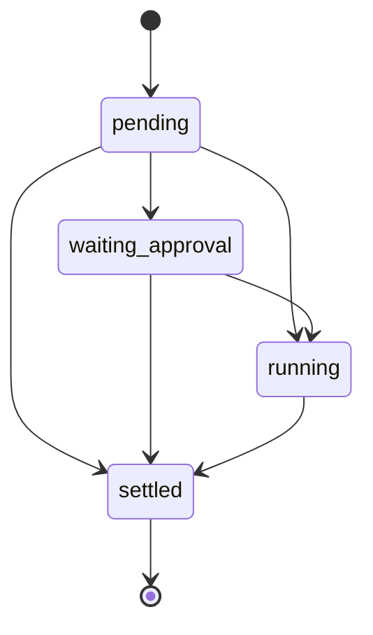

# ToolCall v3 协议

ToolCall v3 将三类语义彻底分开：

1. 工具调用执行到哪个生命周期阶段。
2. 工具执行后得到了什么业务结果。
3. 当前模型 Turn 接下来如何推进。

因此必须始终遵守：

> `returned/negative` 不等于技术故障，也不等于整个 Turn 必须失败。

## 1. 唯一数据源

后端、桌面端、移动端、历史持久化和事件回放共同使用 `@anybox/shared` 中的严格 `ToolCallSnapshotSchema` 与 reducer。任何一端都不得根据错误文本、退出码、metadata、旧事件名或 UI 状态反推 ToolCall 状态。

每个快照包含：

- `schemaVersion: 3`
- 稳定的 `callID`、`turnID` 与 `revision`
- 原始输入和已解析输入
- 调用来源、重试关联和时间戳
- 生命周期 `state`
- 可选进度及纯展示信息

旧 `state.status` 不属于 v3。旧快照不会被转换或映射成新状态。

## 2. 生命周期

生命周期只有四个 phase：



约束：

- phase 只能向前移动。
- `settled` 不能重新进入 `running`。
- 每个调用只能结算一次；重复结算采用 first settlement wins。
- 所有有效变化递增 `revision`；旧 revision 不能覆盖新快照。
- 框架内部重试增加 `retry.attempt`；模型主动重试必须创建新的 `callID`，并用 `previousCallID` 关联。

## 3. Outcome

只有 `settled` 才有 outcome：

| outcome | 含义 |
|---|---|
| `returned` | 工具处理器正常返回了符合协议的结果 |
| `blocked` | 执行前提或安全边界阻止了调用 |
| `denied` | 用户或审批系统拒绝了调用 |
| `cancelled` | 用户、框架、Provider 或关闭流程取消了调用 |
| `timeout` | 调用超过明确的执行期限 |
| `failed` | Anybox 未获得符合工具协议的有效结果 |

`returned` 再拆成两个正交字段：

- `result: success | negative`
- `completeness: complete | partial`

例如，Shell 退出码非零是 `returned/negative/complete`；输出被截断可以是 `returned/success/partial` 或 `returned/negative/partial`。MCP 的 `isError: true` 也是有效的 `returned/negative`，而 MCP 连接中断才是 `failed/transport`。

每个 outcome 还带有执行语义：

- `sideEffect: none | possible | confirmed | unknown`
- `retry: safe | unsafe | unknown`

这两个字段描述已发生的执行事实，不参与生命周期推断。

## 4. 结构化技术故障

`failed` 必须携带完整的 `ToolFailure`：

```ts
interface ToolFailure {
  stage:
    | "validation"
    | "authorization"
    | "dispatch"
    | "execution"
    | "transport"
    | "protocol"
    | "result-processing"
    | "internal"
  source: "model" | "runtime" | "provider" | "tool"
  code: string
  message: string
  handlerExecuted: boolean
  retryable: boolean
  severity: "recoverable" | "turn-fatal"
  details?: Record<string, unknown>
}
```

`failed` 仅表示无法得到有效工具结果，例如进程无法启动、Provider/MCP 传输中断、协议损坏、结果反序列化失败或未预期异常。预期内的业务否定、空结果和非零退出码不得构造成 `failed`。

## 5. 工具输出与执行框架

正常返回的工具输出显式提供：

- `result`
- `completeness`
- `sideEffect`
- `retry`
- 可选 `control`

预期内的非返回结果通过框架的 `ToolControlSignal` 表达；未预期技术异常通过 `ToolFailureError` 表达。插件或工具处理器不能根据文案自行伪造一个普通“失败字符串”。

适配规则：

- Shell/SSH 非零退出：`returned/negative`
- MCP `isError: true`：`returned/negative`
- IPython 用户代码异常：`returned/negative`
- 截断：`completeness: partial`
- 参数或执行前提不满足：`blocked`
- 审批拒绝：`denied`
- 中断：`cancelled`
- 截止时间超过：`timeout`
- 运行时、传输或协议异常：结构化 `failed`

## 6. Turn control

Turn control 与 outcome 独立，并保存在 settled state 中：

| control | 行为 |
|---|---|
| `continue-model` | 将结果交给模型继续推理 |
| `restart-loop` | 以新的模型迭代重新进入循环 |
| `finish-turn` | 正常结束当前 Turn |
| `wait-user` | 停止循环并等待用户输入 |
| `fail-turn` | 以明确错误结束 Turn |
| `cancel-turn` | 取消当前 Turn |

同一模型步骤产生多个工具结果时，由中央 processor 聚合控制请求。优先级从高到低为：

```text
cancel-turn
> fail-turn
> wait-user
> finish-turn
> restart-loop
> continue-model
```

工具身份、metadata 内容或 outcome 名称都不能隐式改变 Turn。需要等待用户或重启循环的工具必须显式返回相应 control。

## 7. 事件协议

运行时只使用以下 ToolCall 事件：

```text
tool.call.created
tool.call.input_delta
tool.call.progress
tool.call.phase_changed
tool.call.settled
```

事件携带 canonical v3 快照，并由共享 reducer 校验 phase、revision 和 settlement。旧的 `tool.call.completed`、`tool.call.failed`、`tool.call.denied` 等终态事件已删除。

运行时事件与安全 Trace export 使用 `schemaVersion: 3`。Trace 中分别导出 phase、outcome、result、completeness、turnControl、执行语义和完整结构化 failure。

## 8. 持久化与来源 metadata

- Provider 的传输 metadata 只存放在 `source.metadata`，用于模型历史重放。
- UI/工具展示 metadata 存放在 `presentation.metadata` 或 outcome metadata。
- 展示 metadata 不会重新注入 Provider 历史。
- 历史记录必须已经是有效 v3；读取方不提供旧 `status` 到 v3 的兼容映射。

## 9. UI 语义

| 语义 | 标签 | 色调 |
|---|---|---|
| `returned/success/complete` | 已完成 | success |
| `returned/negative` | 未达成 | warning |
| `returned/*/partial` | 部分完成 | warning |
| `blocked` | 已阻止 | neutral |
| `denied` | 已拒绝 | neutral |
| `cancelled` | 已取消 | neutral |
| `timeout` | 已超时 | warning |
| `failed` | 执行故障 | danger |

技术故障的展开详情应显示 stage、source、code、handler 是否执行、retryable 和 severity；不能只显示红色“失败”。

## 10. 验证基线

至少覆盖以下测试矩阵：

- 所有合法 phase 转换与非法回退。
- first settlement wins、重复事件幂等与 revision 顺序。
- 六种 Turn control 及其聚合优先级。
- Shell/MCP/IPython/Web Fetch 的 success、negative、partial、timeout、cancelled 和 failed 分界。
- 审批等待、批准、拒绝与恢复。
- 后端持久化、桌面流合并、移动端合并和历史回放使用同一 canonical 快照。
- 旧 `status` 快照与旧事件名被严格拒绝。

