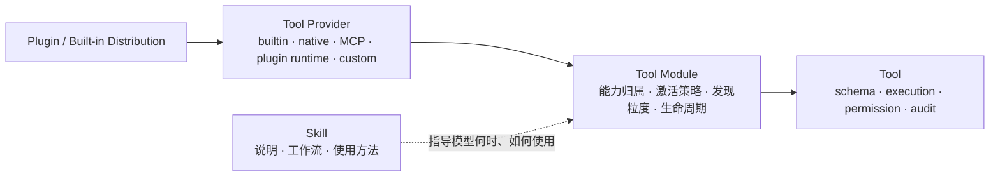
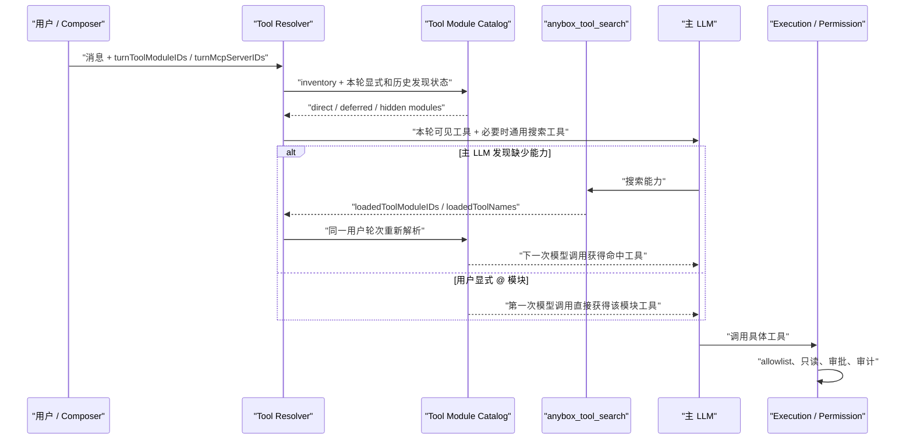

# ADR：通用 Tool Module Catalog 与按需能力披露

| 项目 | 内容 |
| --- | --- |
| 状态 | Accepted；核心运行时、Resolver、来源追踪与首批回归测试已实现 |
| 决策日期 | 2026-08-02 |
| 适用范围 | Anybox Agent 的 builtin、native、MCP、plugin runtime 与 project custom tools |
| 前置决策 | [原生 Tool Module 的渐进式披露与当前轮激活](./native-tool-module-architecture-decision.md) |

## 1. 决策摘要

Anybox 将 Tool Module 从 Planner 专用的懒加载机制提升为所有工具统一的能力归属、发现和生命周期目录。

核心结论：

- 每一个进入 Agent runtime 的工具都必须属于一个 Tool Module。
- “属于模块”不等于“默认注册给 LLM”。模块通过独立 activation policy 决定常驻、配置启用、搜索加载或仅显式加载。
- Tool Module 不接管工具执行权限。模块激活只让工具进入当前候选集；具体调用仍经过现有 Agent allowlist、全局工具开关、只读策略、审批和审计链路。
- Tool Module 不取代 Tool Provider。Provider 负责工具从哪里来、如何连接或加载；Module 负责这些工具在产品语义上属于哪项能力。
- 不增加主 LLM 调用前的意图解析器。渐进式披露仍由主 LLM 调用通用工具搜索完成，用户也可以通过 `@模块`、快捷指令或命令面板主动加载。
- Planner 的 `planner.core` 继续按需加载并且只在当前用户轮次有效；既有 MCP deferred-tool 行为保持兼容。

## 2. 概念边界



| 概念 | 负责 | 不负责 |
| --- | --- | --- |
| Tool Module | 能力分组、目录、激活方式、作用域、发现粒度、失败策略 | 协议连接、密钥、具体执行授权 |
| Tool Provider | builtin/native 加载，MCP 连接，plugin runtime 或 custom 注册 | 产品能力分组和用户意图判断 |
| Tool | 参数 schema、执行函数、权限属性、结果与审计 | 安装和分发 |
| Plugin | 安装、版本、依赖、连接器、Skill/MCP 分发 | 自动等同于某个 Module 或自动授权工具 |
| Skill | 告诉模型如何完成某类工作 | 注册 executable tool 或绕过权限 |

Plugin 和 Module 是多对多关系。一个插件可以提供多个能力模块；一个能力模块也可以由不同 Provider 实现。标准 MCP 插件默认以 MCP server 为 Provider 边界，但它仍会被映射到稳定的 Tool Module。

## 3. 通用模块契约

运行时 descriptor 的核心结构为：

```ts
type ToolModuleDescriptor = {
  id: string
  title: string
  description: string
  keywords: string[]
  toolIDs: string[]
  provider: {
    kind: 'builtin' | 'native' | 'mcp' | 'plugin' | 'custom'
    id: string
    name?: string
  }
  activation: {
    mode: 'always' | 'configured' | 'search-or-explicit' | 'explicit-only'
    scope: 'global' | 'project' | 'session' | 'turn'
    discovery: 'none' | 'module' | 'tool'
  }
  failureMode: 'throw' | 'omit'
  load?: () => Promise<ToolInfo[]>
}
```

模块 ID 使用稳定、provider-safe 的小写标识，例如：

```text
runtime.progressive-disclosure
workspace.file-io
planner.core
mcp.gmail
custom.project
```

MCP server ID 本身不满足格式约束时，runtime 会生成可读 slug 并追加确定性 hash，避免碰撞和非法字符进入协议字段。

## 4. 激活与披露模型

| 模式 | 典型对象 | 默认是否进入 LLM 工具列表 | 激活方式 | 当前实现 |
| --- | --- | --- | --- | --- |
| `always` | 核心 builtin 能力组、project custom tools | 是，但仍受工具权限和全局选择过滤 | runtime 自动 | 已实现 |
| `configured` | 已选择的 MCP server | 配置启用时直接进入；未启用时按 tool 粒度 deferred | 项目配置、当前轮 MCP 选择、工具搜索 | 已实现 |
| `search-or-explicit` | `planner.core` 等可选原生能力 | 否 | `anybox_tool_search` 或 `@模块` | 已实现 |
| `explicit-only` | 高风险或不应语义发现的能力 | 否 | 结构化快捷指令或命令面板 | 契约已支持；首个业务模块待接入 |

`scope` 描述激活状态的最长生命周期。当前 Planner 使用 `turn`，其搜索结果和显式标签在下一条普通 user message 到来时自动失效。

`discovery` 决定本地搜索索引的粒度：

- `none`：不进入工具搜索。
- `module`：只索引轻量模块 descriptor；未激活时不执行 `load()`，也不创建工具 execution。
- `tool`：索引 Provider 已提供的单个工具定义，兼容现有 MCP deferred-tool 流程。

## 5. 运行时流程



搜索工具的静态 description 只说明它能搜索可选能力，不拼接模块列表、工具列表或参数 schema。候选目录保留在 runtime 本地索引中。

## 6. 首批模块映射

Builtin 工具按稳定的能力边界分组：

| Module ID | 能力示例 |
| --- | --- |
| `workspace.shell` | 各平台 shell、持久终端、后台 shell 会话交互 |
| `workflow.tasks` | Agent 会话任务创建、查询和进度更新 |
| `workspace.file-io` | 文件读取、文本替换、patch、图片查看 |
| `workspace.file-search` | 目录枚举、glob、grep |
| `runtime.programmatic-orchestration` | JavaScript 编排与安全并行工具调用 |
| `agent.multiagent` | 子 Agent 创建、读取、等待和取消 |
| `runtime.progressive-disclosure` | Tool Search、Skill 加载、MCP Resource 访问和内置工作区运行环境发现 |
| `agent.metacognition` | 回滚检查点枚举与回滚，用于 Agent 反思和自我修正 |
| `network.web` | 公开网页和网络资源获取 |
| `media.visual-generation` | 使用图像模型生成视觉媒体 |
| `workspace.lsp` | LSP 定义、引用、hover、工作区符号 |
| `interaction.human` | 向用户提出结构化问题并等待回复 |
| `runtime.other` | 暂时找不到合适分类的内建工具 |

`planner.core` 继续作为按需加载的 Planner 原生模块。`runtime.other` 当前没有工具，仍作为新内建工具
没有明确归属时的默认兜底模块，待边界稳定后再迁移。

其他来源：

- 每个 MCP server 映射为一个 `mcp.<server-id>` 模块，当前仍以 tool 粒度渐进披露。
- 每个项目的无来源 custom tools 归入 `custom.project`。
- Planner 原生工具归入 `planner.core`；运行时只有激活后才暴露和初始化，工具模块页可单独只读导入定义以展示 metadata/schema。
- 未来 plugin-native runtime 可以声明 `plugin-module` source；通过 MCP 提供工具的插件仍以 MCP Provider 进入 Catalog，插件分发所有权保持在 Plugin 系统。

## 7. Source、Provider 与可观测性

每个经 Tool Registry 输出的工具都会附加统一来源：

```ts
type ToolSource = {
  kind: 'mcp' | 'native-module' | 'builtin-module' | 'plugin-module' | 'custom-module'
  id: string
  moduleID?: string
  name: string
  description?: string
  provider?: {
    kind: 'builtin' | 'native' | 'mcp' | 'plugin' | 'custom'
    id: string
    name?: string
  }
}
```

`moduleID` 与 `provider` 在迁移期保持可选，以兼容历史持久化消息和外部 registrar；所有通过当前 Tool Registry 进入 Resolver 的工具都会被补齐。

该 provenance 会随 tool running/result/error metadata 写入消息流。桌面端 trace 能展示 capability module，并保留 Provider 信息用于诊断。

## 8. 安全和失败策略

1. 激活不是授权。任何模块都不能绕过现有 permission pipeline。
2. 客户端只提交 module ID，不能提交 loader 路径、代码、schema 或任意 Provider 配置。
3. lazy module 的实际工具集合必须与 descriptor 的 `toolIDs` 完全一致；缺失、重复或额外工具均视为加载失败。
4. builtin 和 project custom tools 使用 `failureMode: throw`，避免核心能力静默缺失。
5. native、MCP 和 plugin 可选能力默认使用 `failureMode: omit`，失败时记录结构化日志并保持隐藏。
6. 同一模型工具名、别名或 provider-normalized 名称不能由多个模块重复声明。
7. 同一个 module ID 不能同时由 catalog inventory 和 lazy registrar 提供。

## 9. 兼容策略

- 保留 `NativeToolModuleDescriptor` 类型别名和 `ToolModule.load/getTool()`，供已有 Planner 与外部 registrar 逐步迁移。
- 保留 `turnMcpServerIDs` 和 MCP tool-level discovery；它们会在 Catalog 内转换为模块 active/deferred 状态。
- 工具搜索关闭时，历史 MCP deferred tools 仍按既有行为回退为直接可见；严格懒加载的 native modules 继续 fail closed。
- 历史 `ToolSource` 没有 `moduleID/provider` 时，由 Registry 根据 source kind 补齐。

## 10. 当前实现位置

| 层 | 文件 |
| --- | --- |
| shared contract | `packages/shared/src/tool-module.ts` |
| universal catalog | `packages/anyboxagent/src/tool/module.ts` |
| inventory/source adapter | `packages/anyboxagent/src/tool/registry.ts` |
| global and on-demand settings catalog | `packages/anyboxagent/src/server/usecases/settings.ts` |
| turn resolver/disclosure | `packages/anyboxagent/src/session/core/resolve-tools.ts` |
| execution provenance | `packages/anyboxagent/src/tool/execution.ts`、`packages/anyboxagent/src/session/core/processor.ts` |
| desktop trace | `packages/desktop/src/renderer/src/app/stream.ts`、`ThreadView.tsx` |
| desktop tool module settings | `packages/desktop/src/renderer/src/app/tools/BuiltinToolsPage.tsx` |
| regression tests | `packages/anyboxagent/Test/tool.module.test.ts`、`tool.search.test.ts`、`planner.tools.test.ts` |

工具模块页分为“常驻工具模块”和“按需工具模块”。常驻模块继续按服务端 Catalog 分组，Module 开关是所属工具可用性的批量编辑器，最终保存为逐工具的全局 selection。按需区域通过只读检查入口导入平台 native 模块定义并展示工具 metadata/schema，但条目仍保持 inactive/hidden，不写入 selection、不改变 `activation`，也不会把工具注册给当前或后续 LLM turn；`planner.core` 只有被 Tool Search、显式模块请求或 Planner 委派激活后才进入当前轮次工具集。按需检查失败与常驻目录隔离，不能阻断全局工具配置。

## 11. 后续演进边界

核心运行时已经通用化，但以下工作作为独立产品迭代处理：

- 将 Composer 当前的 Planner 快捷入口改为读取服务端允许展示的 module catalog，而不是继续增加前端硬编码模块。
- 为项目级 Module 配置增加显式持久化模型，并把 `configuredModuleIDs` 接入 settings API。
- 为非 builtin Provider 增加 module 级配置和 Provider 健康度诊断；当前页面只对平台 native 模块提供只读目录与加载失败提示。
- 根据实际使用数据决定是否把大型 MCP server 从 tool-level discovery 升级为真正的 server/module lazy connection。
- 在存在第二种 plugin-native runtime 后，补齐 Plugin manifest 到 Tool Module descriptor 的声明与签名校验；不提前让 manifest 自报工具 schema 成为执行真相。

这些后续项不得引入隐藏意图解析器，也不得把模块激活与执行授权合并。
