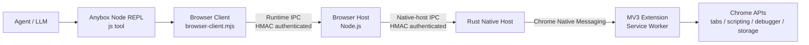

# Anybox Chrome 插件

本文是 Chrome 插件工程唯一需要长期维护的实现文档。当前代码基线为 `0.15.1`；版本与安装元数据以
[`runtime/.anybox-plugin/plugin.json`](./runtime/.anybox-plugin/plugin.json)
为准。

`runtime/skills/chrome/SKILL.md` 是交付给 Agent 的运行时操作指令，不是另一份架构文档。生成目录
`plugins/Anybox-Plugins/chrome` 是安装制品，也不是人工维护的事实源。

## 核心架构

Chrome 插件不是 Chrome 专用 MCP Server，也不是扩展直接调用 Anybox HTTP API。模型通过 Anybox
平台提供的通用、session 级持久 Node REPL 加载插件 Browser Client；Browser Client 再通过两段相互隔离、分别
认证的本地 IPC，将命令传递到 Chrome MV3 扩展。



职责边界：

| 组件 | 实现 | 主要职责 |
|---|---|---|
| Browser Contract | [`shared`](./shared) | 定义唯一的 Contract v4、命令 Schema、能力和 IPC 消息 |
| Browser Client | [`browser-runtime`](./browser-runtime) | 安装 `agent.browsers`，提供面向 Agent 的对象 API，启动或复用 Browser Host |
| Browser Host | [`browser-host`](./browser-host) | 权威执行 Schema、能力、租约、Origin 策略和授权凭据校验 |
| Native Host | [`browser-native-host`](./browser-native-host) | 在 Chrome Native Messaging stdio 与本地 IPC 之间转发和分片 |
| Chrome 扩展 | [`browser-extension`](./browser-extension) | 通过 Chrome API 执行 Tab、页面读取和交互命令 |
| 插件运行时资源 | [`runtime`](./runtime) | 保存源 Manifest、Agent Skill、安装/修复脚本和展示资源 |
| 打包工具 | [`tools`](./tools) | 构建各组件，并按严格白名单生成最终插件目录 |

Browser Host 是本插件的信任边界和控制面。Browser Client 的校验只负责尽早返回友好错误；任何命令
到达 Chrome 前，Browser Host 都会重新执行权威校验。扩展是实际执行 Chrome API 的数据面。

## 源码与安装制品

人工修改的源码工程：

```text
packages/chrome-plugin/
  browser-extension/
  browser-host/
  browser-native-host/
  browser-runtime/
  runtime/
  shared/
  tools/
  README.md
```

构建生成并提交的安装目录：

```text
plugins/Anybox-Plugins/chrome/
  .anybox-plugin/
  assets/
  browser-extension/
  extension-host/
  scripts/
  skills/
  LICENSE
```

Anybox Registry 指向生成目录中的规范 Manifest，并通过 GitHub Tree 下载整个插件目录。不要直接修改
生成目录中的 `browser-client.mjs`、`browser-host.mjs`、扩展文件、Native Host 或 Skill；修改源码后
统一重新打包。

插件 Manifest 只声明 Anybox 内置 `node-repl` MCP 依赖，所需工具为 `js`、`js_reset` 和
`js_add_node_module_dir`。Chrome 业务逻辑全部留在本插件中，没有逐动作 `browser_*` MCP 工具。

## 启动与连接

1. Anybox 加载插件的 Chrome Skill。
2. Agent 从当前插件包动态导入 `scripts/browser-client.mjs`。
3. `setupBrowserRuntime({ globals: globalThis })` 在当前 Anybox session 安装持久的 `agent.browsers`，
   并注册 Session/Turn 结束时的清理钩子；新 session 或 `js_reset` 后必须重新初始化。
4. Browser Client 读取 Browser Host runtime bootstrap；没有可复用 Host 时，以 detached Node
   进程启动插件内的 `browser-host.mjs`。
5. `ensureReady({ launch: true })` 先等待可能正在进行的扩展重连，再执行 Native Host 幂等安装和
   认证探测；仍没有浏览器连接时才查找并启动 Chrome，随后有限等待扩展握手。
6. 扩展通过 `chrome.runtime.connectNative("com.anybox.browser")` 启动 Rust Native Host。
7. Rust Native Host 读取短期 bootstrap proof，连接 Browser Host 的 native-host IPC 端点。
8. 扩展发送 `hello`，Host 只接受精确的 Contract v4，并只开放“规范命令与扩展实际声明命令”的
   安全交集。版本不一致时连接保持可诊断，但不会接收命令或降级。

`agent.browsers.readiness()` 会读取连接状态，但不会启动 Chrome，也不会主动执行 Native Host 探测。
`ensureReady({ launch: true })` 默认等待扩展重连约 750 ms、启动 Chrome 后最多等待约 10 秒，并返回
结构化状态：

- `ready`
- `needs-browser`
- `needs-extension`
- `needs-extension-update`
- `needs-native-host-repair`
- `browser-not-installed`
- `backend-unavailable`

Browser Host 在没有连接后保留一段空闲时间再退出。扩展具有自动重连、握手超时、心跳和断连清理：
重连延迟在约 1～60 秒之间指数退避，心跳默认每 30 秒发送，断连超过 2 分钟后清理遗留租约。

扩展 Popup 只读展示当前桥接和浏览器控制状态，打开 Popup 本身不会触发重连。未连接时可显式请求
重连；“停止控制”会中止在途命令、释放全部租约、断开 Debugger 并移出受管 Tab Group，但保留所有
已打开页面。停止状态持久化在扩展本地存储中，后续命令会以 `CANCELLED` 拒绝，直到用户在 Popup
中恢复控制。协议版本、重连次数和最近清理结果收纳在折叠的诊断区。

Windows 使用 Named Pipe，macOS/Linux 使用 Unix Domain Socket。Unix socket 与短期 bootstrap
位于 `/tmp/anybox-browser-<installation-hash>` 的私有目录中，避免 macOS 约 103 字节的 socket
路径上限；hash 同时绑定用户目录和持久状态目录，以隔离同一用户下的不同 Anybox 安装。Runtime
Client 与 Native Host 使用不同端点、不同角色和不同 bootstrap proof；生产链路没有 HTTP 或
WebSocket 回退。

## Browser Client API

典型调用：

```js
const readiness = await agent.browsers.ensureReady({ launch: true })
if (readiness.state !== "ready") return readiness

globalThis.chrome = await agent.browsers.getDefault()
await chrome.nameSession("Research example documentation")
globalThis.tab = await chrome.tabs.open("https://example.com/")
await tab.goto("https://example.com/docs")
const result = await tab.snapshot()
await chrome.tabs.finalize({
  keep: [{ tab, status: "deliverable" }],
})
return result
```

当前对象模型：

| 对象 | API |
|---|---|
| `agent.browsers` | `readiness()`、`ensureReady()`、`list()`、`get()`、`getDefault()`、`getForUrl()` |
| Browser Context | `status()`、`documentation()`、`nameSession()`、`tabs.list()`、`listUser()`、`open()`、`claim()`、`activate()`、`get()`、`current()`、`finalize({ keep })` |
| Browser Tab | `info()`、`activate()`、`goto()`、`back()`、`forward()`、`reload()`、`close()`、`markDeliverable()`、`markHandoff()`、页面 API，以及原子能力 `playwright` |
| `tab.playwright` | `domSnapshot()`、`elementInfo()`、`locator()`、`frameLocator()`、`getByRole/Text/Label/Placeholder/TestId()`、页面等待和一次性事件 |
| Playwright Locator | 不可变组合、批量读取、严格单元素读取、actionability 动作和 `waitFor()` |

`documentation()` 由扩展实际声明的能力动态生成。只有 v4 后端完整声明全部必需命令时，
`tab.playwright` 才会作为一个原子能力出现；不暴露部分 API，也不提供旧
`tab.locator(descriptor)` 适配层。公共 API 仍没有任意页面 JavaScript、任意 CDP、元素截图或
`downloadMedia()`。

## Browser Contract 与扩展执行

当前且唯一支持的协议是 Browser Contract v4。Runtime、Host 和扩展都要求请求显式携带
`contractVersion: 4`；缺失、v1/v2/v3 或未来版本都会返回稳定的不兼容错误，不进行协商降级。
v4 提供以下执行面：

- 任务生命周期：`browser.nameSession`、`tabs.markDeliverable`、`tabs.markHandoff` 和
  `tabs.finalize({ keep })`
- Tab 导航：`goto`、`back`、`forward`、`reload` 和 `close`
- 定位依据：`playwright.domSnapshot`、`playwright.elementInfo`
- Locator 读取：`count`、`allTextContents`、`textContent`、`innerText`、`inputValue`、
  `getAttribute`、`isVisible`、`isEnabled`、`waitFor`
- Locator 动作：`click`、`dblclick`、`fill`、`type`、`press`、`selectOption`、`setChecked`
- 页面等待：导航、URL、生命周期、download 和 filechooser 一次性事件
- 事件后续：Host 管理目录中的 download path、逐次授权的本地文件选择

扩展仍会在 `hello` 中声明命令清单，Host 只采用 v4 规范命令与该清单的交集。Playwright 命令必须
完整出现才会开放 `tab.playwright`；不完整能力会被整体隐藏。旧扩展会得到
`needs-extension-update`，需要与桌面端一起更新。

### Locator AST 与固定内核

Browser Client 只构造不可变 `LocatorPlanV3` AST。Host 再次校验后，只有扩展能够把 AST 编译为
Playwright 内部 selector；客户端不能提交 `internal:` engine、脚本或 CDP 命令。边界为：

- AST 最多 64 个节点、16 层 Frame、32 KiB 序列化大小
- 单个 selector、matcher 或正则 source 最长 2,000 字符
- timeout 最长 60 秒；正则以 `source`/`flags` 明确编码，并拒绝非法 flag、反向引用及高风险
  的嵌套/歧义无界重复
- `domSnapshot()` 默认最多 5,000 节点和 1 MiB，并在输出内明确标记截断

扩展提交固定的 Playwright `1.61.1` injected selector/actionability 内核，不包含完整
`playwright-core`、浏览器驱动或 Node server。来源 tag、commit、入口 SHA-256、生成 bundle
SHA-256、Apache-2.0 License/NOTICE 和离线构建使用的成品均在
[`browser-extension/public`](./browser-extension/public)；更新脚本是
[`sync-playwright-locator-engine.mjs`](./browser-extension/scripts/sync-playwright-locator-engine.mjs)。
普通扩展构建只消费已提交成品，不联网。

扩展的执行方式：

| 操作 | 底层实现 | 说明 |
|---|---|---|
| Tab 查询、创建、激活、导航、刷新、关闭 | `chrome.tabs` | 输出 URL 会移除 path、query 和 hash，只保留 Origin |
| 任务分组、命名、随机色和解组 | `chrome.tabs` + `chrome.tabGroups` | 只管理 Agent 创建的任务组，不改动用户原有分组 |
| 普通快照 | 固定的 `chrome.scripting.executeScript` | 提取受限的正文、链接、按钮和输入框信息 |
| 交互快照 | 固定注入函数 | 为当前交互元素生成临时 `data-anybox-element-id` |
| DOM 树 | 受限 CDP `DOM.getDocument` | 限制深度和节点数，并执行文本脱敏 |
| 无障碍树 | 受限 CDP Accessibility/DOM | 合并敏感节点信息后输出 |
| 截图 | 受限 CDP `Page.captureScreenshot` | 返回 PNG base64；不做像素级脱敏 |
| 坐标和元素点击 | 受限 CDP Input | 元素 ID 在 DOM 变化后可能失效 |
| Fill | 固定注入函数 | 使用原生 value setter 和 input/change 事件 |
| Tab `type()` | 受限 CDP `Input.insertText` | 基础 API，只插入文本 |
| Frame 路由 | `Target.setAutoAttach(flatten:true)` + Page/Runtime/DOM/Accessibility | 主文档、同源 Frame 和跨域 OOPIF 分别绑定 session/execution context |
| Playwright Locator | 固定 Playwright injected 内核 | role/name、label、placeholder、text、test ID、CSS、Shadow DOM 和组合 AST |
| click/dblclick/type/press | CDP Input | 唯一性与 actionability 完成后才派发输入 |
| fill/select/check | 审计后的固定 DOM 操作 | 验证最终状态；不接受调用方脚本 |
| 等待 | `MutationObserver`、生命周期事件、rAF 稳定性采样 | 等待期间不再每 100 ms 创建全树元素数组 |

`frameLocator()` 每一级都严格解析 iframe，再进入对应 session/context。Frame 导航、分离或执行
上下文重建会清除注入缓存和等待状态；主 Frame、子 Frame 和同文档导航都会递增
`documentGeneration`。`domSnapshot()` 会组合当前可用 Frame 的语义内容；`elementInfo()` 返回
角色、可访问名称、可见文本、测试 ID、边界框及排序后的公共 selector/Frame selector 候选。

单元素读取和动作必须恰好匹配一个元素。`first()`、`last()`、`nth()` 是调用方明确消歧，
`force` 也不能绕过唯一性、目标类型或敏感字段授权。动作按 Playwright 语义检查 visible、stable、
receives-events、enabled，以及输入场景的 editable；读取和 attached/hidden 等待不会滚动、聚焦
或修改页面。

动作分为“解析/等待”和“输入派发”两阶段。第一个输入事件派发后，导航、timeout 或传输中断均
不会触发动作重放；无法确认最终状态时返回非重试的 `ACTION_OUTCOME_UNKNOWN`。导航型动作通过
`expectNavigation()` 先在扩展注册 waiter 再执行回调，避免 click 后才监听的竞态。download 和
filechooser 句柄绑定 session、Tab 和 document generation，单次消费且会过期；文件路径由 Host
规范化、确认是本地普通文件，并以路径及文件身份的 SHA-256 指纹绑定一次性授权回执，避免批准后
替换上传集合；download 写入 Host 管理且按 24 小时清理的临时目录。

## 命令校验与授权

Browser Contract v4 请求必须携带由 Node REPL 当前调用上下文提供的：

```text
sessionID
turnID
messageID
toolCallID
browserID
```

Browser Host 按以下顺序处理命令：

```text
Contract 版本
→ 参数 Schema
→ 后端能力
→ 调用上下文
→ Tab 描述与租约
→ Origin 策略
→ 授权凭据
→ 扩展执行
→ 返回值 Schema
```

Origin 策略支持 `ANYBOX_BROWSER_ORIGIN_ALLOW` 和 `ANYBOX_BROWSER_ORIGIN_DENY`。显式 deny 会直接拒绝；
敏感字段填写属于高风险；打开、接管、点击、填写和 Locator 写操作通常产生 Origin 范围的权限请求。

即使策略结果是 `allow`，v4 命令仍必须携带有效的授权 receipt。
`playwright.fileChooser.setFiles` 归入独立 `local-file-read` 类别，始终要求单次高风险授权；
日志和权限摘要都不包含文件路径或输入值。完整流程：

1. Anybox Agent 持有 Ed25519 私钥，只把公钥注入 Node REPL。
2. Browser Client 校验公钥格式，并把它放入当前 Runtime IPC `hello`；公钥同时进入 HMAC 握手
   transcript，因此不能在握手后被替换。
3. Browser Host 将公钥绑定到该 Runtime 连接。`chrome.status().authorizationVerificationAvailable`
   表示当前连接具备 receipt 验证条件。
4. 首次命令没有 receipt 时，Host 返回一次性 challenge。
5. Browser Client 调用 Node REPL permission API；权限系统根据用户授权和策略决定是否由 Agent
   私钥签名。
6. Browser Client 使用 receipt 重试同一命令。
7. Host 校验签名、challenge、命令、Session、Turn、Tool Call、Browser、扩展实例、Origin、Tab、
   敏感标记、有效期和 nonce，并拒绝重放。

授权公钥按 Runtime IPC 连接隔离，不再由 Browser Host 进程读取一个全局公钥。模型只能接触公钥，
无法在 Node REPL 中伪造 Agent 私钥签名。

## Tab 租约与生命周期

扩展使用 `chrome.storage.session` 保存 v4 Tab 租约，使用 `chrome.storage.local` 保存受管 Group
及 Session 名称。租约默认 TTL 为 30 分钟，包含 Tab 来源、Session、Turn、活动/交接状态、
当前 Turn 标记和扩展实例 ID：

- `browser.nameSession()` 在首次打开或接管 Tab 前保存任务名；未命名时使用 `Anybox`。
- `tabs.open()` 创建 Agent 所有的 Tab。
- `tabs.list()` 只列出当前 Session 已拥有的 Tab。
- `tabs.listUser()` 列出可以认领的用户 Tab。
- `tabs.claim()` 为现有用户 Tab 建立租约。
- `tab.goto()`、`back()`、`forward()` 和 `reload()` 只作用于当前 Session 已租用的 Tab。
- `tab.close()` 关闭 Tab，并释放租约、调试器和 Locator 执行状态；关闭后无需再调用 `release()`。
- 通过已有租约 Tab 打开的新 Tab 始终成为 Agent Tab；即使 opener 是接管的用户 Tab，也不会把
  子 Tab 误判为用户页面。
- 跨 Session 操作会被 Browser Host 和扩展双重拒绝。

每个 Session 使用一个“任务名 + Chrome 九种合法颜色之一”的展开 Group。首个 Agent Tab 在当前普通
窗口创建 Group，后续 Agent Tab 固定在该 Group 的窗口创建并加入同组。接管的用户 Tab 保持原窗口
和原 Group。用户手动移动或解组页面后，扩展不会强制移回。Service Worker 启动时验证持久化 Group
ID；Chrome 重启后失效的 ID 会被丢弃。

扩展 Manifest 为此声明 `tabGroups` 权限。从旧版本升级到 `0.14.0` 时，Chrome 可能暂停扩展并要求
用户重新确认“管理标签页组”权限；空 Group 由 Chrome 自动移除。

Turn 收尾以 `tabs.finalize({ keep })` 为唯一最终分类：

| 分类 | 页面 | Group | Lease |
|---|---|---|---|
| `deliverable` | 保留 | 从 Anybox Group 移出 | 删除 |
| `handoff` | 保留 | 留在 Anybox Group | 保留到下一 Turn |
| keep 中未出现的 Agent Tab | 关闭 | 随页面清理 | 删除 |
| 接管的用户 Tab | 保留 | 不改变 | 删除 |

keep 清单只接受当前 BrowserContext、当前 Session 和当前 Turn 的 `BrowserTab`，拒绝重复、未知和
跨域所有权条目。扩展在执行任何关闭前原子验证整份清单。`markDeliverable()` 与 `markHandoff()`
只保存当前 Turn 可覆盖的标记；最终 keep 清单始终具有决定权。下一 Turn 恢复 handoff 时会清除旧
标记，必须重新分类。

清理顺序是：校验清单、停止页面提示层、释放 Playwright 状态、断开 Debugger、移出 deliverable、
关闭临时页、提交 Lease、清理空 Group。解组失败不会把 deliverable 误关。显式 `finalize()` 应是
当前 Turn 最后一个 Chrome 动作；漏调时 Browser Client 生命周期钩子以空 keep 自动收尾。Session
结束、断连或超时会保留 handoff 页面但将其解组并释放，避免永久残留任务组。v3 遗留 Lease 升级时
只清除元数据，不关闭升级前已存在的页面。

## Native Host 安装与分发

源 Manifest 的 `platformArtifacts` 声明 `com.anybox.browser` Native Messaging Host。支持的交付目标
只有 Windows x64、macOS x64 和 macOS arm64；Windows ARM 与 Linux 当前不在 Manifest 中声明。
Anybox 插件安装器负责：

1. 按当前平台和架构选择二进制。
2. 复制到 Anybox 管理的数据目录。
3. 原子更新该组件的 `current` 绑定。
4. 写入 runtime config 和 Chrome Native Host manifest。
5. Windows 下写入当前用户 HKCU 注册表。
6. 写入 ownership receipt，供升级、修复和卸载判断归属。

Chrome Native Host manifest 指向 Anybox 管理的 `current` 二进制，不直接指向下载插件目录。
`runtime/scripts/installManifest.mjs` 是 Browser Client 可调用的幂等检查/修复后备方案。

Native Host manifest 只允许固定扩展 ID `mgpdddgemohfmonbnpehohhlbndakdpg`。扩展 ID 由提交在
Manifest 中的固定 key 派生；改变该 key 会破坏既有安装。

本地普通打包默认只重建当前平台的 Native Host，并保留生成目录中同版本的其他已声明目标。
`--all-native-hosts` 表示 Manifest 实际声明的全部目标，不再代表固定平台集合。严格校验会逐项对照
声明目标、规范路径和包内文件；声明文件缺失、目标或路径重复、路径不匹配，以及出现未声明 Host
都会失败。`--check` 还会强制验证已提交目录包含全部声明目标，即使本次只构建当前平台。

最终包只由自有机器生成：Windows x64 Host 在自有 Windows x64 机器构建，两个 macOS Host 在
Apple Silicon Mac 交叉构建并按显式选择的模式签名。当前公开包采用 ad-hoc 签名，不经过 Apple
公证，也不具备 Developer ID 的 Gatekeeper 信任。GitHub 保存源码、Windows x64 交接文件
`browser-native-host/dist/windows/x64/extension-host.exe`，以及人工提交的
`plugins/Anybox-Plugins/chrome`。Registry URL 继续通过生成目录推导 GitHub Tree 安装；GitHub
Actions 不构建正式发布包，也不提交仓库。

已经在 `browser-native-host/dist` 准备好全部声明制品时，可单独汇总验证：

```bash
node packages/chrome-plugin/tools/package-chrome-plugin.mjs --skip-build --all-native-hosts
```

Rust Native Host 同时处理两种 framing：

- Chrome Native Messaging：4 字节小端长度前缀，Host 输出受 Chrome 1 MiB 上限约束。
- Anybox 本地 IPC：4 字节大端长度前缀，单帧最大约 4 MiB，逻辑消息最大约 64 MiB。

超过安全阈值的消息会按 512 KiB 分片，Browser Host 和扩展都会校验 transfer ID、序号、总大小和
完整性。

## 安全与隐私边界

- Runtime 和 Native Host 使用角色隔离的 IPC 端点及独立 HMAC proof。
- Unix 状态目录和 socket 使用用户级权限；Windows Named Pipe 依赖当前进程 token 的默认 DACL，
  不授予 all-users。
- Browser Host 严格校验 Contract、参数、返回值、能力、租约、Origin 和授权 receipt。
- 扩展只接受固定 Native Host，Native Host manifest 只接受固定扩展 ID。
- 公共 API 禁止 raw page JavaScript、任意 CDP、Cookie、Local Storage、Session Storage、Profile
  和 Credential Store 读取。
- Locator AST 有节点数、Frame 深度、字符串、正则、序列化大小和 timeout 上限；内部 selector
  engine 只能由扩展编译。
- URL、DOM、输入框和无障碍文本使用启发式脱敏；这属于 best-effort，不是完整数据防泄漏保证。
- Screenshot 是原始页面像素，可能包含敏感内容。
- Host/Extension 诊断只允许记录脱敏的 method、耗时、匹配数、错误码、Frame attach 和 engine
  init 指标；不记录 selector 原文、输入值、页面文本或文件路径。Host 日志执行大小轮转。

当前 `peerProcessIdentityVerified` 为 `false`：IPC 具备 OS ACL 和 proof 认证，但还没有额外校验对端
PID/SID/uid，因此不应把它描述为签名级进程来源证明。该字段只报告限制，不会替代
`authorizationVerificationAvailable`，也不会自行阻止浏览器命令。

## 已知限制

- `tab.playwright` 是受限 Locator/Page 等待面，不是完整 Playwright Page；没有任意
  JavaScript/CDP 逃生接口。
- 不提供元素截图或 `downloadMedia()`；download 只保存浏览器已经产生的下载。
- Tab 基础 API 的 `type()` 只插入文本；Playwright Locator 的 `type()` 和 `press()` 提供固定键盘事件。
- Screenshot 不做像素级隐私脱敏。
- Contract 当前不声明主动 command cancellation；断连时扩展会通过 `AbortController` 终止本地
  pending command。
- 当前 macOS Native Host 采用 ad-hoc 签名且未经 Apple 公证；被 Gatekeeper 隔离时，用户可能需要
  在“系统设置 → 隐私与安全”中手动允许。安装器不会自动移除 quarantine 属性。
- Windows Named Pipe 路径有仓库跨进程测试；Unix Domain Socket 共享相同协议实现，但不能用
  Windows 测试结果代替 macOS 实机验证。
- Windows ARM 与 Linux 当前不受支持；安装器在这些平台上会返回明确的平台不支持错误。

## 构建、同步与验证

### 正式本地交付

Windows x64 构建机先运行 Rust 测试并生成原生交接文件：

```powershell
cargo test --locked --manifest-path packages/chrome-plugin/browser-native-host/Cargo.toml
node packages/chrome-plugin/browser-native-host/tools/build.mjs --target win32/x64
```

`packages/chrome-plugin/browser-native-host/dist/windows/x64/extension-host.exe` 是 `dist` 中唯一
允许 Git 跟踪的文件。在 Windows 构建机提交并推送该文件后，Mac 发布机拉取同一提交即可获得交接
产物；正式 Windows 文件不得来自 GitHub Actions。发布门禁会验证其 PE x64 架构和内嵌插件版本，
因此不能复用上一版本的 EXE。

Apple Silicon Mac 需要 Xcode、Rust stable 和两个 Darwin target：

```bash
rustup target add aarch64-apple-darwin x86_64-apple-darwin
```

当前不依赖 Apple Developer Program 的发布方式必须显式选择 `ad-hoc`：

```bash
node packages/chrome-plugin/tools/release-chrome-plugin.mjs \
  --windows-host packages/chrome-plugin/browser-native-host/dist/windows/x64/extension-host.exe \
  --macos-signing ad-hoc
```

该模式用本机 ad-hoc identity `-` 对两个 Mach-O 签名，保留 hardened runtime，并验证签名、架构、
`0755` 权限、版本、三目标包结构与签名后字节一致性。它不请求 secure timestamp、不提交 Apple
notarization，也不运行成功型 Gatekeeper `spctl` 门禁；命令会在 stderr 和结构化结果中明确报告
`notarized: false` 与 `gatekeeperVerified: false`，不能把产物描述成 Apple 已验证软件。

如果未来取得 Developer ID Application 证书，可显式切换回严格模式：

```bash
security find-identity -v -p codesigning
node packages/chrome-plugin/tools/release-chrome-plugin.mjs \
  --windows-host packages/chrome-plugin/browser-native-host/dist/windows/x64/extension-host.exe \
  --macos-signing developer-id \
  --codesign-identity "Developer ID Application: Example, Inc. (TEAMID)" \
  --notary-profile anybox-notary
```

`developer-id` 模式要求 Keychain 中已有证书和 `notarytool` profile；命令拒绝明文 Apple 密码、
证书或 API key 参数，并额外执行 Developer ID、secure timestamp、`notarytool --wait` 与
Gatekeeper `spctl` 门禁。签名后的 Mach-O 始终以 SHA-256 复核，确保其字节原样进入生成目录。
Developer ID 模式的公证流程遵循
[Apple 的软件公证要求](https://developer.apple.com/documentation/security/notarizing-macos-software-before-distribution)。
任一模式成功后都必须人工检查、commit 和 push。

GitHub 的 `Chrome plugin manual verification` 工作流只能通过 `workflow_dispatch` 触发。它对三个
正式目标运行源码测试、原生构建和包验证，上传的文件均明确为 verification-only；macOS 文件未使用
本地选择的签名模式处理，因此不能作为发布输入。

### Chrome Web Store 上传包

Anybox 内部 Chrome 插件与 Chrome Web Store 上传包使用不同品牌图标：

- `browser-extension/public/icons/` 保留 Chrome 导向图标，用于 Anybox 内部插件展示。
- `browser-extension/web-store/icons/` 使用 Anybox 盒子猫应用图标，仅用于商店上传包。

在仓库根目录生成商店 ZIP：

```powershell
corepack pnpm chrome-plugin:package:web-store
```

该命令先构建扩展，再在临时目录中用盒子猫图标覆盖 Manifest 声明的 16、48、128px 图标，拒绝
Source Map、尺寸错误、缺失图标以及商店图标与内部 Chrome 图标相同的情况。它不会修改
`browser-extension/dist`、源码内置图标或 `plugins/Anybox-Plugins/chrome`。最终文件写入
`packages/chrome-plugin/artifacts/anybox-chrome-<version>-web-store.zip`，ZIP 根目录直接包含
`manifest.json`，并输出文件大小与 SHA-256。

只有在已单独完成扩展构建并希望复用 `browser-extension/dist` 时，才使用：

```powershell
corepack pnpm chrome-plugin:package:web-store:skip-build
```

### 日常构建与测试

在仓库根目录执行：

```powershell
corepack pnpm chrome-plugin:package
```

该命令会类型检查并打包 Browser Client 和 Browser Host，构建扩展与当前平台 Rust Native Host，
然后按严格白名单替换 `plugins/Anybox-Plugins/chrome`。最终包拒绝源码、测试、Source Map、依赖、
缓存、符号链接和未声明文件，限制总大小，并验证固定 Locator bundle SHA-256、Playwright
License/NOTICE 与扩展 minified JavaScript 总量不超过 1.5 MiB。普通构建不更新 Locator 内核；
只有显式执行 `pnpm --filter anybox-chrome-extension sync:locator-engine -- --source <playwright-root>`
才会从已检出的精确 tag 重新生成并校验上游 commit/入口哈希。

运行组件测试和打包回归：

```powershell
corepack pnpm chrome-plugin:package:test
```

检查已提交生成目录是否与源码一致：

```powershell
corepack pnpm chrome-plugin:package:check
```

修改插件时应一起提交源码与重新生成的插件目录。只修改本文档时无需重新生成安装包，因为开发文档
不进入最终插件；修改 `runtime/skills/chrome/SKILL.md` 时必须重新打包，以同步生成目录中的 Skill。

涉及运行链路的变更至少需要验证：

1. Manifest 能被当前 Anybox 插件解析器加载。
2. Runtime/Native Host 两种 IPC 角色的握手和拒绝路径。
3. Browser Host Contract、能力、租约、Origin 和授权 receipt 校验。
4. 扩展 hello、心跳、分片、重连和命令执行。
5. Native Host 安装、升级、修复、探测和卸载归属。
6. `chrome-plugin:package:test` 与 `chrome-plugin:package:check`。
7. 真实 Chrome 中固定内核与 Playwright 1.61.1 的匹配数/目标指纹差分，以及 Extension CDP
   执行器的严格定位、Frame、动态 DOM、动作与“不重放”故障注入。
8. 20,000 节点热语义定位 p95、1,000 次连续定位内存稳定性、License 和 1.5 MiB 体积门禁。

## 文档维护规则

- 本文件只描述当前已经落地的实现；历史审计、迁移阶段、路线图和已完成问题不继续保留。
- 重要事实优先级为：运行源码、测试、源 Manifest、本文档。
- 版本、Contract、IPC、授权、Tab 生命周期、安装器或打包策略改变时，在同一变更中更新本文档。
- Agent 的操作约束只维护在 `runtime/skills/chrome/SKILL.md`，不要把其操作提示复制成第二份架构文档。
- 不要在生成目录维护文档，也不要直接编辑生成后的 Skill 或脚本。
