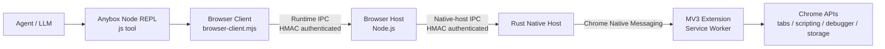

# Anybox Chrome 插件

本文是 Chrome 插件工程唯一需要长期维护的实现文档。当前代码基线为 `0.11.3`；版本与安装元数据以
[`runtime/.anybox-plugin/plugin.json`](./runtime/.anybox-plugin/plugin.json)
为准。

`runtime/skills/chrome/SKILL.md` 是交付给 Agent 的运行时操作指令，不是另一份架构文档。生成目录
`plugins/Anybox-Plugins/chrome` 是安装制品，也不是人工维护的事实源。

## 核心架构

Chrome 插件不是 Chrome 专用 MCP Server，也不是扩展直接调用 Anybox HTTP API。模型通过 Anybox
平台提供的通用持久 Node REPL 加载插件 Browser Client；Browser Client 再通过两段相互隔离、分别
认证的本地 IPC，将命令传递到 Chrome MV3 扩展。



职责边界：

| 组件 | 实现 | 主要职责 |
|---|---|---|
| Browser Contract | [`shared`](./shared) | 定义 Contract v1/v2、命令 Schema、能力和 IPC 消息 |
| Browser Client | [`browser-runtime`](./browser-runtime) | 安装 `agent.browsers`，提供面向 Agent 的对象 API，启动或复用 Browser Host |
| Browser Host | [`browser-host`](./browser-host) | 权威执行 Schema、能力、租约、Origin 策略和授权凭据校验 |
| Native Host | [`browser-native-host`](./browser-native-host) | 在 Chrome Native Messaging stdio 与本地 IPC 之间转发和分片 |
| Chrome 扩展 | [`browser-extension`](./browser-extension) | 通过 Chrome API 执行 Tab、页面读取和交互命令 |
| 插件运行时资源 | [`runtime`](./runtime) | 保存源 Manifest、Agent Skill、安装/修复脚本和展示资源 |
| 打包工具 | [`tools`](./tools) | 构建各组件，并按严格白名单生成最终插件目录 |

Browser Host 是本插件的信任边界和控制面。Browser Client 的校验只负责尽早返回友好错误；任何命令
到达 Chrome 前，Browser Host 都会重新执行权威校验。扩展是实际执行 Chrome API 的数据面。

## 源码与安装制品

人工修改的源码工程：

```text
packages/chrome-plugin/
  browser-extension/
  browser-host/
  browser-native-host/
  browser-runtime/
  runtime/
  shared/
  tools/
  README.md
```

构建生成并提交的安装目录：

```text
plugins/Anybox-Plugins/chrome/
  .anybox-plugin/
  assets/
  browser-extension/
  extension-host/
  scripts/
  skills/
  LICENSE
```

Anybox Registry 指向生成目录中的规范 Manifest，并通过 GitHub Tree 下载整个插件目录。不要直接修改
生成目录中的 `browser-client.mjs`、`browser-host.mjs`、扩展文件、Native Host 或 Skill；修改源码后
统一重新打包。

插件 Manifest 只声明平台 `node-repl/default` Connector 依赖，所需工具为 `js`、`js_reset` 和
`js_add_node_module_dir`。Chrome 业务逻辑全部留在本插件中，没有逐动作 `browser_*` MCP 工具。

## 启动与连接

1. Anybox 加载插件的 Chrome Skill。
2. Agent 从当前插件包动态导入 `scripts/browser-client.mjs`。
3. `setupBrowserRuntime({ globals: globalThis })` 安装持久的 `agent.browsers`，并注册 Session/Turn 结束
   时的清理钩子。
4. Browser Client 读取 Browser Host runtime bootstrap；没有可复用 Host 时，以 detached Node
   进程启动插件内的 `browser-host.mjs`。
5. `ensureReady({ launch: true })` 先等待可能正在进行的扩展重连，再执行 Native Host 幂等安装和
   认证探测；仍没有浏览器连接时才查找并启动 Chrome，随后有限等待扩展握手。
6. 扩展通过 `chrome.runtime.connectNative("com.anybox.browser")` 启动 Rust Native Host。
7. Rust Native Host 读取短期 bootstrap proof，连接 Browser Host 的 native-host IPC 端点。
8. 扩展发送 `hello`，Host 选择双方最高公共 Contract 版本，并只开放“规范命令与扩展实际声明
   命令”的安全交集。

`agent.browsers.readiness()` 会读取连接状态，但不会启动 Chrome，也不会主动执行 Native Host 探测。
`ensureReady({ launch: true })` 默认等待扩展重连约 750 ms、启动 Chrome 后最多等待约 10 秒，并返回
结构化状态：

- `ready`
- `needs-browser`
- `needs-extension`
- `needs-extension-update`
- `needs-native-host-repair`
- `browser-not-installed`
- `backend-unavailable`

Browser Host 在没有连接后保留一段空闲时间再退出。扩展具有自动重连、握手超时、心跳和断连清理：
重连延迟在约 1～60 秒之间指数退避，心跳默认每 30 秒发送，断连超过 2 分钟后清理遗留租约。

Windows 使用 Named Pipe，macOS/Linux 使用 Unix Domain Socket。Runtime Client 与 Native Host 使用
不同端点、不同角色和不同 bootstrap proof；生产链路没有 HTTP 或 WebSocket 回退。

## Browser Client API

典型调用：

```js
const readiness = await agent.browsers.ensureReady({ launch: true })
if (readiness.state !== "ready") return readiness

globalThis.chrome = await agent.browsers.getDefault()
globalThis.tab = await chrome.tabs.open("https://example.com/")
return await tab.snapshot()
```

当前对象模型：

| 对象 | API |
|---|---|
| `agent.browsers` | `readiness()`、`ensureReady()`、`list()`、`get()`、`getDefault()`、`getForUrl()` |
| Browser Context | `status()`、`documentation()`、`tabs.list()`、`listUser()`、`open()`、`claim()`、`activate()`、`get()`、`current()`、`finalize()` |
| Browser Tab | `info()`、`activate()`、`snapshot()`、`interactiveSnapshot()`、`domTree()`、`accessibilityTree()`、`screenshot()`、`click()`、`clickElement()`、`fill()`、`type()`、`scroll()`、`waitFor()`、`release()`、`markDeliverable()`、`locator()` |
| Browser Locator | `click()`、`fill()`、`textContent()`、`inputValue()`、`waitFor()` |

`documentation()` 由当前协商后的能力动态生成。Locator 只有在连接的扩展实际声明相应命令时才会暴露。
当前 API 没有 `tab.playwright`、任意页面 JavaScript 或任意 CDP 接口。

## Browser Contract 与扩展执行

当前主协议是 Browser Contract v2，同时保留受限的 v1 兼容处理。v2 命令包括：

- Tab：`tabs.list`、`tabs.listUser`、`tabs.open`、`tabs.claim`、`tabs.activate`、
  `tabs.release`、`tabs.markDeliverable`、`tabs.finalize`
- 页面读取：`page.snapshot`、`page.interactiveSnapshot`、`page.domTree`、
  `page.accessibilityTree`、`page.screenshot`、`page.waitFor`
- 页面交互：`page.click`、`page.clickElement`、`page.fill`、`page.type`、`page.scroll`
- Locator：`locator.click`、`locator.fill`、`locator.textContent`、`locator.inputValue`、
  `locator.waitFor`

扩展的执行方式：

| 操作 | 底层实现 | 说明 |
|---|---|---|
| Tab 查询、创建、激活、关闭 | `chrome.tabs` | 输出 URL 会移除 path、query 和 hash，只保留 Origin |
| 普通快照 | 固定的 `chrome.scripting.executeScript` | 提取受限的正文、链接、按钮和输入框信息 |
| 交互快照 | 固定注入函数 | 为当前交互元素生成临时 `data-anybox-element-id` |
| DOM 树 | 受限 CDP `DOM.getDocument` | 限制深度和节点数，并执行文本脱敏 |
| 无障碍树 | 受限 CDP Accessibility/DOM | 合并敏感节点信息后输出 |
| 截图 | 受限 CDP `Page.captureScreenshot` | 返回 PNG base64；不做像素级脱敏 |
| 坐标和元素点击 | 受限 CDP Input | 元素 ID 在 DOM 变化后可能失效 |
| Fill | 固定注入函数 | 使用原生 value setter 和 input/change 事件 |
| Type | 受限 CDP `Input.insertText` | 只插入文本，不模拟 Enter 或表单提交 |
| Scroll、Wait | 固定注入函数与有限轮询 | `waitFor` 最长 60 秒 |
| Locator | 扩展内结构化遍历 | 支持主文档、开放 Shadow Root 和同源 iframe，不支持跨域 iframe |

Locator 会按 role、name、text、label、placeholder、CSS、test ID 等结构化条件筛选，并检查目标是否
可见、可用、未被遮挡且布局稳定。多个元素匹配时使用第一个匹配项。扩展内部虽使用固定脚本和受限
CDP，但模型不能提供自定义脚本或任意 CDP 方法。

## 命令校验与授权

Browser Contract v2 请求必须携带由 Node REPL 当前调用上下文提供的：

```text
sessionID
turnID
messageID
toolCallID
browserID
```

Browser Host 按以下顺序处理命令：

```text
Contract 版本
→ 参数 Schema
→ 后端能力
→ 调用上下文
→ Tab 描述与租约
→ Origin 策略
→ 授权凭据
→ 扩展执行
→ 返回值 Schema
```

Origin 策略支持 `ANYBOX_BROWSER_ORIGIN_ALLOW` 和 `ANYBOX_BROWSER_ORIGIN_DENY`。显式 deny 会直接拒绝；
敏感字段填写属于高风险；打开、接管、点击、填写和 Locator 写操作通常产生 Origin 范围的权限请求。

即使策略结果是 `allow`，v2 命令仍必须携带有效的授权 receipt。完整流程：

1. Anybox Agent 持有 Ed25519 私钥，只把公钥注入 Node REPL。
2. Browser Client 校验公钥格式，并把它放入当前 Runtime IPC `hello`；公钥同时进入 HMAC 握手
   transcript，因此不能在握手后被替换。
3. Browser Host 将公钥绑定到该 Runtime 连接。`chrome.status().authorizationVerificationAvailable`
   表示当前连接具备 receipt 验证条件。
4. 首次命令没有 receipt 时，Host 返回一次性 challenge。
5. Browser Client 调用 Node REPL permission API；权限系统根据用户授权和策略决定是否由 Agent
   私钥签名。
6. Browser Client 使用 receipt 重试同一命令。
7. Host 校验签名、challenge、命令、Session、Turn、Tool Call、Browser、扩展实例、Origin、Tab、
   敏感标记、有效期和 nonce，并拒绝重放。

授权公钥按 Runtime IPC 连接隔离，不再由 Browser Host 进程读取一个全局公钥。模型只能接触公钥，
无法在 Node REPL 中伪造 Agent 私钥签名。

## Tab 租约与生命周期

扩展使用 `chrome.storage.session` 保存 Tab 租约，默认 TTL 为 30 分钟。租约包含 Tab 来源、Session、
Turn、状态、保留标记和扩展实例 ID：

- `tabs.open()` 创建 Agent 所有的 Tab。
- `tabs.list()` 只列出当前 Session 已拥有的 Tab。
- `tabs.listUser()` 列出可以认领的用户 Tab。
- `tabs.claim()` 为现有用户 Tab 建立租约。
- 通过已有租约 Tab 打开的新 Tab 会继承租约。
- 跨 Session 操作会被 Browser Host 和扩展双重拒绝。

结束处理：

- Agent 新建的 Tab 默认关闭。
- 用户 Tab 只释放控制权，不关闭。
- `markDeliverable()` 标记的结果 Tab 会保留。
- `finalize()` 会同时清理 Debugger 附着和页面提示层。
- Browser Client 在 Turn、Session、REPL reset 或传输关闭时注册自动 finalize。
- 扩展异常断连超过清理宽限期后，也会回收租约。

## Native Host 安装与分发

源 Manifest 的 `platformArtifacts` 声明 `com.anybox.browser` Native Messaging Host，以及 Windows、
macOS、Linux 的 x64/arm64 目标。Anybox 插件安装器负责：

1. 按当前平台和架构选择二进制。
2. 复制到 Anybox 管理的数据目录。
3. 原子更新该组件的 `current` 绑定。
4. 写入 runtime config 和 Chrome Native Host manifest。
5. Windows 下写入当前用户 HKCU 注册表。
6. 写入 ownership receipt，供升级、修复和卸载判断归属。

Chrome Native Host manifest 指向 Anybox 管理的 `current` 二进制，不直接指向下载插件目录。
`runtime/scripts/installManifest.mjs` 是 Browser Client 可调用的幂等检查/修复后备方案。

Native Host manifest 只允许固定扩展 ID `hjbejdmgpifdjjlpgmdfmbmbhkedgnjc`。扩展 ID 由提交在
Manifest 中的固定 key 派生；改变该 key 会破坏既有安装。

当前仓库生成目录只包含 Windows x64 Native Host。虽然源 Manifest 声明六个平台/架构目标，打包器
每次只构建当前运行平台，因此跨平台发布前必须由对应平台补齐全部声明文件；不能把当前 Windows
工作树视为完整的六平台发布物。

Rust Native Host 同时处理两种 framing：

- Chrome Native Messaging：4 字节小端长度前缀，Host 输出受 Chrome 1 MiB 上限约束。
- Anybox 本地 IPC：4 字节大端长度前缀，单帧最大约 4 MiB，逻辑消息最大约 64 MiB。

超过安全阈值的消息会按 512 KiB 分片，Browser Host 和扩展都会校验 transfer ID、序号、总大小和
完整性。

## 安全与隐私边界

- Runtime 和 Native Host 使用角色隔离的 IPC 端点及独立 HMAC proof。
- Unix 状态目录和 socket 使用用户级权限；Windows Named Pipe 依赖当前进程 token 的默认 DACL，
  不授予 all-users。
- Browser Host 严格校验 Contract、参数、返回值、能力、租约、Origin 和授权 receipt。
- 扩展只接受固定 Native Host，Native Host manifest 只接受固定扩展 ID。
- 公共 API 禁止 raw page JavaScript、任意 CDP、Cookie、Local Storage、Session Storage、Profile
  和 Credential Store 读取。
- URL、DOM、输入框和无障碍文本使用启发式脱敏；这属于 best-effort，不是完整数据防泄漏保证。
- Screenshot 是原始页面像素，可能包含敏感内容。
- Host 日志对敏感 key 和 URL 做清理，并执行大小轮转。

当前 `peerProcessIdentityVerified` 为 `false`：IPC 具备 OS ACL 和 proof 认证，但还没有额外校验对端
PID/SID/uid，因此不应把它描述为签名级进程来源证明。该字段只报告限制，不会替代
`authorizationVerificationAvailable`，也不会自行阻止浏览器命令。

## 已知限制

- 没有公共 Playwright Page，也没有任意 JavaScript/CDP 逃生接口。
- Locator 不穿透跨域 iframe，多个匹配默认选择第一个元素。
- `type()` 只插入文本；需要 Enter、快捷键或复杂键盘序列时，当前 API 可能无法完成。
- Screenshot 不做像素级隐私脱敏。
- Contract 当前不声明主动 command cancellation；断连时扩展会通过 `AbortController` 终止本地
  pending command。
- Windows Named Pipe 路径有仓库跨进程测试；Unix Domain Socket 共享相同协议实现，但不能用
  Windows 测试结果代替 macOS/Linux 实机验证。
- 当前提交的安装制品只包含 Windows x64 Native Host。

## 构建、同步与验证

在仓库根目录执行：

```powershell
corepack pnpm chrome-plugin:package
```

该命令会类型检查并打包 Browser Client 和 Browser Host，构建扩展与当前平台 Rust Native Host，
然后按严格白名单替换 `plugins/Anybox-Plugins/chrome`。最终包拒绝源码、测试、Source Map、依赖、
缓存、符号链接和未声明文件，并限制总大小。

运行组件测试和打包回归：

```powershell
corepack pnpm chrome-plugin:package:test
```

检查已提交生成目录是否与源码一致：

```powershell
corepack pnpm chrome-plugin:package:check
```

修改插件时应一起提交源码与重新生成的插件目录。只修改本文档时无需重新生成安装包，因为开发文档
不进入最终插件；修改 `runtime/skills/chrome/SKILL.md` 时必须重新打包，以同步生成目录中的 Skill。

涉及运行链路的变更至少需要验证：

1. Manifest 能被当前 Anybox 插件解析器加载。
2. Runtime/Native Host 两种 IPC 角色的握手和拒绝路径。
3. Browser Host Contract、能力、租约、Origin 和授权 receipt 校验。
4. 扩展 hello、心跳、分片、重连和命令执行。
5. Native Host 安装、升级、修复、探测和卸载归属。
6. `chrome-plugin:package:test` 与 `chrome-plugin:package:check`。
7. 支持平台上的实际 Chrome 安装、扩展连接和代表性端到端命令。

## 文档维护规则

- 本文件只描述当前已经落地的实现；历史审计、迁移阶段、路线图和已完成问题不继续保留。
- 重要事实优先级为：运行源码、测试、源 Manifest、本文档。
- 版本、Contract、IPC、授权、Tab 生命周期、安装器或打包策略改变时，在同一变更中更新本文档。
- Agent 的操作约束只维护在 `runtime/skills/chrome/SKILL.md`，不要把其操作提示复制成第二份架构文档。
- 不要在生成目录维护文档，也不要直接编辑生成后的 Skill 或脚本。
