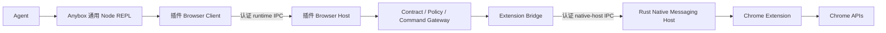

# Chrome 插件当前运行链路

0.9.0 的关键边界是：AnyboxAgent 只提供通用 Node REPL，所有 Chrome 业务都在插件包。

关键事实：

- Node REPL 不包含 Chrome 模块、Browser Contract 或 `requestHost`。
- Agent 通过 LLM/tool 循环自主导入插件的绝对路径 `browser-client.mjs`。
- Browser Client 按需启动或复用同一插件包的 `browser-host.mjs`。
- Browser Host 是最终 schema、capability、policy 和 Extension identity 边界。
- Agent Server 不启动 Browser Gateway，也不暴露 Browser HTTP 路由。

## 节点索引

| 节点 | 文档 |
| --- | --- |
| 01 | [插件入口与通用 Connector](./01-plugin-entry-and-agent-mcp.md) |
| 02 | [通用 Node REPL](./02-node-repl-mcp-server.md) |
| 03 | [Browser Client](./03-browser-client-runtime.md) |
| 04 | [Browser Client ↔ Host IPC](./04-transport-worker-and-runtime-ipc.md) |
| 05 | [插件 Browser Host Gateway](./05-agent-ipc-listener-and-gateway.md) |
| 06 | [Contract、Policy 与 Command Gateway](./06-contract-policy-and-command-gateway.md) |
| 07 | [Extension Bridge](./07-browser-extension-bridge.md) |
| 08 | [Native Host 注册与 bootstrap](./08-native-host-registration-and-bootstrap.md) |
| 09 | [Rust Native Messaging Host](./09-rust-native-messaging-host.md) |
| 10 | [Extension Service Worker](./10-extension-service-worker-and-client.md) |
| 11 | [Extension Command Executor](./11-extension-command-executor.md) |
| 12 | [Content Overlay 与 Popup](./12-content-overlay-and-popup.md) |
| 13 | [端到端时序](./13-end-to-end-walkthroughs.md) |
| 14 | [生命周期、安全与诊断](./14-lifecycle-security-limits-and-debugging.md) |
