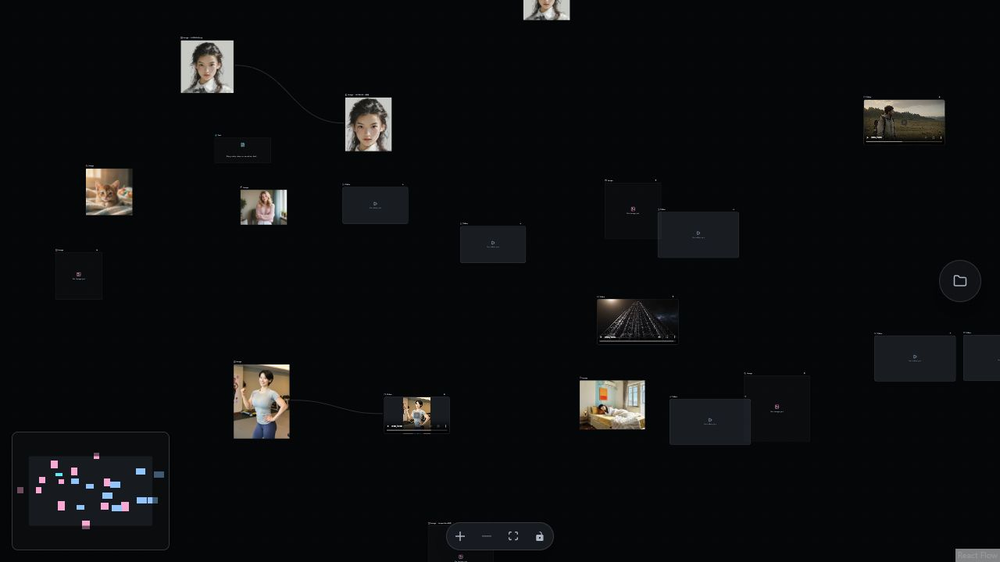
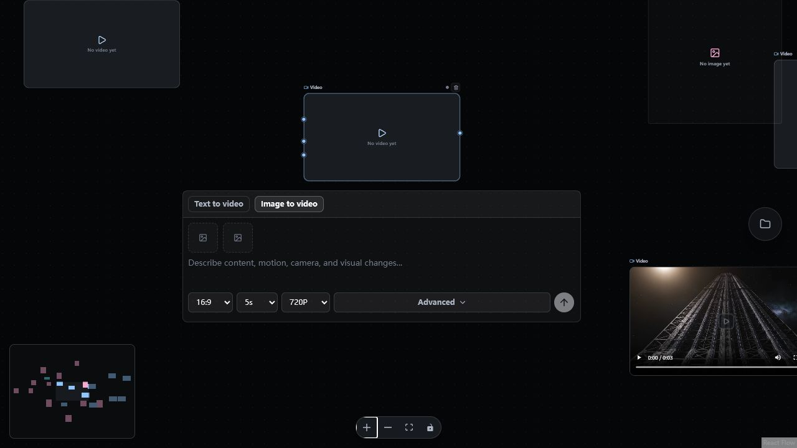
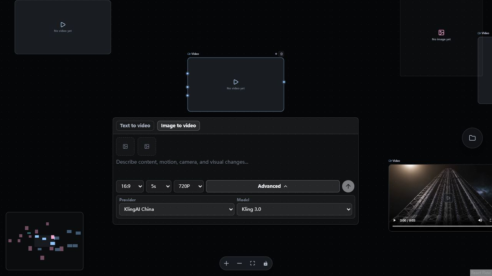
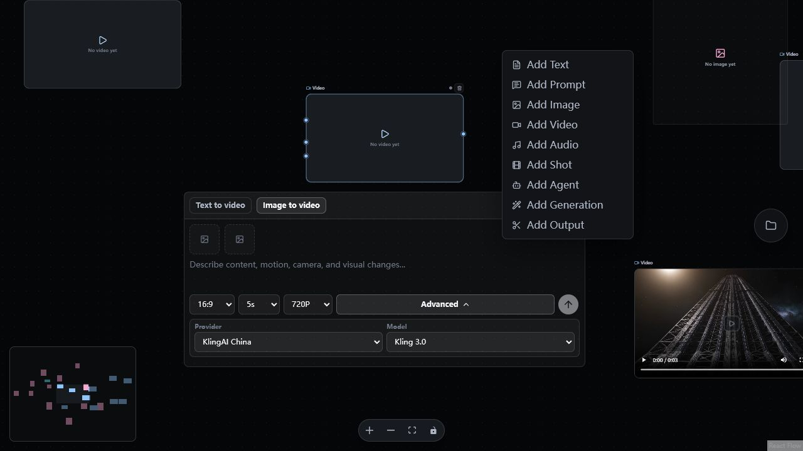
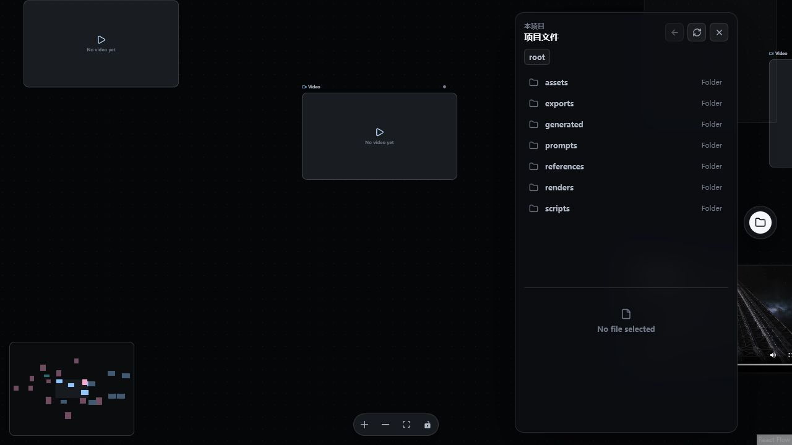
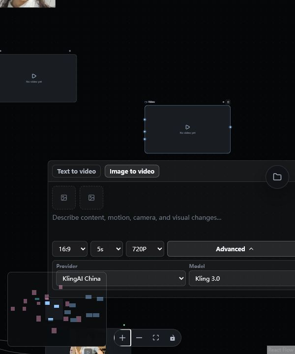
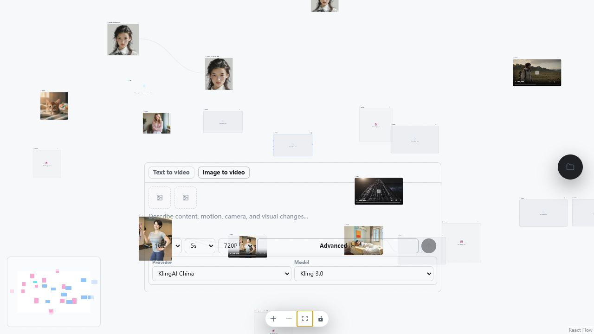
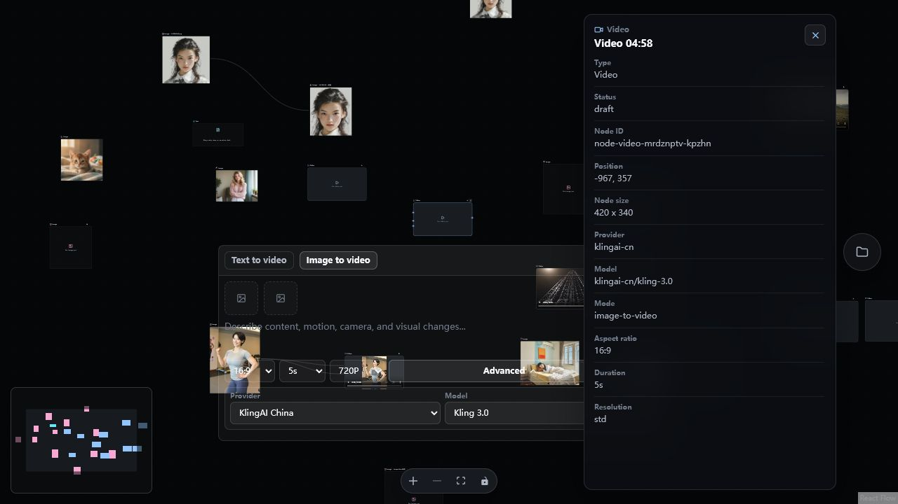
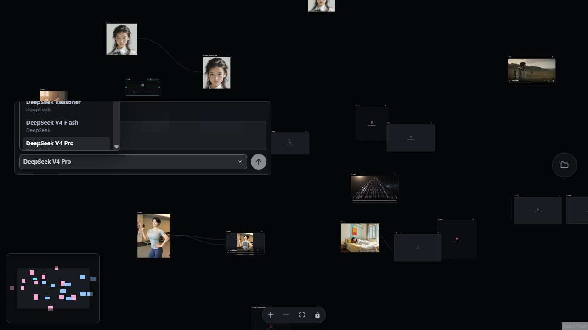

# Cinema Web 前端设计审计

日期：2026-07-10  
范围：真实 23 节点项目的画布、视频/文本节点编辑、节点创建菜单、项目文件、详情面板、暗色/亮色主题，以及 800px/600px 窄窗口。  
结论：产品方向合理，但交互安全性、大画布语义、亮色主题与窄窗口编辑态尚未达到内部 Beta 应有的稳定度。

复核说明：审计过程中工作区新增了右键菜单定位、焦点、方向键、Escape、危险样式 token 和对应单测。最终结论已按最新源码修正；下方早期菜单截图仅用于展示节点类型与入口，不再作为“菜单无键盘行为”的证据。

## 总体判断

| 维度 | 判断 |
| --- | --- |
| 暗色视觉与媒体层级 | 良好，媒体是主角，节点外壳克制 |
| 节点编辑模式 | 方向正确，screen-space 浮层保证了表单可读性 |
| 大画布与连线语义 | 较差，缩放后节点、端口、边都失去可读性 |
| 交互安全与反馈 | 较差，删除、键盘事件和保存失败存在高风险 |
| 键盘与辅助技术 | 不完整，ARIA 外壳多于完整行为 |
| 窄窗口 | 文件面板可用，节点编辑器会裁切、遮挡 |
| 亮色主题 | 不合格，存在大面积低对比和透明层穿透 |

## 实测流程

### 1. 打开真实画布 — 较差

固定 `fitView` 会把 23 个节点压到接近最小缩放，媒体还能靠缩略图辨认，但标题、状态、端口和操作几乎无法扫描。

### 2. 选中视频节点 — 一般偏好

选中态清楚，编辑器脱离画布缩放后保持可读，这是正确方向。问题是编辑器与节点输入端口没有视觉对应，浮层也会遮挡附近节点。

### 3. 展开高级设置 — 一般

常用参数和高级参数有合理的渐进披露，但表单、画布媒体、MiniMap 和右侧面板缺少统一的避让规则。

### 4. 打开新增节点菜单 — 一般

入口只依赖空白处右键，不够可发现；菜单暴露多个只有占位卡片、创建后无下一步的节点类型。最新实现已经补上 Portal、视口钳制、打开时聚焦、方向键循环与 Escape 关闭，这是本轮并发改动中最完整的一项修复。

### 5. 打开项目文件 — 一般偏好

语义结构、行布局和窄窗折叠较好，但空预览区在宽窗占用大量空间，打开/关闭/目录切换后没有稳定焦点恢复。

### 6. 窄窗口编辑节点 — 较差

800px 时浮层与 MiniMap、导航和媒体重叠；600px 时面板右侧超出视口。实测 600px 下浮层宽 568px、右边界到 665px，textarea、Advanced、提交按钮和 Model 控件均被裁切。

### 7. 亮色主题 — 严重失败

主题 token 已存在，但大量 overlay、按钮和 hover 仍写死暗色/白色透明值。结果是深色文字落在暗色或透明 surface 上，底层媒体直接穿透编辑器；画布节点文字也被洗掉。

### 8. 节点详情 — 一般

信息结构清楚，但详情面板和节点编辑浮层可以同时打开并互相遮挡；面板内容偏技术实现，而不是用户决策信息。

### 9. 文本生成与模型选择 — 一般

生成器简洁，但打开后没有把焦点送入表单；模型列表较长且无搜索、无方向键导航，控件键盘事件还可能穿透到画布。

## 做得好的部分

1. **媒体优先的信息层级正确。** 图片和视频节点把预览放在主视觉位，符合影视创作工作台，而不是把参数表单做成主角。
2. **选中后再展开编辑器是合理模式。** `CinemaNodeInputOverlay` 用 Portal 把表单放到 screen-space，避免跟随画布缩放变小。
3. **多数基础语义已有意识。** icon 操作普遍是真实 `button` 并有 `aria-label`；标题支持 Enter/F2 编辑、Escape 取消；局部错误使用 `role="alert"`，任务状态使用 progress/aria-live。
4. **文本韧性不错。** `min-width: 0`、ellipsis、独立滚动和固定控件尺寸使用较多。
5. **文件面板的窄窗策略值得复用。** 小于 840px 后改为大面板并隐藏次要预览，主任务仍可完成。
6. **减少动态效果已有覆盖。** spinner 和 indeterminate progress 响应 `prefers-reduced-motion`。

## 最高优先级问题

### P0 — 删除与画布快捷键可能造成误操作

- 节点删除按钮单击即持久化，没有确认、Undo/Redo 或可恢复 toast。
- 全局 Delete/Backspace 只排除输入控件；焦点在普通按钮、菜单、模型选择器时仍可能删除选中节点。
- 实测在模型按钮聚焦时按 ArrowDown，React Flow 将当前节点下移并保存，而不是导航模型列表。

建议：在 overlay/menu/picker/form 根层统一阻断画布方向键和删除键；只有节点容器自身聚焦时允许移动。删除后提供 5–10 秒 Undo，含资产或连线的节点可增加二次确认。

### P0 — 保存与命令失败对用户不可见

`saveState` 会进入 saving/error，但 `saveError` 的值被丢弃，正常界面没有保存状态、错误说明或重试入口。用户无法判断拖拽、连线、删除、生成参数是否真正写入项目。

建议：在固定画布 chrome 显示 `Saving / Saved / 未保存 / 保存失败`；失败时提供重试并保留本地脏状态，关闭窗口前提示未完成保存。

### P0 — 亮色主题不是完整主题

根部虽有 light token，组件区仍大量使用固定 `rgba(255,255,255,...)`、暗色 overlay 和固定深浅色。当前 `styles.css` 约 3922 行，其中白色 rgba 引用 80 次，主题切换无法保证状态矩阵。

建议：沿用最新 context menu 已采用的 `--cinema-floating-*` / danger token 模式，建立成对的 overlay、button、status、focus、disabled semantic token；组件只消费运行时 token，不直接写固定白/黑/灰。下一步修 editor、model picker、canvas nav、file panel、inspector、submit button，再声明亮色主题可用。

### P1 — 大画布没有语义缩放与视口恢复

每次打开都 `fitView`，保存的 viewport 没有恢复；在 0.2–0.4x 时标题和操作目标不可读，24px 删除按钮实测只剩约 5–8px。

建议：优先恢复上次 viewport/active cluster，仅新项目首次 fit；增加“聚焦选中节点”。按缩放等级切换：

- `>= 0.8x`：完整标题、状态、工具栏和端口标签。
- `0.45–0.8x`：缩略图、短标题、状态点，隐藏危险操作。
- `< 0.45x`：只显示类型 glyph、媒体缩略图和状态，不显示不可点击的小按钮。

### P1 — 端口、连线和边缺少可理解的语义

- Handle 只有 13px，随画布缩放；视频的首帧、尾帧等多个输入端口同形同色且无标签、ARIA 或键盘替代。
- `onConnect` 只校验 source/target 是否存在，没有 `isValidConnection`、类型、数量、自连或循环校验。
- 边没有方向箭头、稳定选中态和通用断开入口。控制台持续出现找不到 `first_frame_image` target handle 的 React Flow 警告，说明保存数据与渲染端口已发生漂移。

建议：建立 typed port contract（输入类型、角色、arity、循环策略）；拖线时只高亮兼容端口，非法落点解释原因；边增加方向箭头、hover/selected 状态、右键断开和键盘替代。

### P1 — 节点创建入口与真实能力不一致

右键菜单无条件展示 Text、Prompt、Image、Video、Audio、Shot、Agent、Generation、Output，但 Prompt/Audio/Shot/Agent/Generation/Output 当前只是通用占位卡；完整的 Custom API 反而没有创建入口。

建议：用 `NodeDefinition` registry 统一 `component / createable / defaultData / size / ports / capabilities / inspector / status`。菜单只展示已形成闭环的节点；未完成项明确禁用并标注“即将支持”。同时增加可见的 `+` 或命令面板，不把右键当唯一入口。

### P1 — 浮层缺少统一碰撞和响应式策略

当前浮层只按节点下方计算 left/top，未做左右 clamp、上下翻转或与 MiniMap、Controls、文件/详情面板的避让；窄窗只处理文件/详情面板，没有处理 node composer。

建议：抽象统一 overlay manager。宽窗支持上下翻转、16px viewport clamp、safe area；`<= 760px` 直接切换为底部 drawer 或 side sheet，并缩小/隐藏 MiniMap。

### P1 — Portal、picker 与画布快捷键的键盘边界不完整

- 生成浮层打开后焦点仍在触发按钮；因为 Portal 排在 ReactFlow 后面，Tab 会穿过大量节点操作才到达表单。
- 文本模型 picker 虽有 listbox/option 角色，但没有 roving tabindex、方向键导航或搜索；其按钮键盘事件仍可穿透到画布。
- 隐藏操作只用 opacity/pointer-events，仍可能留在 Tab 顺序。

建议：把最新 `CinemaContextMenuSurface` 的焦点与 Escape 模式推广到 picker 和编辑浮层；打开编辑器时聚焦第一个字段，关闭后恢复节点；在 overlay/form/picker 根层统一阻断画布快捷键；inactive/hidden 操作设置不可聚焦。

## 推荐的节点设计

### 节点本体

- Header：类型图标 + 类型名 + 可选标题；右侧只保留状态，删除放入 `…` 菜单或选中工具栏。
- Body：图片/视频以媒体预览为主；文本展示 2–4 行摘要；空节点给出下一步动作，而不是只有 `No image/video yet`。
- Port rail：左侧输入、右侧输出；首帧/尾帧/参考图/文本等使用短标签或类型图标，连接拖拽时显示完整名称。
- Status：统一 `idle / queued / running / succeeded / failed / canceled` 到 tone、icon、progress、文案，`idle` 不与成功共用绿色。

### 选中与编辑

- 单击选中，双击重命名；选中不改变节点尺寸。
- 参数编辑器保持 screen-space，这是现有设计应保留的核心。
- 编辑器必须具备碰撞、焦点、滚动与窄窗 drawer 规则。
- 多选时仅显示批量动作，不同时打开多个节点编辑器。

### 连线

- 拖动时只显示兼容端口，端口命中区保持至少 24px screen-space；最终触控目标建议 44px。
- 边显示方向，选中后可删除；通用右键菜单提供断开、替换输入、查看来源。
- 为键盘用户提供“连接到…”命令面板。

## 建议实施顺序

1. **安全与可信度：** 保存状态/重试、键盘事件隔离、Undo、端口漂移修复。
2. **核心节点工作流：** viewport 恢复、语义缩放、typed ports、edge 交互、收紧可创建节点。
3. **适配与一致性：** 窄窗 drawer、overlay manager、亮色 semantic tokens、统一 status/button 状态矩阵。
4. **效率与可访问性：** command palette、菜单键盘导航、焦点恢复、模型搜索、裁剪键盘/数值替代。

## 证据限制

- 本次没有执行创建、删除、上传或真实生成，以避免改变项目数据。
- 键盘、DOM、控制台和响应式行为已实际检查；截图只能证明可见状态，不能单独证明完整 WCAG 合规。
- 最新源码测试 42/42 与 typecheck 通过，说明问题主要在产品行为、状态表达与可访问性，不是当前类型错误。
- 本审计未修改前端源码；仅在 `.audit/` 保存本次截图和报告。
