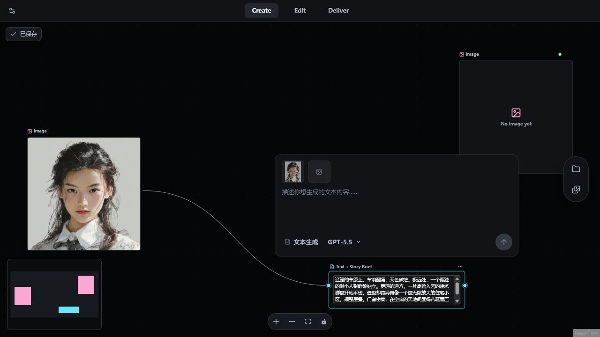
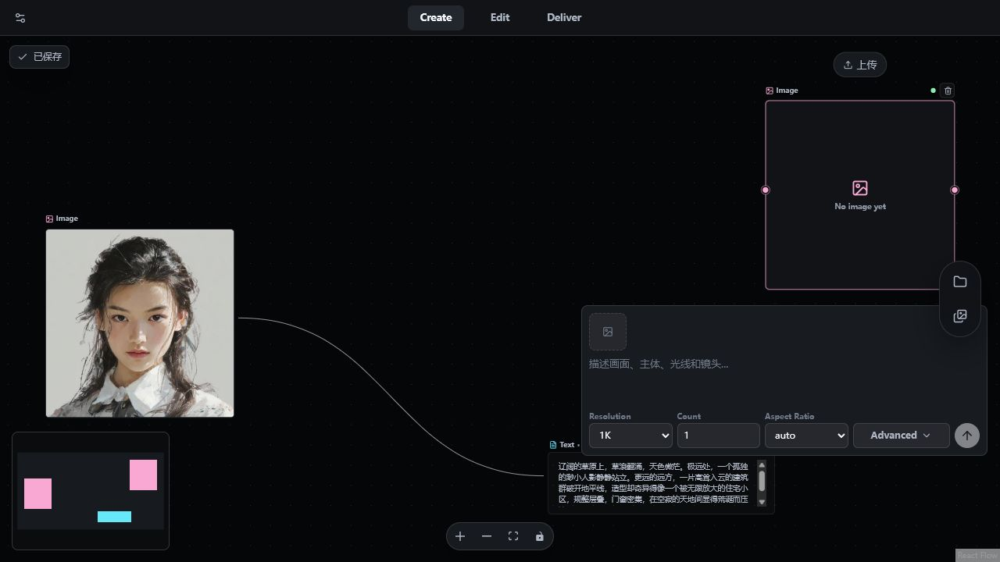

# 其他节点 Composer 设计审视

日期：2026-07-11

## 结论

图片和视频 Composer 都适合沿文本 Composer 的方向统一，但应统一的是视觉语法与操作骨架，而不是把三者压成完全相同的控件数量。

- 文本：低复杂度基准版。
- 图片：同一外壳 + 一条高频参数轨道。
- 视频：同一外壳 + 轻量模式层 + 高频参数轨道 + 可折叠高级层。

当前只有文本、图片和视频节点拥有生成 Composer。音频节点与已完成的图片/视频节点是素材预览，不应强行套用 Composer。

## 证据

### 1. 文本 Composer：健康



单一 surface、开放式输入区、常驻“文本生成 + 模型”和稳定的右下角提交按钮已经形成清晰的视觉层级。

### 2. 图片 Composer：可用，但视觉层级偏表单化



主要问题：

- 模型被放在 Advanced 中，提交前看不到决定生成行为的核心上下文。
- Resolution、Count、Aspect Ratio、Advanced 和提交等权排列，底部更像配置表单。
- Advanced 在提交行下方展开，提交按钮不是稳定终点。
- 外层圆角、surface、阴影和提交按钮尚未使用文本 Composer 的统一语义 token。
- 模型仍为原生 select，视觉和键盘体验与文本模型菜单不一致。
- 520px 内依靠自由换行处理动态参数，窄宽度层级不稳定。

推荐结构：

```text
连接文本 / 参考图
开放式图片描述
分辨率 · 比例 · 数量 · 更多
图片生成 · 当前模型                         提交
```

图片的分辨率、比例、数量属于高频决策，不应全部藏进 Advanced；但应降低盒子感，并让模型常驻 footer。

### 3. 视频 Composer：功能完整，但需要结构级整理

当前项目中没有视频生成节点，因此本项基于实际 JSX/CSS、输入契约和已连接 provider 数据审视，未伪造运行态截图。

主要问题：

- 640px surface 顶部有独立 tabs 底色，底部又有五列方框控件，Advanced 里再嵌套参数与 Provider/Model 面板，层级过多。
- Model 被藏在 Advanced 中，但模式、输入槽、比例、时长和质量都受 Model 影响。
- 48px 视频输入槽隐藏了槽位名和“必填”标识，首帧、尾帧、参考图和源视频的语义不够直观。
- Prompt 在 DOM 中位于输入槽之前，却用 CSS order 显示在输入槽之后，键盘焦点顺序与视觉顺序不一致。
- 模式 tabs 缺少完整 tabpanel、aria-controls、roving tabindex 和方向键行为。
- 视频生成节点尚未接入通用 viewport guard；Advanced 或错误态可能超出可视区域。
- 快捷栏固定五列，760px 以下只有通用 Overlay 贴底规则，没有视频专属折行策略。

推荐结构：

```text
单一 Composer surface
轻量模式切换（仅多模式时显示）
有角色标签的首帧 / 尾帧 / 参考图 / 源视频
开放式 Prompt
高级参数区（按需展开，位于 footer 上方）
视频生成 · 当前模型 · 比例 · 时长 · 质量              提交
```

视频宽度可以继续保持约 600–640px，不需要机械缩成 520px。它要统一的是气质、主次和交互位置。

## 建议的共享骨架

后续实现可抽取以下共享层，而保留各节点自己的业务参数：

- `GenerationComposerShell`：surface、padding、focus、shadow、viewport 行为。
- `AttachmentStrip`：图片槽、视频角色槽、连接参数标签。
- `GenerationPrompt`：开放式输入和一致的可访问名称。
- `ComposerParameterRail`：图片/视频高频参数。
- `ComposerFooter`：生成类型、ModelPicker、稳定提交按钮。
- `ComposerAdvancedPanel`：位于 footer 上方的可折叠二级参数。

## 优先级

1. P0：视频接入 viewport guard；修正视觉/DOM 顺序；补 tabs 键盘语义、Prompt 名称和可读的禁用原因。
2. P1：先改图片 Composer——统一 surface/footer、模型常驻、Advanced 上移、提交按钮统一。
3. P1：再改视频 Composer——Model 提升、输入槽角色可见、两层控制结构。
4. P2：统一 ModelPicker、语义 token、亮暗主题、窄宽度策略和中英文文案。
5. P3：在图片和视频结构稳定后抽取共享组件，避免过早抽象动态 FormSpec。

## 可访问性风险与审视限制

- 图片/视频 Prompt 应增加稳定的 `aria-label` 或可见标签，不只依赖 placeholder。
- 18px 删除按钮需要保留紧凑视觉，但扩大交互热区。
- Advanced 已有 `aria-expanded` / `aria-controls`，可继续复用。
- 禁用提交原因不应只存在于 `title`；正常缺参状态也不宜统一用 `role="alert"`。
- 本次验证了当前暗色运行态、DOM 结构与源码；未覆盖所有 provider、生成中、失败、hover、focus、亮色和极窄窗口组合。

最终判断：通过。推荐按“图片先、视频后、最后抽共享层”的顺序推进。
