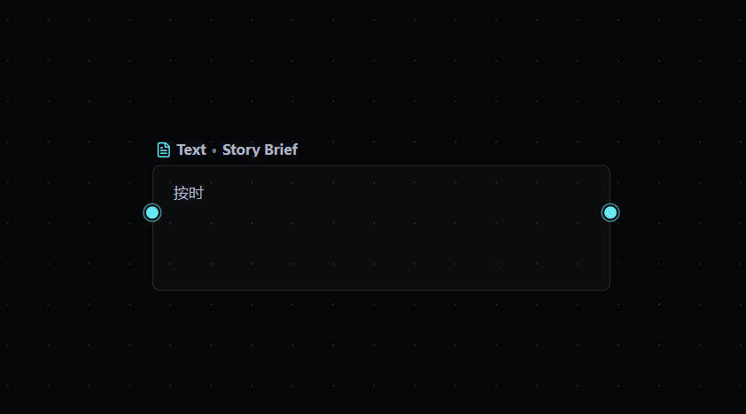

# Text node interaction audit

Date: 2026-07-11

## Scope

The selected Text / Story Brief node in the Create canvas, with attention to discovering manual editing and AI generation.

## Evidence

## Step 1 — Select and understand the text node

Health: Poor

- The node reads as a passive text preview. It does not visibly explain how to edit or generate.
- The cyan connection handles are more prominent than the creation actions, so the visual hierarchy favors graph wiring over writing.
- `Text · Story Brief` mixes the node type and user title in one low-emphasis line; this is understandable, but it leaves no room for a clear primary action.
- The large empty area around a short value does not provide an empty-state hint, editing affordance, or AI entry point.
- The current implementation hides Edit, Generate, and More behind a toolbar whose visibility rule does not cover the text-card class. This turns a discoverability weakness into a complete blocker.
- Icon-only 24 px actions are small targets and require tooltip discovery even after the visibility bug is fixed.

## Recommended interaction model

1. Unselected: keep the card quiet and readable; do not show the full toolbar.
2. Selected: always show a compact action row with a labeled primary action `AI 生成` and secondary `编辑` / `更多` actions. Do not depend on hover.
3. Empty text node: replace the blank preview with two explicit choices, `输入文本` and `AI 生成`.
4. Existing text: make the AI action explicit about intent—`改写` or `续写`—or let the generator choose between replace and append before submission.
5. Generating: keep the old text visible, show progress in the action area, and place Undo beside the updated result rather than only in a distant toast.
6. Keyboard: Enter edits the selected node; a documented shortcut opens AI generation; the selected action row must remain focusable and visible.

## Accessibility limits

The screenshot supports findings about visual hierarchy, discoverability, and target presentation. Contrast ratios, focus order, screen-reader output, zoom reflow, and actual keyboard behavior require an interactive run.
