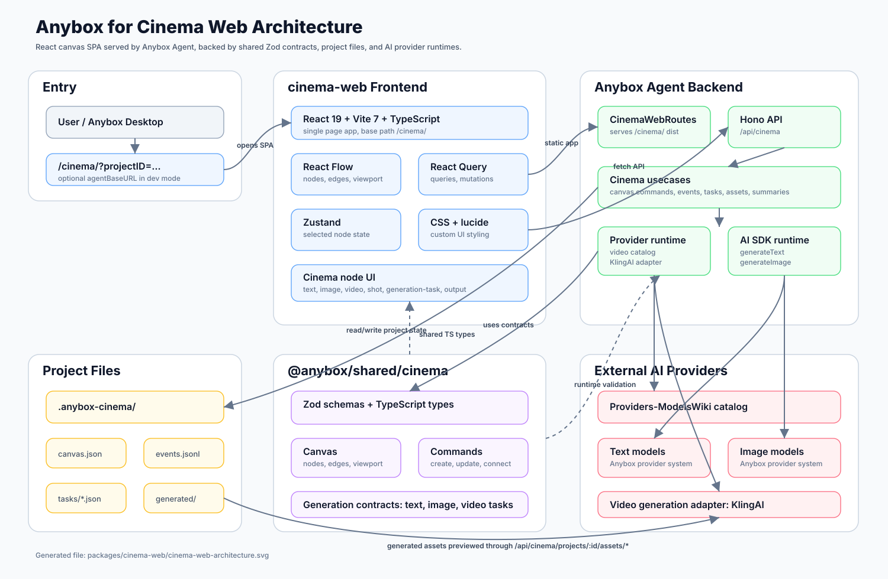

# CinemaWeb 项目架构演讲稿

> 适用场景：对团队、合作方或技术评审介绍 Anybox for Cinema Web 的前端架构、数据模型、后端协作方式和生成任务链路。



## 1. 开场：这个项目解决什么问题

大家好，今天我想从技术架构的角度介绍一下 CinemaWeb 这个项目。

CinemaWeb 不是一个普通的表单式 AI 生成页面，它更像是一个面向影视创作流程的可视化工作台。它把文本、提示词、图片、视频、镜头、生成任务和最终输出，都抽象成画布上的节点。用户可以在一个无限画布里组织创意资产，也可以把节点之间的关系连接起来，让创作过程从“单次调用模型”变成“可追踪、可组合、可迭代的生产流程”。

所以这个项目的核心目标有三个：

1. 提供一个基于节点画布的创作界面。
2. 把 AI 文本、图片、视频生成能力嵌入到节点中。
3. 通过 Anybox Agent 后端把画布状态、生成任务、资产文件和事件日志持久化到本地项目里。

从架构上看，它是一个 React 单页应用，但它的真实价值不只在 UI，而在于它通过共享类型契约和命令式后端 API，把前端画布、项目文件系统和 AI Provider Runtime 连接成了一个完整的创作运行时。

## 2. 总体架构：前端工作台 + Agent 运行时 + Shared Contract

我们可以先看整体分层。

最上层是用户入口。用户从 Anybox Desktop 或 Anybox Agent 打开 Cinema 项目，访问的地址一般是：

```text
/cinema/?projectID=...
```

在开发模式下，还可以通过 `agentBaseURL` 指向实际的 Agent 服务。这一点很重要，因为它让 CinemaWeb 可以独立开发，也可以被 Anybox Agent 作为内嵌 Web UI 托管。

第二层是 `packages/cinema-web`，也就是今天的主角。它使用 Vite、React 19、TypeScript 构建，是一个运行在 `/cinema/` base path 下的单页应用。前端内部主要由四个能力组成：

1. `@xyflow/react` 负责节点画布、连线、视口、缩放、拖拽和 MiniMap。
2. `@tanstack/react-query` 负责服务端数据查询和变更请求。
3. `zustand` 管理轻量 UI 状态，比如当前打开编辑器或 Inspector 的活动节点。
4. 自定义 React 组件和 CSS 负责 Cinema 风格的节点编辑器、生成器、检查面板和工具栏。

应用最外层现在是 Create / Edit / Deliver 三工作台壳层。Create 对应现有节点创作画布并保持完整可用；Edit 为未来 Timeline 剪辑台预留；Deliver 为未来检查、渲染和交付流程预留。当前 Edit 与 Deliver 在 ARIA tablist 中可见但处于 disabled，并显示 `Soon`，因此不会制造尚无业务闭环的假入口。项目名称、工作台导航和活动 tabpanel 在加载、错误、未初始化和正常画布状态下保持同一层级结构。

第三层是 `@anybox/shared/cinema`。这是整个系统的类型契约层。它使用 Zod 定义画布、节点、边、命令、事件、模型、Provider、生成任务和资产等 Schema，同时导出 TypeScript 类型。前端和后端都依赖这一层，因此它不是普通的类型文件，而是运行时校验和编译期类型的共同边界。

第四层是 `packages/anyboxagent` 里的 Cinema API。这里使用 Hono 暴露 `/api/cinema/...` 路由，负责读取项目、更新画布、执行命令、创建生成任务、刷新任务、取消任务、读取资产和记录事件。

最底层是本地项目文件。每个 Cinema 项目会有一个 `.anybox-cinema/` 目录，里面保存：

```text
.anybox-cinema/
  project.json
  canvas.json
  events.jsonl
  tasks.jsonl
  tasks/*.json
  generated/
```

也就是说，这个系统不是把项目状态藏在远端数据库里，而是把画布和生成资产落到项目目录中。这让它天然适合本地创作、版本管理、调试和未来的协作同步。

## 3. 前端入口：Provider 先搭起来，再渲染 App

前端入口在 `src/main.tsx`。

这里做了一个很明确的初始化顺序：

1. 创建 `QueryClient`。
2. 用 `QueryClientProvider` 包住应用。
3. 用 `ReactFlowProvider` 包住应用。
4. 渲染真正的 `App`。

这个顺序说明了项目的两个核心上下文：一个是服务端数据上下文，一个是画布上下文。

React Query 的默认配置关闭了 `refetchOnWindowFocus`，并设置了轻量 retry。这符合 CinemaWeb 的使用场景：用户在画布上操作时，我们不希望窗口聚焦造成频繁重新拉取，影响画布状态；但网络或本地 Agent 短暂失败时，也保留一次自动重试。

React Flow Provider 则让 App 内部可以通过 `useReactFlow` 读取画布实例，例如把屏幕坐标转换成画布坐标，用于右键菜单添加节点。

真正的 Canvas 被放在 Create 对应的 `tabpanel` 中。工作台顶栏采用无外框的紧凑 tabs，Create 使用当前 surface 表达选中状态；Edit 与 Deliver 保持固定尺寸的禁用状态。壳层同时覆盖亮色、暗色和 560px 窄窗口，不改变 Canvas 内部的保存、节点编辑、素材库和 Inspector 生命周期。

## 4. App 的核心职责：把服务端 Canvas 映射成 React Flow

`src/App.tsx` 是当前项目的核心文件，它承担了几个关键职责。

第一，它从 URL 读取运行参数：

```text
projectID
agentBaseURL
```

`projectID` 决定当前打开哪个 Cinema 项目，`agentBaseURL` 决定 API 请求发往哪个 Agent。默认情况下，`agentBaseURL` 使用当前页面 origin；开发模式可以显式指定。

第二，它维护画布状态：

```text
nodes
edges
nodes[].selected
activeNodeID
saveState
contextMenu
generation errors
auto refresh state
```

其中 `nodes` 和 `edges` 是 React Flow 需要的运行态数据；`nodes[].selected` 是唯一的多选集合，`activeNodeID` 则只表示当前允许打开编辑器或 Inspector 的活动节点。普通点击选择一个节点，Ctrl/Cmd 点击追加或取消节点，空白区拖动执行框选；从组选框或任一已选节点拖动都会保持整组移动。多选时所有节点保留选中描边，但不会同时挂载多套编辑浮层；右键组选区或任一已选节点会打开组菜单，可一次删除打开菜单时捕获的完整节点集合。

服务端持久化的格式是 `CinemaCanvasDocument`，不包含这些临时选择状态。因此项目里有两组转换函数：

```text
toFlowNodes(canvas)
toCanvasNode(node)
```

这两个函数是前端画布和后端文档之间的桥。后端只关心通用的节点结构、位置、尺寸、数据和连线；前端则需要把它补充成 React Flow 的 `Node`，包括自定义节点类型、样式宽高和渲染数据。

这个设计的好处是：React Flow 是 UI 运行时，不会污染持久化模型；持久化模型也不会被某个前端库强绑定。未来如果要支持其他编辑器或 CLI 操作，只要遵守 `CinemaCanvasDocument` 契约即可。

## 5. 节点模型：统一抽象 + 类型化差异

CinemaWeb 支持的节点类型定义在 `NODE_TYPES` 和 shared schema 里，包括：

```text
text
prompt
image
video
audio
shot
agent
generation-task
output
```

这里的关键不是节点种类多，而是所有节点都共享同一个基础结构：

```text
id
type
title
position
size
data
```

其中 `data` 是一个开放的 `Record<string, unknown>`。这看上去很宽松，但它在这个项目里很有意义：Cinema 节点的形态还在快速演化，不同 AI Provider 返回的数据也不完全一致。用统一外壳包住灵活数据，可以让画布结构稳定，同时给具体节点留下扩展空间。

前端再根据 `cinemaType` 渲染不同节点：

1. Text 节点有文本编辑器、复制、下载和文本生成输入框。
2. Image 节点统一承载上传、AI 生成和裁剪来源；空节点提供创建入口，获得最终资产后只保留预览和裁剪。
3. Video 节点有生成模式、Provider、模型、比例、时长、分辨率、参数 JSON 和视频预览。
4. 普通节点使用通用卡片样式展示标题、状态和内容。
5. Inspector 面板根据选中节点展示更细的编辑和任务操作能力。

换句话说，底层数据模型是统一的，UI 表现是按节点类型分化的。这是典型的“稳定内核 + 可扩展表现层”。

图片节点进一步把“图片是什么”和“图片如何得到”分开。持久化类型始终是 `image`，来源写在开放的 `data` 中：

```text
asset                       最终资产，也是唯一可供下游消费的图片
candidateAssets             多图生成后、确认前的候选资产
selectedCandidateAssetID    当前预览的候选
sourceKind                  upload | generation | crop
prompt / model / taskID     生成审计信息
```

UI 状态不额外持久化，而是从这些字段推导：有 `asset` 就是 Ready；没有 `asset` 但有候选就是 Choosing；任务为 queued 或 running 就是 Generating；其余是 Empty 或可重试错误态。旧项目中的 `local-image` 只是读取边界上的兼容别名，会被规范化成 `image`；旧的 `resultAssets + selectedAssetID` 会选择已选结果或第一张结果，迁移为最终 `asset`。读取本身不写盘，下一次正常 command 或 canvas write 再惰性保存规范数据。

## 6. 状态管理：本地即时反馈，服务端最终确认

CinemaWeb 的状态管理不是单纯的“服务端返回什么就显示什么”。为了让画布操作流畅，它采用了本地即时更新和服务端确认结合的方式。

例如用户拖动节点、编辑文本、修改 prompt 时，前端会先更新本地 `nodes`，让 UI 立即响应。随后通过 `queueNodePatch` 把节点修改排队，并在 650ms 后发送 `update-node` 命令到后端。

文本输入内部还有更细的防抖，文本节点和图片节点的输入提交大约延迟 320ms。这么做是为了避免用户每敲一个字就写入 `canvas.json`，同时又能保证用户停顿后自动保存。

保存状态用一个简单但清晰的状态机表示：

```text
idle -> dirty -> saving -> saved
                  \-> error
```

`dirty` 代表本地有未同步修改，`saving` 代表命令正在发送，`saved` 代表服务端已确认，`error` 代表保存失败。顶部的 SaveIndicator 就是这个状态机的可视化结果。

这个设计对演示和真实使用都很重要。它让用户感觉画布是实时的，同时又能明确知道哪些修改已经落盘。

所有 Canvas Command 现在进入显式串行队列。每条命令都有稳定 `id` 和 `baseRevision`，只有服务端 ACK 后才出队；网络失败会退避重试，最终失败的命令保留在队首，并通过画布左上角状态和重试按钮暴露给用户。刷新或关闭页面时，如果仍有草稿、发送中命令或失败命令，浏览器会触发离开保护。

服务端使用同一个 Canvas 写锁串行化 Command、生成任务同步、文本生成和 Custom API 结果写入。每次成功写入都会递增 `revision`；过期命令返回 409，前端拉取最新 revision 后使用原命令 ID 重放。因为重复命令 ID 会返回既有事件，所以“服务端已写入但响应丢失”不会造成重复执行。

## 7. 命令模型：所有画布变更都变成 Command

CinemaWeb 没有直接把整个 canvas 一次次 PUT 到后端，而是大量使用命令接口：

```text
POST /api/cinema/projects/:projectID/commands
```

命令类型定义在 `CinemaCommandSchema`，包括：

```text
create-node
update-node
delete-node
connect-nodes
disconnect-edge
update-viewport
create-generation-task
complete-generation-task
```

当前前端主要会在这些场景发命令：

1. 新建节点时发送 `create-node`。
2. 编辑节点内容、标题、位置时发送 `update-node`。
3. 删除节点时发送 `delete-node`。
4. 连线时发送 `connect-nodes`。
5. 删除边时发送 `disconnect-edge`。

后端的 `applyCinemaCommand` 会做三件事：

1. 读取当前 `.anybox-cinema/canvas.json`。
2. 通过 `applyCommandToCanvas` 得到下一个 canvas。
3. 原子写入新的 `canvas.json`，并向 `events.jsonl` 追加事件。

这让画布变更天然具备审计能力。每一次结构变化都有 command，有 event，有 actor，有 message。后面如果要做撤销、历史记录、协作回放或自动化 agent 修改画布，这套命令模型都是基础。

## 8. React Query：把服务端运行时拆成多条数据流

App 里用 React Query 拉取多类运行时数据：

```text
project
canvas
video providers
text models
image models
generation tasks
```

它们不是放在一个大接口里，而是拆成多个 query。这带来几个好处：

1. 每类数据有独立缓存 key。
2. 某些数据可以按项目初始化状态延迟加载。
3. 任务刷新、模型刷新、画布刷新可以按需组合。
4. 错误边界更清晰，哪个子系统失败更容易定位。

例如 `canvasQuery` 只有在项目已初始化后才启用；`tasksQuery` 只负责生成任务；`providersQuery` 只关心视频 Provider。前端在 `renderedNodes` 里把这些运行时数据注入每个节点，让节点组件可以拿到模型列表、Provider 列表、任务列表和生成状态。

文本、图片、视频和 Custom API 的前端运行状态不再各自依赖单个全局 `nodeID`。统一的节点操作状态机为每个节点维护 pending 引用计数和错误映射：一个节点完成或失败只会更新自己，不会提前清除另一个仍在执行的节点；同一节点即使出现重叠请求，也要等所有请求 settle 后才解除 busy。项目切换时整个运行态注册表会重置。这使多个生成工序可以像真实影视流水线一样并行推进。

这个模式很适合复杂工作台：App 负责聚合数据和行为，具体节点组件负责呈现和局部交互。

## 9. 文本生成链路：Text Node 到 AI SDK Runtime

文本生成从 Text 节点内部触发。

用户在文本节点下方输入生成 prompt，选择模型，然后点击生成。前端会先调用 `flushNodePatch`，确保当前节点草稿已经保存，再请求：

```text
POST /api/cinema/projects/:projectID/text-generations
```

请求体包含：

```text
nodeID
prompt
model
writeMode: "append"
```

后端会校验节点存在，并且必须是 `text` 类型。然后通过项目级模型配置解析实际模型，调用 Anybox 的语言模型运行时生成文本。生成结果不是孤立返回给前端，而是写回 canvas 中对应节点的 `data.text`，并清空 `generationPrompt`。

最后后端返回新的 canvas，前端调用 `applyCanvas` 整体同步。

这个链路的关键点是：生成结果进入项目状态，而不是只存在浏览器内存里。因此刷新页面后，生成内容依然保留在 `canvas.json` 中。

## 10. 统一图片链路：上传和生成汇入同一个 Image Node

用户在画布上只面对一种 Image 节点。节点刚创建时是 Empty：默认只显示标题和稳定的 1:1 占位区，选中后才在上方显示上传入口、下方显示图片生成 composer。上传与生成是填充同一个空节点的两条互斥路径，不再创建“本地图片节点”和“图片生成节点”两个概念。

上传走已有资产导入接口：

```text
POST /api/cinema/projects/:projectID/assets/imports
```

导入成功后，前端通过 `update-node` 把返回资产写入当前节点的 `data.asset`，并设置 `sourceKind: "upload"`。节点 ID、位置和已有连线保持不变；取消选择文件或上传失败时，节点仍保持 Empty。

图片生成仍然允许用户输入 prompt、选择 image model、设置 size 和 count，并调用：

```text
POST /api/cinema/projects/:projectID/image-generations
```

后端会把这次请求转换成一个 `text-to-image` 类型的 generation task，并绑定到当前 image 节点上。Provider Runtime 会创建任务，任务数据写入 `.anybox-cinema/tasks/:taskID.json`，同时通过 `syncTaskToCanvas` 把任务状态和输出资产同步回画布节点。节点已经有最终 `asset` 或尚未确认的 `candidateAssets` 时，生成入口返回 `409 CINEMA_IMAGE_NODE_FINALIZED`，从服务端守住一次填充约束。

生成只返回一张图片时，任务同步直接把它写入 `data.asset` 并设置 `sourceKind: "generation"`；返回多张时，结果先写入 `candidateAssets`，并用 `selectedCandidateAssetID` 记录当前预览。此时节点处于 Choosing，下游还读不到候选。用户点击唯一主操作“使用此图片”后，前端通过 `update-node` 把选中候选移到 `asset` 并清除候选字段。任务文件仍保留完整输出，画布节点只保留确定的最终图片。

最终图片通过资产接口预览：

```text
GET /api/cinema/projects/:projectID/assets/*
```

因此 Image 节点是一个一次性填充的资产容器：Empty 时可以上传或生成，过程中显示任务状态，Choosing 时只负责候选确认，Ready 后只展示最终图片和裁剪工具。上传图、生成图和裁剪图在下游都遵守同一个 `data.asset` 契约；Ready 节点不再提供替换、重新生成或版本切换。

## 11. 视频生成链路：Provider、模型、模式和源节点

视频节点的复杂度更高，因为它需要处理多种生成模式：

```text
text-to-video
image-to-video
frames-to-video
reference-to-video
video-to-video
edit
extend
motion-control
```

当前前端 Video 节点主要开放了 `text-to-video` 和 `image-to-video` 两类模式。它会根据所选模式过滤可用 Provider，再根据 Provider 过滤可用模型，同时读取模型支持的比例、时长和分辨率。

图生视频还有一个很有意思的节点关系：Video 节点会检查入边。如果有一个 Image 节点连接到当前 Video 节点，并且 Image 节点有最终 `asset`，那么无论它来自上传、生成还是裁剪，这个图片资产都会作为 `sourceImageAsset` 注入 Video 节点。未确认的 `candidateAssets` 不参与下游解析。

这说明 CinemaWeb 的连线不只是视觉关系，它开始承载生成上下文。节点图未来可以进一步发展成真正的创作 DAG：上游节点提供素材，下游节点消费素材，生成任务记录每一步产物。

当用户创建视频生成任务时，前端请求：

```text
POST /api/cinema/projects/:projectID/generation-tasks
```

后端会校验 Provider 和模型能力，创建 task，写入任务文件，再同步回 canvas。任务可以刷新，也可以取消：

```text
POST /generation-tasks/:taskID/refresh
POST /generation-tasks/:taskID/cancel
```

前端还会自动刷新未完成任务：初次延迟约 2.6 秒，之后约每 9 秒刷新一次。这个机制让异步视频任务能够持续更新状态，而不需要用户手动刷新页面。

## 12. 事件同步：轻量轮询保证外部变更可见

除了任务自动刷新，App 还有一条事件同步机制。

前端会轮询：

```text
GET /api/cinema/projects/:projectID/events?after=...&limit=50
```

如果发现有新的事件，就重新拉取 canvas 和 tasks。这里有一个细节：当前端处于 `dirty` 或 `saving` 状态时，它会跳过事件轮询同步，避免把本地未保存的用户操作覆盖掉。

这是一种比较务实的同步策略。它没有引入 WebSocket 或 CRDT，但已经能支持本地 Agent、生成任务和其他进程对项目状态的变更被前端感知。对当前阶段来说，复杂度和收益是比较平衡的。

## 13. 后端持久化：本地文件作为项目真相源

Anybox Agent 的 Cinema Usecase 层负责项目状态的读写。

最核心的文件是：

```text
canvas.json
```

写入 canvas 时，后端会先写临时文件，再 rename 到目标文件。这是一个原子写入策略，能降低写到一半导致 JSON 损坏的风险。

事件使用 JSONL：

```text
events.jsonl
tasks.jsonl
```

这很适合追加型日志。每一行都是一个事件，读取最近事件或按 cursor 读取都很直接。

生成任务则同时有索引日志和单任务文件：

```text
tasks/:taskID.json
```

这种设计把“当前任务状态”和“任务事件审计”分开：单任务 JSON 方便读取最新状态，JSONL 方便追踪生命周期。

资产文件则保存在项目目录下，例如 `generated/images/...`，再通过 API 以受控方式暴露给前端。资产接口还支持 range header，这对视频预览很关键，因为浏览器播放视频通常需要范围请求。

## 14. Shared Contract：Zod 是架构里的边界语言

这个项目里我认为最值得强调的设计之一，是 `@anybox/shared/cinema`。

它不是简单的“共享 TS 类型”，而是把数据结构定义成 Zod Schema，再从 Schema 推导类型。这样前后端拿到的是同一份定义：

1. 前端编译期知道节点、命令、任务和模型长什么样。
2. 后端运行时可以校验请求体和项目文件。
3. 项目文件如果损坏或版本不匹配，可以在边界处明确报错。

比如 `CinemaCanvasDocumentSchema` 固定了：

```text
schemaVersion: 1
canvasType: "node-canvas"
viewport
nodes
edges
nodeTypes
```

`CinemaCommandSchema` 则使用 discriminated union 定义所有命令。这个模式非常适合会长期演化的产品：新增节点类型、新增任务模式、新增 Provider 参数时，可以先从 contract 层扩展，再让前端和后端跟进。

统一图片节点没有升级 `schemaVersion`。Shared contract 暂时继续接受 deprecated 的 `local-image`，Agent 和 Cinema 插件在解析边界把它转换为 canonical `image`，同时归一化 `nodeTypes` 并去重。这样旧画布可以无损打开，节点 ID、位置、尺寸、边、handle、资产路径和任务 metadata 都不会因为迁移丢失；新写入的数据则不会重新产生旧类型和旧结果字段。

## 15. UI 架构：画布主区域 + Inspector 侧栏

页面结构上，CinemaWeb 是一个典型的创作工具布局：

```text
cinema-shell
  cinema-workspace
    topbar
    ReactFlow canvas
  Inspector
```

左侧是画布，右侧是 Inspector。画布负责空间组织和节点交互；Inspector 负责活动节点的细节编辑、任务查看和操作。多选集合与活动节点分离，批量移动、删除不会迫使多个节点同时进入编辑态。

样式集中在 `src/styles.css`，使用 CSS 变量定义颜色、边框、表面色和文本色。整体视觉是深色工作台风格：低亮度背景、节点卡片、细边框、强调色和紧凑控件。这种视觉选择和影视创作工具比较匹配，因为它把注意力留给画面资产和创作内容。

节点本身也做了比较明确的分层：

1. Handle 负责连接能力。
2. Header 负责节点类型、标题和状态。
3. Preview 负责展示最终资产，或在 Choosing 状态展示当前候选。
4. Composer 只在 Empty 图片节点中负责输入 prompt 和参数；Ready 后从节点界面移除。
5. Footer 或 Inspector 负责补充操作。

这种结构让每个节点都像一个小型工具，而不只是画布上的标签。

## 16. 技术取舍：为什么不是更重的方案

这个项目有几个很明显的取舍。

第一，前端没有引入大型全局状态库，而是 React state + React Query + Zustand。原因是大部分数据的真相源在 Agent 后端和项目文件中；React Flow 节点状态承载临时多选集合，Zustand 只保留活动节点这类轻量 UI 状态。过重的状态管理反而会让同步边界不清晰。

第二，画布变更使用命令接口，而不是全量覆盖。命令模型比全量保存更适合事件审计、协作和自动化。

第三，当前同步使用轮询，而不是 WebSocket。对于本地 Agent 和异步生成任务来说，轮询足够稳定，也降低了连接管理复杂度。未来如果需要多人协作或更实时的任务状态，再升级到 SSE 或 WebSocket 也比较自然。

第四，节点 `data` 保持开放结构。它牺牲了一部分局部字段的强类型，但换来了对快速迭代和多 Provider 差异的包容。真正强约束的部分放在 canvas、command、task、provider 这些跨层边界上。

## 17. 可以继续演进的方向

如果后续要继续演进，我会重点看几个方向。

第一是拆分 `App.tsx`。当前它承担了节点组件、数据查询、命令调度、任务调度和页面渲染多个职责。随着功能增长，可以拆成：

```text
hooks/useCinemaProject.ts
hooks/useCinemaCommands.ts
hooks/useGenerationTasks.ts
components/nodes/*
components/inspector/*
utils/cinemaCanvas.ts
```

第二是继续增强命令队列。当前已经具备显式串行队列、退避重试、revision 冲突重放和手动恢复；如果要支持跨重启恢复或离线编辑，下一步可以把待发送命令持久化到本地，并增加可检查的冲突解决界面。

第三是把事件同步升级为推送式。当前轮询简单可靠，但任务状态很多时，SSE 或 WebSocket 会更实时，也能减少无效请求。

第四是把节点图变成更明确的生成 DAG。现在 image-to-video 已经开始利用边关系传递 source image，未来可以让 prompt、shot、audio、agent 节点也成为可消费上下文，让整条生成流水线更自动化。

第五是继续补充测试。Shared schema、后端 usecase、前端 Command Queue、保存状态组件和节点并发操作状态机已有自动化覆盖；Playwright 也会同时挂起两个文本生成请求，验证其中一个失败时另一个仍保持 generating，且两条错误分别留在对应节点。下一步重点应放在跨重启恢复和更完整的节点编辑路径。

`pnpm --filter anybox-cinema-web test:e2e` 默认会先构建 Cinema Web，再启动一个绑定临时初始化项目的真实 Agent。可靠性用例会注入网络中断、外部 revision 更新和两个并发生成故障，验证自动/手动重试、同一命令 ID 的 409 换基重放、失败队列的离页保护，以及按节点隔离的 generating/error 状态。Windows 本地默认复用系统 Chrome，也可用 `CINEMA_E2E_CHANNEL` 覆盖浏览器通道。

素材库另有 Testing Library + Axe 组件检查，以及 `e2e/asset-library.pw.ts` 的 Chromium 主路径检查。该用例涉及个人素材库，只有显式设置 `CINEMA_E2E_URL` 连接测试项目时才运行，覆盖 Rail/面板互斥、个人域、回收站、窄窗口、Escape 焦点恢复和真实颜色对比度；默认临时夹具会安全跳过它。

### 17.1 素材库运行时边界

素材库不再把文件路径当作 Canvas 身份。项目库和个人库分别维护 JSON Catalog，Catalog 保存稳定 `assetID`、媒体 metadata、`contentRevision` 和当前物理相对路径；Canvas 只保存 canonical `assetRef`。因此文件改名、移动、回收和恢复时不需要批量改写节点。

项目素材位于 `assets/library/`，Catalog、备份和 operation journal 位于 `.anybox-cinema/`；个人素材位于 Agent data 下的 `cinema-library/`。所有 mutation 带 `operationID + baseRevision`，Catalog 写入使用作用域锁、临时文件、fsync、rename 和最近两份备份。Canvas 的 `create-node-from-asset` 也在项目写锁中校验 revision 与 Ready 状态，由服务端决定节点 kind，前端不能伪造物理路径。

上传按单文件 multipart 流入 `.staging`，同时计算大小和 SHA-256；媒体内容由签名与 ffprobe 校验。内容和 Range 响应使用带 backpressure 的文件流，避免大视频进入 JavaScript 内存。FFmpeg/ffprobe 作为固定 SHA 的 Windows x64 LGPL 运行时随桌面端打包，子进程只接收参数数组，限制输出、超时和全局并发，并为 Chromium 不兼容的媒体生成预览代理。

前端的素材库是独立 Rail 面板，内部包含项目/个人域、物理文件夹、全域搜索、上传队列、多选操作和三媒体详情。拖入 Canvas 使用私有 MIME payload，只传 `{scope, assetID}`；服务端返回完整 Canvas 后才出现节点，所以命令失败不会留下幽灵节点。

## 18. 结尾：这个架构的核心价值

总结一下，CinemaWeb 的架构核心不是“React 写了一个画布”，而是把影视创作中的 AI 生成过程抽象成了一个可持久化、可审计、可扩展的节点系统。

前端负责提供高反馈的交互体验；React Flow 负责画布表达；React Query 负责与 Agent 运行时同步；Shared Contract 负责跨层类型和校验；Anybox Agent 负责把命令、任务、资产和事件落到项目文件系统；Provider Runtime 负责真正调用外部模型。

这套架构最大的优点是边界清楚：

```text
UI 关心交互
Contract 关心协议
Agent 关心运行时和持久化
Provider 关心模型能力
Project Files 关心最终状态
```

所以它既能支持现在的文本、图片、视频生成，也为未来更复杂的创作流水线打好了基础。随着节点类型、Provider 和任务模式增加，这个项目可以从一个生成工具，逐步演化成一个面向影视内容生产的可视化 AI 编排系统。

## 附：演讲时可以强调的技术关键词

- Vite + React 19 + TypeScript 单页应用
- React Flow 节点画布
- React Query 查询和变更管理
- Zustand 轻量 UI 状态
- Zod shared contract
- Command-based canvas mutation
- Local project file persistence
- JSONL event log
- Generation task lifecycle
- Provider runtime abstraction
- Asset API with range support
- Debounced node patch queue
- Event polling and task auto refresh
