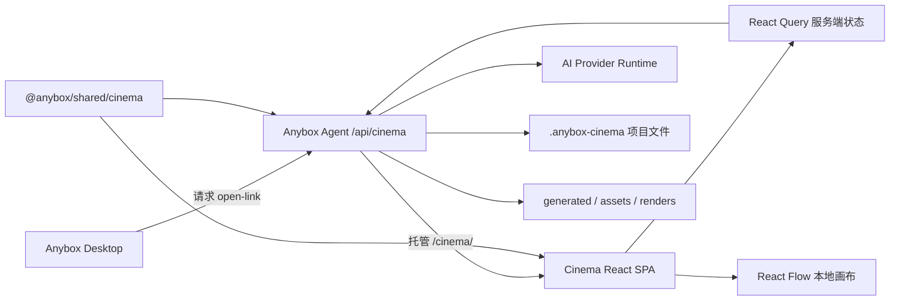

# Cinema Web 阶段性项目分析报告

> 报告状态：阶段性评审 / 可持续更新  
> 评审日期：2026-07-10  
> 评审对象：`packages/cinema-web` 及其直接依赖的 Shared Cinema Contract、Anybox Agent Cinema API  
> 当前阶段判断：高级原型，处于进入内部 Beta 前的稳定化阶段  
> 代码基线：当前工作区，包含尚未提交的 `src/App.tsx` 用户修改

## 1. 报告目的

本报告用于记录 Cinema Web 当前阶段的产品能力、技术架构、工程健康度、关键风险和下一阶段建议。它不是最终验收报告，也不代表 Timeline 等规划能力已经实现。

本次评审重点回答以下问题：

1. 当前项目解决什么问题，已经形成了哪些完整能力。
2. 前端、共享契约、Agent API 和项目文件之间如何协作。
3. 当前最可能导致数据丢失、状态错乱或交互失败的问题是什么。
4. 项目是否适合继续横向扩展功能。
5. 下一阶段应优先完成哪些工作，以及如何验收。

## 2. 执行摘要

Cinema Web 已经形成一个可运行的影视创作节点工作台。它能够把文本、图片、视频、素材和 AI 生成任务组织成可持久化节点图，并通过 Anybox Agent 将画布、任务、资产和事件写入本地项目目录。

当前最有价值的部分不是单一 React 画布，而是已经打通的完整闭环：

```text
桌面入口
  -> Cinema Web 节点画布
  -> Shared Contract
  -> Agent Cinema API
  -> Provider Runtime
  -> 项目文件、生成资产和事件审计
```

总体架构方向正确，以下能力值得保留：

- 使用共享 Zod Schema 约束跨层 Canvas、Command、Task 和 Provider 数据。
- 以本地项目文件作为最终真相源，便于调试、版本管理和审计。
- 画布编辑采用本地即时反馈和服务端确认结合的方式。
- Provider 输入契约可以动态生成不同模型的参数控件和媒体输入槽位。
- 生成任务、项目资产、事件日志和画布节点已经形成端到端链路。

但当前还不适合按生产级编辑器标准交付。最高风险集中在保存一致性：自动保存失败会静默丢失补丁，多个命令可能并发覆盖整份 Canvas，关闭页面会清空防抖中的修改，而用户界面又不显示保存失败。

因此，本阶段的核心结论是：

> 暂缓继续扩展 Timeline、更多节点类型或复杂编辑能力，先完成“保存不静默丢失”的可靠性里程碑。

## 3. 项目定位与当前边界

### 3.1 项目定位

Cinema Web 不是独立站点，而是 Anybox Desktop 与 Anybox Agent 体系中的节点式影视创作工作台。

主要技术栈：

- React 19
- React DOM 19
- TypeScript 5.9
- Vite 7
- `@xyflow/react`
- TanStack React Query 5
- Zustand 5
- Lucide React
- 全局原生 CSS

入口与依赖配置：

- `index.html`
- `src/main.tsx`
- `package.json`
- `vite.config.ts`
- `tsconfig.json`

### 3.2 当前产品范围

已经具备专用交互的节点：

| 节点 | 当前能力 |
| --- | --- |
| Text | 文本编辑、模型选择、图片上下文、文本生成、下载文本 |
| Image | 图片模型、Provider 参数、参考图、多结果预览、任务进度 |
| Video | Provider、模型、生成模式、首尾帧、参考图、源视频、任务刷新 |
| Local Image | 本地导入、素材预览、裁剪、派生新节点 |
| Custom API | JSON Schema、请求模板、认证、预览、运行、输出映射 |

以下节点目前主要是通用静态卡片：

- Prompt
- Audio
- Shot
- Agent
- Generation Task
- Output

当前右键菜单允许创建其中多个未完成节点，容易形成“创建后无后续操作”的产品死路。相反，Custom API 已实现完整编辑器，却没有正常创建入口。

### 3.3 尚未实现的范围

Timeline / 剪辑台目前只有 `cinema-timeline-editor-design.md` 中的设计，没有对应前端模块、Shared Schema、Agent 路由、渲染任务或 FFmpeg 流程。

设计文档中列出的五个阶段均应继续视为规划项：

1. 入口和静态剪辑台。
2. Timeline 编辑 MVP。
3. 资产导入和 metadata。
4. 导出。
5. 多轨、文本、图片、音频和 marker 等体验完善。

## 4. 系统架构



### 4.1 前端入口

`src/main.tsx` 创建 QueryClient，并使用 `QueryClientProvider` 和 `ReactFlowProvider` 包裹 App。

React Query 默认行为：

- 关闭 `refetchOnWindowFocus`。
- 查询失败自动重试一次。

页面没有前端 Router。运行上下文来自 URL 查询参数：

- `projectID`
- `agentBaseURL`

### 4.2 前端状态层次

当前至少存在三层状态：

1. 节点组件内部草稿，例如 prompt、JSON、参数输入。
2. App 内的 React Flow `nodes/edges`。
3. React Query 中的 `canvasQuery.data`。

React Flow 的 `nodes[].selected` 管理多选集合，Zustand 只管理 `activeNodeID`；活动节点负责编辑器和 Inspector，多选节点负责批量移动与删除。面板状态、保存状态、任务状态和错误仍保存在 App 本地。

### 4.3 Shared Contract

`@anybox/shared/cinema` 定义：

- Canvas、Node、Edge、Viewport Schema。
- Cinema Command discriminated union。
- Project Event 和 Command Result。
- Provider Manifest、Runtime 和认证状态。
- Generation Task。
- Text、Image、Custom API、Asset Import 请求响应。

后端路由会执行 Zod `parse`，但前端 `requestJson<T>` 只进行 TypeScript 泛型断言，没有运行时响应校验。当前边界是“后端强校验、前端信任响应”。

### 4.4 Agent API

前端直接使用的项目级接口包括：

- Project / Canvas
- Files / Events
- Video Providers
- Text Models / Image Models
- Text Generation / Image Generation
- Custom API Run / Credential
- Asset Import / Asset Preview
- Generation Task List / Create / Refresh / Cancel
- Command
- Open Link

### 4.5 持久化

主要项目文件：

```text
.anybox-cinema/
  project.json
  canvas.json
  events.jsonl
  tasks.jsonl
  tasks/<taskID>.json
```

Agent 写 Canvas 时使用临时文件加 rename，可避免只写入一半 JSON；任务当前状态也采用类似的原子替换方式。事件和任务审计则追加到 JSONL。

需要注意：文件写入是原子的，不代表多个 read-modify-write 命令在逻辑上是串行的。当前仍缺少项目级锁、revision 或乐观并发控制。

## 5. 核心运行流程

### 5.1 打开项目

1. Desktop 调用 Agent 的 `open-link`。
2. Agent 返回带 `projectID` 的 Cinema URL。
3. 开发模式额外附带真实 `agentBaseURL`。
4. 前端读取 Project Summary。
5. 已初始化项目继续加载 Canvas、Provider、模型和任务。
6. Canvas 被转换为 React Flow 节点和边。

### 5.2 编辑与保存

当前流程：

```text
节点输入草稿
  -> 节点内部防抖
  -> App nodes 本地更新
  -> 650ms node patch 队列
  -> POST /commands
  -> Agent read/apply/write
  -> 返回整份 Canvas
  -> 前端 applyCanvas 全量覆盖
```

设计目标合理，但命令队列和整份 Canvas 回写之间缺少可靠的版本控制。

### 5.3 生成任务

- Text：调用 text generation，结果直接写回文本节点。
- Image：创建绑定到图片节点的生成任务，并把结果资产同步回同一节点。
- Video：基于 Provider、模型、mode 和连接的源节点创建 generation task。
- 活动任务由前端定时逐个 refresh。
- 任务和 Canvas 的变化通过项目事件轮询同步到页面。

### 5.4 图片导入和裁剪

本地文件先由 FileReader 转成 Base64，再通过 JSON 上传。裁剪在浏览器 Canvas 中生成 PNG，然后按以下顺序执行：

1. 上传新资产。
2. 创建新 Local Image 节点。
3. 创建派生关系连线。

该流程目前不是后端事务。

## 6. 工程规模与健康度

### 6.1 代码规模

| 指标 | 当前值 |
| --- | ---: |
| `src/App.tsx` | 7,264 行 |
| `src/styles.css` | 3,760 行 |
| `src` 主要文件 | 5 个 |
| 生产 JS | 544.39 KB |
| 生产 JS gzip | 166.53 KB |
| 生产 CSS | 82.73 KB |
| 生产 CSS gzip | 11.43 KB |

`App.tsx` 同时承担：

- 节点类型与元数据。
- Provider 和 generation 输入解析。
- 图片裁剪。
- 所有节点组件。
- Inspector、文件浏览器和菜单。
- 所有 Query 和 Mutation。
- 自动保存、事件轮询和任务刷新。
- React Flow 页面编排。

这已经超过适合继续集中演进的规模。

### 6.2 构建

`npm run build` 当前通过，包括：

1. `tsc --noEmit`
2. `vite build`

Vite 已提示单一 JS chunk 超过 500 KB。当前没有动态 import 或手工拆包。

### 6.3 测试

Cinema Web 包自身：

- 没有 `test` 脚本。
- 没有 `lint` 脚本。
- 没有 `format` 脚本。
- 没有前端 `*.test.*` / `*.spec.*` 文件。

直接依赖层的现有验证：

- Shared Cinema Schema：10/10 通过。
- Agent Cinema API：45/45 通过。

这说明后端和契约并非无测试，但最容易发生状态竞态的前端保存层没有自动化覆盖。

## 7. 已确认的优势

### 7.1 架构优势

- Shared Contract 明确了跨层边界。
- Canvas、Command、Task 和 Provider 的核心外壳稳定。
- 节点 `data` 保持开放，能够容纳快速演化的 Provider 参数。
- 项目文件是清晰、可审计、可迁移的真相源。
- Command Event 和 Task Audit 分离，便于追踪生命周期。
- Provider 输入契约已抽象为 slot、parameter control 和 fulfillment。
- 资产接口支持安全路径解析和视频 Range 请求。

### 7.2 前端优势

- React Flow 适合当前节点画布交互。
- 节点编辑器通过 Portal 脱离画布缩放，方向正确。
- 多数操作使用真实 button。
- Icon-only 按钮普遍有 `title` 或 `aria-label`。
- Progress 使用 progressbar 语义。
- 错误信息大多使用 `role="alert"`。
- 状态点不只依赖颜色，还提供隐藏文本或 aria-label。
- 支持 `prefers-reduced-motion`。
- 文件面板对 840px 以下窗口已有响应式布局。

### 7.3 安全正向点

- React 未使用 `dangerouslySetInnerHTML`。
- Custom API Key 不写入 Canvas rawData。
- API Key 使用独立 password 输入和凭据接口。
- 保存成功后会清空前端 API Key 草稿。
- 项目资产和目录接口对路径穿越有后端防护和测试。

## 8. 风险台账

### 8.1 P0：进入下一阶段前必须处理

| ID | 风险 | 证据位置 | 影响 |
| --- | --- | --- | --- |
| P0-01 | 正常自动保存失败后 patch 不重新入队 | `src/App.tsx:6222`、`src/App.tsx:6036` | 本地修改保留在 UI，但不会再自动落盘 |
| P0-02 | 保存错误对用户不可见 | `src/App.tsx:5926`、正常页面 JSX | 用户无法判断是否保存成功，也没有重试入口 |
| P0-03 | App 卸载直接清空 timer 和 patch queue | `src/App.tsx:6203` | 关闭、刷新或快速离开会丢失防抖中的修改 |
| P0-04 | 并发命令返回整份 Canvas，可能乱序覆盖 | `src/App.tsx:6006`、`src/App.tsx:5957` | 较旧响应可能覆盖更新状态 |
| P0-05 | Agent Command 是无 revision 的 read-modify-write | `packages/anyboxagent/src/server/usecases/cinema.ts:2869` | 两个并发命令可能基于同一旧 Canvas 写入，产生逻辑丢更新 |

建议处理方式：

1. 命令在收到 ACK 前始终保留在持久队列中。
2. 相同项目的 Canvas Command 在服务端串行执行。
3. Canvas 增加 `revision`，命令携带 `baseRevision`。
4. 旧响应不得覆盖更新 revision 的本地 Canvas。
5. 保存失败显示明确错误、重试和未保存状态。
6. 为 pagehide / close 建立可验证的保护策略。

### 8.2 P1：稳定化阶段应完成

| ID | 风险 | 影响 |
| --- | --- | --- |
| P1-01 | 每类生成只用一个 nodeID 表示 pending | 多节点并发生成时 busy 状态会互相覆盖或提前清除 |
| P1-02 | 图片裁剪和导入不是事务 | 上传、建节点、连线中途失败会留下孤立资源 |
| P1-03 | `generation-task` 可通过普通节点菜单创建 | 会形成没有真实 task 文件的伪任务节点 |
| P1-04 | Custom API 已完整实现但没有创建入口 | 产品入口与实际能力不一致 |
| P1-05 | 辅助 Query 失败导致整个 Canvas 致命错误 | Provider 或任务暂时失败时，用户无法继续编辑已有画布 |
| P1-06 | 节点浮层没有碰撞检测和可用高度管理 | 靠近窗口边缘时编辑器会出屏或无法操作底部控件 |
| P1-07 | 画布主要依赖中键平移 | 触控板和普通鼠标用户导航困难 |
| P1-08 | 裁剪是纯指针交互 | 键盘和辅助技术用户无法调整裁剪区域 |
| P1-09 | 菜单缺少完整键盘与焦点管理 | 没有方向键、Escape、首项聚焦和关闭后的焦点恢复 |
| P1-10 | 前端没有保存层测试 | 竞态、失败重试和卸载丢数据无法自动回归 |

### 8.3 P2：可在基础稳定后演进

| ID | 风险 | 影响 |
| --- | --- | --- |
| P2-01 | 事件固定 2.4 秒轮询，任务固定 9 秒刷新 | 活动任务期间请求量偏高，错误没有退避或可见状态 |
| P2-02 | 每次任务刷新后重新拉取五类运行时数据 | Provider 和模型目录发生不必要刷新 |
| P2-03 | 大画布中每个节点反复扫描 nodes/edges | 节点和边增长后渲染复杂度接近多轮 `O(V·E)` |
| P2-04 | 单一 544 KB JS chunk | 首次加载、缓存和模块维护成本增加 |
| P2-05 | 图片先完整 Base64 化再放入 JSON | 请求体膨胀约三分之一，大文件会占用更多主线程和内存 |
| P2-06 | 前端没有响应运行时 Schema 校验 | Agent 版本不匹配时，错误会延迟到深层组件 |
| P2-07 | 只有暗色 token | 无法自然接入 Anybox light/dark 双主题 |
| P2-08 | 中英语言混用且 `lang="en"` | 产品语气和辅助技术发音不一致 |
| P2-09 | Canvas viewport 持久化契约未被前端恢复 | 每次打开依赖 fitView，保存的 viewport 没有实际作用 |

## 9. 安全边界评估

当前方案以“本机 Agent、可信项目、可信入口”为前提。

### 9.1 Agent Origin 与鉴权

前端直接接受 URL 中的 `agentBaseURL`，没有 same-origin、loopback allowlist 或签名校验。Agent 在没有显式 whitelist 时对 `/api/*` 使用开放 CORS，Cinema 路由没有会话鉴权中间件。

Agent 默认绑定 `127.0.0.1`，降低了局域网暴露，但不等于阻止任意浏览器 Origin 调用本机服务。

如果 Cinema 只运行在完全可信桌面环境，可暂时将其视为阶段性约束；如果普通网页或不可信项目能够访问，应增加：

1. 每次 Agent 启动生成随机 Bearer Token。
2. 严格 Origin allowlist。
3. 只接受 Agent 生成或签名的 open-link。
4. `agentBaseURL` 仅允许受信 loopback origin。

### 9.2 Custom API SSRF 边界

Custom API 允许用户配置 URL、Header、Body 和认证信息。后端当前阻止部分 metadata host，但仍允许其他环回、内网地址，并设置 `redirect: "follow"`。

如果项目配置可能来自不可信主体，应：

1. DNS 解析后检查私网、环回、链路本地和保留地址。
2. 对每次重定向重新校验目标。
3. 为访问私网提供显式权限和风险提示，而不是静默允许。
4. 对目标 Host 建立项目级或用户级授权记录。

## 10. UI 与 Anybox 规范差距

本节按 Anybox 前端的明暗主题、键盘路径、窄窗口、溢出和克制型桌面工具原则评审。

### 10.1 主题与 Token

当前只有一组 Cinema 暗色变量，并存在较多硬编码 hex、rgba、节点 accent、React Flow 背景色和 MiniMap mask。

建议迁移为：

- 成对的 light/dark semantic token。
- 组件只消费无 `-light` / `-dark` 后缀的运行时 token。
- Button、status、surface、border、text 分开建模。
- 缺少合适 token 时先补 token，不在组件内继续硬编码。

### 10.2 Overlay

`CinemaNodeInputOverlay` 当前只根据节点底部计算 `left/top`。应增加统一 overlay manager：

- 左右 clamp。
- 下方空间不足时向上翻转。
- 根据 viewport 计算 max-height。
- 表单内部独立滚动。
- Esc 关闭。
- 关闭后恢复触发器焦点。

### 10.3 键盘与辅助技术

需要补全：

- Space + 拖动画布或可发现的 Hand 工具。
- Crop 数值输入和键盘移动/缩放。
- Menu 的 Arrow、Home、End、Escape。
- Listbox 和 Tabs 的方向键逻辑。
- 图片结果的 `aria-selected` 或 `aria-pressed`。
- 文件面板按钮状态与实际挂载状态一致。
- 正确的页面语言或明确的多语言策略。

## 11. 文档一致性

当前存在以下文档漂移：

1. `TODO.md` 仍描述 `onMoveEnd` 自动保存 viewport，但当前代码没有该行为。
2. `CinemaWeb-architecture-speech.md` 描述顶部 SaveIndicator，当前正常页面没有该组件。
3. `cinema-ui-style-guide.md` 中记录的 CSS 行数、颜色统计和部分待办已过时。
4. Timeline 设计文档没有明确的“尚未实现”状态标识。
5. Canvas Schema 保留 viewport，但前端没有恢复或更新它。

建议为主要设计文档增加：

- `Status`
- `Last verified`
- `Implemented scope`
- `Not implemented`
- `Related source entry`

## 12. 推荐的阶段路线

### 阶段 A：保存可靠性稳定化

目标：建立“任何失败都不会静默丢修改”的硬保证。

建议交付：

- 显式串行 Command Queue。
- 服务端项目级 Command 锁。
- Canvas revision / baseRevision。
- ACK 前命令不出队。
- 失败重试与退避。
- 保存状态、错误详情和手动重试 UI。
- 页面关闭保护。
- 按 nodeID 管理并发生成状态。

验收标准：

1. 模拟命令失败后，本地修改仍保留并可重试。
2. 两个节点同时编辑不会互相覆盖。
3. 两个节点同时生成时，各自 busy 状态正确。
4. 命令响应乱序不会回退 Canvas。
5. 在 650ms 防抖窗口内关闭页面，不会无提示丢数据。
6. 保存错误对用户可见，并提供恢复路径。

### 阶段 B：模块化与前端测试

目标：降低继续开发时的回归风险。

建议目录：

```text
src/
  api/
    cinemaClient.ts
  features/
    canvas/
      canvas-mappers.ts
      graph-index.ts
      useCanvasSync.ts
      useCommandQueue.ts
    nodes/
      TextCanvasNode.tsx
      ImageGenerationCanvasNode.tsx
      VideoGenerationCanvasNode.tsx
      LocalImageCanvasNode.tsx
      CustomApiCanvasNode.tsx
    generation/
      generationContract.ts
      generationPayload.ts
      generation-selectors.ts
  components/
    overlays/
    inspector/
    file-browser/
    menus/
  styles/
    tokens.css
    shell.css
    nodes.css
    overlays.css
    responsive.css
```

优先测试：

- generationContract 的 role/modality 映射。
- generationPayload 的兼容字段。
- 自动保存失败与重试。
- 命令乱序响应。
- 页面卸载。
- 多节点并发生成。
- 裁剪事务失败和补偿。
- 轮询退避和恢复。

### 阶段 C：UI 与性能收口

目标：达到稳定的桌面生产力工具体验。

建议交付：

- Overlay manager。
- 完整画布平移路径。
- Menu/Listbox/Tab/Crop 键盘支持。
- Anybox light/dark token。
- Provider 与模型局部降级。
- Graph 索引和节点 memo。
- Query 精准刷新。
- SSE 或统一任务状态通道评估。
- JS 拆包和缓存策略。
- 文件上传改为 multipart 或流式方案。

### 阶段 D：产品能力扩展

完成前三阶段后再进入：

- 清理和确定正式节点类型。
- Custom API 正式入口。
- Prompt、Shot、Audio、Agent 节点的真实交互。
- Timeline Phase 1-5。
- Render Job 与 FFmpeg。
- Undo / Redo 和更明确的生成 DAG。

## 13. 下一里程碑建议

建议将下一里程碑命名为：

> Cinema Canvas Reliability Milestone

进入该里程碑前不要求增加新产品功能，完成条件为：

- 已知 P0 保存问题全部关闭。
- Command 并发有服务端和前端双重保护。
- 保存状态可见。
- 前端具备保存层自动化测试。
- 辅助 Query 可以局部降级。
- 创建菜单不再暴露伪任务和无完成路径节点。
- 页面关闭和网络失败有明确恢复策略。
- 当前工作区修改经过完整项目场景 E2E 验证。

## 14. 本次验证记录

| 验证项 | 结果 |
| --- | --- |
| `npm run build` | 通过 |
| TypeScript `tsc --noEmit` | 通过 |
| Vite production build | 通过，有单 chunk 大于 500 KB 警告 |
| Shared Cinema Schema | 10/10 通过 |
| Agent Cinema API | 45/45 通过 |
| 本地无 projectID 页面 | 正常渲染，无控制台错误 |
| Cinema Web 包内前端测试 | 不存在 |
| Cinema Web lint / format | 未配置 |

验证限制：

- 没有使用真实已初始化 Cinema 项目执行完整浏览器 E2E。
- 没有执行真实 Provider 计费请求。
- 没有通过故障注入实际复现并发 Canvas 覆盖；该风险来自已确认的前后端并发代码路径。
- 本报告基于当前工作区，`src/App.tsx` 已存在用户未提交修改。

## 15. 最终阶段判断

| 维度 | 判断 |
| --- | --- |
| 产品闭环 | 已形成节点编辑、生成、资产和持久化闭环 |
| 架构方向 | 正确，Shared Contract 与本地文件真相源值得保留 |
| 保存可靠性 | 不满足生产级编辑器要求 |
| 可维护性 | 单体文件过大，应开始按垂直能力拆分 |
| 测试成熟度 | 后端和 Shared 较好，前端明显不足 |
| UI 完整度 | 深色高级原型较完整，双主题与键盘路径不足 |
| 性能准备度 | 小画布可用，大画布和长期任务需要优化 |
| 安全边界 | 可用于可信本机假设，需要会话鉴权和 Origin 收紧后再扩展 |
| Timeline 准备度 | 设计充分，但不建议在保存稳定化前实施 |

最终结论：

> Cinema Web 已经证明了产品方向和核心技术链路，但下一阶段的成功标准不应是“新增更多功能”，而应是把它从可工作的高级原型提升为不会静默丢失用户创作内容的可靠编辑器。
